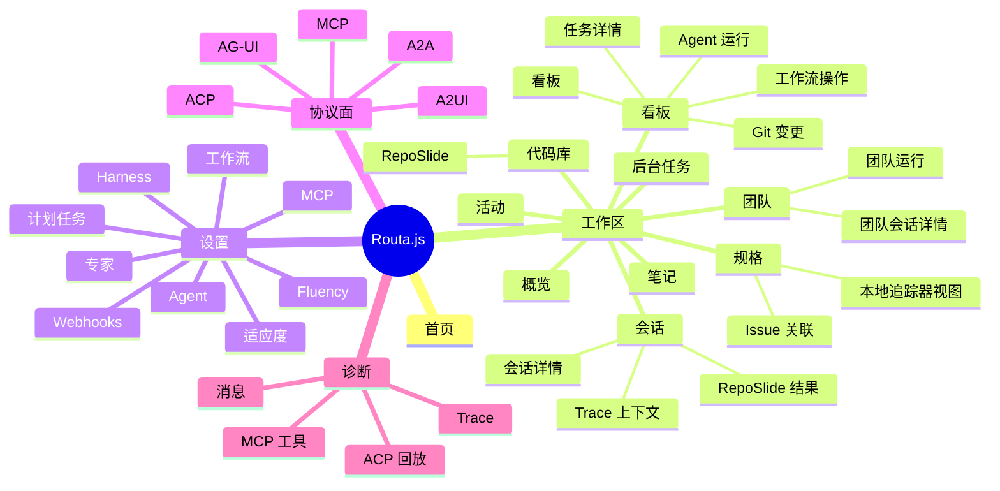
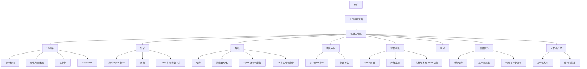
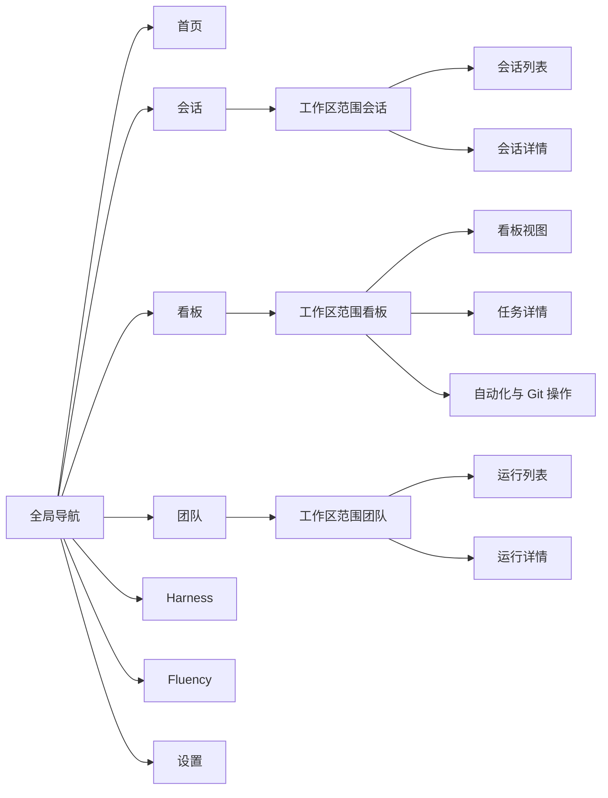
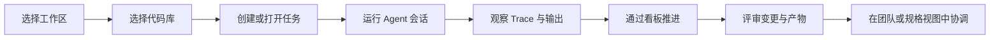

# 产品信息架构可视化

## 目的

本文档为 Routa.js 的产品结构提出一个清晰的可视化模型。
其目的是同时呈现三件事：

- 用户可以导航到哪些位置
- 哪些产品概念是主要的、哪些是支撑性的
- 工作区范围的协调如何在系统中流转

下面的图与当前的工作区优先架构以及 `docs/product-specs/FEATURE_TREE.md` 中生成的路由清单保持一致。

## 设计原则

该可视化不应是一张扁平的站点地图。
Routa.js 更适合被解释为：

1. 一个工作区优先的产品
2. 拥有一小组稳定的导航面
3. 背后是一个更丰富的协调领域模型

这意味着最佳的呈现方式是分层视图：

- 第 1 层：导航树
- 第 2 层：工作区信息架构
- 第 3 层：关键用户旅程

## 1. 产品功能树

当你需要一眼说明“产品包含哪些内容”时，使用此图。

## 2. 以工作区为中心的信息架构

当你需要解释产品模型（而不仅仅是菜单）时，使用此图。

## 3. 主导航模型

对于 UI 与信息架构(IA)讨论而言，这是最有用的一张图，因为它将全局导航与工作区内容深度区分开来。

## 4. 关键用户旅程

当你想说明工作区为何是产品锚点时，使用此图。

## 推荐的呈现方式

如果需要把它整合成用于产品评审的单一最终视觉图，请按以下顺序呈现：

1. 产品功能树
2. 以工作区为中心的信息架构
3. 关键用户旅程

该顺序解释了：

- 存在哪些内容
- 它们如何组织
- 用户如何在其中流转

## 面向外部受众的推荐简化方案

对于外部相关方，将产品收敛为五个顶层能力组：

- 工作区协调
- Agent 执行
- 看板自动化
- 团队协作
- 治理与设置

这样可以避免过度强调协议名称和内部实现细节。

## 备注

- 工作区应在未来所有信息架构(IA)图中保持为主要的视觉锚点。
- 代码库、会话和看板是三个最重要的二级产品对象。
- ACP 和 MCP 等协议面应作为支撑性基础设施呈现，而不是与其他项目同级的用户导航。
- 当前部分路由仍包含过渡性的 `default` 工作区行为，但目标信息架构明确以工作区为范围。
