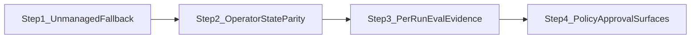

# Harness Monitor — Run-Centric P0 Implementation Plan

**Selected area:** Harness Monitor run-centric operator console (highest architectural priority per [repo todo inventory](https://github.com/phodal/routa/blob/main/docs/exec-plans/active/harness-monitor-run-centric-priorities.md))

**Parent plan:** [harness-monitor-run-centric-priorities.md](./harness-monitor-run-centric-priorities.md)

**Related issues:**
- [docs/issues/2026-04-13-harness-monitor-user-value-gap-to-decision-console.md](../../issues/2026-04-13-harness-monitor-user-value-gap-to-decision-console.md)
- [docs/issues/2026-04-12-harness-monitor-semantic-refactor-for-run-centric-operator-model.md](../../issues/2026-04-12-harness-monitor-semantic-refactor-for-run-centric-operator-model.md)

**Scope:** P0 items only — unmanaged fallback, operator state parity, per-run eval/evidence, policy/approval surfaces. P1 (workspace lifecycle, handoffs) and P2 (managed envelope) are out of scope for this plan.

---

## Current State Assessment

Harness Monitor has already migrated to a four-layer layout (`context/`, `run/`, `observe/`, `govern/`, `evaluate/`, `attribute/`, `ui/`). Domain scaffolding exists but the TUI path still diverges from the CLI/orchestrator path in several critical places.

| P0 item | Status | Biggest gap |
|---|---|---|
| Unmanaged run fallback | ~60% | Synthetic runs hidden when any hook session exists |
| Operator state in run details | ~75% hook / ~40% synthetic | Process-scan runs use a thin details renderer |
| Eval/evidence on runs | ~50% | Repo-global fitness cache; no per-run DB read in TUI |
| Policy/approval checkpoints | ~55% | Heuristic only; no checkpoint list; scan runs excluded |

### Critical gate (blocks mixed-mode workflows)

Both TUI and CLI only synthesize process-scan runs when **zero** hook-backed sessions exist:

```70:74:crates/harness-monitor/src/ui/views.rs
        let hook_backed_session_count = items.len();
        items.extend(
            self.unmatched_agents_for_runs(&agent_matches)
                .into_iter()
                .filter(|_| hook_backed_session_count == 0)
```

```495:496:crates/harness-monitor/src/run/orchestrator.rs
    if !has_session_runs {
        for agent in detected_agents
```

When Codex is hook-backed and Claude is repo-local but unmatched, Claude is invisible in the Runs list.

### Per-run eval gap

TUI resolves fitness from a single repo-global cache entry:

```1007:1017:crates/harness-monitor/src/ui/run_details.rs
fn fitness_snapshot_for_run<'a>(
    cache: &'a AppCache,
    run: &crate::ui::state::SessionListItem,
    changed_files: &[String],
    journey_files: &[String],
) -> Option<&'a fitness::FitnessSnapshot> {
    if run_uses_fitness_snapshot(run, changed_files, journey_files) {
        cache.fitness_snapshot()
    } else {
        None
    }
}
```

CLI already loads per-run eval via `shared/db.rs::list_eval_snapshots_for_run` in `run/orchestrator.rs`.

---

## Implementation Order



Each step is a separate baby-step commit. Run `cargo test -p harness-monitor` after every step; add snapshot updates only when rendering intentionally changes.

---

## Step 1 — Finish Unmanaged Run Fallback

**Goal:** Unmatched repo-local agents always appear as runs, even when hook-backed sessions coexist.

### Files to change

| File | Change |
|---|---|
| [`crates/harness-monitor/src/ui/views.rs`](../../../crates/harness-monitor/src/ui/views.rs) | Remove `hook_backed_session_count == 0` filter in `compute_session_items`. Always extend `unmatched_agents_for_runs` results. Dedupe by agent key against already-matched sessions. |
| [`crates/harness-monitor/src/run/orchestrator.rs`](../../../crates/harness-monitor/src/run/orchestrator.rs) | Mirror TUI: synthesize unmatched agents regardless of `has_session_runs`. Keep `is_repo_local_agent_cli` filter. |
| [`crates/harness-monitor/src/attribute/attribution.rs`](../../../crates/harness-monitor/src/attribute/attribution.rs) | Verify `assess_run` / `infer_origin` handle concurrent hook + scan origins without false attribution. |

### Key functions

- `compute_session_items` — runs list assembly
- `unmatched_agents_for_runs` — agent candidates not attached to sessions
- `compute_agent_match_state` — ambiguity guard (threshold ≥5, runner-up check)
- `build_cli_run_summaries` — CLI parity

### Tests to add/extend

| File | Test |
|---|---|
| [`crates/harness-monitor/src/ui/tests.rs`](../../../crates/harness-monitor/src/ui/tests.rs) | Extend `detected_agents_attach_to_session_when_match_is_unique`: expect synthetic Claude run when Codex is hook-backed |
| [`crates/harness-monitor/src/ui/tests_runtime_matching.rs`](../../../crates/harness-monitor/src/ui/tests_runtime_matching.rs) | Mixed-mode: sessions + unmatched agent → synthetic run appears |
| [`crates/harness-monitor/src/ui/snapshots/`](../../../crates/harness-monitor/src/ui/snapshots/) | New snapshot: `routa_watch_tui_mixed_hook_and_scan_runs.snap` |

### Exit criteria

- Unmatched `codex` / `claude` / `cursor` processes always visible in Runs
- Matched agents stay attached to hook sessions (no double-counting)
- Ambiguous agents remain candidates, never false-attributed
- Origin labels distinguish `hook` vs `scan` when both present

---

## Step 2 — Expand Run Details Into Operator State

**Goal:** Any selected run — hook-backed or process-scan — shows source, mode, role, workspace, block reason, and next action in one pane.

### Files to change

| File | Change |
|---|---|
| [`crates/harness-monitor/src/ui/run_details.rs`](../../../crates/harness-monitor/src/ui/run_details.rs) | Unify `render_process_scan_run_details` with hook-backed layout. Reuse `render_run_decision_line` for synthetic runs. Add Block / Next / Handoff lines. |
| [`crates/harness-monitor/src/ui/run_details.rs`](../../../crates/harness-monitor/src/ui/run_details.rs) | `build_run_operator_model`: populate `workspace_branch`, worktree type/detached instead of hardcoded `Main` / `None`. |
| [`crates/harness-monitor/src/observe/repo.rs`](../../../crates/harness-monitor/src/observe/repo.rs) or [`crates/harness-monitor/src/run/workspace.rs`](../../../crates/harness-monitor/src/run/workspace.rs) | Extract `workspace_identity_for` and `load_git_worktree_records` from `orchestrator.rs` into shared module for TUI reuse. |
| [`crates/harness-monitor/src/run/orchestrator.rs`](../../../crates/harness-monitor/src/run/orchestrator.rs) | Import shared workspace helpers; remove duplicated logic. |
| [`crates/harness-monitor/src/attribute/attribution.rs`](../../../crates/harness-monitor/src/attribute/attribution.rs) | Ensure `infer_handoff_summary` / `infer_recovery_hints` produce meaningful next actions for synthetic runs. |

### Key functions

- `build_run_operator_model` — assembles `RunOperatorModel`
- `render_run_details` — routes to hook vs scan renderer
- `render_run_decision_line` — State / Eval / Approval one-liner
- `semantic_run_status` — operator-facing status label
- `workspace_identity_for` — branch, detached, worktree type

### Tests to add/extend

| File | Test |
|---|---|
| [`crates/harness-monitor/src/ui/tests.rs`](../../../crates/harness-monitor/src/ui/tests.rs) | `synthetic_run_details_surface_full_operator_context` — process-scan run shows decision line |
| [`crates/harness-monitor/src/ui/snapshots/`](../../../crates/harness-monitor/src/ui/snapshots/) | Update `routa_watch_tui_run_details_decision_first.snap` if layout changes |

### Exit criteria

- Process-scan runs show Block, Next, Policy, Evidence, Eval lines (same structure as hook-backed)
- Worktree branch and detached state visible when git worktree data exists
- No regression to existing prompt-first / recovered markers / synthetic fallback

---

## Step 3 — Attach Eval And Evidence To Runs

**Goal:** Eval summary and evidence satisfaction reflect the **selected run**, not the whole repo.

### Files to change

| File | Change |
|---|---|
| [`crates/harness-monitor/src/ui/cache.rs`](../../../crates/harness-monitor/src/ui/cache.rs) | Add per-run fitness/eval cache: `BTreeMap<String, FitnessSnapshot>` keyed by `session_id` or run scope. |
| [`crates/harness-monitor/src/shared/db.rs`](../../../crates/harness-monitor/src/shared/db.rs) | Wire `list_eval_snapshots_for_run` into TUI refresh path (already used by CLI). |
| [`crates/harness-monitor/src/ui/run_details.rs`](../../../crates/harness-monitor/src/ui/run_details.rs) | `fitness_snapshot_for_run` → resolve from per-run cache or DB, not `cache.fitness_snapshot()`. Revisit `run_uses_fitness_snapshot` exclusion for synthetic runs. |
| [`crates/harness-monitor/src/evaluate/evaluator.rs`](../../../crates/harness-monitor/src/evaluate/evaluator.rs) | Use `fitness_snapshot_to_eval_snapshot` when bridging cache → `assess_run_guardrails`. |
| [`crates/harness-monitor/src/evaluate/gates.rs`](../../../crates/harness-monitor/src/evaluate/gates.rs) | `build_evidence_requirements`: feed satisfied flags from real `EvalSnapshot.evidence` refs. |
| [`crates/harness-monitor/src/ui/state_fitness.rs`](../../../crates/harness-monitor/src/ui/state_fitness.rs) | Scope fitness panel to selected run; show "no eval for this run" when absent. |
| [`crates/harness-monitor/src/ui/render.rs`](../../../crates/harness-monitor/src/ui/render.rs) | `render_fitness_panel` title includes selected run id. |

### Key functions

- `fitness_snapshot_for_run` — per-run resolution (currently repo-global)
- `run_uses_fitness_snapshot` — eligibility gate
- `assess_run_guardrails` — evidence requirement list
- `load_latest_eval_by_run` (orchestrator) — pattern to mirror in TUI cache
- `store_eval_snapshot` / `list_eval_snapshots_for_run` (db) — persistence

### Tests to add/extend

| File | Test |
|---|---|
| [`crates/harness-monitor/src/ui/tests.rs`](../../../crates/harness-monitor/src/ui/tests.rs) | Two runs with different eval states; selecting run changes Eval line |
| [`crates/harness-monitor/src/ui/cache_tests.rs`](../../../crates/harness-monitor/src/ui/cache_tests.rs) | Per-run cache keying and eviction |
| [`crates/harness-monitor/src/evaluate/gates.rs`](../../../crates/harness-monitor/src/evaluate/gates.rs) | Evidence satisfied from `EvalSnapshot.evidence` |
| [`crates/harness-monitor/src/shared/db.rs`](../../../crates/harness-monitor/src/shared/db.rs) | Existing eval persistence tests — ensure TUI path exercises same contract |

### Exit criteria

- Selecting a run updates Eval line and evidence summary for that run only
- Blocked runs show which artifact is missing (`test_report`, `coverage`, etc.)
- Fitness panel scoped to selected run (or explicit empty state)
- Synthetic runs can show eval when scoped data exists (remove blanket exclusion if data is available)

---

## Step 4 — Surface Policy And Approval Checkpoints

**Goal:** Operator sees effect classes, policy decision, approval status, and blocking evidence without opening the Fitness panel.

### Files to change

| File | Change |
|---|---|
| [`crates/harness-monitor/src/ui/run_details.rs`](../../../crates/harness-monitor/src/ui/run_details.rs) | Add `Checkpoints:` section: expand `EvidenceRequirementStatus` list beyond one-line Policy/Effects. Show effect classes, policy decision, approval state per requirement. |
| [`crates/harness-monitor/src/evaluate/gates.rs`](../../../crates/harness-monitor/src/evaluate/gates.rs) | Extend `approval_label_for` / `infer_block_reason` if new checkpoint inputs needed. Map `HumanApproval` evidence to checkpoint display. |
| [`crates/harness-monitor/src/run/run.rs`](../../../crates/harness-monitor/src/run/run.rs) | Prepare `Checkpoint` struct for future managed mode; for now display via evidence requirements. |
| [`crates/harness-monitor/src/attribute/attribution.rs`](../../../crates/harness-monitor/src/attribute/attribution.rs) | `build_planes` / `summarize_planes` — surface Constrain/Validate planes in run details (CLI already partial). |

### Key functions

- `render_run_decision_line` — State / Eval / Approval
- `assess_run_guardrails` — policy + evidence assessment
- `approval_label_for` — `not_required`, `waiting_on_evidence`, `required`, `blocked`
- `build_evidence_requirements` — requirement list with satisfied flags
- `infer_effect_classes` / `infer_policy_decision` — heuristic policy

### Tests to add/extend

| File | Test |
|---|---|
| [`crates/harness-monitor/src/evaluate/gates.rs`](../../../crates/harness-monitor/src/evaluate/gates.rs) | `require_approval`, `deny`, `allow_with_evidence` rendering inputs |
| [`crates/harness-monitor/src/ui/tests.rs`](../../../crates/harness-monitor/src/ui/tests.rs) | `hard_gate_failure_blocks_selected_run` — extend for checkpoint list |
| [`crates/harness-monitor/src/ui/snapshots/`](../../../crates/harness-monitor/src/ui/snapshots/) | Blocked-run and approval-required snapshots |

### Exit criteria

- Run details show effect classes, policy decision, approval status, and per-requirement evidence state
- Process-scan runs included (not excluded from policy/approval UI)
- Assessment reuses `gates.rs` output — no duplicate UI-only heuristics

---

## Verification

### Per-step gates

```bash
cargo test -p harness-monitor
cargo insta test -p harness-monitor   # when snapshots change
entrix run --tier fast                  # if touching shared fitness/entrix integration
```

### End-to-end smoke

1. Launch hook-backed Codex session + unmatched Claude process in same repo
2. Confirm both appear in Runs (Step 1)
3. Select each run — confirm operator state parity (Step 2)
4. Run Entrix fast eval scoped to a run — confirm Eval line updates on selection (Step 3)
5. Trigger hard gate failure — confirm checkpoint list shows block reason (Step 4)

### Characterization tests to preserve

- `run_details_surface_run_centric_operator_context`
- `hard_gate_failure_blocks_selected_run`
- `synthetic_run_details_surface_process_scan_origin`
- `detected_agents_attach_to_session_when_match_is_unique`

---

## Constraints (must not violate)

- Do not regress prompt-first runs, recovered markers, or existing synthetic run fallback
- Do not revert run semantics to session-centric navigation
- Do not duplicate assessment logic in UI — reuse `assess_run`, `assess_run_guardrails`, `gates.rs`
- All new UI strings must go through i18n if user-facing (TUI currently uses English literals; match existing `run_details.rs` pattern)
- Update [`crates/harness-monitor/AGENTS.md`](../../../crates/harness-monitor/AGENTS.md) module map if `workspace_identity_for` moves

---

## Post-P0 (tracked separately, not in this plan)

From [harness-monitor-user-value-gap-to-decision-console.md](../../issues/2026-04-13-harness-monitor-user-value-gap-to-decision-console.md):

1. Task journey as continuous chain (not summary fields)
2. Continue/merge safety as one-line run judgment
3. Committed changes as run-level evidence
4. Decision summary for runs needing human intervention

These build on P0 wiring and are P1 in the parent priorities doc.

---

## Commit Strategy

| Commit | Concern |
|---|---|
| `fix(harness-monitor): show unmatched agents when hook sessions exist` | Step 1 |
| `feat(harness-monitor): unify operator state for process-scan runs` | Step 2 |
| `feat(harness-monitor): scope eval and evidence to selected run` | Step 3 |
| `feat(harness-monitor): expand policy checkpoint surface in run details` | Step 4 |

Target: under 10 files and under 1000 lines per commit. Include co-author line per repo convention.
