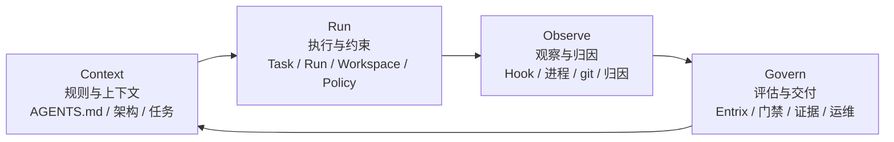
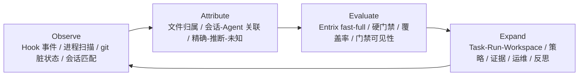

# Harness Monitor 四层模型

## 评审判断

当前的语义在方向上是正确的，但当它以一组平级 plane 的扁平列表形式呈现时，概念数量过多。

最易读的模型是一个四层回路：



用直白的话说：

- `Context`：决定 Agent 应当知道什么
- `Run`：决定 Agent 可以做什么
- `Observe`：记录 Agent 实际做了什么
- `Govern`：决定结果是否可以向前推进

## 稳定的领域记录

这种简化不会改变那些稳定的一等对象。它们仍然是：

- `Task`
- `Run`
- `Workspace`
- `EvalSnapshot`
- `PolicyDecision`
- `Evidence`
- 相关的领域事件

这个回路关注的是如何解释围绕这些记录的行为，而不是用更多运行时实体来替代它们。

## 3+1 概览

对于幻灯片和概览页面，最紧凑的版本是偏向实现的 `3+1` 回路：



这是当前代码库最简短且准确的叙述：`Observe -> Attribute -> Evaluate`，然后再把这个回路展开回完整的 Harness 表面。

## 包结构

当前的包结构已经契合四层模型，无需为每个概念强行拆分出一个 crate。

```text
Context
  AGENTS.md
  docs/ARCHITECTURE.md
  docs/fitness/README.md
  crates/harness-monitor/templates/
  crates/harness-monitor/scripts/

Run
  crates/harness-monitor/src/domain/
  crates/harness-monitor/src/application/run_assessment.rs
  crates/harness-monitor/src/operator_guardrails.rs
  crates/harness-monitor/src/repo.rs

Observe
  crates/harness-monitor/src/observe.rs
  crates/harness-monitor/src/detect.rs
  crates/harness-monitor/src/hooks.rs
  crates/harness-monitor/src/ipc.rs
  crates/harness-monitor/src/state_events.rs

Govern
  crates/harness-monitor/src/domain/evaluator.rs
  crates/harness-monitor/src/state_fitness.rs
  crates/harness-monitor/src/tui_fitness.rs
  由 entrix 驱动的门禁、证据与就绪状态，经由 run assessment 消费

Surfaces
  crates/harness-monitor/src/main.rs
  crates/harness-monitor/src/cli_operator.rs
  crates/harness-monitor/src/state*.rs
  crates/harness-monitor/src/tui*.rs
  packages/harness-monitor/bin/harness-monitor.js
```

`Surfaces` 并不是第五个语义层。它们是同一个四层回路之上的入口点和渲染器。

## Plane 映射

更早的 plane 术语仍然有用，但它现在被映射进四层模型，而不是与之竞争：

- `Context` 拥有 `Contextualize`
- `Run` 拥有 `Orchestrate` 和 `Constrain`
- `Observe` 拥有 `Observe` 和 `Attribute`
- `Govern` 拥有 `Evaluate`、`Validate`、`Evidence` 和 `Operate`
- `Reflect` 是从 `Govern` 回到 `Context` 的反馈边

## 代码边界

当前共享的语义路径保持不变：

- `RunAssessmentInput` 收集原始的运行、工作区和评估事实
- `assess_run(...)` 推导出操作者层面的含义、策略与证据状态、下一步动作，以及汇总后的 plane 状态
- CLI 和 TUI 基于该共享评估进行渲染，而不是各自独立地重建语义

在具体代码中：

- `crates/harness-monitor/src/application/run_assessment.rs` 是语义聚合层
- `crates/harness-monitor/src/operator_guardrails.rs` 仍然是更底层的 run/govern 约束引擎
- `crates/harness-monitor/src/cli_operator.rs` 和 TUI 模块仍然作为同一评估路径之上的 surface 存在

## 范围边界

这个模型有意不宣称这四层同样成熟。

如今实现得最强的回路是：

- 观察信号
- 归因所有权
- 评估就绪度

其余的 context、operate 和 reflection 能力应当从这个回路中生长出来，而不是过早地变成独立的顶层架构。

## 验证标准

当满足以下条件时，这个模型即为成功：

- 公开文档用同一个四层叙事来解释 `harness-monitor`
- 适合幻灯片的 `3+1` 视图与实现保持一致
- 稳定的领域记录仍然是 `Task / Run / Workspace / EvalSnapshot / PolicyDecision / Evidence`
- CLI 和 TUI 仍然共享同一条运行评估路径
- 归因的模糊性和门禁阻断保持显式而非被隐藏
