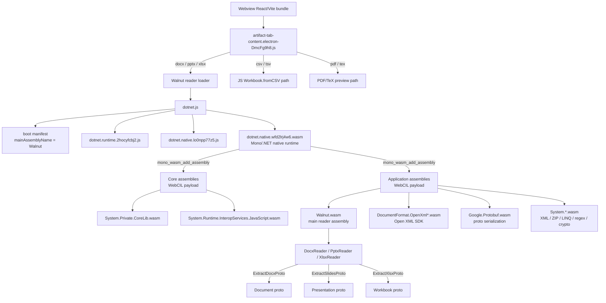

# Office 文档查看器：基于 WASM 的 DOCX/PPTX/XLSX/CSV 预览

## 解决方案 - 2026-05-07

就当前的 WASM reader / Office API / renderer 集成范围而言，父级 Office 查看器跟踪项已解决。子级的 DOCX、PPTX、XLSX、Walnut workbook-layout 以及 XLSX viewport-performance 跟踪项均已 `resolved`；下方仍未勾选的条目作为明确的长尾保真度待办保留，而不是阻塞 Office 界面对外暴露的活跃问题。

PPTX 是本轮对齐的最后重点。`packages/office` 现在会发出一个带预渲染幻灯片缩略图的 Cursor Canvas payload，`packages/office-render` 在回退到 canvas renderer 之前会优先在左侧栏使用这些图片缩略图。相比在运行时根据幻灯片 JSON 重绘每个缩略图，这更贴近预期的 Cursor 风格栏行为。

桌面端验证使用了 `/Users/phodal/Desktop/OrganizationalChart.pptx`。Microsoft PowerPoint 能正常打开它，并将第 3/29 张幻灯片渲染为预期的 Thoughtworks 组织结构图，且缩略图导航可见。Routa 能为同一文件生成 Canvas artifact，在启用缩略图 payload 校验后，Cursor Canvas 一致性检查通过。

针对同一桌面文件的 Walnut/Routa PPTX 检查可用，但并非逐字节/逐像素完美。在抑制零裁剪矩形字段后，`slideShapeStyleDigestsMatch` 现在通过；协议断言仍报告 `slideTextDigestsMatch` 和 `slideTextStyleDigestsMatch` 相对 Google Slides / PowerPoint 文本样式物化存在漂移。render-contract 比较现在将「两个 reader 都没有提取到 speaker-note payload」视为匹配；剩余差异是 desktop、narrow 和 slideshow 视图中的屏幕截图像素差异，统计数据则匹配。

## 发生了什么

Codex (OpenAI) 的 Electron 桌面应用内嵌了一套完整的 Office 文档预览系统，能在 side panel 中直接渲染 DOCX、PPTX、XLSX、CSV/TSV、PDF 等文件。分析 Codex app 后确认其技术栈和架构如下。

Routa 目前仅有 `file-output-viewer`（代码/搜索结果）和 `reposlide`（PPTX 下载链接），没有内嵌的 Office 文档预览能力。用户需要离开应用才能查看 agent 生成的 .docx/.xlsx/.pptx 文件。

## TODO

- [x] DOCX reader 发出类 Walnut 的 `oaiproto.coworker.docx.Document`，并对 `dll_viewer_solution_test_document.docx` 通过协议等价性校验。
- [x] DOCX 高级协议字段：页眉/页脚、批注、脚注/尾注、基础修订标记、超链接、内容控件文本、浮动/锚定图片、图表引用、段落编号以及表格颜色一致性。
- [x] DOCX 书签/锚点链接、内联内容控件占位符、作为段落占位的公式以及无 `w:cols` 的 section 布局，已由 `docx_advanced_contract.docx` 与 Walnut 一致性检查覆盖。
- [x] DOCX debug renderer 样式继承：解析 `textStyles[].basedOn` 链，使继承的段落/run 样式字段影响渲染文本。
- [x] DOCX 为 body/header/footer/content-control 块以及表格单元格保留类 Walnut 的结构性空段落，减少真实世界中 element/段落计数漂移。
- [x] DOCX 针对真实世界中无效的 OOXML 镜像 Walnut 标量怪癖：大写 RGB/`AUTO` 颜色、仅整数的段落间距/run 字号，以及仅含 `contextualSpacing` 的空段落回退到 docDefaults。
- [x] DOCX 保留生成的目录内容控件（`docPartGallery = Table of Contents`）以实现 Word 视觉一致性，同时一致性说明仍记录 Walnut 跳过生成 TOC 的行为；root 图片仍按主文档关系顺序一致排序。
- [x] DOCX 通过段落样式 `basedOn` 链以及非 `Normal` 的默认段落样式 ID 解析段落间距。
- [x] DOCX 镜像 Walnut 的 root 页面尺寸与 run 字体怪癖：root 宽/高仅在存在显式 `w:pgSz` 时发出，`image/jpeg` 被保留，`w:rFonts` 在东亚字体槽之前使用西文字体槽。
- [x] DOCX 表格单元格现在为真实世界表格一致性发出类 Walnut 的边框/对角线、gridSpan、垂直对齐以及单元格 ID。
- [x] DOCX 段落标记 run 属性现在反馈到段落文本样式，包括 Word 创作样式使用的 `w:szCs` 和 `AUTO` 颜色行为。
- [x] DOCX 表格 element bbox 现在会针对页面内容宽度遵循表格水平对齐。
- [x] DOCX 浮动图片 bbox 现在读取原始 `wp:positionH/wp:positionV@relativeFrom`，应用 page/margin/column/paragraph 锚框，并为真实世界锚定图片保留 page-relative 垂直偏移。
- [x] DOCX 1x1 示例/代码块表格现在像 Walnut 一样抑制隐式默认黑色单元格边框颜色，同时为普通的多单元格表格保留隐式黑色边框。
- [x] DOCX root 图片现在包含可见 body drawings 之外的包级图片部分，匹配 Walnut 对 numbering/bullet 和孤立图片部分的行为。
- [x] DOCX 长文档现在将协议 element 上限从 400 提升到 2,000 个块，在 `ebook*.docx` 和 `output.docx` 上与 Walnut 匹配，且不截断靠后的表格/图片/文本。
- [x] DOCX 页眉/页脚引用选择现在读取原始 `w:type`，并在 `even/default/first` 引用共存时匹配 Walnut 的默认 header/footer 行为。
- [x] DOCX section 分页推断现在在剩余的真实世界单/多 section 边界情况上与 Walnut 匹配，包括生成表格密集的文档、Heading2/Default 首次渲染分页的文档，以及多 `sectPr` 渲染分页重复。
- [x] DOCX root 图片排序现在在 body、numbering、header/footer 和 theme 包图片上与 Walnut 匹配，且不回退 `word-sample.docx`。
- [x] DOCX 修订处理现在镜像 Walnut 的可见文本语义：保留插入标记、跳过删除文本、不发出空的 review/hyperlink/comment 标记 run，删除元数据仍保留在 `reviewMarks` 中。
- [x] DOCX 批注区间现在镜像 Walnut 的修订容器怪癖和部分作用域：插入/删除 run 内的批注区间标记不会关闭外层活跃区间，且在 body、notes 和 comments 部分之间清空活跃批注状态。
- [x] DOCX 在兼容 Walnut 的 `footnotes` 协议界面中忽略尾注，并忽略仅含尾注引用的 run。
- [x] DOCX 渲染分页文本现在对段中 `w:lastRenderedPageBreak` 匹配 Walnut 的 `__docxBreak:rendered__` 标记，同时跳过 Walnut 省略的前导分页渲染标记。
- [x] DOCX section 摘要现在对单 `sectPr` 文件模拟 Walnut 基于分页推导的 section 重复，同时跳过生成 TOC、修订作用域内的渲染分页以及表格内部渲染分页。
- [x] DOCX 一致性工具现在将 Walnut 随机化的脚注/批注 run ID 视为不稳定，转而比较稳定的引用 ID。
- [x] DOCX 解码后的 Proto JSON contract 现在在真实的 `dll_viewer_solution_test_document.docx` fixture 以及 advanced/style-section/table-style/anchor-layout contract fixtures 上与 Walnut 匹配。比较器会归一化二进制 payload 和已知的不稳定生成 ID，然后断言规范化后的解码 JSON 相等。
- [x] DOCX corpus scanner 现在按文件运行 Walnut/Routa 比较器，并能断言解码后的 Proto JSON contract（`scan:office-wasm-reader:docx -- --json-contract --assert`），无需在大目录上保持一个 Walnut WASM runtime 长期存活。
- [x] DOCX 中文/Word 创作样式深度现在从 `w:rFonts/@w:cs`、段落标记 run 字体以及列表段落的 numbering-level 缩进回退中发出复杂脚本字形元数据。
- [x] DOCX 真实世界的列表/样式 section 怪癖现在对 `06.docx` 与 Walnut 解码 JSON 匹配：段落编号从 numbering 定义和 `w:startOverride` 写入 `autoNumberType`/`autoNumberStartAt`，仅含对齐的段落样式继承默认 run 字号，空 `w:sectPr` 不再物化合成的页面设置。
- [x] DOCX 真实世界的表格/样式文本怪癖现在对 `/Users/phodal/Downloads/realworld/5d1b8b8662d700110424b9ccc08ed7a1.docx` 与 Walnut 解码 JSON 匹配：直接表格单元格边距以 EMU 发出，浅层段落 `w:firstLine` 缩进在不过度物化 `w:hanging` 的前提下被保留，highlight 值进入 `textStyle.scheme`，空/无效表格边框被抑制，段落样式摘要遵循 `w:jc="both"` 以及 Walnut 的默认 run 字体继承边界。
- [x] DOCX 非 Word 生成器的小数尺寸现在对可比文件遵循 Walnut 的协议物化：小数 `w:ind` 和小数 `w:szCs` 值不会被四舍五入进段落/样式协议字段，同时对仅含对齐、无直接 run 字体的样式仍保留整数默认复杂脚本字号继承。这使 `/Users/phodal/Downloads/realworld/CI_CD.docx` 从 98 处解码 JSON 差异降为 `0`，`/Users/phodal/Downloads/realworld/ChocolateFactory.docx` 从 1 处解码 JSON 差异降为 `0`。
- [x] DOCX debug renderer 现在消费解码后的 section 页面设置、header/footer 内容、含分隔线的列设置、段落对齐、margin/hanging 缩进、行距、列表 auto-number 和 bullet 标记、run 超链接、Word 下划线值/样式、显式 false run 强调覆盖、DOCX highlight/caps/typeface scheme 元数据、脚注/批注引用标记/正文/元数据、插入修订标记、表格 bbox/宽度/span/行高/边距/边框/对角边框、图片/表格/图表 bbox 偏移与尺寸，以及图表引用。
- [x] DOCX debug renderer 现在使用解码后的 section 边界作为视觉分页，同时保留尾部 root element，并使 page-anchored 全宽图片溢出页面正文边距，以匹配 Word 封面/封底页的图片布局。
- [x] DOCX debug renderer 现在根据解码后的页面尺寸/边距估算正文容量，并将长 section/root element 流分页到多个预览页。
- [x] DOCX debug renderer 现在将解码后的 Word 字号单位映射为 CSS 像素，并在段落摘要未携带直接 auto-number 元数据时使用 numbering 定义来确定 bullet/number 标记。
- [x] DOCX debug renderer 现在跳过相邻同 bbox 的微小图片占位符，避免透明的 Word group-object 图层占用独立布局高度。
- [x] DOCX debug renderer 现在在省略显式 header/footer payload 的后续 section 中继承解码后的 section header/footer 内容。
- [x] DOCX debug renderer 现在将超大解码表格跨预览页拆分，避免长表格 section 溢出单个页面正文。
- [x] DOCX debug renderer 现在像 Word 的视觉顺序一样在图片说明之前渲染相邻 figure 图片，并对表格段落使用紧凑排版/内边距。
- [x] DOCX renderer 拆分回归已修复：page-overlay 图片分页现在从 `word-preview-layout.ts` 导入共享的 overlay 分类器，因此 CAG 风格的全宽/页脚/顶部 logo 锚定图片在选择文件后不再使 debug 页崩溃。在 CAG Schedule 8 DOCX 上的浏览器 smoke 报告渲染了 `41` 页、TOC 引导符，以及第 39、40、41 页可见的页脚页码。
- [x] DOCX debug renderer 现在在解码后的页面边距处绘制类 Word 的页面裁切标记，匹配 CAG Word 打印布局页面，且不改变协议提取或正文流。
- [x] DOCX debug renderer 现在处理 `docx-renderer-gap-checklist.docx` 中 Word 与预览的漂移：分号分隔的 DOCX 字体栈（如 `Arial;Helvetica;sans-serif`）解析为 sans 字体而非带引号的 serif 回退，Symbol 私有用途的 bullet 标记归一化为 Unicode bullet，渲染页面使用固定的类 Word 页面高度而非随内容增长。
- [x] DOCX reader/debug renderer 现在将可见的 `w:txbxContent` 绘图文本提升为定位的 page overlay，并在常规 run 提取期间跳过绘图内含文本，防止 CAG 风格的工作流标签泄漏进正文流。
- [x] DOCX reader/debug renderer 现在将分组图片框保留为类 Word 的定位背景矩形，从 `pic:spPr/a:xfrm` 解析子图片几何，而非将嵌入图片拉伸到外层 `wpg:wgp` 框，并跳过 `mc:AlternateContent` 回退绘图重复项。这修复了早前全宽图片工作引入的 CAG Schedule 8 第 4 页 key-focus 图回归。
- [ ] DOCX 视觉布局深度：核心协议一致性对已提交的 contract fixtures 和定向的真实世界中文样本为绿色，且 CAG 参考文档现在在启用 pretext 段落测量的 Chromium 中匹配 Microsoft Word 的 `41` 页计数。图片 `a:srcRect` 裁剪元数据现在以类 Word 的背景尺寸/定位流入 debug renderer，`pic:spPr/a:ln` 图片轮廓现在渲染为 CSS 边框，`a:outerShdw` 图片阴影现在渲染为 CSS box shadow，`behindDoc`/前景 `relativeHeight` 现在驱动图片图层顺序，定位文本框内容现在渲染为 page overlay。剩余视觉保真工作包括多个前景对象之间的完整重叠优先级、浮动绕排距离、更丰富的 shape/callout 填充-线条/连接符样式、效果元数据、超出当前已覆盖的常见 page/margin/column/paragraph 对齐/偏移情况的更广锚定位变体，以及超出当前有界补偿的更类 Word 的页面流/字体度量。
- [ ] DOCX 图表 payload 深度：图表引用、缓存 series、series RGB 填充、轴标题/网格线和 show-value 数据标签现在流入 debug renderer；剩余工作是更丰富的 Word 特定轴/标题/图例/绘图区样式、多轴图表、趋势线/误差线以及嵌入图表 workbook/cache 边界情况。
- [ ] DOCX section/header/footer 长尾：section 摘要、`sections[].elements` 以及前导段落与段中渲染分页的归属现在与修订标记密集的中文样本匹配。剩余工作是更广的 column/header/footer 组合以及更多非 Word 生成器边界情况。
- [ ] DOCX 样式/表格长尾：协议级解析现在覆盖 docDefaults 间距/run 样式、段落样式间距 `basedOn`、默认段落样式 ID、段落样式摘要、renderer 侧段落 `basedOn`、直接 run 覆盖、列表 auto-number type/start 元数据、Word 内置 `NoSpacing`/`MacroText`/`Revision*` 摘要默认值、仅含对齐的段落样式默认 run 回退、显式 false 粗体/斜体覆盖、东亚/复杂脚本 run 字体、highlight scheme 元数据、可比非 Word 生成器文件的小数尺寸非物化、表格单元格边距、无效/空边框抑制、关键布局情况的图片/表格 bbox 一致性，以及来自实际表格宽度的表格 bbox。剩余工作是尚未在 fixtures 中出现的潜在样式默认值、超出直接属性的 run-style 物化，以及更丰富的表格边框/span/样式区域。
- [ ] XLSX 精确表格样式：表头、行/列条纹标志、首/末列强调、合计行以及内置 Light/Medium/Dark 样式族已被消费；精确的 Excel 内置 element 定义仍是视觉长尾项。
- [x] XLSX 图标集逻辑：遵循 `cfvo` 的 type/value 处理 min/max/num/percent/percentile，外加 `gte`、`reverse`、`showValue`，以及常见图标族如 rating/arrows/traffic/symbols。
- [ ] XLSX 图表保真：预览消费 `sheet.drawings[].chart` 的锚点/series/legend、主要图表族、组合提示、次坐标轴、趋势线/误差线、数据标签标志、轴标题、图例间距、格式化刻度间隙，以及 bar gap/overlap 和 doughnut first-slice/hole 尺寸等族选项；Excel/Walnut 像素级图表自动布局仍是视觉长尾工作。
- [x] XLSX 绘图叠加：预览消费 chart/shape/image 锚点、workbook 图片 payload、Walnut 图片引用、绘图顺序、阴影、常见 shape 文本/线条默认值以及浮动命中区域。根据 crop 探测，Walnut 的电子表格绘图 schema 中仍不含图片裁剪。
- [x] XLSX 冻结窗格/粘性表头：前缀和布局驱动表头、可见区间、合成/解码的冻结区域投影、选区分段、行/列调整命中测试、键盘导航以及编辑叠加层定位。Reader 侧的冻结窗格提取保持禁用，因为 Walnut 不在解码后的 Workbook 协议中发出冻结窗格字段。
- [ ] XLSX workbook 交互：类 Walnut 的 viewer 级交互已覆盖 sheet 切换、滚动视口状态、前缀和单元格命中测试、活动单元格选区、键盘导航、双击单元格编辑器、validation 列表叠加、行/列调整辅助线、冻结正文/表头投影、浮动对象命中区域、图表悬停目标以及 canvas/worker 渲染。剩余产品交互一致性是类 Excel 的自动筛选菜单、多区间选择、填充手柄/自动填充、复制/粘贴保真、公式栏编辑/引用选择、sheet-tab 上下文操作、撤销/重做以及可编辑的图表/shape 操作。
- [ ] XLSX 条件格式广度：色阶、更丰富的数据条、图标集、文本/单元格比较规则、duplicate/unique、top/bottom、above/below-average、常见公式表达式、结构化引用、简单定义名称以及 `stopIfTrue` 优先级均已实现；完整的任意 Excel 公式语言一致性仍是长尾项。缺失的缓存公式值现在通过 ClosedXML 为 workbook 单元格回填，包括跨 sheet 查找、boolean/text/date-serial/error 结果、超链接显示文本、shared-formula 跟随项,以及针对 ClosedXML 0.105.0 不支持函数缺口的精确/通配 `XLOOKUP` 回退。
- [x] XLSX 协议覆盖：已提交的 fixtures 现在覆盖核心 workbook 布局、图片、迷你图、定义名称、批注、threaded comments、数据透视表、切片器、日程表、多图表族、曲面图以及外部链接公式行为；`/Users/phodal/Downloads/excel` 仍仅用于验证，当前对 Walnut 报告 `21/21` 解码协议匹配。
- [x] PPTX 图表部分：从 `c:chart` / `ChartPart` 关系发出 `charts` 和 `chartReference`，并在 debug 预览中渲染基础的 bar/line/pie 风格图表 payload。
- [x] PPTX 分组 shape/图片 bbox 投影现在将变换后的 X/Y 坐标向下取整以匹配 Walnut 风格的 group 变换取整，同时保持宽度/高度向下取整。
- [ ] PPTX group shapes、连接符以及 SmartArt/diagram 支持：基础的 group 扁平化和连接符端点/线端一致性已由 `pptx_group_connector_contract.pptx` 覆盖；SmartArt/diagrams 和复杂嵌套 group 变换仍待处理。
- [ ] PPTX 针对填充、线条、文本样式和占位符的完整 theme/layout/master 继承。
- [x] PPTX 针对专用表格 fixture 与 Walnut 的表格一致性：协议断言现在覆盖行/列、span/merge 占位符、填充、边框、边距、锚点以及文本样式。
- [ ] PPTX 图片裁剪、蒙版、平铺、duotone/高级效果以及 z-order 元数据。

PPTX 实现顺序：

1. Theme/layout/master 占位符继承：将幻灯片回退从 slide element -> layout placeholder -> master placeholder 深化处理 text body style、列表层级、填充、线条以及占位符几何。
2. PPT 表格：专用的解码 Walnut 一致性 fixture 已覆盖；接下来深化表格样式继承和更广的合并单元格边界情况。
3. Group/connector/custom geometry：在 SmartArt/diagram 特定工作之前，改进 group 变换、连接符端点以及常见自定义路径。
4. 高级图片/效果：在核心 text/layout/chart/table 路径稳定后，拓宽 crop/mask/tile/effect 元数据。
5. Slideshow 深度：在静态渲染保真稳定后，添加幻灯片导航操作、notes 模式、计时和切换效果。
6. 导出/编辑：仅在 viewer 协议保真成熟后再评估 `ExportProtoToPptx`。

进展 - 2026-05-02：

- PPT 预览 renderer 现在在幻灯片渲染、缩略图位图生成、slideshow 渲染、字形预热和选区命中测试之前应用 `Presentation.layouts`/master 占位符继承。实现保持直接的幻灯片样式权威，并从 layout/master 记录填充缺失的占位符几何/文本/列表默认值。
- PPT render contract 现在以极小的抗锯齿容差比较解码后的屏幕截图像素，而非原始 PNG 字节，这消除了外观相同的 Walnut/Routa 预览产生的误报，同时仍会在真实布局差异上失败。
- PPT 图表协议和预览渲染现在覆盖 root `Presentation.charts`、slide element `chartReference` 以及从解码图表 payload 进行的基础图表绘制。
- PPT 表格协议和预览渲染现在覆盖带行/列网格、合并 span、单元格填充/边框、边距、锚点和文本的 graphic-frame 表格。
- PPT viewer shell 现在将 slideshow 操作放在 debug 页头部，并独立于 notes/sources 脚注高度计算幻灯片适配，因此长脚注会滚动到幻灯片下方，而不是缩小或遮挡幻灯片。
- 在 `/Users/phodal/Downloads/《此心安处》 方案 by GPT Pro.pptx` 上的最新验证：`compare:office-wasm-reader:pptx-render -- --assert` 通过；在 `2048x1058` 的浏览器测量中，幻灯片 1/4 保持 `1703x958`，Play 位于 52px 的头部，隐藏脚注不会改变幻灯片尺寸。
- PPT group/connector 协议现在镜像 Walnut 的 group 扁平化行为，将 group 子 bbox 变换到幻灯片坐标，映射 `straightConnector1`，并保留连接符端点及 head/tail 线端元数据。
- PPT canvas renderer 现在将 `straightConnector1` 视为线条，并将连接符线端元数据与基础 shape 线条合并，因此箭头/端点/连接样式不再在渲染时被丢弃。
- PPT reader 现在保留幻灯片文本中显式的 `a:br` 文本换行，同时像 Walnut 一样继续抑制 slide-number/date 字段占位符。这修复了真实世界中标题/正文换行的漂移，且不重新引入 notes 文本漂移。
- PPT root 图片现在保留 OpenXML 内容类型（如 `image/jpeg`），而非归一化为 `image/jpg`，匹配 Walnut 的图片 digest 摘要。
- 真实 Workbench 验证样本 `/Users/phodal/write/blog-cache/Workbench/25. TW Differentiators/Copy of Thoughtworks  Differentiators_.pptx` 现在通过解码后的 Walnut PPT 协议等价性。其 render contract 仍在屏幕截图像素上失败，因为 debug canvas 文本布局尚未精确匹配 Walnut/PowerPoint 排版。
- canvas 文本 renderer 现在对多段 PPT 文本框应用更接近 Walnut 的默认段间距，并保持在当前 Workbench 样本上最匹配 Walnut 的保守绕排宽度启发式。在 Differentiators render contract 上，desktop 像素漂移从约 `93k/2.06M` 降到 `78k/2.06M`，narrow 从 `6.0k/308k` 降到 `5.0k/308k`，slideshow 从 `58k/1.29M` 降到 `48k/1.29M`。
- PPT 协议比较现在包含幻灯片可见文本 digest，而不仅是文本样式 digest 和 notes 文本，因此未来的换行/字段/文本回归会在仅表现为屏幕截图漂移之前先失败。
- PPT 协议工具现在有按文件的 corpus scanner（`scan:office-wasm-reader:pptx`），因此可以在不在单个进程中累积 Walnut WASM 内存的情况下比较大型真实世界目录。`compare:office-wasm-reader:pptx -- --diff --diff-limit=N` 也会报告解码后的协议路径；当前 Differentiators 样本在 layout level 文本样式上仍有解码默认字段漂移（`spaceAfter`、`bold`、`italic`、`underline`），即便语义一致性检查通过。
- PPT reader 现在区分 master 级列表样式默认值与 element 级列表样式，为 layout shape 发出类 Walnut 的 `autoFit.noAutofit` 和 `useParagraphSpacing` 默认值，在 layout 元数据中抑制 layout 段落,并为非占位符 layout shape 添加 Walnut 风格的默认 outline 记录。在 Differentiators 样本上，解码协议差异计数从首次默认样式尝试后的 `8024` 降到 `3099`，同时语义一致性保持绿色。
- PPT reader 现在将 `a:custGeom` shape 映射到 Walnut 的自定义几何代码 `188`。在 Workbench `10. Executive Summary` 样本上，第 2 张幻灯片的 shape 几何计数现在匹配（`rect=15`、`custom=12`），解码协议差异从 `66268` 降到 `63562`；更广的幻灯片几何 digest 检查在靠后的幻灯片上仍失败，需要更深入的自定义路径/占位符处理。
- PPT 协议比较现在将语义 bbox 坐标四舍五入到十分之一像素 EMU 桶，过滤亚像素的 Walnut/Routa 变换噪声，同时保持生产门对真实布局漂移敏感。
- Workbench PPTX 生产检查现在将 PowerPoint 可见漂移与 Walnut 独有的 bbox 异常分开：`1. Assumptions & Dependencies` 和 `10. Executive Summary` 在 group-origin 取整和亚像素 bbox 归一化后通过解码语义一致性。前 10 个 Workbench PPTX 文件的语义匹配从 `1/10` 提升到 `4/10`。`11. Governance & Communication` 第 25 张和 `12. Hiring & Talent Management` 第 49 张幻灯片中剩余的不匹配，主要由翻转的嵌套 group/自定义几何 bbox 值主导，其中 LibreOffice/PowerPoint 式渲染将 shape/connector 放在 Routa 的坐标，而 Walnut 将某些装饰性翻转 element 解码到极左或负 x；将这些保留为 PowerPoint 与 Walnut 的兼容性说明，而不是让 renderer 偏离 PowerPoint 视觉。
- 下一个 PPT 项是 SmartArt/diagram/自定义几何以及更深的表格样式继承；像素级 PowerPoint 排版在 viewer 拥有原生 screenshot/raster 路径或更深的文本布局引擎之前，仍是 renderer 保真限制。

进展 - 2026-05-05：

- 添加了一个类 PowerPoint 的按幻灯片 render 比较器 `compare:office-wasm-reader:pptx-powerpoint-render`，它通过 LibreOffice 将 PPTX 转为 PDF/PNG，并将每个 Routa/Walnut viewer 幻灯片 canvas 与该参考进行比较。输出保存在 `/tmp/routa-office-wasm-pptx-powerpoint-render` 下，不得提交。
- PPT 预览现在保持幻灯片视口高度独立于脚注/source-note 高度：脚注滚动到固定幻灯片视口下方，而不是缩小适配的 canvas 高度。主幻灯片 canvas 和缩略图按钮也暴露稳定的 test ID 用于按幻灯片浏览器验证。
- 在 `/Users/phodal/Downloads/《此心安处》 方案 by GPT Pro.pptx` 上的最新验证：`compare:office-wasm-reader:pptx-powerpoint-render -- --assert --changed-ratio 0.10 --average-delta 12` 对全部 `12/12` 张幻灯片通过；最大漂移是第 2 张（`changedPixelRatio ~= 0.0674`、`averageDelta ~= 10.45`）。现有的 Walnut/Routa render contract 在同一文件上仍通过。

## 预期行为

Routa 应能在 session canvas 或 artifact tab 中直接预览 Office 文档（DOCX/PPTX/XLSX/CSV），提供与 Codex 类似的文件类型路由和渲染体验。

## 当前一致性快照 - 2026-05-05

- DOCX 子状态：对已提交的 DOCX contract 套件和定向的真实世界中文 DOCX 样本，核心的兼容 Walnut 协议一致性已完成。整体问题仍保持开放，因为 Office 预览仍有 XLSX/PPTX 缺口，且 DOCX 仍有长尾的视觉/生成器保真工作。
- XLSX 子状态：对已提交的 XLSX contract 套件和 `/Users/phodal/Downloads/excel` 中 21 个仅用于验证的生产语料库，Walnut 解码后的 Workbook 协议一致性已完成。布局问题 `2026-05-02-walnut-workbook-layout-adapter.md` 和性能问题 `2026-05-03-xlsx-renderer-viewport-performance.md` 已解决。对 `PopcornElectronWorkbookPanel` 的后续梳理显示 Walnut 的 workbook 面板是一个 viewer-first 的 Popcorn 编辑界面，具有显式视口状态、选区/编辑状态、冻结窗格投影、行/列调整辅助线、表格筛选/排序叠加状态、浮动对象选择、图表悬停目标以及 canvas/worker 渲染。Routa 现在匹配 viewer 级 contract；剩余 XLSX 工作是像素级图表/表格/条件格式视觉保真以及产品级 Excel 交互，而非当前的协议阻塞项。
- DOCX：`dll_viewer_solution_test_document.docx`、`docx_advanced_contract.docx`、`docx_style_section_contract.docx`、`docx_anchor_layout_contract.docx`、`docx_table_style_contract.docx` 已通过 Walnut 语义 parity 与 decoded Proto JSON contract。真实 fixture 的 normalized decoded JSON diff 从 323 收敛到 0；byte-level proto 仍不同，因为 Walnut/Routa 会写入不同的生成 ID 和二进制编码细节，合同测试以 decoded JSON 作为稳定判断面。
- DOCX 当前已补齐默认段落间距/行距的 `docDefaults` 继承，debug renderer 会沿 `textStyles[].basedOn` 合并继承样式，reader 也会按文档顺序输出多个 section summary，并使用实际 table grid/width 计算表格元素 bbox。`docx_style_section_contract.docx` 已覆盖 direct run override、character-style non-materialization、multi-section summary；`docx_table_style_contract.docx` 已覆盖 table bbox parity 和 table-style shading non-materialization；`docx_anchor_layout_contract.docx` 已覆盖 anchor align bbox parity；真实 fixture 还覆盖了 East Asian fonts、explicit false bold/italic、contextual spacing tag、drawing bbox zero-Y quirks、`NoSpacing` default run text style、`MacroText` default line spacing、`Revision*` default run font fallback。2026-05-03 follow-up added complex-script typeface metadata, paragraph mark run font metadata, list paragraph indentation plus `autoNumberType`/`autoNumberStartAt` from numbering-level definitions, leading-vs-mid-paragraph rendered page-break section element assignment, Revision-style default font merging, alignment-only paragraph style default font-size fallback, empty-`sectPr` pageSetup suppression, direct table cell margins, shallow first-line paragraph indent, highlight scheme metadata, justified paragraph style alignment, and empty-border suppression. Complex floating wrap/z-order/effects, embedded chart payload, and protocol-level full style inheritance still remain.
- 语料库 JSON-contract 探测：`/Users/phodal/Downloads/realworld` 中前三个中文 DOCX 样本保持语义绿色，同时解码 JSON diff 从约 `849/839/935` 降到 `0/0/0`。`【phodal 】智谱AI 初稿 0911-1.docx`、`【phodal 】智谱AI 正文V3-2.docx`、`【phodal 】智谱AI 正文V3.docx` 在完成复杂脚本字体、style-summary 对齐、numbering 缩进、section 分页、Revision 样式字体回退和比较器归一化工作后，现在拥有精确的 normalized 解码 JSON 一致性。后续探测还将 `/Users/phodal/Downloads/realworld/06.docx` 从 247 处解码 JSON diff 降到 `0`，`/Users/phodal/Downloads/realworld/5d1b8b8662d700110424b9ccc08ed7a1.docx` 从 6985 处降到 `0`，`/Users/phodal/Downloads/realworld/ChocolateFactory.docx` 从 1 处降到 `0`，`/Users/phodal/Downloads/realworld/CI_CD.docx` 从 98 处降到 `0`。`skip=23 --limit=16` 语料切片现在报告 7 个 Walnut 可读匹配 / 0 个不匹配 / 9 个 Walnut 解析错误；这些错误是无效的小数页边距、小数表格单元格值或重复样式 ID，Walnut 在协议提取之前就拒绝它们，而 Routa 将这一类视为超出 Walnut 一致性的健壮性。
- 最新真实世界 DOCX 扫描：`/tmp/routa-realworld-docx-both-ok-final-docx.clean.json` 覆盖 `/Users/phodal/Downloads/realworld` 中 89 个 Walnut 可读文件，报告 89 个语义完全匹配、0 个语义不匹配。自上次扫描以来已修复：嵌套修订批注区间扩展、部分本地批注状态、段中渲染分页标记、表格内部 section break 多计、表格单元格边框/锚点/gridSpan 一致性、段落标记样式、表格水平对齐、基于分页推导的 section 摘要、包级图片、尾注排除、空 hyperlink/comment/review 标记 run 抑制、删除文本过滤、原始锚点 `relativeFrom` bbox 处理、page-relative 垂直偏移一致性、单单元格表格隐式边框颜色一致性、长文档 element 截断、原始 header/footer `w:type` 选择、最终 section 计数/shape 推断,以及 header/footer/theme 图片排序。
- 仅 Routa 健壮性扫描：`/tmp/routa-all-realworld-docx-scan.jsonl` 覆盖 `/Users/phodal/Downloads/realworld` 下全部 166 个 `.docx` 文件，报告 166 个已解析 / 0 个失败。`/tmp/routa-downloads-top-docx-scan.jsonl` 覆盖 4 个顶层 `/Users/phodal/Downloads/*.docx` 文件，报告 4 个已解析 / 0 个失败。
- 额外验证：`/Users/phodal/Downloads/Copy of CAG RFP - Schedule 8 - Operations and maintenance - Onshore.docx` 可通过 Routa 解析（`2124842` proto 字节）。Walnut 仍在该文件无效的小数页边距值（`1440.0000000000002`）上抛错，因此将其作为超出 Walnut 一致性的 Routa 健壮性来跟踪，而非 Walnut 可比样本。
- XLSX 像素级图表通道现在从排版一致性开始：图表 canvas 不再硬编码混杂的 `Arial` 字号，标题、轴标签、轴标题、数据标签和图例度量共享一个类 Excel 的 `Calibri` 排版适配器。轴间隙和水平图例位置现在从这些文本度量推导。
- XLSX 图表框架一致性现在从一个共享的框架几何辅助器绘制类 Excel 的 chart-area 和 plot-area 边框，因此轴/网格/series 布局可与同一图表对象和绘图框 contract 比较。
- XLSX 图表刻度一致性现在在 series 含负值时将值轴扩展到零以下，在零基线上绘制主轴，并将 bar/area 填充和数据标签锚定到该基线，而非始终使用绘图区底部。
- XLSX 数据条渲染现在消费更丰富的协议样式提示，用于边框、轴颜色、负值填充/边框颜色、same-as-positive 标志以及 right-to-left 渐变方向，改善混合正/负值生产表格的条件格式一致性。
- XLSX 表格视觉一致性现在对渲染单元格应用内置表格样式边框颜色以及深色样式的表头/合计文本颜色，而非依赖默认网格线和继承字体颜色。
- XLSX `TableStyleMedium2` 现在通过 workbook theme 的 `accent1` 颜色解析，而非早前的 `accent4` 近似，更贴近 `02_Tasks_Table`、`03_TimeSeries` 和 `99_Config` 的现代 Excel 内置表格样式族。
- XLSX `TableStyleMedium2` 的表头/合计 tint 现在比正文条纹更浅，匹配 `02_Tasks_Table` 的 Microsoft Excel 视觉抽检，而非将表头渲染为深蓝灰条带。
- XLSX 单元格样式优先级现在将直接 workbook 填充置于表格样式背景填充之上，同时将条件格式填充置于两者之上，匹配 Microsoft Excel 对 `02_Tasks_Table` 中样式化表头的渲染顺序。
- XLSX rating 图标集视觉现在渲染为显式 SVG 条形字形，而非依赖文本/字体的字形，在 `02_Tasks_Table` 风险单元格上更贴近 Microsoft Excel 的 `5Rating` 条件格式样式。
- XLSX Excel 视觉抽检现在在解码 workbook 表格没有 `autoFilter` payload 时抑制表格筛选按钮，匹配 Microsoft Excel 在 `complex_excel_renderer_test.xlsx` 表如 `02_Tasks_Table` 和 `99_Config` 上的行为，而非为每个表头绘制 Walnut 风格的启发式下拉。
- XLSX Excel 视觉抽检现在对没有显式水平对齐的 RTL 文本单元格应用默认 right-to-left 方向和右对齐，匹配 Microsoft Excel 在 `07_Layout_Stress` 阿拉伯语样本上的行为。
- XLSX 图表排版现在使用与 workbook grid/canvas renderer 相同的 Aptos-first 字体栈，保留 Calibri 作为回退，减少当前的 Microsoft Excel 图表文本漂移。
- XLSX 条件格式协议一致性现在为 `aboveAverage`、`bottom`、`rank`、`stdDev`、`equalAverage` 和 `timePeriod` 发出 Walnut 的 `CfRule` 字段；debug 预览还评估 Excel serial-date 时间段规则,如 `last7Days` 和 `thisMonth`。
- XLSX 条件格式优先级现在按 Excel/Walnut 的 `priority` 对解码规则排序，并在 format、color-scale、data-bar 和 icon-set 视觉上一致地应用 `stopIfTrue`，而非依赖协议数组顺序。
- XLSX `cellIs` 条件格式比较现在在应用比较运算符之前，从绝对/相对单元格引用、定义名称以及常见日期辅助函数（如 `DATE(...)` 和 `TODAY()`）解析公式阈值。
- XLSX 条件格式预览现在对 `containsErrors` 和 `notContainsErrors` 应用 Excel error-value 规则，覆盖常见值如 `#DIV/0!`、`#N/A`、`#REF!` 和 `#VALUE!`。
- XLSX 条件公式求值现在支持稀疏区间 `COUNTIF` 和 `COUNTIFS`，包括 `A:A` 这样的全列区间，且不进行稠密的 1,048,576 行物化。
- XLSX 条件公式求值现在处理生产规则中使用的常见辅助函数，包括 `ISERROR`、`ISNA`、`IF`、`IFERROR` 和 `ABS`。
- XLSX 条件公式求值现在支持稀疏区间 `SUMIF`、`SUMIFS` 和 `AVERAGEIF` 用于聚合阈值规则，且不进行稠密区间物化。
- XLSX 条件公式求值现在处理生产规则中使用的常见文本辅助函数，包括 `SEARCH`、`FIND`、`LEFT`、`RIGHT`、`MID`、`LOWER`、`UPPER` 和 `TRIM`。
- XLSX 图表 renderer 现在消费解码后的图表族选项：bar `gapWidth`/`overlap`/`varyColors` 影响 clustered bar 几何和着色，doughnut `firstSliceAngle`/`holeSize` 影响切片旋转和内半径。
- XLSX 图表协议/render contract 现在包含来自 `c:barChart` 的 bar `grouping`、`gapWidth` 和 `overlap`，因此 Walnut/Routa 图表布局差异会在 render-contract 比较器中显现，而非被摘要掩盖。
- XLSX 图表视觉一致性现在对折线图和图例样本使用更细的类 Excel 线条描边和标记半径，减少 `03_TimeSeries` 和 `01_Dashboard` 上可见的过粗渲染。
- XLSX 条件公式求值现在处理生产规则中使用的日期部分和奇偶辅助函数，包括 `YEAR`、`MONTH`、`DAY`、`WEEKDAY`、`ISODD` 和 `ISEVEN`。
- XLSX 条件公式求值现在支持算术表达式和数值舍入辅助函数，包括 `+`、`-`、`*`、`/`、`^`、`ROUND`、`ROUNDUP`、`ROUNDDOWN`、`INT`、`FLOOR` 和 `CEILING`。
- XLSX 条件公式求值现在支持稀疏区间上的多条件聚合辅助函数 `AVERAGEIFS`、`MINIFS` 和 `MAXIFS`。
- XLSX 条件公式求值现在支持查找辅助函数 `INDEX`、`MATCH`、`VLOOKUP` 和 `XLOOKUP`，用于阈值表驱动的格式规则。
- XLSX 条件公式求值现在支持统计/排名辅助函数 `COUNTA`、`COUNTBLANK`、`MEDIAN`、`LARGE`、`SMALL`、`RANK`、`RANK.EQ`、`PERCENTILE` 和 `PERCENTILE.INC`。
- XLSX 条件公式求值现在支持日期边界和工作日辅助函数 `EDATE`、`EOMONTH`、`NETWORKDAYS`、`WORKDAY` 和 `DATEDIF`。
- XLSX 条件公式求值现在支持分支辅助函数 `IFNA`、`IFS`、`SWITCH` 和 `CHOOSE`。
- XLSX 条件公式求值现在支持文本/转换辅助函数 `EXACT`、`VALUE`、`SUBSTITUTE`、`REPLACE`、`CONCAT`、`CONCATENATE` 和 `TEXTJOIN`。
- XLSX 公式求值现在覆盖 `/Users/phodal/Downloads/excel` 中发现的额外生产 workbook 辅助函数：`TEXTBEFORE`、`TEXTAFTER`、`CHAR`、`SUBTOTAL`、`OFFSET`、`NOW` 以及 validation 风格比较辅助函数 `LT`/`LTE`/`GT`/`GTE`。
- XLSX 条件公式求值现在支持生产规则使用的日期/时间格式化和转换辅助函数，包括 `TEXT`、`DATEVALUE`、`TIME` 和 `TIMEVALUE`。
- XLSX workbook 公式值回填现在在公式单元格没有缓存 `<v>` 值时使用相同的 .NET 侧 ClosedXML 依赖。reader 仍保留现有 OpenXML 缓存值作为协议的事实来源，但会为常见 workbook 公式填充空的公式结果，并将 ClosedXML 错误枚举归一化回 Excel 字符串,如 `#DIV/0!`。
- XLSX 公式回填现在即使在同一 workbook 中另一个单元格触发 ClosedXML 回填时也保留现有缓存公式 `<v>` 值，并添加了受保护的 `XLOOKUP` 回退，因为 ClosedXML 0.105.0 对 `_xlfn.XLOOKUP(...)` 报告 `#NAME?`。在重建生成的 WASM bundle 后，`/Users/phodal/Downloads/excel` 上的验证仍对 Walnut 报告 `21/21` 解码协议匹配和 `21/21` render-contract 匹配。
- XLSX 公式预览现在对带 `#NAME?` 缓存值的 `CELL("filename")` workbook-name 公式应用一个窄范围的类 Excel 显示修复：预览使用上传的 `sourceName` 渲染 workbook basename，同时保持解码后的 Walnut/Routa 协议不变。
- 2026-05-05 针对 `/Users/phodal/Downloads/complex_excel_renderer_test.xlsx` 的 Microsoft Excel Computer Use 抽检：`01_Dashboard` 和 `02_Tasks_Table` 在公式、数据条、图表、行/列尺寸和图标集放置上大体对齐。剩余可见的 Excel 与预览差异大多是视觉保真而非协议阻塞项：桌面 Excel 使用 Aptos 作为默认 workbook UI/单元格字体,表格/图表颜色仍有像素级长尾差异，且预览 shell/header/tabs 有意区别于原生 Excel chrome。电子表格 renderer 现在对 DOM 单元格、canvas 单元格、表头、冻结窗格和 shape 默认使用 Aptos-first 字体栈。
- 2026-05-05 Walnut 交互梳理：提取的 `PopcornElectronWorkbookPanel` 状态快照包括 workbook 版本、撤销/重做标志、活动 sheet、活动单元格/区间、多区间选择、select-all 阶段、拖拽/填充预览状态、公式输入/编辑器模式、缩放、列/行像素数组、行索引重映射、冻结窗格、调整辅助线、表格筛选/排序状态以及选中浮动 element 边界。该面板在单元格/浮动对象命中测试之前，通过固定的 `40px` 行表头、`20px` 列表头、前缀和、滚动偏移和冻结正文段来映射视口坐标。Routa 当前的 debug 预览实现了相同的 viewer 关键部分：sheet tabs、scroll store、显式布局适配器、选区/键盘导航、双击编辑叠加、validation 叠加、调整命中测试、冻结正文/表头/选区图层、可见浮动叠加、图表/图片/shape 命中区域、canvas 渲染、worker 回退以及帧调度。本问题中遗留的缺口是有意保留的产品交互：类 Excel 的自动筛选菜单、更丰富的公式栏编辑/引用选择、多区间/填充手柄/自动填充/复制粘贴、sheet-tab 上下文操作、撤销/重做以及交互式对象编辑。

## Codex 技术方案逆向分析

### 1. 文件类型路由

在 `use-model-settings-D_GIIENF.js` 中按扩展名路由到不同 artifact type：

```
csv/tsv/xlsx/xlsm -> artifactType: "spreadsheet"
docx              -> artifactType: "document"
pptx              -> artifactType: "slides"
pdf/tex           -> artifactType: "pdf"
```

### 2. Reader 架构

核心入口在 `artifact-tab-content.electron-DmcFg9h8.js`：

```js
csv  -> Workbook.fromCSV(...).toProto()
tsv  -> Workbook.fromCSV(..., { separator: "\t" }).toProto()
docx -> Document.decode(Walnut.DocxReader.ExtractDocxProto(bytes, false))
pptx -> Presentation.decode(Walnut.PptxReader.ExtractSlidesProto(bytes, false))
xlsx -> Workbook.decode(Walnut.XlsxReader.ExtractXlsxProto(bytes, false))
```

- 非 PDF 文件最大预览限制 40MB
- 解析结果有 5 项 LRU cache
- PDF 直接 base64 data URL 给 PDF panel

### 3. WASM Reader 生成语言和工具链

**C# -> .NET 9 Mono AOT -> browser-wasm**

关键证据：
- `dotnet.runtime.js`: `var e="9.0.14",t="Release"` -> .NET 9.0.14
- `dotnet.native.wasm`: 构建路径含 `Microsoft.NETCore.App.Runtime.Mono.browser-wasm/9.0.14`
- `Walnut.wasm`: 构建路径 `openai/lib/js/oai_js_walnut/obj/wasm/Release/net9.0-browser/linked/Walnut.pdb`
- 依赖: `DocumentFormat.OpenXml` 3.3.0, `Google.Protobuf`

### 4. WASM 文件清单

| 文件 | 大小 | 说明 |
|------|------|------|
| `dotnet.native.wasm` | ~2MB | CoreCLR Mono runtime |
| `Walnut.wasm` | ~1.7MB | 业务代码（Reader） |
| `DocumentFormat.OpenXml.wasm` | ~4.1MB | Open XML SDK |
| `Google.Protobuf.wasm` | ~0.5MB | Protobuf 序列化 |
| `System.*.wasm` | 各 ~100-500KB | BCL 子集（约 20 个） |
| 总计 | ~10-12MB | 完整运行时 |

### 4.1. WASM bundle relationship

`tmp/codex-app-analysis/extracted/webview/assets` 下共有 31 个 `.wasm` 文件。它们不是 31 个彼此直接调用的独立 WASM 模块，而是一套 manifest-driven 的 .NET browser-wasm/WebCIL bundle：

- `dotnet.native.wfd2lrj4w6.wasm` 是唯一真正的 Mono/.NET native runtime WASM，导入 `env` 和 `wasi_snapshot_preview1`，导出 `memory`、`mono_wasm_add_assembly`、`mono_wasm_load_runtime`、`mono_wasm_invoke_jsexport`、`malloc`、`free` 等运行时 API。
- 其余 30 个 `.wasm` 都是 WebCIL 包装的 .NET assembly。它们的 WASM import 都只有 `webcil`，export 也都是 `webcilVersion`、`webcilSize`、`getWebcilSize`、`getWebcilPayload`，由 .NET runtime 解包并作为 assembly 加载。
- `artifact-tab-content.electron-DmcFg9h8.js` 内嵌启动清单，`mainAssemblyName` 是 `Walnut`；`resources.fingerprinting` 把哈希文件名映射回逻辑名，例如 `Walnut.nvqhqmqbjk.wasm -> Walnut.wasm`、`dotnet.native.wfd2lrj4w6.wasm -> dotnet.native.wasm`。
- `resources.coreAssembly` 只包含 `System.Private.CoreLib` 和 `System.Runtime.InteropServices.JavaScript`；`resources.assembly` 包含 `Walnut`、`DocumentFormat.OpenXml*`、`Google.Protobuf` 和其余 `System.*` 依赖。



这意味着 Routa 如果参考这条路线，真正需要复制的架构不是“多个 WASM 模块互相依赖”，而是：

```text
JS artifact router
  -> .NET browser-wasm loader
  -> native runtime wasm
  -> WebCIL assembly set
  -> narrow reader ABI: bytes -> proto bytes
  -> React artifact panels
```

### 5. 渲染层

解析后的 proto 交给三个 React panel：
- `PopcornElectronDocumentPanel` - DOCX 渲染（paragraph/run/style/table/image/hyperlink 等）
- `PopcornElectronPresentationPanel` - PPTX 渲染（slide/layout/shape/picture/chart/table 等）
- `PopcornElectronWorkbookPanel` - XLSX 渲染（workbook/sheet/cell/formula/chart 等）

DOCX 有 feature gate (`839469903`)：开启走 Walnut，否则走 `docx-preview` 库的 `renderAsync`。

### 6. 整体链路图

```
用户点击文件 -> 扩展名路由 -> read-file-binary -> bytes
    |
    +-- csv/tsv -> JS Workbook.fromCSV() -> workbook proto
    +-- docx    -> Walnut.DocxReader.ExtractDocxProto() -> document proto
    +-- pptx    -> Walnut.PptxReader.ExtractSlidesProto() -> presentation proto
    +-- xlsx    -> Walnut.XlsxReader.ExtractXlsxProto() -> workbook proto
    +-- pdf     -> base64 data URL
    |
    v
React Panel 渲染（Popcorn*）
```

## 协议深入分析 - 2026-05-01

Codex 的 Office 预览可以拆成三层协议：Electron IPC 传输层、app-server RPC 层、WASM/protobuf reader ABI 层。

### 1. Electron IPC transport

Preload bridge 暴露 `window.electronBridge`，renderer 不直接接触 Electron 的 `ipcRenderer`：

```js
window.electronBridge.sendMessageFromView(message)
```

实际传输 channel：

```text
renderer
  -> window.electronBridge.sendMessageFromView(...)
  -> ipcRenderer.invoke("codex_desktop:message-from-view", message)
  -> main process

main process
  -> webContents.send("codex_desktop:message-for-view", message)
  -> preload dispatch window MessageEvent("message")
  -> renderer message bus
```

关键 channel：

```text
codex_desktop:message-from-view
codex_desktop:message-for-view
codex_desktop:mcp-app-sandbox-host-message
```

这里的 Electron 层只是一个通用 message tunnel，Office 文件解析不在 main process 中完成。

### 2. App-server request protocol

Renderer message bus 将业务请求包装成 request envelope：

```js
{
  type: "mcp-request",
  hostId,
  request: {
    id,
    method,
    params
  }
}
```

请求管理器维护 `requestPromises`，以 request `id` 做关联：

```text
createRequest(method, params)
sendRequest(method, params)
onResult(id, result)
onError(id, error)
```

Office reader 主要依赖这些 method：

```text
read-file-metadata      -> { isFile, sizeBytes }
read-file-binary        -> { contentsBase64 }
compile-latex-artifact  -> { contentsBase64 }
```

二进制文件内容通过 base64 string 跨 IPC/RPC 边界传输，而不是直接传 `ArrayBuffer`：

```text
contentsBase64 -> atob(...) -> Uint8Array
```

这意味着 desktop host 的职责是定位 host/workspace 文件、读取 bytes、返回 base64；DOCX/PPTX/XLSX 解析在 renderer 内继续执行。

### 3. WASM reader ABI

Renderer 初始化 .NET browser-wasm runtime，并加载主 assembly `Walnut`：

```text
dotnet.withConfig(config).create()
  -> getAssemblyExports("Walnut")
```

WASM 边界上的 reader ABI 非常窄：

```text
Uint8Array OfficeFileBytes
  -> Walnut reader export
  -> Uint8Array ProtobufBytes
```

具体导出方法：

```js
DocxReader.ExtractDocxProto(bytes, false)
PptxReader.ExtractSlidesProto(bytes, false)
XlsxReader.ExtractXlsxProto(bytes, false)
```

JS 侧再用生成的 protobuf wrapper 解码：

```js
Document.decode(protoBytes)
Presentation.decode(protoBytes)
Workbook.decode(protoBytes)
```

CSV/TSV 不走 WASM，直接由 JS parser 构造同一个 `Workbook` proto；PDF 不走 artifact proto reader，而是转 data URL 给 PDF panel。

### 4. Internal artifact proto model

Codex 没有把 OpenXML DOM 或 HTML 直接交给 React 渲染，而是归一化成内部 artifact schema：

```text
DOCX -> Document proto
PPTX -> Presentation proto
XLSX/CSV/TSV -> Workbook proto
```

从生成的 wrapper 和 WASM symbols 看，schema 覆盖范围包括：

- `Document`: section、paragraph、run、style、table、image、hyperlink、numbering、header/footer、footnote、comment、review 等
- `Presentation`: slide、layout、theme、shape、picture、table、chart、speaker notes、comment、master/layout relationship 等
- `Workbook`: workbook、sheet、cell、format、shared string、formula、conditional formatting、data validation、table/autofilter、defined name、chart、pivot table/cache、slicer、timeline、sparkline、comment 等

这个 proto model 是 UI panel 的稳定输入格式，也是未来编辑/导出能力可能复用的中间层。

### 5. Full preview path

```text
user opens file.xlsx
  -> extension routing creates artifact tab
  -> read-file-metadata(hostId, path)
  -> read-file-binary(hostId, path)
  -> base64 decode to Uint8Array
  -> XlsxReader.ExtractXlsxProto(bytes, false)
  -> Workbook.decode(protoBytes)
  -> PopcornElectronWorkbookPanel
```

DOCX/PPTX 同理：

```text
docx -> DocxReader -> Document proto -> PopcornElectronDocumentPanel
pptx -> PptxReader -> Presentation proto -> PopcornElectronPresentationPanel
xlsx -> XlsxReader -> Workbook proto -> PopcornElectronWorkbookPanel
```

### 6. Reader/export implications

WASM strings 里能看到 read 和 export 双向能力相关符号：

```text
ExtractDocxProto
ExtractSlidesProto
ExtractXlsxProto
ExportProtoToDocx
ExportProtoToPptx
ExportProtoToXlsx
```

这不代表 Codex UI 一定暴露完整编辑写回，但说明底层 reader 层并不只是“一次性 HTML preview”。更准确的抽象是：

```text
Office binary <-> normalized proto artifact model <-> React panel/editor
```

对 Routa 来说，这个发现会影响方案选择：如果只做快速预览，JS library 足够启动；如果要长期支持 artifact 编辑、结构化 diff、agent 修订、导出回 Office，则应该尽早设计一个稳定的中间 artifact schema。

## 为什么可能发生

这是功能缺失而非 bug。Routa 的 session canvas 和 kanban card 已经有 artifact 展示机制，但没有 Office 文档的解析和渲染能力。

## 实现方案

### 方案 A: 复用 Codex 的 .NET WASM 路线

- 优点：解析质量高，Open XML SDK 是官方库，覆盖全面
- 缺点：需要 C# 代码维护，WASM 体积 ~10-12MB，需要 .NET 运行时
- 可行性：`DocumentFormat.OpenXml` 是 MIT 开源，`Walnut` 是 OpenAI 自研的 reader 层（闭源），需要自行实现 reader
- 风险：无法直接复用 Walnut 源码，需要重写 C# reader 层

### 方案 B: 纯 JS/TS 方案

- DOCX: `docx-preview`（MIT，Codex 也在用作为 fallback）
- XLSX: `SheetJS` 或 `hyperformula`
- PPTX: `pptxjs` 或自研简版 renderer
- CSV: 已有轻量 JS 实现
- 优点：无 WASM 开销，bundle 更小，与现有 TS 技术栈统一
- 缺点：PPTX/DOCX 渲染质量可能不如原生 OpenXML 解析

### 方案 C: 服务端渲染

- 在 Rust/Axum 后端解析 Office 文档，返回结构化 JSON 或渲染图
- 优点：前端零负担
- 缺点：增加后端复杂度，大文件传输延迟

### 方案 D: 混合方案（推荐评估）

- CSV/TSV: 纯 JS（轻量，已验证可行）
- DOCX: `docx-preview` 或类似 JS 库
- PDF: `pdf.js`（成熟）
- XLSX/PPTX: 评估 JS 库质量，必要时考虑 WASM 路线

## 相关文件

- `src/client/components/file-output-viewer.tsx` - 现有文件输出 viewer（仅代码/搜索）
- `src/app/workspace/[workspaceId]/sessions/[sessionId]/use-session-canvas-artifacts.ts` - Canvas artifact 管理
- `src/core/reposlide/deck-artifact.ts` - 现有 PPTX 下载（无预览）
- `src/app/debug/office-wasm-poc/` - 当前本地 debug POC
- `scripts/debug/check-office-wasm-poc-consistency.ts` - 校验 POC 和 Codex extracted bundle 的 ABI/manifest 一致性
- `docs/references/office-document-viewer-wasm-reader/` - 后续参考实现目录和产品化拆分建议
- `tmp/codex-app-analysis/` - Codex 逆向分析文件（ignored）

## 待解决问题

1. **渲染精度要求**: Routa 的用户场景是"快速预览 agent 输出"还是"精确还原 Office 格式"？
2. **PPTX 渲染**: 纯 JS 的 PPTX renderer 质量是否够用？是否值得走 WASM 路线？
3. **Bundle 体积约束**: 桌面端 (Tauri) 对 WASM 体积容忍度高，Web 端是否需要按需加载？
4. **Protobuf vs JSON**: Codex 用 protobuf 传输解析结果，我们是否需要这一层？还是直接用 JSON 更简单？
5. **是否需要编辑能力**: Codex 的 Walnut 至少编译了 `ExportProtoToDocx` / `ExportProtoToPptx` / `ExportProtoToXlsx` 符号；Routa 是只需要预览，还是要预留 artifact 编辑与导出回 Office 的中间 schema？

## 协议一致性发现 - 2026-05-01

当前 Routa 自有的 WASM reader 匹配 Walnut 的 ABI 名称和依赖族，但**不**匹配返回的 protobuf 协议。这是生成的 PPTX 预览大多是纯文本的主要原因。

运行：

```bash
npm run compare:office-wasm-reader:pptx
```

Fixture：

```text
tools/office-wasm-reader/fixtures/agentic_ui_proactive_agent_technical_blueprint.pptx
```

观察到的协议差异：

| Reader | ABI method | Returned message | Proto bytes | First slide visual data |
| --- | --- | --- | ---: | --- |
| Walnut | `PptxReader.ExtractSlidesProto(bytes, false)` | `oaiproto.coworker.presentation.Presentation` | `119233` | `23` elements: `11` text elements + `12` shape elements |
| Routa generated | `PptxReader.ExtractSlidesProto(bytes, false)` | `routa.office.v1.OfficeArtifact` | `32007` | `0` elements; only `15` text blocks |

Walnut 首张幻灯片的键：

```text
index, useLayoutId, elements, widthEmu, heightEmu, innerXml, outerXml,
background, id, notesSlide, creationId
```

Routa 首张幻灯片的键：

```text
index, textBlocks, title
```

因此对该 fixture 而言，缺失的 contract 并不是「嵌入图片」。该 fixture 在 `ppt/media` 中没有媒体文件；其视觉外观由矢量幻灯片 element 承载：background、定位 shape、填充、线条、圆角矩形、文本框以及样式化的文本 run。

PPTX 一致性的最低协议目标：

- 顶层：`Presentation.theme`、`Presentation.layouts`、`Presentation.images`、`Presentation.charts`。
- 幻灯片级：`id`、`index`、`useLayoutId`、`widthEmu`、`heightEmu`、`background`、`elements`。
- Element 级：`id`、`name`、`type`、`bbox`、`shape`、`fill`、`line`、`paragraphs`，外加 image/table/chart 引用。
- 文本级：带 `textStyle`（`fontSize`、`fill.color`、`typeface`、bold/italic/underline）的 paragraphs 和 runs。

实现含义：保留导出的方法名，但将生成的 PPTX payload 改为收敛到 Walnut 的 `Presentation` 形态，或添加一个忠实的适配器，在渲染前将 Routa 自有的等价 schema 映射到同一形态。扩展当前的 `OfficeArtifact.Slide.text_blocks` model 是不够的。

后续实现：

- `Routa.OfficeWasmReader.PptxReader.ExtractSlidesProto` 现在为 PPTX 发出类 Walnut 的 `oaiproto.coworker.presentation.Presentation` payload，而非 `routa.office.v1.OfficeArtifact`。
- 在 `/debug/office-wasm-poc` 和 `npm run compare:office-wasm-reader:pptx` 中，生成的 payload 都使用提取的 `Presentation.decode` 模块解码。
- 在 `agentic_ui_proactive_agent_technical_blueprint.pptx` 上，协议级等价性现在匹配幻灯片数量、首张幻灯片尺寸、首张幻灯片背景、首张幻灯片定位 element 存在性、首张幻灯片文本样式存在性以及首张幻灯片 element 数量（`23`，匹配 Walnut：`11` 文本 + `12` shape element）。
- 已知剩余缺口：发出的 proto 在结构上兼容但非逐字节相同；与 Walnut 完整 reader 输出相比，theme/layout payload 仍然很简略。

PPTX 一致性回归守卫：

```bash
npm run test:office-wasm-reader:pptx-parity
```

已提交的一致性 fixture 保持小巧。本地图片密集的大型幻灯片仍可在不加入 git 的情况下显式检查：

```bash
npm run compare:office-wasm-reader:pptx -- --assert '/Users/phodal/Downloads/《此心安处》 方案 by GPT Pro.pptx'
```

`《此心安处》` 不是真正的 PowerPoint 图表对象情况：其包中有 `ppt/charts/` 但没有 chart XML 部分，Walnut 也解码出 `chartCount = 0`。可见的"类图表"内容由图片和 shape 承载。因此当前一致性检查验证该幻灯片相关的 contract：root `Presentation.images`、图片字节 SHA-256 digest、element `imageReference` id 序列、`imageReference` 解析、幻灯片数量、layout/theme 存在性、element 数量、image-reference 数量以及按幻灯片的 element type 计数。

在该幻灯片上解码两个 WASM 输出得到的 Walnut 特定发现：root `Presentation.images` 按序号路径顺序（`/ppt/media/...`）发出，而非幻灯片遍历顺序。Walnut 对该 fixture 似乎不转码 JPEG payload；在匹配排序后，图片 id、内容类型、字节长度和 SHA-256 digest 完全匹配。`http://localhost:3000/debug/office-wasm-poc` 上生成的 debug 预览现在显示第 4 张幻灯片含多个不同的图片支撑 element，而非一个重复图片。

PPTX render-contract 守卫：

```bash
npm run compare:office-wasm-reader:pptx-render -- --assert '/Users/phodal/Downloads/《此心安处》 方案 by GPT Pro.pptx'
npm run test:office-wasm-reader:pptx-render
```

- `compare-walnut-pptx-render-contract.ts` 通过 Playwright 打开 debug 页，同时通过 `reader=routa` 和 `reader=walnut` 加载同一 PPTX，并将 desktop、narrow 和 slideshow 截图捕获到 `/tmp/routa-office-wasm-pptx-render`。
- 该守卫断言两个 reader 都从位图表面渲染而非实时回退 canvas、进入全屏 slideshow、保持相同布局统计、避免运行时控制台错误，并产生相同的预览/slideshow 截图哈希。
- `test:*` 脚本可在端口 `3218` 上启动隔离的 Next dev server；`compare:*` 脚本可针对已运行在 `http://127.0.0.1:3000/debug/office-wasm-poc` 的应用或自定义 `--base-url`。

image-reference/theme/layout/chart/table 通道之后剩余的实现缺口：

- 基础 group shape 和连接符端点已由专用 Walnut fixture 覆盖；SmartArt/diagram、视频/音频、批注、notes 模式、深度嵌套/旋转的 group 变换以及自定义几何路径仍未完整建模。
- Theme 和 layout payload 在结构上存在，但与 Walnut 非逐字节相同；来自 master/layout 占位符的文本样式继承仍比 PowerPoint 浅。
- 表格支持已对 `pptx_table_contract.pptx` 做协议测试；该合成表格 fixture 的渲染截图仍有细微的抗锯齿文本差异，因此默认 render 门保持在真实世界图片密集的 PPTX fixture 上。
- 图表渲染消费解码后的图表 payload，但在绘图布局、轴排版、图例、标签和非基础图表族上仍是近似。
- 图片裁剪/蒙版、平铺、duotone、高级效果、渐变/图案填充以及 z-order 元数据需要更广的覆盖。
- 导出回 PPTX（`ExportProtoToPptx` 风格的流程）尚未实现。

## DOCX 协议一致性 - 2026-05-01

`Routa.OfficeWasmReader.DocxReader.ExtractDocxProto` 现在为 DOCX 发出类 Walnut 的 `oaiproto.coworker.docx.Document` payload，而非旧的 `routa.office.v1.OfficeArtifact` 文本/表格投影。

已验证的 fixtures：

```text
tools/office-wasm-reader/fixtures/dll_viewer_solution_test_document.docx
tools/office-wasm-reader/fixtures/docx_advanced_contract.docx
tools/office-wasm-reader/fixtures/docx_style_section_contract.docx
tools/office-wasm-reader/fixtures/docx_table_style_contract.docx
tools/office-wasm-reader/fixtures/docx_anchor_layout_contract.docx
```

这些 fixture 的 Walnut 一致性检查现在匹配：

- 文档页面尺寸（`widthEmu = 12240`、`heightEmu = 15840`）
- element 数量和 type 计数（`26` text、`1` image reference、`7` tables）
- 嵌入图片的 id/content type/byte length/SHA-256 digest
- image reference id 和 reference 解析
- 段落数量和文本 run 数量
- 表格行/单元格形态以及保留换行的表格预览
- section 数量和 numbering 定义数量
- 段落样式定义数量（`36`）和 id
- docDefaults 段落间距/行距继承
- 按文档顺序的多 section 摘要，包括 continuous section break 和列数
- 直接 run 覆盖，同时保留 Walnut 的字符样式 `basedOn` 非物化行为
- 表格 element bounding box 使用实际表格 grid/表格宽度而非完整内容宽度
- 锚定图片/图表 bbox 计算遵循常见的 `wp:anchor` 水平/垂直对齐和偏移框

重要的 Walnut 特定发现：

- 对该 fixture 而言 `Document.name` 为空，即便 DOCX core properties 有类似标题的值；生成的 reader 镜像 Walnut，不写入 root name 字段。
- DOCX 文本 run 必须保留原始空格和显式换行。重用早前的 `TextNormalization.Clean` 行为会折叠代码块并减少文本 run 数量。
- Walnut 只发出段落样式。从 `styles.xml` 写出每个样式会产生 `164` 个样式；过滤到 `StyleValues.Paragraph` 后匹配 Walnut 的 `36` 个样式定义。
- 内联图片的 Walnut element id 在多次运行中看起来是非语义/随机的，因此等价性测试有意比较 image id/引用和 payload digest，而非 element id 或原始 proto 字节。
- Walnut root 文档页面尺寸只发出显式的 `w:pgSz` 值；没有显式页面尺寸的文档保持 root 宽/高未设置，即便布局几何仍使用回退页面度量。
- Walnut 发出直接 run 覆盖，但不将字符样式 `basedOn` 链物化进 run `textStyle`。
- Walnut 不将表格样式的条件 shading（`firstRow`、banded rows、`lastRow`、`firstCol`）物化进表格单元格 `fill`；直接单元格 shading 仍会发出并单独覆盖。
- Walnut 为 body/header/footer/content-control 块和表格单元格中具有结构意义的空段落保留文本 element。Routa 现在镜像该行为，并在 Walnut 这样做时通过默认段落样式/docDefaults 解析空段落间距。
- Walnut 以大写写入 RGB 颜色值，并对仅整数的段落间距和 run 字号字段忽略无效的小数字符串。Routa 仍对页边距/表格度量保持小数容忍解析，那里需要这种容忍以避免在真实文档上 reader 崩溃。
- 带 `w:contextualSpacing` 但无 `w:spacing` 的尾部空段落不会被 Walnut 视为纯空段落；它回退到 docDefaults 间距，包括显式 `0` 值。
- Walnut 跳过由 `w:docPartGallery w:val="Table of Contents"` 标识的生成 TOC 内容控件；普通内容控件仍会发出。
- Walnut root `Document.images` 排序对图片关系遵循主文档关系顺序的逆序。Image reference 顺序仍是遍历顺序，且对仅图片不匹配的样本本已匹配。
- Walnut 通过 `w:basedOn` 链解析段落样式间距，并在段落没有显式样式时使用 `w:default="1"` 的段落样式 ID；这对默认样式名不是 `Normal` 的 WPS 文件很重要。
- Walnut run `typeface` 在东亚字体槽之前优先使用 `w:rFonts/@w:ascii` 或 `@w:hAnsi`；仅东亚字体声明通常不会物化进 run `textStyle`。
- Walnut 保留 `image/jpeg` 内容类型拼写，并在协议颜色值中将 `w:color w:val="auto"` 发出为 `AUTO`。

DOCX 一致性回归守卫：

```bash
npm run test:office-wasm-reader:docx-parity
npm run test:office-wasm-reader:docx-json-contract
npm run compare:office-wasm-reader:docx-json -- --json-diff-limit 40 tools/office-wasm-reader/fixtures/dll_viewer_solution_test_document.docx
node --import tsx scripts/office-wasm-reader/run-office-wasm-fixtures.ts --only dll_viewer_solution_test_document --only docx_advanced_contract --only docx_style_section_contract --only docx_table_style_contract --only docx_anchor_layout_contract
```

2026-05-03 验证：

- `npm run build:office-wasm-reader` 通过。
- `npm run test:office-wasm-reader:docx-parity` 对全部五个 DOCX fixtures 通过。
- `npm run test:office-wasm-reader:docx-json-contract` 现在覆盖 `docx_advanced_contract.docx`、`docx_style_section_contract.docx`、`docx_anchor_layout_contract.docx` 和 `docx_table_style_contract.docx`，锁定 bookmarks/links/placeholders/无 `w:cols` section 布局、section 作用域 element、默认 run 样式摘要、anchor layout 和表格样式 ID 的 normalized 解码 Proto JSON 精确性。
- `node --import tsx scripts/office-wasm-reader/run-office-wasm-fixtures.ts --only dll_viewer_solution_test_document --only docx_advanced_contract --only docx_style_section_contract --only docx_table_style_contract --only docx_anchor_layout_contract` 通过。
- `npx eslint --max-warnings=0 scripts/office-wasm-reader/compare-walnut-docx-protocol.ts` 和 `git diff --check` 通过。
- DOCX 协议工具现在支持 `--json-contract-only`，它比较规范化的解码 Proto JSON 并报告超出现有语义摘要检查的深层字段路径。advanced/style-section/anchor/table fixtures 在写入 section 作用域的 `sections[].elements`、省略缺失的 `w:cols` 而非发出空 columns 消息、归一化 Walnut 的不稳定 ID、发出 docDefaults run 样式摘要并发出表格样式 ID 后，现在有零个 normalized JSON diff。

2026-05-05 验证：

- 对 `/Users/phodal/Downloads/Copy of CAG RFP - Schedule 8 - Operations and maintenance - Onshore.docx` 的 Microsoft Word 比较确认首页封面图为页面宽度，且目录从下一页开始。debug renderer 现在将解码后的 section element 组渲染为独立视觉页，使用 section 边界而不丢弃尾部 `root.elements`，并将页面宽度 `bbox.x ~= 0` 的图片视为相对页面框的满版。
- 在 `http://localhost:3000/debug/office-wasm-poc?reader=routa` 上对同一 CAG 文档的 Playwright 视觉/DOM smoke 最初报告 `pageCount = 38`，而 Microsoft Word 为 `41`。TOC 标题锚点接近但不精确：`Thoughtworks approach` 第 3 页 vs Word 第 3 页、`Proposed CAG support model` 第 4 页 vs Word 第 4 页、`Service configuration` 第 17 页 vs Word 第 16 页、`Quality assurance` 第 18 页 vs Word 第 20 页、`Project management` 第 30 页 vs Word 第 31 页、`Resource management` 第 32 页 vs Word 第 33 页、`Risk management` 第 32 页 vs Word 第 34 页、`Obsolescence management` 第 35 页 vs Word 第 37 页，以及 `Licence management` 第 36 页 vs Word 第 38 页。
- CAG 视觉通道确认首页和封底页面宽度图片保持满版（`leftDelta ~= 1`、`rightDelta ~= -1`、`width ~= 794px`），Heading2 分隔规则和 bullet 标记渲染正常，且重复的 70 字节同 bbox 图片占位符不再在 `Proposed CAG support model` 之前插入额外的空白图片高度块。最新截图工件：`/tmp/routa-cag-page-4-after-dedupe.png`。
- 后续 CAG 视觉/DOM smoke 现在报告 `pageCount = 41`，在继承页脚、在图片说明之前渲染 figure 图片、将 61 行的 Service configuration 表格跨页拆分并压缩表格单元格排版后，匹配 Microsoft Word 的 `41` 页。主标题锚点现在为：`Thoughtworks approach` 第 3 页、`Proposed CAG support model` 第 4 页、`Service configuration` 第 17 页、`Quality assurance` 第 19 页、`Project management` 第 32 页、`Resource management` 第 34 页、`Risk management` 第 34 页、`Obsolescence management` 第 37 页，以及 `Licence management` 第 39 页。最新截图：`/tmp/routa-cag-page-4-footer-after.png`、`/tmp/routa-cag-service-table-compact-after.png`。
- 随后的 CAG 表格布局通道按估算的行内容高度而非原始行数拆分超大表格，防止预览页超过 `1300px` 被拉伸。在该中间通道中，Playwright smoke 报告 `pageCount = 44`、无过高页面，标题锚点为：`Thoughtworks approach` 第 3 页、`Service configuration` 第 18 页、`Quality assurance` 第 21 页、`Project management` 第 35 页、`Resource management` 第 37 页、`Risk management` 第 37 页，以及 `Licence management` 第 42 页。这对表格密集页面在视觉上更安全，但仍非精确的 Word 分页。
- 空段落/页眉清理将 CAG 预览分页减少到 `pageCount = 42`，无超过 `1300px` 的页面。关键锚点现在为 `Thoughtworks approach` 第 3 页、`Proposed CAG support model` 第 4 页、`Service configuration` 第 17 页、`Quality assurance` 第 20 页、`Project management` 第 34 页、`Resource management` 第 36 页、`Risk management` 第 36 页，以及 `Licence management` 第 40 页。封底全宽图片现在从 `x=1,y=1,w=794,h=561` 开始，消除了继承的空页眉顶部间隙；剩余不匹配可能是浮动/背景图片合成与 Word 布局引擎的差异。
- 后续 CAG 封面页一致性检查发现两处独立的首页漂移。Word 预览页面网格允许正文内容列在带 `96px` 侧边距的 `794px` 页面内扩展到 `720px`，将内容和页脚资源右移到内容框外。生成的目录 SDT 块也仍被排除在视觉渲染之外，因为 reader 镜像 Walnut 的协议行为而非 Word 的可见缓存字段结果。
- DOCX reader 现在保留生成的 TOC 内容控件以实现视觉一致性，且 Word 预览将 body/header/footer section 约束到解码后的页面内容宽度。CAG smoke 现在显示第 2 页 TOC 条目，包括 `Thoughtworks approach to operations and maintenance`、`Service configuration` 及其缓存页码，而非仅渲染 `Table of contents` 标题。
- 第二次 CAG 封面页通道发现封面 logo 是定位在页脚带中的 `wp:anchor relativeFrom="page"` 绘图，而非普通内联正文图片。reader 现在保留 page-relative 垂直 `posOffset`，且 Word 预览将 page-bottom 锚定图片视为不参与正文流高度估算的绝对 page overlay。中间截图工件：`/tmp/routa-cag-page1-footer-anchors-after-reader.png`；该通道报告 `42` 预览页、约 `600px` 的受约束第 1 页正文矩形，以及接近 `top ~= 906px` 的绝对页脚 logo 位置。
- 对本地 Microsoft Word 的 Computer Use 检查确认了同一 CAG 文件的 Word 基线：Word 报告 `41` 页，生成的 TOC 链接暴露缓存的 `title\tpageNumber` 值并带右对齐页码，最后一页是 Section 5，含 Thoughtworks/Changi 联系信息块以及同页的全宽机场图片。
- debug renderer 现在将生成的 TOC 制表位渲染为带右对齐页码的点状引导符，使内部 TOC 链接保持文档样式而非强制浏览器超链接样式，在 section-break 扩展后保留尾部正文 section，并将 top/page-footer/全宽 page-anchored 图片视为 overlay，因此最后的联系页不再继承前面的正文文本。当前 Playwright smoke 截图：`/tmp/routa-cag-page1-final-docx-fix.png`、`/tmp/routa-cag-page2-final-docx-fix.png`、`/tmp/routa-cag-last-page-final-logo-fix.png`。
- 该中间通道的历史 CAG 视觉缺口：Routa 预览仍估算 `42` 页而 Microsoft Word 报告 `41`；剩余漂移集中在最后几个正文页附近，在能宣称像素级一致性之前，需要一个更类 Word 的 text-flow/分页估算器。
- 对 Obsolescence 页的后续 Word 比较发现两个仅 renderer 的 bug：段落标记 run 属性（`w:pPr/w:rPr`）被应用到可见文本，使页面正文变红；页脚中的 PAGE 字段未渲染，因为解码后的页脚只携带以 `|` 结尾的缓存前缀。预览现在对可见 run 忽略段落标记的颜色/字号，同时保留段落对齐，并在无编号封面页之后从视觉页索引计算页脚 PAGE 字段文本。CAG 文件上的浏览器 smoke 现在报告 Obsolescence 段落颜色为 `rgb(15, 23, 42)`，页脚文本为 `©2023 Thoughtworks Pte Ltd. Commercial in Confidence | 39`；截图工件：`/tmp/routa-cag-obsolescence-footer-after.png`。
- 后续 CAG 分页通道通过在分页估算器中计入 Heading2 分隔规则高度，并将单个短的尾部正文段落合并回上一个 section 页而非发出一个孤立页，使 Obsolescence 页与 Microsoft Word 截图对齐。浏览器 smoke 现在将 `Service Validation Activities` 排除在 `Obsolescence management` 页之外，在该页显示页脚 `| 39`，并保持最后的联系页与全宽机场图片同页；最新截图工件：`/tmp/routa-cag-page-40-after-orphan.png`、`/tmp/routa-cag-page-42-after-orphan.png`。
- Computer Use + Microsoft Word PDF 导出比较在 2026-05-05 为同一 CAG 文件捕获了新基线。Word 报告 `41` 页；在 pretext 分页通道之前，Routa 预览仍渲染 `42` 个 `article` 页。Word 第 1 页的封面机场图片满版到页面顶/左/右边缘，而 Routa 仍在该页面宽度图片之前留有可见顶部间隙。Word 第 2 页 TOC 使用 Word 的 serif 标题/条目度量和页脚页码 `2`；Routa 有点状引导符和右对齐缓存页码，但其 TOC 排版和垂直放置仍有差异。Word 第 39 页匹配 `Obsolescence management` 内容和页脚 `| 39`；Routa 显示相同的 section/页脚，但文本度量、bullet 大小/缩进和行距仍明显更紧。Word 第 41 页将 Thoughtworks/Changi 联系信息块左对齐放置，带圆形裁剪头像和同页的机场图片；Routa 第 42 页将联系信息块放得太靠右，将头像渲染为方形图片，并仍反映多出一页的分页漂移。
- 后续 renderer 通道修复了该比较中置信度最高的坐标漂移：顶部满版图片现在补偿前导空流，使 CAG 封面图从 `article y=0` 开始，page-relative 顶部 logo 不再重复添加正文内边距，page-margin 对齐的顶部图片（如最后的 Thoughtworks logo/头像）渲染在页面内容边缘而非右移约 `96px`，且近正方形的顶部头像图片渲染为带类 Word 边框的圆形裁剪。此时 Playwright smoke 仍报告 `42` 预览页，因此该通道改善了视觉放置但未解决 Word `41` 页计数一致性缺口。最新截图工件：`/tmp/routa-docx-compare-after3/articles/routa-article-1.png` 和 `/tmp/routa-docx-compare-after4/articles/routa-article-42.png`。
- Pretext 分页实验在 `OffscreenCanvas` 可用时将 `@chenglou/pretext` 富内联文本测量集成进 DOCX 段落高度估算，并在 jsdom/无 canvas 环境中有界回退到之前的启发式。原始 pretext 测量对 Word 一致性过于紧凑（`39` 预览页），因此 renderer 应用了一个小的 `1.02` Word 布局补偿和 Heading2 keep-with-next 预留。当前 CAG Playwright smoke 现在报告 `41` 预览页，匹配 Word 的 `41`；关键检查：TOC 页脚 `| 2`、Obsolescence 页/页脚 `39`、Service Validation 从第 `40` 页开始，且最后的联系/机场页是第 `41` 页。最新截图：`/tmp/routa-docx-pretext-final2/articles/routa-article-39.png` 和 `/tmp/routa-docx-pretext-final2/articles/routa-article-41.png`。
- 后续 TOC 视觉通道以类 Word 的 serif 排版渲染生成的 `Table of contents` 标题，并让标题 run 继承段落字体而非用 run 级 sans-serif 样式覆盖。TOC 点状引导符现在以完全不透明度衬托条目文本渲染。当前 CAG smoke 保持 `41` 页且页脚检查不变；最新 TOC 截图：`/tmp/routa-docx-focus-final2/articles/routa-article-2.png`。
- 后续制表位渲染守卫现在将点状引导符布局限制为带右侧页码或计算出的尾部页字段的类 TOC 制表位段落。普通 DOCX 制表符保持在正常段落流中，而非被误分类为目录条目。
- 普通 DOCX 制表符现在以显式的类 Word 制表宽度渲染，而非继承浏览器更宽的默认制表位。自定义解码的制表位位置和右/中/小数对齐仍是 renderer 长尾工作。
- renderer 可维护性通道将 DOCX 页面布局、图片、图表和表格 CSS 辅助器移入 `word-preview-layout.ts`，使 `word-preview.tsx` 重新回到 `1600` 行文件预算守卫之下，同时保留现有视觉行为。
- 在 `/Users/phodal/ai/routa-js/tools/office-wasm-reader/artifacts/docx-renderer-gap-checklist/docx-renderer-gap-checklist.docx` 用上述比较目标更新了 renderer-gap checklist 工件。该通道期间使用的临时比较证据：Word 导出 `/tmp/word-docx-reference/cag-word-reference.pdf`、`/tmp/word-docx-reference/` 下的 Word 页面 PNG，以及 `/tmp/routa-docx-compare/articles/` 下的 Routa article 截图。
- 回归守卫现在覆盖生成的 TOC SDT 保留、page-relative 锚点垂直偏移物化、受约束的 Word 预览正文宽度,以及 page-footer 锚定图片定位。
- 在补充注释中渲染解码后的 DOCX 批注 author/initial/date 元数据后，`npx vitest run src/app/debug/office-wasm-poc/__tests__/word-preview.test.tsx`、定向 `eslint`、`npm run test:office-wasm-reader:docx-json-contract`、`git diff --check` 以及 `curl -I --max-time 10 'http://localhost:3000/debug/office-wasm-poc?reader=routa'` 通过。
- 在 `/Users/phodal/Downloads/realworld` 上带解码 JSON contract 覆盖的完整本地语料库扫描仍发现 `166/166` 个 Routa 可读 DOCX 文件。其中 `89/89` 个 Walnut 可读文件报告 `0` 个 normalized 解码 Proto JSON diff；剩余 `77` 个文件是 Walnut 失败但仅 Routa 成功。最终扫描的 `mismatchCount = 0`、`errorCount = 0`、`okCount = 89`、`walnutErrorRoutaOkCount = 77`，且 `jsonDiffPathCounts` 为空。
- 扫描输出：`/tmp/routa-docx-realworld-scan-2026-05-05.json`。

2026-05-04 验证：

- `npm run build:office-wasm-reader` 通过。
- `npm run test:office-wasm-reader:docx-json-contract` 对全部五个 DOCX fixtures 通过。
- `npx eslint scripts/office-wasm-reader/compare-walnut-docx-protocol.ts scripts/office-wasm-reader/scan-docx-protocol-corpus.ts` 通过。
- 在清理过时的 `obj` 输出后，`dotnet build tools/office-wasm-reader/Routa.OfficeWasmReader/Routa.OfficeWasmReader.csproj` 通过。
- DOCX reader 现在镜像在定向真实世界样本中发现的剩余解码 JSON contract 差异：携带 `w:sectPr` 的空段落写入 Walnut 的 section-break carrier 标志，仅 theme 的 run 字体不再创建空 `textStyle` 消息，不完整的具体样式字体回退到类 Walnut 的默认 run 字体。
- `scripts/office-wasm-reader/scan-docx-protocol-corpus.ts` 现在将 Walnut 失败与 Routa 失败分开。当 Walnut 比较器失败时，scanner 运行仅 Routa 的 smoke 提取，并将结果分类为 `walnut-error-routa-ok` 或 `routa-error`。scanner 还支持 `--compact` 用于语料库分诊，`--timeout-ms=N` 用于可选的有界 Walnut 比较。
- 在 `/Users/phodal/Downloads/realworld` 上带解码 JSON contract 覆盖的完整本地语料库扫描发现 `166/166` 个 Routa 可读 DOCX 文件。其中 `89/89` 个 Walnut 可读文件报告 `0` 个 normalized 解码 Proto JSON diff；剩余 `77` 个文件是 Walnut 失败但仅 Routa 成功。最终扫描的 `mismatchCount = 0`、`errorCount = 0`、`okCount = 89`，且 `walnutErrorRoutaOkCount = 77`。
- 代表性真实世界 JSON 精确检查对 `/Users/phodal/Downloads/realworld/ThoughtWorks_黄峰达.docx`、`/Users/phodal/Downloads/realworld/目录v3.docx` 以及已提交的 DOCX contract fixtures 仍通过。`/Users/phodal/Downloads/realworld/About Thoughtworks.docx` 现在被正确分类为 `walnut-error-routa-ok`：Walnut 抛出 `Format_InvalidStringWithValue, 100.0`，而 Routa 发出一个 smoke 有效的 `oaiproto.coworker.docx.Document` 并带已解析的 image reference。
- 在为 DOCX renderer 添加 section 页面设置、header/footer 内容和列、段落对齐/缩进/行距/列表/bullet 标记、超链接、Word 下划线值/样式、显式 false run 强调覆盖、DOCX highlight/caps/typeface scheme 元数据、脚注/批注引用标记/正文/元数据、插入修订标记、表格 bbox/span/行高/宽度/边距/锚点/边框/对角边框、图片/表格/图表 bbox 偏移与尺寸,以及图表引用 canvas 渲染的覆盖后，`npx vitest run src/app/debug/office-wasm-poc/__tests__/word-preview.test.tsx` 通过。

2026-05-02 验证：

- `npm run build:office-wasm-reader` 通过。
- `npm run test:office-wasm-reader:docx-parity` 对全部五个 DOCX fixtures 通过，每个 fixture 31/31 语义检查通过。
- `node --import tsx scripts/office-wasm-reader/run-office-wasm-fixtures.ts --only dll_viewer_solution_test_document --only docx_advanced_contract --only docx_style_section_contract --only docx_table_style_contract --only docx_anchor_layout_contract` 通过。
- `npx eslint --max-warnings=0 scripts/office-wasm-reader/compare-walnut-docx-protocol.ts src/app/debug/office-wasm-poc/office-preview-utils.ts src/app/debug/office-wasm-poc/__tests__/presentation-renderer.test.ts` 通过。
- `npx vitest run src/app/debug/office-wasm-poc/__tests__/presentation-renderer.test.ts` 通过。
- 完整的 `npm run test:office-wasm-reader:fixtures` 通过 DOCX fixtures，目前在 `complex_excel_renderer_test` XLSX golden 漂移上停止；这未作为 DOCX 一致性工作的一部分更新。
- 2026-05-02 真实世界 DOCX 扫描：在加固页面设置/表格度量中的分数 twips 并容忍重复的段落样式 / abstract numbering id 后，本地 166 个文件的 DOCX 语料库现在以 166/166 成功解析。最初的崩溃由 section `w:pgMar` 值（如 `1440.0000000000002`）引起，OpenXML SDK 通过整数 `.Value` 属性访问时会拒绝它。
- 2026-05-02 在同一 166 文件语料库上的 Walnut/Routa 协议扫描：Routa 在 166/166 上成功；Walnut 在 77/166 上失败（`65` 个小数整数属性失败、`9` 个重复键失败、`3` 个无效枚举失败）。在两个 reader 都解码的 89 个文件中，在保留 Walnut 风格空段落、归一化 RGB/`AUTO` 大小写、对段落间距/run 字号使用严格整数解析、在空段落上遵循 `contextualSpacing`、跳过生成 TOC 内容控件、匹配 Walnut 的 root 图片关系排序、保留显式 root 页面尺寸语义、解析段落样式/默认样式间距,以及匹配 Walnut 的 run 字体槽优先级后，完整语义一致性从 17/89 提升到 67/89。原始 proto 字节仍在 0/89 上匹配。
- 同一修复后的 89 文件扫描将 `elementCountMatches` 失败从 53 降到 3、`elementTypeCountsMatch` 从 53 降到 3、`paragraphCountMatches` 从 54 降到 3、`paragraphSpacingSignaturesMatch` 从 66 降到 11、`textRunStyleSignaturesMatch` 从 45 降到 14、`imageDigestsMatch` 从 22 降到 7，并消除了 9 个 `pageSizeMatches` 失败。剩余的主要不匹配是 run 样式/文本分段（`14`）、section 形态/计数（`13`）、文本 run 计数（`12`）、段落间距（`11`）、表格形态/bbox（`9`）、脚注引用（`7`）、图片计数/digest（`7`）、表格颜色（`6`）以及超链接（`5`）。
- 之前完全匹配的文件没有回退；新完全匹配的文件大多是空白/近空、空段落、RGB/AUTO 大小写、小数间距/字号、仅 contextual-spacing、生成 TOC、显式页面尺寸、段落样式继承/默认样式、图片内容类型、图片顺序或字体槽优先级的情况。

剩余 DOCX 实现缺口：

- 核心协议状态：对已提交的 contract 套件以及 Walnut 能解码文件的本地真实世界语料库，兼容 Walnut 的 DOCX 协议现在为绿色。页眉/页脚、批注、脚注、基础修订标记、超链接、内容控件文本、书签、作为占位符的公式、段落编号、section 作用域正文 element、渲染分页标记、包图片、表格单元格/边框/span/颜色、浮动/锚定图片引用、图表引用以及 Word 创作样式怪癖均已建模并由一致性检查覆盖。
- 健壮性状态：本地 166 文件仅 Routa 扫描解析了 166/166 个 DOCX 文件，且全部 89 个 Walnut 可读真实世界文件现在有零个 normalized 解码 Proto JSON diff。`/Users/phodal/Downloads/Copy of CAG RFP - Schedule 8 - Operations and maintenance - Onshore.docx` 即便 Walnut 拒绝其无效小数页边距，Routa 仍可读。
- 剩余 DOCX 布局保真：更丰富的浮动/锚定定位变体、前景对象 z-order 优先级、围绕浮动对象的文本绕排、distance-from-text、效果元数据以及超出协议 POC 的像素级 renderer 行为。CAG 参考文档现在在启用 pretext 测量的 Chromium 中匹配 Word 的 `41` 页计数，但在 TOC 字体度量/垂直放置、靠后页面文本/bullet 间距,以及当前补偿和 Heading2 keep-with-next 预留仅能近似的更广 Word 分页语义上仍有可见的 renderer 漂移。
- 剩余 DOCX 图表保真：图表引用和基础缓存 series 在 debug 预览中渲染；更丰富的 Word 特定轴/标题/图例/绘图区样式、多轴情况、嵌入 workbook/cache 细节以及图表 renderer 保真仍需工作。
- 剩余 DOCX section/header/footer 保真：已知的单 section、多 section、生成 TOC、表格内部分隔、修订作用域分隔、前导与段中渲染分隔、解码页面设置、解码列数/间隙/分隔符以及默认 header/footer 渲染情况均已覆盖。更广的列布局边界情况、header/footer 变体组合以及非 Word 生成器边界情况仍需语料库支撑的 fixture。
- 剩余 DOCX 样式/表格长尾：reader 覆盖 docDefaults、段落样式 `basedOn` 间距、默认段落样式 ID、直接 run/段落属性、段落样式摘要、renderer 侧段落继承、列表 auto-number type/start 元数据、仅含对齐的段落样式默认 run 回退、显式 false 粗体/斜体、`NoSpacing`/`MacroText`/`Revision*`、东亚/复杂脚本字体、highlight/caps/typeface scheme 元数据、可比非 Word 生成器文件的小数尺寸非物化、表格 bbox、表格样式 ID、直接单元格边距、空边框抑制、header/footer/列内容、超链接/引用/修订标记和正文,以及 renderer 对段落布局/列表/表格/图片/图表字段的消费。尚未在 fixtures 中出现的潜在样式默认值、超出直接属性的 run-style 物化,以及更丰富的表格样式区域视觉继承仍待处理。
- 剩余验证工作：将五个已提交的 JSON contract fixtures 保留为轻量 CI 守卫，仅在未来语料库或 renderer 通道暴露具体的解码协议或视觉回归时才添加新提交的 fixture，并将下一个广泛验证重点从解码协议一致性转移到 debug DOCX renderer。

## 验证 - 2026-05-01

实现了一个 debug 概念验证页 `/debug/office-wasm-poc`，从 `tmp/codex-app-analysis/extracted/webview/assets` 加载 Codex 提取的 Walnut WASM reader 资源。

用 `~/Downloads` 中的本地文件验证：

- DOCX: `/Users/phodal/Downloads/office-wasm-poc-word-smoke.docx`
- XLSX: `/Users/phodal/Downloads/test-file.xlsx`
- PPTX: `/Users/phodal/Downloads/agentic_ui_proactive_agent_technical_blueprint.pptx`
- 带图片/布局 smoke 的 PPTX: `/Users/phodal/Downloads/《此心安处》 方案 by GPT Pro.pptx`

运行的检查：

```bash
npm run debug:office-wasm:check
npx eslint --max-warnings=0 'src/app/debug/office-wasm-poc/page-client.tsx'
npx tsc --noEmit --pretty false
```

一致性检查验证 POC 运行时配置、模块文件名、reader ABI 名称和 panel contract 仍与 `tmp/codex-app-analysis/extracted/webview/assets/artifact-tab-content.electron-DmcFg9h8.js` 匹配。

添加类 Codex 的 PPTX 拆分布局后的额外浏览器 smoke 验证：

- DOCX/DOCUMENT 预览仍渲染预期的文本/表格内容。
- XLSX/SPREADSHEET 预览仍渲染 sheet tabs 和单元格。
- 现有 PPTX 预览仍渲染预期标题内容。
- `《此心安处》` PPTX 渲染为左侧缩略图栏加右侧幻灯片 canvas，带可滚动页面容器、可滚动缩略图栏，且预览 DOM 中检测到 22 个图片支撑 element。
- 通过 `browser-use` 将第 12 张幻灯片与 LibreOffice 栅格化的 PPTX 参考比较；修复了 alpha/背景/线条渲染和缩略图字体缩放，使缩略图栏不再显示超大文本或实心透明 shape。
- 移除了预览上方嘈杂的 debug 副本；POC 现在只保留一个紧凑的上传/状态栏和折叠的原始 proto JSON 面板。

截图：


## 参考

- Codex 分析文件: `tmp/codex-app-analysis/extracted/webview/assets/`
- Electron preload bridge: `tmp/codex-app-analysis/extracted/.vite/build/preload.js`
- Electron main IPC handlers: `tmp/codex-app-analysis/extracted/.vite/build/main-SLemWUtC.js`
- Artifact tab reader: `tmp/codex-app-analysis/extracted/webview/assets/artifact-tab-content.electron-DmcFg9h8.js`
- Protobuf wrappers: `document-BOb5tmtr.js`, `presentation-DFBGauUV.js`, `spreadsheet-Bpv2Ypgr.js`
- Open XML SDK: https://github.com/dotnet/Open-XML-SDK (MIT)
- docx-preview: https://github.com/VolodymyrBayworker/docx-preview
- SheetJS: https://sheetjs.com/
