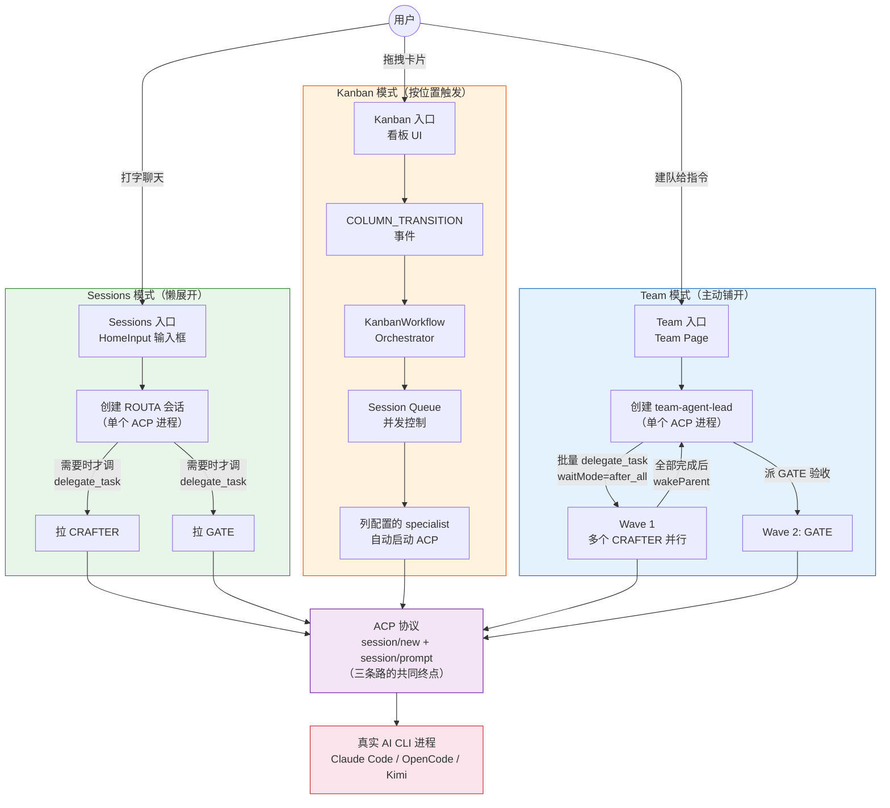
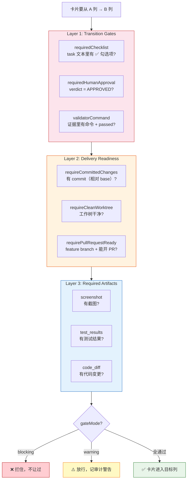
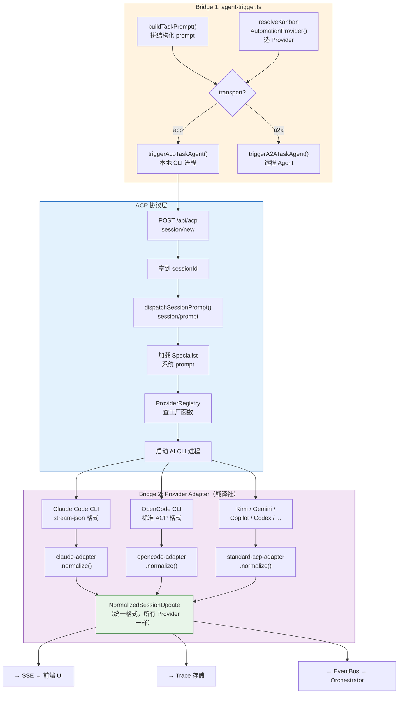
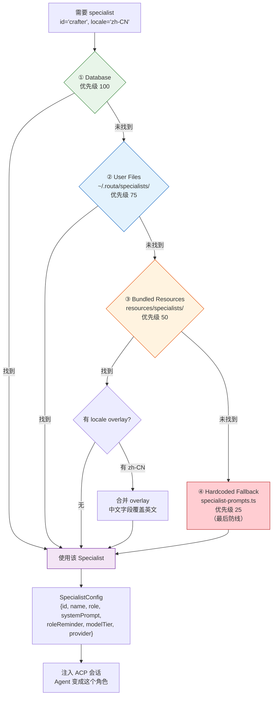
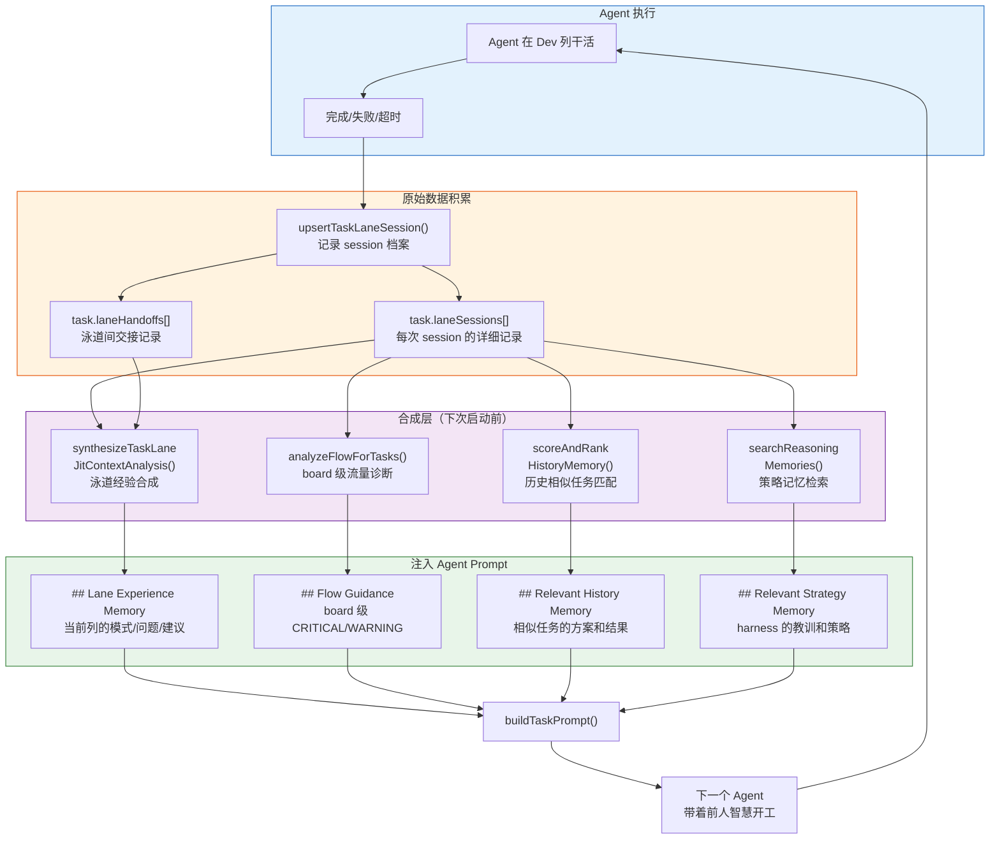
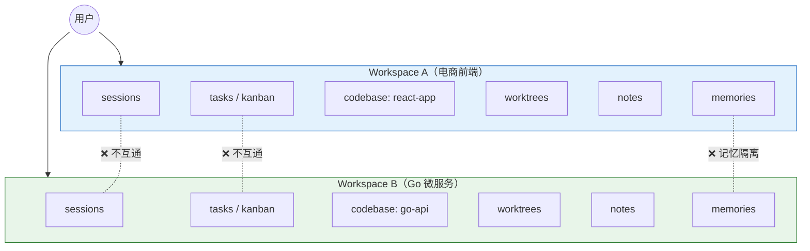
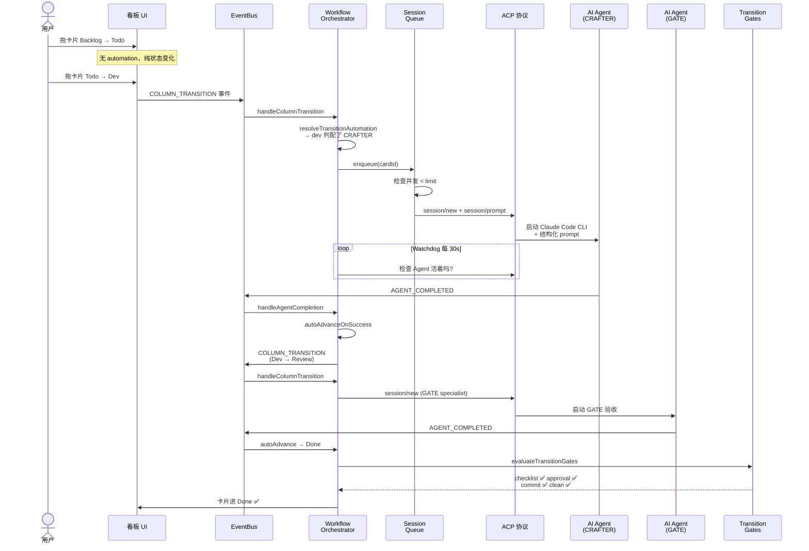

# Routa 架构图集

> 配合 [01-系统骨架导览](01-routa-architecture-tour.zh-CN.md) 到
> [06-泳道经验记忆](06-lane-experience-memory.zh-CN.md) 六篇文字使用。
> 每张图对应一篇文档的核心主题。

---

## 图 1：系统分层总览

对应 [01-系统骨架导览](01-routa-architecture-tour.zh-CN.md)

```mermaid
graph TB
    subgraph Presentation["表现层 Presentation"]
        direction LR
        Home["主页<br/>选模式"]
        Sessions["会话<br/>Sessions"]
        Kanban["看板<br/>Kanban"]
        Team["团队<br/>Team"]
        Spec["规格"]
        Feature["特性浏览"]
        Harness["Harness"]
        Settings["设置"]
    end

    subgraph API["API / 传输层（双后端语义对等）"]
        direction LR
        NextJS["Web: Next.js<br/>src/app/api/*"]
        Axum["Desktop: Rust/Axum<br/>crates/routa-server"]
        NextJS <-. "api-contract.yaml<br/>ADR-0001" .-> Axum
    end

    subgraph Protocol["协议适配层"]
        direction LR
        REST["REST<br/>CRUD"]
        MCP["MCP<br/>工具调用"]
        ACP["ACP<br/>跑 Agent"]
        A2A["A2A<br/>Agent 互通"]
        AGUI["AG-UI<br/>UI 流"]
        SSE["SSE<br/>实时推送"]
    end

    subgraph Domain["领域服务层（业务大脑）"]
        direction LR
        Orch["编排<br/>orchestration"]
        KanbanAuto["泳道自动化<br/>kanban automation"]
        Workflow["工作流<br/>workflows"]
        Review["评审<br/>review"]
        Trace["追踪<br/>trace"]
        SharedSession["共享会话<br/>shared-session"]
    end

    subgraph Container["服务容器"]
        direction LR
        RoutaSystem["TS: RoutaSystem<br/>src/core/routa-system.ts"]
        AppState["Rust: AppState<br/>crates/routa-core/src/state.rs"]
    end

    subgraph Store["存储 / 注册表层"]
        direction LR
        WS["workspace"]
        Task["task"]
        Session["session"]
        Note["note"]
        Codebase["codebase"]
        Worktree["worktree"]
        KBoard["kanban board"]
        Artifact["artifact"]
        Skill["skill"]
    end

    subgraph Persist["持久化 / 运行时层"]
        direction LR
        PG["Postgres"]
        SQLite["SQLite"]
        Mem["内存"]
        JSONL["JSONL trace"]
        Docker["Docker 沙箱"]
        GitWT["git worktree"]
    end

    Presentation --> API
    API --> Protocol
    Protocol --> Domain
    Domain --> Container
    Container --> Store
    Store --> Persist

    style Presentation fill:#e3f2fd,stroke:#1565c0
    style API fill:#fce4ec,stroke:#c62828
    style Protocol fill:#f3e5f5,stroke:#6a1b9a
    style Domain fill:#e8f5e9,stroke:#2e7d32
    style Container fill:#fff3e0,stroke:#e65100
    style Store fill:#e0f2f1,stroke:#00695c
    style Persist fill:#f5f5f5,stroke:#616161
```

---

## 图 2：三种编排模式

对应 [04-三种模式对比](04-three-modes-compared.zh-CN.md)

---

## 图 3：Kanban 自动化流水线

对应 [02-Kanban 自动化深潜](02-kanban-automation-deep-dive.zh-CN.md)

```mermaid
graph LR
    Drag["拖卡片<br/>Todo → Dev"] --> Emit["emitColumn<br/>Transition"]
    Emit --> Resolve["resolve<br/>Transition<br/>Automation"]
    Resolve --> Orch["Workflow<br/>Orchestrator"]

    subgraph Orchestrator["编排器决策"]
        Orch --> Steps["获取 automation<br/>steps 列表"]
        Steps --> Loop["防循环保护<br/>≤3 次/非dev列"]
        Loop --> Super["加载监督策略<br/>watchdog / ralph_loop"]
        Super --> Register["注册<br/>ActiveAutomation"]
    end

    Register --> Queue

    subgraph QueueSystem["并发队列"]
        Queue["Session<br/>Queue"] --> Check{"running<br/>< limit?"}
        Check -->|"是"| Start["startEntry<br/>启动 ACP"]
        Check -->|"否"| Wait["排队等待"]
        Wait -.->|"有空位时<br/>drainQueue"| Start
    end

    Start --> CreateSession["startKanban<br/>TaskSession"]

    subgraph SessionCreation["创建会话"]
        CreateSession --> WT["创建 git<br/>worktree"]
        WT --> Provider["确定 provider<br/>+ specialist"]
        Provider --> Context["收集上下文<br/>flow + memory"]
        Context --> Trigger["triggerAssigned<br/>TaskAgent"]
    end

    Trigger --> Agent["ACP Agent<br/>干活中..."]

    Agent --> Watchdog["Watchdog<br/>每30s扫描"]
    Watchdog -->|"超时"| Timeout["AGENT_TIMEOUT"]
    Agent -->|"完成"| Complete["AGENT_COMPLETED"]
    Agent -->|"失败"| Failed["AGENT_FAILED"]

    subgraph Completion["完成后处理"]
        Complete --> Satisfied{"完成条件<br/>满足?"}
        Satisfied -->|"是 + 有下一step"| NextStep["启动下一 step"]
        Satisfied -->|"是 + autoAdvance"| Advance["自动推到下一列"]
        Satisfied -->|"否"| Recover{"需要恢复?"}
        Recover -->|"是"| RecoverSession["recoverAutomation<br/>attempt + 1"]
        Recover -->|"否"| MarkFailed["标记失败"]
        Failed --> Recover
        Timeout --> Recover
    end

    Advance -->|"发新的<br/>COLUMN_TRANSITION"| Emit

    style Drag fill:#fff3e0,stroke:#e65100
    style Agent fill:#e3f2fd,stroke:#1565c0
    style Advance fill:#e8f5e9,stroke:#2e7d32
```

---

## 图 4：转换门禁三层检查

对应 [02-Kanban 自动化深潜](02-kanban-automation-deep-dive.zh-CN.md) 第 6 节

---

## 图 5：Agent 触发与 Provider 归一化

对应 [03-Agent 触发与 ACP 桥梁](03-agent-trigger-and-acp-bridge.zh-CN.md)

---

## 图 6：Specialist 加载优先级链

对应 [05-Specialist 人设体系](05-specialist-persona-system.zh-CN.md)

---

## 图 7：泳道经验记忆——闭环学习

对应 [06-泳道经验记忆](06-lane-experience-memory.zh-CN.md)

---

## 图 8：Workspace 作用域

---

## 图 9：一张卡从 Backlog 到 Done 的完整生命线

