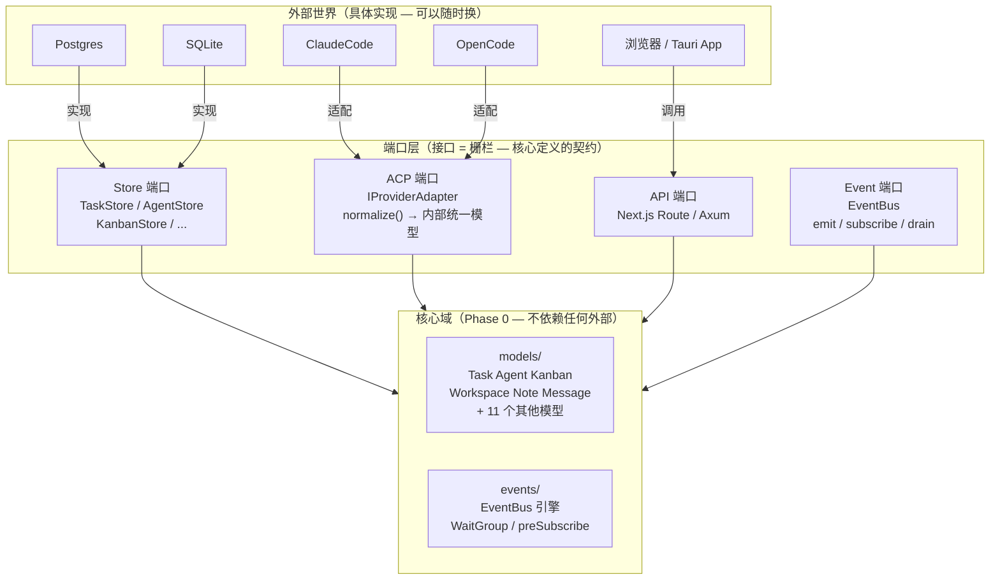
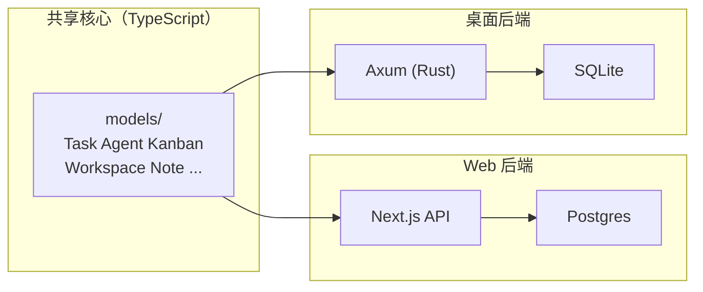

# Routa Phase 0 设计拆解

> 按「业务痛点 → 为什么这样设计 → 代码怎么落地 → 之前之后对比」的顺序，每个设计决策自闭环。
> 原始对话生成于 2026-07-03。所有代码引用指向 Routa 真实源文件。

## 「你在这里」锚点

```
Routa 全局施工图:

  models/ ──→ store/ ──→ worker/ ──→ acp/ ──→ kanban/ ──→ api/ ──→ app/
     ↑           ↑          ↑          ↑           ↑          ↑         ↑
  Phase 0     Phase 1    Phase 2    Phase 3     Phase 5   Phase 6  Phase 7
  类型底座    Store接口   Worker     ACP适配    看板引擎   API壳    页面壳

你现在在 Phase 0。这一层零依赖，但所有人依赖它。地基出问题 = 全楼重建。

本课进度    Phase 0 / 7。Routa 全栈已完成。
真实文件    ~/Desktop/my/routa/src/core/models/  14 个文件 + 1 个 barrel
            ~/Desktop/my/routa/src/core/events/   2 个文件
```

---

## 总体业务场景

Routa 是一个多 AI Agent 协作平台。一个典型的使用场景：

一个 Workspace（项目）里有一块看板，上面有 6 列：Backlog → Todo → Dev → Review → Done → Blocked。

用户创建一张 Task card「做一个登录页面」，从 Backlog 拖到 Dev 列。**一拖进 Dev 列**，发生以下一连串事情：

1. Routa 检查 Dev 列的自动化配置（`KanbanColumnAutomation`），发现有 `enabled: true`
2. 创建一个 BackgroundTask，分配一个 CRAFTER agent（负责写代码的 AI）
3. CRAFTER 被启动，拿到 card 的目标描述、验收条件、上下文代码
4. CRAFTER 开始工作：读文件、写代码、跑测试
5. CRAFTER 完成，触发 `AGENT_COMPLETED` 事件
6. 系统检测到 card 符合「进入 Review 列」的条件，**自动把 card 拖到 Review 列**
7. Review 列触发 GATE agent（审查者），审查代码
8. GATE 通过，card 拖到 Done

在这个场景里，Phase 0 作为地基，要回答五个基础问题。以下逐个拆解。

---

## 问题 1：词汇不统一 — 同一个概念，不同模块各自定义

### 真实业务场景

系统里有三个模块同时在用 Task 的概念：

- `api/tasks/route.ts`：浏览器发 POST 请求创建 card 时，API handler 自己拼 Task 对象
- `kanban/agent-trigger.ts`：AI Agent 启动时，需要读 Task 的各个字段来拼装 prompt
- `tools/agent-tools.ts`：ROUTA agent 在工作流中委派子任务时，也要创建 Task 对象

### 如果不管它，会发生什么

API handler 是这样拼 Task 的：

```typescript
// api/tasks/route.ts — 手写对象字面量
const task = {
  id: "task-abc",
  title: "登录页面",
  status: "pending",              // ← 类型是 string，不是 TaskStatus 枚举
  labels: undefined,              // ← 忘了设默认值，undefined
  columnId: "dev",                // ← 字段名叫 columnId
};
```

agent-trigger 是这样读 Task 的：

```typescript
// kanban/agent-trigger.ts — 用 any 类型，读字段时加 fallback
function buildPrompt(task: any) {
  const col = task.column ?? task.columnId ?? "backlog";  // ← 兼容三条命名
  const lbs = task.labels ?? [];                          // ← 每个消费方自己补默认值
}
```

**两个具体后果**：

1. **字段名漂移**：`agent-trigger` 多写了 `task.column` 的 fallback，说明历史上这个字段叫 `column`，后来改成 `columnId`，但旧代码不敢删。每改一次字段名就多一条 fallback 链。
2. **默认值散落**：API handler 补 `labels → undefined`，agent-trigger 又补 `labels → []`。如果有一天默认值从 `[]` 改成 `["untriaged"]`，要改 N 处。

更致命的是：Routa 有两套后端——Web 版（TypeScript + Postgres）和桌面版（Rust + SQLite）。如果 TypeScript 侧和 Rust 侧对 Task 字段的理解不一致，API 返回的 JSON 在两个后端之间漂移，前端在 Web 版和桌面版之间切换时会看到不同的数据结构。

### 为什么需要六边形架构（设计背景）

Routa 的 ADR 0001（`docs/adr/0001-dual-backend-semantic-parity.md`）记录了关键决策：

> Routa.js ships as both a web app (Next.js) and a desktop app (Tauri + Rust/Axum). They must share the same domain model vocabulary.

**同一个产品有两套后端，但必须共享同一套领域模型**。Web 版用 TypeScript + Postgres，桌面版用 Rust + SQLite。两套技术栈完全不同，但 Task、Agent、Kanban、Workspace 的概念不能有任何差异。

如果不做隔离：Task 的 TypeScript 类型散落在 Next.js API handler 里，Rust 那边重新定义一遍 → 两个版本的 Task 迟早漂移。改一个业务规则（如新增 `Task.evidenceSummary` 字段）→ 要改 TypeScript + Rust 两边 → k = 2N。

这就是六边形架构的动机：把领域模型放在最核心的位置（Phase 0），让它成为**唯一真相源**。Web 后端和桌面后端都 import 同一套类型定义，不存在"各自主理解的 Task"。

**六边形架构全貌**：



**核心规则**：所有箭头指向内。`core/` 不知道 Postgres 和 SQLite 的存在，只知道 `TaskStore` 接口。换数据库 → 只换箭头最外端，`core/` 0 改动。`IProviderAdapter` 就是 DDD 书里说的「防腐层」—— ClaudeCode 和 OpenCode 的事件格式完全不同，但都通过 `normalize()` 翻译成内部统一模型，核心模块只认统一模型，不知外部差异。

**双后端如何共享核心**：



Rust 端的 `crates/routa-core/src/models/task.rs` 是同一份契约的 Rust 翻译，用 `#[serde(rename_all = "camelCase")]` 保证 JSON 字段名与 TypeScript 侧一致。CI 里跑 parity test 对比两边的 JSON 输出，漂移会被自动抓到。

### 设计决策：14 个 interface + 14 个 createXxx 工厂函数

**核心思路**：所有模块从一个地方拿类型和创建逻辑，而不是各自拼。interface 锁定领域词汇的形状，工厂函数锁定默认值。

14 个模型按复杂度分四档。以下从 Routa 真实施工代码中搬四个完整案例，展示这个模式的全频谱。

---

### 一档：简单工厂 — Agent（3 个默认值填充）

`src/core/models/agent.ts` — Routa 里最简单的工厂函数，只有 7 个字段，工厂只做「填默认值」一件事：

```typescript
export interface Agent {
  id: string;
  name: string;
  role: AgentRole;
  modelTier: ModelTier;
  workspaceId: string;
  parentId?: string;
  status: AgentStatus;
  createdAt: Date;
  updatedAt: Date;
  metadata: Record<string, string>;
}

export function createAgent(params: {
  id: string;
  name: string;
  role: AgentRole;
  workspaceId: string;
  parentId?: string;
  modelTier?: ModelTier;              // ← 可选 — 不传就是 SMART
  metadata?: Record<string, string>;  // ← 可选 — 不传就是 {}
}): Agent {
  const now = new Date();
  return {
    id: params.id,
    name: params.name,
    role: params.role,
    modelTier: params.modelTier ?? ModelTier.SMART,
    workspaceId: params.workspaceId,
    parentId: params.parentId,
    status: AgentStatus.PENDING,      // ← 填默认
    createdAt: now,                   // ← 填默认
    updatedAt: now,                   // ← 填默认
    metadata: params.metadata ?? {},  // ← 填默认
  };
}
```

**工厂做了什么**：4 个参数必传（id, name, role, workspaceId），3 个可选（parentId, modelTier, metadata），4 个系统字段由工厂自动填充（status, createdAt, updatedAt, metadata 默认值）。调用方只传业务参数，不碰系统字段。

同档的还有 `Message`（`createMessage` — 5 个必填 + 3 个可选，工厂只负责填 `timestamp: new Date()`）、`Artifact`（`createArtifact` — 4 个必填 + 8 个可选，工厂填 `status: "pending"` + `createdAt/updatedAt`）。

---

### 二档：派生值工厂 — BackgroundTask（title 从 prompt 自动推导）

`src/core/models/background-task.ts` — 比简单工厂多一步：**业务字段之间有关联逻辑**，调用方不需要自己算：

```typescript
export interface BackgroundTask {
  id: string;
  title: string;                    // ← 人类可读标题，从 prompt 前 60 字符推导
  prompt: string;                   // ← 给 Agent 的完整提示词
  agentId: string;
  workspaceId: string;
  status: BackgroundTaskStatus;
  triggeredBy: string;
  triggerSource: BackgroundTaskTriggerSource;
  priority: BackgroundTaskPriority;
  resultSessionId?: string;
  sandboxId?: string;
  errorMessage?: string;
  attempts: number;
  maxAttempts: number;
  createdAt: Date;
  startedAt?: Date;
  completedAt?: Date;
  updatedAt: Date;
  lastActivity?: Date;
  currentActivity?: string;
  toolCallCount?: number;
  inputTokens?: number;
  outputTokens?: number;
  workflowRunId?: string;
  workflowStepName?: string;
  dependsOnTaskIds?: string[];
  taskOutput?: string;
}

/** 最小入参 — 和完整 interface 完全不同的形状 */
export interface CreateBackgroundTaskInput {
  id?: string;
  title?: string;
  prompt: string;
  agentId: string;
  workspaceId: string;
  triggeredBy?: string;
  triggerSource?: BackgroundTaskTriggerSource;
  priority?: BackgroundTaskPriority;
  sandboxId?: string;
  maxAttempts?: number;
  workflowRunId?: string;
  workflowStepName?: string;
  dependsOnTaskIds?: string[];
}

export function createBackgroundTask(
  input: CreateBackgroundTaskInput
): BackgroundTask {
  const now = new Date();
  const title = input.title ?? input.prompt.slice(0, 60).replace(/\n/g, " ");
  //                          ↑ 派生逻辑：如果没传 title，从 prompt 前 60 字符截取

  return {
    id: input.id ?? crypto.randomUUID(),
    title,                                  // ← 派生值
    prompt: input.prompt,
    agentId: input.agentId,
    workspaceId: input.workspaceId,
    status: "PENDING",
    triggeredBy: input.triggeredBy ?? "user",
    triggerSource: input.triggerSource ?? "manual",
    priority: input.priority ?? "NORMAL",
    sandboxId: input.sandboxId,
    attempts: 0,
    maxAttempts: input.maxAttempts ?? 1,
    createdAt: now,
    updatedAt: now,
    workflowRunId: input.workflowRunId,
    workflowStepName: input.workflowStepName,
    dependsOnTaskIds: input.dependsOnTaskIds,
  };
}
```

**三个和 Agent 工厂不同的点**：

1. **入参接口和返回值接口完全不同** — `CreateBackgroundTaskInput` 只有 10 个字段，但 `BackgroundTask` 有 29 个字段。入参只暴露调用方需要关心的，系统字段（attempts, maxAttempts, status, timestamps, progress counters）全部在工厂内部处理。
2. **派生逻辑** — `title` 不传时从 `prompt.slice(0, 60)` 自动截取。如果将来改成 80 字符，只改这一个 `60`，所有调用方零改动（k = 1）。
3. **id 自动生成** — `input.id ?? crypto.randomUUID()`，调用方可以不关心 id 生成策略。

同档的还有 `Note`（`createNote` — nested metadata 对象有 5 个子字段，每个都有默认值）、`Workspace`（`createWorkspace` — metadata 通过 `getEffectiveWorkspaceMetadata()` 自动计算 `worktreeRoot` 路径）、`Schedule`（除了 `createSchedule` 还有 `resolveSchedulePrompt` 辅助函数，做 `{timestamp}` / `{cronExpr}` 模板变量替换）。

---

### 三档：复杂工厂 — Task（44 字段 + 历史兼容 + 嵌套 normalize × 2）

`src/core/models/task.ts` — Routa 最复杂的领域对象。完整的 interface 有 44 个字段、工厂函数 33 个参数。以下只展示关键的设计模式：

```typescript
export interface Task {
  // ── 核心身份（必填） ──
  id: string;
  title: string;
  objective: string;
  status: TaskStatus;
  workspaceId: string;

  // ── 看板定位 ──
  boardId?: string;
  columnId?: string;          // ← 历史唯一字段名，不与 column/taskColumn 混用
  position: number;           // ← 必选（工厂默认 0）

  // ── 集合字段（interface 上是必选，工厂保证不为 undefined） ──
  labels: string[];
  sessionIds: string[];
  laneSessions: TaskLaneSession[];
  laneHandoffs: TaskLaneHandoff[];
  dependencies: string[];
  codebaseIds: string[];

  // ── 嵌套对象（入口处 normalize） ──
  contextSearchSpec?: TaskContextSearchSpec;    // 7 个子字段的检索提示
  jitContextSnapshot?: TaskJitContextSnapshot;  // 运行时上下文快照

  // ── 历史兼容 ──
  comment?: string;                      // ← 旧格式（单条字符串）
  comments: TaskCommentEntry[];          // ← 新格式（结构化数组）

  // ── 时间戳（系统字段） ──
  createdAt: Date;
  updatedAt: Date;

  // ... 还有 20+ 个可选字段（scope, acceptanceCriteria, github*, worktreeId, etc.）
}

export function createTask(params: {
  id: string;
  title: string;
  objective: string;
  workspaceId: string;
  comment?: string;                     // ← 旧格式
  comments?: TaskCommentEntry[];        // ← 新格式
  status?: TaskStatus;
  columnId?: string;
  position?: number;
  labels?: string[];
  dependencies?: string[];
  codebaseIds?: string[];
  contextSearchSpec?: TaskContextSearchSpec;
  jitContextSnapshot?: TaskJitContextSnapshot;
  // ... + 20 个可选参数
}): Task {
  const now = new Date();
  // 新旧格式兼容：优先用 comments，fallback 到 comment
  const comments = params.comments ?? buildInitialTaskComments(params.comment, now);

  return {
    id: params.id,
    title: params.title,
    objective: params.objective,
    comment: params.comment,
    comments,                                         // ← 兼容处理结果
    status: params.status ?? TaskStatus.PENDING,
    columnId: params.columnId,
    position: params.position ?? 0,
    labels: params.labels ?? [],
    sessionIds: [],                                   // ← 从空数组起步
    laneSessions: [],                                 // ← 从空数组起步
    laneHandoffs: [],                                 // ← 从空数组起步
    dependencies: params.dependencies ?? [],
    codebaseIds: params.codebaseIds ?? [],
    contextSearchSpec: normalizeTaskContextSearchSpec(params.contextSearchSpec),
    jitContextSnapshot: normalizeTaskJitContextSnapshot(params.jitContextSnapshot),
    workspaceId: params.workspaceId,
    createdAt: now,
    updatedAt: now,
  };
}
```

**Task 工厂的四个独特设计**：

**1. 新旧格式兼容** — `comment`（单条字符串，旧格式）和 `comments`（结构化数组，新格式）共存。工厂内部 `buildInitialTaskComments(params.comment, now)` 把旧格式自动转为新格式。调用方传 `comment` 或 `comments` 都能工作，不需要知道这是一次格式迁移。

**2. 嵌套对象 normalize** — `contextSearchSpec` 和 `jitContextSnapshot` 都在赋值前经过 normalize 函数清洗。下面展开 `normalizeTaskContextSearchSpec` 的完整逻辑：

`src/core/models/task.ts:356-378`：

```typescript
export function normalizeTaskContextSearchSpec(
  value: TaskContextSearchSpec | null | undefined,
): TaskContextSearchSpec | undefined {
  if (!value) return undefined;

  const normalized: TaskContextSearchSpec = {
    query: normalizeTaskContextSearchText(value.query),
    featureCandidates: normalizeTaskContextSearchItems(value.featureCandidates),
    relatedFiles: normalizeTaskContextSearchItems(value.relatedFiles),
    routeCandidates: normalizeTaskContextSearchItems(value.routeCandidates),
    apiCandidates: normalizeTaskContextSearchItems(value.apiCandidates),
    moduleHints: normalizeTaskContextSearchItems(value.moduleHints),
    symptomHints: normalizeTaskContextSearchItems(value.symptomHints),
  };

  // 全部为空 → 返回 undefined 而非 {}，让下游用 truthy 检查就能判断
  return Object.values(normalized).some((entry) =>
    typeof entry === "string" ? entry.length > 0 : Array.isArray(entry) && entry.length > 0
  ) ? normalized : undefined;
}
```

**关键细节**：normalize 完之后检查 **「全部为空」→ 返回 `undefined`**。这样下游不需要 `if (task.contextSearchSpec && task.contextSearchSpec.query)`，只需要 `if (task.contextSearchSpec)` 就够。如果返回 `{}`，truthy 检查会误判。

另外还有一个 `parseTaskContextSearchSpec`（line 380-407），接受 `unknown` 类型输入（来自 JSON 反序列化后的脏数据），做类型过滤 + normalize，是 **系统边界入口的又一层防护**。

**3. 集合字段初始化为空数组** — `sessionIds: []`、`laneSessions: []`、`laneHandoffs: []`、`labels: params.labels ?? []`。interface 上这些字段都是必选的 `string[]`，但工厂保证创建时从空数组起步，调用方不传 `labels` 不会拿到 `undefined`。

**4. 工厂 params 已有 33 个参数** — 这就是为什么 `position: 0` 作为默认值很重要。如果每个调用方都要 `position: 0` 传一遍，33 个默认值散落在 N 个文件中，改一个要改 N 处。

---

### 四档：带辅助函数的工厂 — Workspace（派生值由独立函数计算）

`src/core/models/workspace.ts` — 工厂不仅填充默认值，还调用辅助函数做业务计算：

```typescript
export interface Workspace {
  id: string;
  title: string;
  status: WorkspaceStatus;
  metadata: Record<string, string>;  // worktreeRoot 等隐含字段在这里
  createdAt: Date;
  updatedAt: Date;
}

export function getDefaultWorkspaceWorktreeRoot(workspaceId: string): string {
  return path.join(os.homedir(), ".routa", "workspace", workspaceId);
}

export function getEffectiveWorkspaceMetadata(
  workspace: Pick<Workspace, "id" | "metadata">
): Record<string, string> {
  const metadata = { ...(workspace.metadata ?? {}) };
  const explicitRoot = metadata.worktreeRoot?.trim();
  // 用户显式设置了 worktreeRoot → 尊重用户配置；否则自动计算
  metadata.worktreeRoot = explicitRoot || getDefaultWorkspaceWorktreeRoot(workspace.id);
  return metadata;
}

export function createWorkspace(params: {
  id: string;
  title: string;
  metadata?: Record<string, string>;
}): Workspace {
  const now = new Date();
  return {
    id: params.id,
    title: params.title,
    status: "active",
    metadata: getEffectiveWorkspaceMetadata({
      id: params.id,
      metadata: params.metadata ?? {},
    }),
    createdAt: now,
    updatedAt: now,
  };
}
```

**`getEffectiveWorkspaceMetadata` 的价值**：`worktreeRoot` 有两条路径 — 用户显式设置 → 用它；没设置 → 自动推导 `~/.routa/workspace/{id}`。如果这个逻辑写在 API handler 或消费方里，每个创建 workspace 的地方都要复制。抽成独立函数，工厂调用它，外部模块也可以通过 `import { getEffectiveWorkspaceMetadata }` 复用（"当前 workspace 的 worktree 路径在哪" 是高频查询）。

---

### 14 个模型全览

| 模型 | 文件 | interface 字段数 | 工厂函数 | 显著特征 |
|------|------|:---:|---------|---------|
| Agent | `agent.ts` | 9 | `createAgent` | 最简单 — 3 个必填 + 4 个默认值 |
| Message | `message.ts` | 8 | `createMessage` | 纯数据 — 只有 `timestamp` 自动填 |
| Task | `task.ts` | 44 | `createTask` | 最复杂 — 历史兼容 + 2× normalize + 33 参数 |
| BackgroundTask | `background-task.ts` | 29 | `createBackgroundTask` | 派生值 — title 从 prompt 截取 |
| Kanban | `kanban.ts` | — | — | 无领域对象工厂，但有 `cloneKanbanColumns` 深克隆 + 4 个映射纯函数 |
| Workspace | `workspace.ts` | 6 | `createWorkspace` | 辅助函数 — `getEffectiveWorkspaceMetadata` |
| Note | `note.ts` | 8 | `createNote` + `createSpecNote` | 嵌套 metadata 默认值 + 快捷工厂 |
| Artifact | `artifact.ts` | 13 | `createArtifact` + `createArtifactRequest` | 两个相关对象各有工厂 |
| Schedule | `schedule.ts` | 14 | `createSchedule` | 模板变量替换 `resolveSchedulePrompt` |
| CanvasArtifact | `canvas-artifact.ts` | — | — | 纯类型，工厂在 artifact.ts 复用 |
| Codebase | `codebase.ts` | — | — | 纯类型 + 枚举 |
| Worktree | `worktree.ts` | — | — | 纯类型 |
| TaskRequirements | `task-requirements.ts` | — | — | 纯类型 + 常量 |
| index | `index.ts` | — | — | barrel re-export |

**规律**：字段越多、嵌套越深、派生逻辑越复杂的对象，工厂函数的收益越大。反过来，纯数据 DTO（Codebase, Worktree, TaskRequirements）不需要工厂——直接 `{ ... }` 就够。

---

### 之前 vs 之后

| 模块 | 之前 | 之后 |
|------|------|------|
| `api/tasks/route.ts` | 手写 `const task = { labels: undefined, status: "pending" }` — 对象字面量 | `import { createTask } from "@/core/models/task"` → `createTask({ title, objective, workspaceId, ... })` |
| `kanban/agent-trigger.ts` | `function buildPrompt(task: any)` — any 类型，字段加 fallback | `import { Task } from "@/core/models/task"` → `function buildPrompt(task: Task)` — 强类型 |
| `tools/agent-tools.ts` | ROUTA 委派时手写 Task | `import { createTask } from "@/core/models"` → `const task = createTask({ ... })` |
| `tools/kanban-tools.ts` | AI Agent 调 create_card 时手写 Task | `import { createTask } from "@/core/models/task"` → `createTask({ id: uuidv4(), title, ... })` |

**效果**：加一个字段（如 `estimatedHours`）→ 只在 `interface Task` 和 `createTask` 各加一行 → 4 个消费模块通过类型检查自动感知到这个新字段。

### 五镜头判断

**分（边界怎么画）** — 具体案例：`createdAt` 的实现变更。

Routa 有 14 个工厂函数，每个都生成 `createdAt: new Date()` 和 `updatedAt: new Date()`。假设需要把时间格式从 `Date` 对象改成 ISO 字符串 `string`：

```
❌ 没有工厂函数时:
  14 个模型文件各改 1 处（createdAt, updatedAt）
  + 外部 N 个调用方如果手写了 new Date() 也要改
  → 改动面 = 14 × 2 + N，k 不可控

✅ 有工厂函数时:
  14 个 factory 文件各改 1 处 createdAt + 1 处 updatedAt → 改 14 个文件
  外部 N 个调用方只传业务参数，不碰 createdAt → 0 改动
  → 改动面 = 14，k 完全控制在工厂内部
```

边界画在哪：**分界线在 "业务参数" 和 "系统字段" 之间**。调用方负责传业务参数（title, objective, role），工厂负责填系统字段（id, createdAt, status, sessionIds）。

**稳（变化怎么封）** — 具体案例：三种变化的 k 值。

```
变化 1 — 默认值变: modelTier 从 SMART → BALANCED
  ❌ 无工厂: 3 个调用文件各写死了 ModelTier.SMART → k = 3
  ✅ 有工厂: createAgent 内 params.modelTier ?? ModelTier.BALANCED → k = 1

变化 2 — 初始值变: labels 默认值从 [] 改成 ["untriaged"]
  ❌ 无工厂: api handler、kanban-tools、agent-tools 各补 labels ?? [] → k = 3
  ✅ 有工厂: createTask 内 labels: params.labels ?? ["untriaged"] → k = 1

变化 3 — 派生值变: BackgroundTask 的 title 推导从 "前 60 字符" 改成 "前 80 字符"
  ❌ 无工厂: 每个创建 BackgroundTask 的地方都自己写了 .slice(0,60) → k = N
  ✅ 有工厂: createBackgroundTask 内 input.prompt.slice(0,80) → k = 1
```

Routa 的真实 `createBackgroundTask`（`background-task.ts:128`）正是这样做的：`const title = input.title ?? input.prompt.slice(0, 60).replace(/\n/g, " ")`。如果把这个 60 改成 80，只需要改这一行。

**向（依赖怎么流）** — 具体案例：import 图。

```
Routa 真实的 import 情况（从 models/ 目录的 import 语句统计）:

models/task.ts:
  import type { ArtifactType } from "./artifact";       ← 同层，import type
  import type { KanbanRequiredTaskField } from "./task-requirements";  ← 同层
  import type { TaskCreationSource } from "../kanban/...";  ← 同 Phase 0

  ❌ 不存在: import from "../store/..."     ← 跨 Phase，不允许
  ❌ 不存在: import from "../acp/..."        ← 跨 Phase，不允许
  ❌ 不存在: import from "../../app/..."     ← 跨层，不允许

models/workspace.ts:
  import os from "os";       ← 只依赖 Node 标准库
  import path from "path";   ← 只依赖 Node 标准库

models/agent.ts, artifact.ts, background-task.ts, canvas-artifact.ts,
codebase.ts, message.ts, schedule.ts, worktree.ts, task-requirements.ts:
  (零 import — 不依赖任何同层或上层文件)
```

箭头方向：`Node 标准库 → models/ → store/ → acp/ → kanban/ → api/ → app/`。Phase 0 在最内圈，只被依赖，不依赖外部。

**约（协作契约怎么定）** — 具体案例：编译期违约被挡。

```typescript
// ❌ 编译不过 — modelTier 的值不在 ModelTier 枚举中
const agent = createAgent({
  id: "a1", name: "bot", role: AgentRole.CRAFTER, workspaceId: "ws1",
  modelTier: "ULTRA_SMART",  // ← TypeScript error: Type '"ULTRA_SMART"'
});                           //   is not assignable to type 'ModelTier | undefined'

// ❌ 编译不过 — role 是必选字段，没传
const agent = createAgent({
  id: "a1", name: "bot", workspaceId: "ws1",
  // ← Property 'role' is missing
});

// ✅ 编译通过 — 只传业务必需的 + 可选字段用正确的枚举值
const agent = createAgent({
  id: "a1", name: "bot", role: AgentRole.CRAFTER, workspaceId: "ws1",
  modelTier: ModelTier.BALANCED,  // ← 合法枚举值
});
```

**权（代价怎么选）** — 具体案例：绕过工厂的后果。

```typescript
// 有人绕过工厂，直接 as 断言
const agent = {
  id: "a1", name: "bad-bot", role: AgentRole.CRAFTER,
  workspaceId: "ws1", modelTier: "FAST" as any,  // ← 绕过了枚举检查
  status: undefined,  // ← 绕过了默认值
  createdAt: new Date(), updatedAt: new Date(),
  metadata: {},
} as Agent;

// 下游代码:
if (agent.status === AgentStatus.ACTIVE) {  // undefined === "ACTIVE" → false
  // 这段代码永远不会执行，但也不会报错
}
if (agent.labels.includes("bug")) {  // TypeError: Cannot read property 'includes' of undefined
  // 💥 运行时爆炸
}
```

**Routa 的选择**：宁可牺牲直接构造对象的灵活性（不能用 `as Agent`），也要保证下游拿到的 `Agent.status` 一定是合法枚举值、`Agent.labels` 一定是数组。灵活性换安全性。14 个模型 × 50+ 个消费方 = 灵活性的代价被放大 N 倍，不值得。

---

## 问题 2：通知链断裂 — 拖了 card，下游模块不知道

### 真实业务场景

用户在浏览器里把 card 从 Todo 拖到 Dev：

```typescript
// 浏览器端
function onDragEnd(cardId: string, newColumnId: string) {
  await fetch(`/api/tasks/${cardId}`, {
    method: "PUT",
    body: JSON.stringify({ columnId: newColumnId }),
  });
  moveCardInLocalState(cardId, newColumnId);
}
```

**后续链断了**：

- `column-transition.ts`（负责发射 `COLUMN_TRANSITION` 事件）完全没有被通知到
- `workflow-orchestrator.ts`（负责检查列自动化配置并启动 Agent）也没有被通知到
- `background-worker.ts`（负责轮询待执行的 BackgroundTask）更不知道发生了什么

**结果**：card 在 UI 上移动了，数据库 columnId 也更新了，但 Dev 列的自动化（启动 CRAFTER agent）**没有被触发**。用户等了几分钟发现什么都没发生，重新拖一次。

### 如果不管它，会发生什么

每个 emit 点必须硬编码所有下游模块的 import：

```typescript
// column-transition.ts
import { workflowOrchestrator } from "./workflow-orchestrator";
import { taskStore } from "../store/task-store";
import { agentRegistry } from "../acp/agent-registry";

function onCardMoved(card: Task, toColumn: string) {
  taskStore.updateStatus(card.id, columnIdToTaskStatus(toColumn));  // 更新 DB
  workflowOrchestrator.triggerAutomation(card, toColumn);            // 启动 Agent
  agentRegistry.assignAgent(card.assignedProvider, card);            // 分配 Agent
}
```

**三个后果**：
1. `column-transition.ts` 知道了 `workflowOrchestrator`、`taskStore`、`agentRegistry` 的存在 → 依赖爆炸
2. 加一个新的消费方（如审计日志、Slack 通知）→ 回 `column-transition.ts` 改代码 → 这个文件越改越大
3. 没有统一的投递顺序 → 谁先 import 谁先执行

### 设计决策：为什么用 EventBus 而不是直接调用

这是 **观察者模式（Observer Pattern）** 的经典应用场景——但不止于模式本身。Routa 的 EventBus 有三个专门为多 Agent 场景设计的机制：

| 机制 | 为什么需要 | 没有它会发生什么 |
|------|-----------|----------------|
| **Agent 订阅缓冲**（pendingEvents） | Agent 进程还没启动时，别人已经注册了订阅。事件必须在这里排队 | Agent 启动前的事件全部丢失 |
| **preSubscribe 双通道**（handler + subscription） | Agent A 等 Agent B 的回复，但不知道事件先到还是订阅先完成 | 时序竞态 → 间歇性丢事件，极难复现和调试 |
| **WaitGroup（after_all）** | ROUTA 等 N 个子 Agent 全部完成才继续 | 协调逻辑膨胀 60 行 → Orchestrator 不堪重负（见问题 5） |

> 📖 `GOOS-端口与适配器` + `CC-8 边界`。EventBus 就是六边形上的一条边 — 外部模块通过这个端口跟自己通信，但 EventBus 不知道谁在用。

**为什么不用第三方消息队列（Redis Pub/Sub、Kafka）？** Routa 是桌面 + Web 双后端产品。桌面版运行在用户电脑上，不能假设用户装了 Redis。EventBus 必须是进程内、零外部依赖的。这也是它用 4 个 `Map` 做存储的原因——零 I/O 开销，哪都能跑。

### 代码落地

**现在回到同一个场景 — 用户把 card-5 从 Todo 拖进 Dev，ROUTA 在等 3 个子 Agent 完成**。我们用这个场景跟踪四个 Map 里的真实数据变化。

---

**场景设定**：系统启动后，以下模块已经注册了自己的订阅：

- `workflow-orchestrator` 订阅了 `[COLUMN_TRANSITION, AGENT_COMPLETED, AGENT_FAILED]`（关心 card 移动和 Agent 完成）
- `ROUTA-1`（协调者）订阅了 `[AGENT_COMPLETED, PERMISSION_REQUESTED]`（关心子 Agent 的进度）
- `ROUTA-1` 通过 `preSubscribe` 注册了一个临时 handler — 它在等 `CRAFTER-A` 的 `AGENT_COMPLETED` 事件（`preSubscribe` 返回了 `{ promise }`，ROUTA 正在 `await promise`）

**初始状态 — 四个 Map 的内容**：

```
handlers Map:                           subscriptions Map:
┌──────────────────────────────┐       ┌───────────────────────────────────┐
│ "pre-subscribe-PERM-REQ"  →  │       │ "sub-orchestrator" → {            │
│   handler(event) {           │       │   agentId: "orchestrator",        │
│     if AGENT_COMPLETED →     │       │   eventTypes: [COLUMN_TRANSITION, │
│       resolvePromise(event)  │       │       AGENT_COMPLETED,            │
│   }                          │       │       AGENT_FAILED],              │
└──────────────────────────────┘       │   priority: 5                     │
                                       │ }                                 │
pendingEvents Map: (空)                │                                   │
┌──────────────────────────────┐       │ "sub-routa-1" → {                 │
│ (还没有任何 Agent 发事件)      │       │   agentId: "ROUTA-1",            │
└──────────────────────────────┘       │   eventTypes: [AGENT_COMPLETED,    │
                                           PERMISSION_REQUESTED],          │
waitGroups Map: (空)                      │   priority: 10                  │
┌──────────────────────────────┐       │ }                                 │
│ (ROUTA 还没创建 WaitGroup)    │       │                                   │
└──────────────────────────────┘       │ "sub-pre-perm" → {                 │
                                       │   agentId: "ROUTA-1",              │
                                       │   eventTypes: [AGENT_COMPLETED],   │
                                       │   oneShot: true,                   │
                                       │   priority: 10                     │
                                       │ }  ← preSubscribe 同时注册了这条订阅 │
                                       └───────────────────────────────────┘
```

---

**时刻 1 — 用户拖 card-5 进 Dev 列，`column-transition.ts` 调 `eventBus.emit(...)`**

```
column-transition.ts 调用:
  eventBus.emit({
    type: AgentEventType.COLUMN_TRANSITION,
    agentId: "system",
    workspaceId: "ws-abc",
    data: { cardId: "card-5", fromColumnId: "todo", toColumnId: "dev", boardId: "board-1" },
    timestamp: new Date(),
  });
```

**emit 内部逐个处理三个 Map**：

**第 1 步 — handlers Map**：

遍历 `handlers` 的所有值。当前只有一个 handler — `"pre-subscribe-PERM-REQ"` 注册的 handler。这个 handler 只关心 `AGENT_COMPLETED` 事件。当前事件是 `COLUMN_TRANSITION` → `eventTypes.includes(COLUMN_TRANSITION)` 返回 false → **跳过**。handlers Map 不变。

**第 2 步 — subscriptions Map + pendingEvents Map**：

对 subscriptions 里的每条订阅，检查 `eventTypes` 是否包含 `COLUMN_TRANSITION`：

```
遍历 "sub-orchestrator":
  eventTypes 包含 COLUMN_TRANSITION ✓ → 匹配！
  → pendingEvents["orchestrator"] 之前为空 → 创建 [事件1]

遍历 "sub-routa-1":
  eventTypes = [AGENT_COMPLETED, PERMISSION_REQUESTED]
  COLUMN_TRANSITION 不在里面 → 跳过

遍历 "sub-pre-perm":
  eventTypes = [AGENT_COMPLETED]
  COLUMN_TRANSITION 不在里面 → 跳过
```

**第 2 步结束后，pendingEvents Map 变了**：

```
pendingEvents Map: (第 2 步后的状态)
┌──────────────────────────────────────┐
│ "orchestrator" → [                   │
│   { type: COLUMN_TRANSITION,         │
│     data: { cardId: "card-5",        │
│       fromColumnId: "todo",          │
│       toColumnId: "dev" } },         │  ← 事件 1 在这里排队
│ ]                                    │
│ "ROUTA-1" → (还是空的)               │ ← 没有路由到它
└──────────────────────────────────────┘
```

**第 3 步 — waitGroups Map**：

`COLUMN_TRANSITION` 不是终态事件（只有 AGENT_COMPLETED / AGENT_FAILED / AGENT_TIMEOUT / REPORT_SUBMITTED 是终态）→ **跳过**。waitGroups Map 不变（还是空的）。

---

**时刻 2 — workflow-orchestrator 就绪后取事件**

```
workflow-orchestrator.ts 调用:
  const events = eventBus.drainPendingEvents("orchestrator");
  // → 返回 [事件1]
```

**drainPendingEvents 内部**：

```typescript
const events = this.pendingEvents.get("orchestrator") ?? [];
// → 拿到 [事件1]
this.pendingEvents.delete("orchestrator");
// → pendingEvents["orchestrator"] 被清空
return events;
```

**pendingEvents Map 变了**：

```
pendingEvents Map: (drain 后的状态)
┌──────────────────────────────────────┐
│ "ROUTA-1" → (还是空的)               │
│ "orchestrator" 已被 delete — 不存在了 │
└──────────────────────────────────────┘
```

workflow-orchestrator 拿到事件1，解析出 `toColumnId: "dev"` → 查 board 配置 → Dev 列有 `automation.enabled = true` → 创建 BackgroundTask → 启动 CRAFTER agent。

---

**时刻 3 — ROUTA 创建 WaitGroup，等 3 个子 Agent 完成**

```
ROUTA 调用:
  eventBus.createWaitGroup({
    id: "grp-login-page",
    parentAgentId: "ROUTA-1",
    expectedAgentIds: [],   // ← 先空着，子 Agent 还没创建
    onComplete: (group) => { aggregateResults(group); },
  });
```

**waitGroups Map 的内容**：

```
waitGroups Map:
┌─────────────────────────────────────────────┐
│ "grp-login-page" → {                        │
│   id: "grp-login-page",                     │
│   parentAgentId: "ROUTA-1",                 │
│   expectedAgentIds: [],                      │  ← 空 — 子 Agent 还没创建
│   completedAgentIds: Set {},                 │  ← 空
│   onComplete: aggregateResults              │
│ }                                           │
└─────────────────────────────────────────────┘
```

**后续 — 3 个子 Agent 陆续创建并追加**：

```
eventBus.addToWaitGroup("grp-login-page", "CRAFTER-A");
// → expectedAgentIds = ["CRAFTER-A"]

eventBus.addToWaitGroup("grp-login-page", "CRAFTER-B");
// → expectedAgentIds = ["CRAFTER-A", "CRAFTER-B"]

eventBus.addToWaitGroup("grp-login-page", "CRAFTER-C");
// → expectedAgentIds = ["CRAFTER-A", "CRAFTER-B", "CRAFTER-C"]
```

**waitGroups Map 更新后**：

```
waitGroups Map:
┌─────────────────────────────────────────────┐
│ "grp-login-page" → {                        │
│   expectedAgentIds: ["CRAFTER-A",            │
│       "CRAFTER-B", "CRAFTER-C"],             │
│   completedAgentIds: Set {},                 │  ← 还是空 — 没一个完成
│ }                                           │
└─────────────────────────────────────────────┘
```

---

**时刻 4 — CRAFTER-A 完成工作，emit AGENT_COMPLETED**

```
CRAFTER-A 的 ACP 适配器调用:
  eventBus.emit({
    type: AgentEventType.AGENT_COMPLETED,
    agentId: "CRAFTER-A",
    workspaceId: "ws-abc",
    data: { sessionId: "sess-1", summary: "Login form done" },
    timestamp: new Date(),
  });
```

**emit 内部逐个处理三个 Map**：

**第 1 步 — handlers Map**：

遍历 handlers。`"pre-subscribe-PERM-REQ"` 的 handler 检查 `eventTypes.includes(AGENT_COMPLETED)` → ✓ 匹配！→ `resolvePromise(event)` → Promise 被 resolve → `await promise` 的 ROUTA 收到事件 → `this.off(handlerKey)` → **handler 被移除**。

**handlers Map 变了**：

```
handlers Map: (第 1 步后的状态)
┌──────────────────────────────┐
│ (空 — preSubscribe 的 handler 已 resolve 后自删) │
└──────────────────────────────┘
```

**第 2 步 — subscriptions Map + pendingEvents Map**：

```
遍历 "sub-orchestrator":
  eventTypes 包含 AGENT_COMPLETED ✓ → 匹配！
  → 事件推入 pendingEvents["orchestrator"]

遍历 "sub-routa-1":
  eventTypes 包含 AGENT_COMPLETED ✓ → 匹配！
  → 事件推入 pendingEvents["ROUTA-1"]

遍历 "sub-pre-perm" (preSubscribe 同时注册的):
  eventTypes 包含 AGENT_COMPLETED ✓ → 匹配！
  → 事件推入 pendingEvents["ROUTA-1"]
  → oneShot = true → 标记为待删除
```

pendingEvents Map 变了：

```
pendingEvents Map: (第 2 步后的状态)
┌──────────────────────────────────────┐
│ "orchestrator" → [                   │
│   { type: AGENT_COMPLETED,           │
│     agentId: "CRAFTER-A" }           │  ← CRAFTER-A 的完成事件
│ ]                                    │
│ "ROUTA-1" → [                        │
│   { type: AGENT_COMPLETED,           │  ← 同一条事件，两份记录
│     agentId: "CRAFTER-A" },          │
│   { type: AGENT_COMPLETED,           │  ← preSubscribe 的 subscription
│     agentId: "CRAFTER-A" },          │     也路由到了 ROUTA-1
│ ]                                    │
└──────────────────────────────────────┘
```

subscriptions Map 变了：

```
subscriptions Map: (第 2 步后的状态)
┌───────────────────────────────────┐
│ "sub-orchestrator" → { ... }      │  ← 长生命周期，不变
│ "sub-routa-1" → { ... }           │  ← 长生命周期，不变
│ "sub-pre-perm" → 已被删除          │  ← oneShot = true → emit 后自动删
└───────────────────────────────────┘
```

**第 3 步 — waitGroups Map**：

`AGENT_COMPLETED` 是终态事件 → 触发 `checkWaitGroups("CRAFTER-A")`：

```typescript
// checkWaitGroups 内部：
for (const [groupId, group] of this.waitGroups.entries()) {
  // 只有 "grp-login-page" 这一个 WaitGroup
  if (group.expectedAgentIds.includes("CRAFTER-A")) {
    // ✓ 包含！→ completedAgentIds 加 1
    group.completedAgentIds.add("CRAFTER-A");
    // → completedAgentIds = Set { "CRAFTER-A" }
    // → size = 1, expected = 3 → 还没完 → 不触发 onComplete
  }
}
```

**waitGroups Map 变了**：

```
waitGroups Map:
┌─────────────────────────────────────────────┐
│ "grp-login-page" → {                        │
│   expectedAgentIds: ["CRAFTER-A",            │
│       "CRAFTER-B", "CRAFTER-C"],             │
│   completedAgentIds: Set { "CRAFTER-A" },    │  ← 加了 1
│ }                                           │  ← size 1 < 3 → 没触发 onComplete
└─────────────────────────────────────────────┘
```

---

**时刻 5 — CRAFTER-B 失败，CRAFTER-C 完成**（同一时间线稍后）

CRAFTER-B 调用 `emit(AGENT_FAILED, agentId: "CRAFTER-B")` → checkWaitGroups 执行 → `completedAgentIds` 加 1 → Set { "CRAFTER-A", "CRAFTER-B" } → size = 2, 还是 < 3。

CRAFTER-C 调用 `emit(AGENT_COMPLETED, agentId: "CRAFTER-C")` → checkWaitGroups 执行 → `completedAgentIds` 加 1 → Set { "CRAFTER-A", "CRAFTER-B", "CRAFTER-C" } → size = 3 ≥ 3 → **onComplete 触发！**

```
→ aggregateResults(group) 执行
→ this.waitGroups.delete("grp-login-page")
```

**waitGroups Map 最终状态**：

```
waitGroups Map:
┌──────────────────────────┐
│ (空 — "grp-login-page" 已 delete) │
└──────────────────────────┘
```

---

### 四个 Map 的总结

| Map | 存什么 | 数据长什么样 | 生命周期 | 为什么需要它 |
|-----|--------|------------|---------|------------|
| `handlers` | 临时监听器 → key = 监听者 ID，value = 回调函数 | `"pre-subscribe-X" → (event) => resolvePromise(event)` | 单次 — resolve 后自删 | 让 Agent 可以 `await` 一个事件，而不需要轮询检查 |
| `subscriptions` | Agent 订阅簿 → key = 订阅 ID，value = {agentId, eventTypes[], priority, oneShot} | `"sub-orchestrator" → {eventTypes: [COLUMN_TRANSITION, ...], priority: 5}` | 长生命周期 — Agent 注销才删 | 告诉 emit「谁关心哪些事件」。oneShot 的订阅触发一次后自删 |
| `pendingEvents` | 每 Agent 的事件缓冲队列 → key = Agent ID，value = 事件数组 | `"orchestrator" → [{type: COLUMN_TRANSITION, data: {...}}]` | 由 `drainPendingEvents` 取走即清 | Agent 没就绪时事件不丢失。就绪后 drain 一次性取走，一个不丢 |
| `waitGroups` | fan-out/gather 协调 → key = 组 ID，value = {expected[], completed Set, onComplete} | `"grp-login-page" → {expected: [A,B,C], completed: Set{A}, ...}` | 全完成后自删 | 让 ROUTA 不需要手动维护计数器 + listener + 清理逻辑 |

**如果缺了任何一个 Map**：

- 缺 `handlers` → preSubscribe 无法工作 → Agent 必须轮询 pendingEvents 检查事件到了没
- 缺 `subscriptions` → emit 不知道事件该路由给谁 → 所有 Agent 都得做 poll
- 缺 `pendingEvents` → Agent 启动前的事件全部丢失 → 时序竞态，极难复现 bug
- 缺 `waitGroups` → Orchestrator 手动维护 DelegationGroup（见问题 5）→ 协调基础设施被复制两份

```typescript
emit(event: AgentEvent): void {
  // 第 1 步 — handlers Map: 投递到所有直接 handler
  for (const handler of this.handlers.values()) {
    try { handler(event); } catch (err) { console.error("[EventBus] Handler error:", err); }
  }

  // 第 2 步 — subscriptions Map: 遍历所有 Agent 订阅簿，按优先级降序排序
  const sortedSubs = Array.from(this.subscriptions.values()).sort(
    (a, b) => (b.priority ?? 0) - (a.priority ?? 0)
  );

  const oneShotToRemove: string[] = [];
  for (const sub of sortedSubs) {
    if (sub.excludeSelf && event.agentId === sub.agentId) continue;
    if (!sub.eventTypes.includes(event.type)) continue;
    // 推入 Agent 的 pending queue
    const pending = this.pendingEvents.get(sub.agentId) ?? [];
    pending.push(event);
    this.pendingEvents.set(sub.agentId, pending);
    if (sub.oneShot) oneShotToRemove.push(sub.id);
  }

  // 循环结束后统一清理 one-shot（不在迭代中修改 Map）
  for (const subId of oneShotToRemove) this.subscriptions.delete(subId);

  // 第 3 步 — WaitGroup 检查: 只有终态事件才触发
  if (
    event.type === AgentEventType.AGENT_COMPLETED ||
    event.type === AgentEventType.AGENT_FAILED ||
    event.type === AgentEventType.AGENT_TIMEOUT ||
    event.type === AgentEventType.REPORT_SUBMITTED
  ) {
    this.checkWaitGroups(event.agentId);
  }
}
```

**监听方如何取事件**（event-bus.ts:176-180）：

```typescript
drainPendingEvents(agentId: string): AgentEvent[] {
  const events = this.pendingEvents.get(agentId) ?? [];
  this.pendingEvents.delete(agentId);      // ← 取走即清空
  return events;
}
```

### 运行全貌 walk-through

```
① column-transition.ts 发射:
   eventBus.emit({
     type: COLUMN_TRANSITION,
     data: { cardId: "card-5", fromColumnId: "todo", toColumnId: "dev", boardId: "board-1" },
     ...
   });
   // ← column-transition 发完就结束。它不知道谁在听。

② EventBus.emit() 内部:
   第 1 步 — handlers Map: 投递（此时 handlers 里只有 preSubscribe 的临时 handler）
   第 2 步 — subscriptions Map: 匹配到 workflow-orchestrator 的订阅
              → 事件推入 pendingEvents["orchestrator"]
   第 3 步 — COLUMN_TRANSITION 不是终态事件 → 跳过 WaitGroup 检查

③ workflow-orchestrator.ts:
   const events = eventBus.drainPendingEvents("orchestrator");
   // → 拿到 [{ type: COLUMN_TRANSITION, data: {...} }]
   // → 查 board 配置 → Dev 列有 automation → 创建 BackgroundTask → 启动 ACP 会话
```

### 之前 vs 之后

| 模块 | 之前 | 之后 | 为什么更好 |
|------|------|------|-----------|
| `column-transition.ts` | import 3 个下游模块，手动调每个 | import EventBus → `emit(event)` | 不再需要知道谁在听 |
| `workflow-orchestrator.ts` | 无统一入口，card 移动散落在 3 处触发 | `subscribe(...)` + `drainPendingEvents(...)` | 单点监听所有 card 移动 |
| 新增「审计日志模块」 | 回 3 个 emit 点各加一行 | 新建 `audit-logger.ts` → `subscribe` + `drain` | 老模块 0 改动 |
| `background-worker.ts` | 轮询 TaskStore，每 N 秒扫一次 | `subscribe([终态事件])` + `drainPendingEvents` | 从轮询变成事件驱动 |

### 五镜头判断

**分（边界怎么画）** — 具体案例：事件投递 vs Agent 协调两条通路。

EventBus 内部有 4 个 private Map，分属两条完全独立的通路：

```
通路 A — 事件投递:
  handlers Map        → emit 第 1 步：直接调用 handler
  subscriptions Map   → emit 第 2 步：按优先级排序，推入 pendingEvents
  pendingEvents Map   → drainPendingEvents 取走

通路 B — Agent 协调:
  waitGroups Map      → emit 第 3 步：终态事件触发 checkWaitGroups
```

**两条通路在同一个 emit 调用中先后执行，但互不影响** — 通路 B 的 checkWaitGroups 出异常（onComplete 抛错）→ `emit:245-248` 里有 try-catch → 不影响通路 A 的事件投递继续。WaitGroup 炸了一个，其他 Agent 的事件照样传递。

边界画在哪：**"事件发生了 → 通知感兴趣的人"** 和 **"多个事件聚合后触发回调"** 之间。两者虽然都在 EventBus 里，但不共享状态（各自的 Map 不相通），不共享执行路径（emit 三步中各自独立）。

**稳（变化怎么封）** — 具体案例：新增 `AGENT_PAUSED` 事件。

新增一个终态事件类型，它也要触发 WaitGroup 检查：

```
❌ 没有 EventBus（散落耦合）:
  column-transition.ts 里 emit → 要加 AGENT_PAUSED 的处理分支
  orchestrator.ts 里手动 listener → 要加 AGENT_PAUSED 的计数逻辑
  每个 emit 点都可能需要改 → k = N

✅ 有 EventBus:
  event-bus.ts emit 第 3 步条件判断加一行:
    event.type === AgentEventType.AGENT_PAUSED  → k = 1
  所有 emit 点和 listener 自动通过 EventBus 感知 → 0 改动
```

底层存储从 4 个 Map 换成 Redis → 改动面集中在 `event-bus.ts` 这一个文件，因为它是唯一直接操作这 4 个 Map 的地方。外部模块通过 emit/subscribe/drain 这些方法操作，不接触底层存储。

**向（依赖怎么流）** — 具体案例：import 路径对比。

```
✅ EventBus 的正确依赖方向:
  event-bus.ts:
    import { AgentEventType, EventSubscription, WaitGroup } from 自身
    (不 import store/、acp/、kanban/、api/、app/ 的任何模块)

✅ 消费方的正确 import:
  column-transition.ts         → import { EventBus } from "../events/event-bus"
  workflow-orchestrator.ts     → import { EventBus } from "../events/event-bus"
  background-worker.ts         → import { EventBus } from "../events/event-bus"

❌ 如果反过来（EventBus import store 在 column-transition 更新 Task）:
  event-bus.ts → import TaskStore from "../store/task-store"
  → column-transition 调 emit → EventBus 内部调 store.save() → 耦合开始
  → 换数据库 → 要改 EventBus → 箭头的方向被反转了
```

箭头方向：`events/event-bus.ts ← 所有消费方`。EventBus 是事件端口，只被依赖，不依赖别人。

**约（协作契约怎么定）** — 具体案例：AgentEvent 的 `data` 字段为什么是 `Record<string, unknown>`。

```typescript
// AgentEvent 的 data 字段（event-bus.ts:47-53）:
export interface AgentEvent {
  type: AgentEventType;
  agentId: string;
  workspaceId: string;
  data: Record<string, unknown>;   // ← 为什么不是更具体的 Union Type？
  timestamp: Date;
}
```

如果改成 Union Type：

```typescript
// 把 data 缩小到 Union Type → 每次 emit 都要类型断言
type AgentEventData =
  | { type: "COLUMN_TRANSITION"; cardId: string; fromColumnId: string; toColumnId: string }
  | { type: "AGENT_COMPLETED"; sessionId: string; summary: string }
  | { type: "PERMISSION_REQUESTED"; permissionType: string; justification: string };
  // ... 23 种事件类型 = 23 种 data 形状，每次新增事件要改这里

// 调用方:
eventBus.emit({
  type: AgentEventType.COLUMN_TRANSITION,
  data: { cardId: "card-5", fromColumnId: "todo", toColumnId: "dev" }
  // ↑ TypeScript 需要你能把 data 推到对应的 Union 分支 → 增加调用负担
});
```

Routa 选 `Record<string, unknown>` — **有意的模糊**。23 种事件类型的 payload 完全不同，缩小到 Union Type 会让新增事件类型必须改契约签名，反过来限制了扩展性。消费方自己负责做类型断言（如 `event.data.cardId as string`），付出的代价是类型安全性低了，但扩展性高了。

**权（代价怎么选）** — 具体案例：崩溃丢事件 vs 持久化开销。

```
场景: 服务器重启，EventBus 的 4 个 Map 全部清空。

丢失了什么？
  handlers Map        ← preSubscribe 的临时 handler 没了
  subscriptions Map   ← Agent 订阅簿没了 → 重启后 Agent 重新注册
  pendingEvents Map   ← 缓冲的事件没了 → 已发出但未 drain 的事件丢失
  waitGroups Map      ← WaitGroup 没了 → ROUTA 等的回调永远不会触发

如果做持久化（每条 emit 写 Redis / SQLite）:
  ✅ 崩溃不丢事件
  ❌ 每条 emit 增加 1-5ms I/O 延迟
  ❌ 桌面版（Rust + SQLite）和 Web 版（Postgres）需要两套持久化实现
  ❌ WaitGroup 的 onComplete 可能重复触发（Partition 场景）

Routa 的选择:
  不做持久化 → 崩溃丢事件 → 可以接受
  原因: 持久化事件是 Store 层的职责（Phase 1），EventBus 只是通知管道
        丢失的事件 → Agent 重启后重新产生（不需要"恢复")
        WaitGroup 丢失 → Orchestrator 有超时兜底（BackgroundWorker 层）
```

**Routa 的核心权衡公式**：EventBus 的 307 行零依赖引擎 = 牺牲持久性 × 换取零 I/O 开销 + 进程内性能 + 跨平台运行（桌面版不需要装 Redis）。

---

## 问题 3：并发冲突 — 两个 Agent 同时改同一个仓库

### 真实业务场景

用户拖了两张 card 进 Dev 列，间隔不到 1 秒。系统分配两个 CRAFTER agent。

```
card-A: 实现登录页面   → CRAFTER-1
card-B: 修复注册 bug   → CRAFTER-2

两个 CRAFTER 操作同一个 Git 仓库 /Users/waybi/projects/app:

12:00  CRAFTER-1: git checkout -b feat/login   → git commit → git push ✓
12:00  CRAFTER-2: git checkout -b fix/register → git commit → git push ✓

12:05  CRAFTER-1: 创建 PR → main
12:05  CRAFTER-2: 创建 PR → main
       合并后 → merge conflict — 两个 PR 改了同一个文件的相近行
```

两个 Agent 各自在自己的 Git branch 上工作，用 Git worktree 隔离。但底层还有一个更隐蔽的问题：如果两个 CRAFTER 被错误地分配到同一个 worktree（并发 bug），就是灾难——两个进程写入同一个文件。

### 为什么不在 Phase 0 解决

并发控制依赖三个条件，Phase 0 全部不具备：

| 需要的条件 | 所属 Phase | 原因 |
|-----------|-----------|------|
| 查当前 running 的 BackgroundTask 数量 | Phase 1（Store 接口） | 需要 `BackgroundTaskStore.listByStatus(RUNNING)` |
| 任务调度：决定是否启动新作业 | Phase 2（Worker） | BackgroundWorker 的调度循环 |
| 列配置的 concurrency 限制 | Phase 5（Kanban 引擎） | `kanban-session-queue.ts` 管理列级并发 |

Phase 0 强行做 → 违反依赖拓扑（Phase 0 不能 import Phase 1/2/5）→ 要么做假实现，要么硬编码。都不如留到 Phase 5 用真数据做。

**这不是 "不做"，而是 "不在这一层做"**。每一层只解决自己能解决的问题。

---

## 问题 4：状态映射散落 — 同一个 if-else 写了 3 遍

### 真实业务场景

Routa 的看板有 6 列（backlog → todo → dev → review → done → blocked），每列对应一个 `TaskStatus`（PENDING / IN_PROGRESS / REVIEW_REQUIRED / COMPLETED / BLOCKED）。这组映射关系在三个地方被硬编码了。

### 如果不管它，会发生什么

位置 1 — API handler：创建 Task 时需要根据 columnId 推断 status。
位置 2 — Kanban 引擎：card 被拖到新列时需要更新 TaskStore 中的 status。
位置 3 — 前端渲染：需要根据 columnId 显示中文标签。

三个文件独立维护同一套 if-else。某天新增一个 "QA" 列：

| 文件 | 需要改 | 漏改的后果 |
|------|--------|-----------|
| `api/tasks/route.ts` | 加 `"qa" → "IN_QA"` case | 通过 API 创建的 card 状态不对 |
| `kanban/column-transition.ts` | 加 `"qa" → "IN_QA"` case | 拖进 QA 列后状态不更新 |
| 前端 `TaskCard.tsx` | 加 `"qa" → "测试中"` case | UI 显示"待处理"而非"测试中" |

**问题不是"改 3 个文件很累"，而是"改漏一个不会报错"**——前端可能一直显示"待处理"，但系统不会 crash、不会 500、不会触发任何告警。这类 bug 只能靠人工发现。

### 设计决策：纯函数族 vs 配置驱动 vs 数据库

三个方案的取舍：

| 方案 | 优势 | 劣势 | 何时用 |
|------|------|------|--------|
| **纯函数 switch-case** | TypeScript 穷举检查、零运行时开销、一眼看全 | 不支持运行时动态改列 | 列是预设的、有限的、变化极慢的 ✅ Routa 选这个 |
| **JSON/YAML 配置** | 运行时可变，非开发人员也能改 | 配置和代码分离，改漏更容易；需加载解析 | 列是用户自定义的、数量会增长的 |
| **数据库存储** | 支持无限列、运行时 UI 创建 | 每次映射需要查库，增加 I/O + 缓存策略 | SaaS 多租户场景，每个租户有自定义列 |

Routa 选纯函数的原因：6 列是预设的、有限的、变化极慢的。switch-case 的 TypeScript 穷举检查是最好的安全网 — 如果 `TaskStatus` 新增了 `IN_QA`，编译器会提醒「switch 没有覆盖这个新枚举值」。

### 代码落地

`src/core/models/kanban.ts:319-373` — 四个纯函数组成映射族：

```typescript
// ═══ 映射 1：列 ID → TaskStatus ═══
// 参数 columnId 是可选的 string（旧数据/API 参数），不传就是 "backlog"
export function columnIdToTaskStatus(columnId?: string): TaskStatus {
  switch ((columnId ?? "backlog").toLowerCase()) {
    case "dev":     return TaskStatus.IN_PROGRESS;
    case "review":  return TaskStatus.REVIEW_REQUIRED;
    case "blocked": return TaskStatus.BLOCKED;
    case "done":    return TaskStatus.COMPLETED;
    default:        return TaskStatus.PENDING;
  }
}

// ═══ 映射 2：列 Stage → TaskStatus ═══
// Stage 是有类型的 KanbanColumnStage，保证是合法值
export function columnStageToTaskStatus(stage?: KanbanColumnStage): TaskStatus {
  switch (stage ?? "backlog") {
    case "dev":     return TaskStatus.IN_PROGRESS;
    case "review":  return TaskStatus.REVIEW_REQUIRED;
    case "blocked": return TaskStatus.BLOCKED;
    case "done":    return TaskStatus.COMPLETED;
    default:        return TaskStatus.PENDING;
  }
}

// ═══ 映射 3：聚合函数 ═══
// columns 由调用方传入（纯函数），不是内部查 store
export function resolveTaskStatusForBoardColumn(
  columns: Pick<KanbanColumn, "id" | "stage">[] = [],
  columnId?: string,
): TaskStatus {
  const column = columns.find((entry) => entry.id === columnId);
  if (column) return columnStageToTaskStatus(column.stage);
  return columnIdToTaskStatus(columnId);
}

// ═══ 映射 4：反向映射 ═══
// TaskStatus → 列 ID。参数兼容枚举值或 API 序列化后的字符串
export function taskStatusToColumnId(status: TaskStatus | string | undefined): string {
  switch ((status ?? TaskStatus.PENDING).toString().toUpperCase()) {
    case TaskStatus.IN_PROGRESS:     return "dev";
    case TaskStatus.REVIEW_REQUIRED: return "review";
    case TaskStatus.BLOCKED:         return "blocked";
    case TaskStatus.COMPLETED:       return "done";
    default:                         return "backlog";
  }
}
```

四个函数的调用关系：`resolveTaskStatusForBoardColumn` 是外部最常用的入口，内部自动决定走 stage 还是 columnId。`taskStatusToColumnId` 是反向映射，自动化移动 card 时用。

### 新增 "QA" 列的完整流程

```
步骤 1 — 定义列配置（kanban.ts）:
  DEFAULT_KANBAN_COLUMN_ORDER 加 "qa"
  DEFAULT_KANBAN_COLUMNS 加 { id: "qa", name: "QA", stage: "qa", ... }

步骤 2 — 定义 TaskStatus（task.ts）:
  TaskStatus enum 加 IN_QA = "IN_QA"

步骤 3 — 加映射（kanban.ts，4 个函数各加 1 行）:
  columnIdToTaskStatus:        case "qa": return TaskStatus.IN_QA;
  columnStageToTaskStatus:     case "qa": return TaskStatus.IN_QA;
  taskStatusToColumnId:        case TaskStatus.IN_QA: return "qa";
  resolveTaskStatusForBoardColumn 不需要改（它调的是上面两个）

步骤 4 — 调用方自动生效:
  api/tasks/route.ts           → columnIdToTaskStatus("qa") → IN_QA ✓
  column-transition.ts         → resolveTaskStatusForBoardColumn(...) → IN_QA ✓
  tools/kanban-tools.ts        → columnIdToTaskStatus("qa") → IN_QA ✓
  前端只需改 UI 文案: { id: "qa", label: "测试中" } ← 这不属于映射函数职责
```

封闭映射验证：`taskStatusToColumnId(columnIdToTaskStatus("qa")) === "qa"`，往返不丢信息。

### 之前 vs 之后

| 调用方 | 之前 | 之后 |
|--------|------|------|
| `api/tasks/route.ts` | `columnId === "dev" ? "IN_PROGRESS" : ...` — 5 行嵌套 | `columnIdToTaskStatus(normalizedColumnId)` — 1 行 |
| `column-transition.ts` | `if (newColumnId === "dev") updateStatus("IN_PROGRESS")` — 6 个分支 | `resolveTaskStatusForBoardColumn(board.columns, toColumnId)` — 1 行 |
| `tools/kanban-tools.ts` | 直接传 params.status，无列映射 | `columnIdToTaskStatus(targetColumnId)` — 统一映射 |
| 前端 | `switch(columnId) { case "dev": return "进行中" }` | 读 API 返回的 `task.status`，不做列映射 |

### 五镜头判断

**分（边界怎么画）** — 具体案例：映射逻辑从 3 个消费文件抽到 1 个文件。

```
之前的散落状态:
  api/tasks/route.ts        → if (columnId === "dev") return "IN_PROGRESS"
  kanban/column-transition.ts → if (newColumn === "dev") updateStatus("IN_PROGRESS")
  client/TaskCard.tsx       → switch(columnId) { case "dev": return "进行中" }

  边界模糊 → 三个文件夹各自维护同一套映射

之后的收敛状态:
  models/kanban.ts          → 4 个纯函数（columnIdToTaskStatus / columnStageToTaskStatus
                              / resolveTaskStatusForBoardColumn / taskStatusToColumnId）

  边界清晰 → models/ 层负责映射，消费方只调函数
```

边界画在哪：**"数据转换规则" 和 "使用数据的地方" 之间**。映射规则集中在一个文件，消费方只需要知道函数签名，不需要知道映射细节。

**稳（变化怎么封）** — 具体案例：三种变化的 k 值。

```
变化 1 — 新增 "QA" 列:
  ❌ 散落: 改 3 个文件的 if-else → k = 3（可能漏）
  ✅ 收敛: 改 kanban.ts 的 4 个函数 + 常量数组 → k = 5（同一文件内）

变化 2 — 列名变更 "dev" → "developing":
  ❌ 散落: 改 3 个文件的 case label → k = 3
  ✅ 收敛: 改 kanban.ts 的 4 个 case label → k = 4（同一文件内）

变化 3 — 列与状态映射关系变: "done" 不再映射到 COMPLETED，而是一个新状态 VERIFIED:
  ❌ 散落: 3 个文件各加新分支 → k = 3
  ✅ 收敛: kanban.ts 4 个函数各改 1 行 case → k = 4（同一文件内）
```

**向（依赖怎么流）** — 具体案例：真实的 import 图。

```
kanban.ts 的 import（line 1-6）:
  import { TaskStatus } from "./task";                            ← 同层，类型引用
  import { DEFAULT_DEV_REQUIRED_TASK_FIELDS, KANBAN_REQUIRED_TASK_FIELDS,
           type KanbanRequiredTaskField } from "./task-requirements";  ← 同层

task.ts 的 import（line 7-9）:
  import type { ArtifactType } from "./artifact";                ← 同层，import type
  import type { KanbanRequiredTaskField } from "./task-requirements";  ← 同层
  import type { TaskCreationSource } from "../kanban/task-creation-policy";  ← kanban/

双向引用分析:
  kanban.ts → import { TaskStatus } from "./task"       ← 运行时 import ✓
  task.ts   → import type { TaskCreationSource } from "../kanban/..."  ← 编译时 import type ✓
  task.ts   → import type { ArtifactType } from "./artifact"           ← 同层

关键的 "箭头被弯折" 检查:
  kanban.ts 的值 import task.ts → 箭头从左到右 ✓
  task.ts 的 import type kanban → 箭头从右到左，但是 type-only → 编译后擦除 → 不产生运行时循环 ✗

  结论: 双向引用中至少一条是 import type → 安全，不存在循环依赖
```

**约（协作契约怎么定）** — 具体案例：`Pick<KanbanColumn, "id" | "stage">` 的约束力。

```typescript
// resolveTaskStatusForBoardColumn 的签名:
export function resolveTaskStatusForBoardColumn(
  columns: Pick<KanbanColumn, "id" | "stage">[] = [],
  //       ↑ 调用方只能传 id 和 stage 两个字段，不是整个 KanbanColumn（14 个字段）
  columnId?: string,
): TaskStatus

// 调用方:
const status = resolveTaskStatusForBoardColumn(board.columns, toColumnId);
//             ↑ board.columns 的类型是 KanbanColumn[]，包含了 14 个字段
//             ↑ 但函数只 Pick 了 id 和 stage → 多余的字段不会造成类型错误
//             ↑ 默认值是 [] → 调用方可以不传（回退到 columnIdToTaskStatus）

// ❌ 如果改成要求完整 KanbanColumn:
export function resolveTaskStatusForBoardColumn(
  columns: KanbanColumn[],  // ← 调用方必须传完整对象（14 个字段）
  columnId?: string,
)
// → 测试时写 mock 太麻烦（需要构造完整的 KanbanColumn 对象）
// → 选择 Pick 而不是 KanbanColumn 就是缩小契约面
```

**权（代价怎么选）** — 具体案例：纯函数 vs 配置驱动的边界判断。

```
当前场景（Routa — 6 列预设）:
  用户不能自建列，6 列是固定的 → 纯函数 switch-case 刚好

如果场景升级（SaaS — 100+ 列，用户自建）:
  switch-case 的 case 数量从 6 → 100+ → 不可维护
  那时需要升级为:
    const columnStatusMap = await configStore.getColumnStatusMappings(workspaceId);
    return columnStatusMap[columnId] ?? TaskStatus.PENDING;

升级的触发信号:
  1. 产品经理说「用户要能自己创建列」→ 立刻升级
  2. switch-case 加到第 20 个 case → 考虑升级
  3. 不同租户需要不同的列 → 必须升级

Routa 当前停在纯函数是因为还没触发以上任何信号。
这不是 "懒得做配置"，而是 "当前规模下纯函数是最优解"。
```

**封闭映射验证**（额外保护）:

```typescript
// 如果 Routa 有这个测试，它可以验证映射函数没有 bug:
for (const colId of ["backlog", "todo", "dev", "review", "done", "blocked"]) {
  const status = columnIdToTaskStatus(colId);
  const back = taskStatusToColumnId(status);
  assert(back === colId, `往返映射失败: ${colId} → ${status} → ${back}`);
  // ← 这条测试保证映射函数不会忘记某个列或产生错误映射
}
```

---

## 问题 5：协调逻辑膨胀 — "等 N 个子 Agent 完成"污染了主流程

### 真实业务场景

ROUTA agent 调用 `delegate_task_to_agent` 工具，把一个需求拆成 3 个子任务，指定 `waitMode: "after_all"`——三个子 Agent 全部完成后，ROUTA 才能聚合结果、推进下一步。

### 痛点来自 Routa 的真实代码

`src/core/orchestration/orchestrator.ts`。Orchestrator 自己维护了一套 `DelegationGroup` 数据结构，和 EventBus 的 `WaitGroup` **几乎一模一样**，但在这个文件里又实现了一遍：

```typescript
// orchestrator.ts:117-123 — Orchestrator 内部自己定义的 DelegationGroup
interface DelegationGroup {
  groupId: string;
  parentAgentId: string;
  parentSessionId: string;
  childAgentIds: string[];
  completedAgentIds: Set<string>;
}

// orchestrator.ts:231-234 — 两个 Map 管理 after_all 状态
private delegationGroups = new Map<string, DelegationGroup>();
private activeGroupByAgent = new Map<string, string>();
```

**after_all 的创建写在 `delegateTaskWithSpawn` 内部**（line 718-733）：

```typescript
if (waitMode === "after_all") {
  let groupId = this.activeGroupByAgent.get(callerAgentId);
  if (!groupId) {
    groupId = `delegation-group-${uuidv4()}`;
    this.delegationGroups.set(groupId, {
      groupId, parentAgentId, parentSessionId,
      childAgentIds: [], completedAgentIds: new Set(),
    });
  }
  const group = this.delegationGroups.get(groupId)!;
  group.childAgentIds.push(agentId);
}
```

**子 Agent 完成时又写了一遍检查逻辑**（`handleChildCompletion`, line 1298-1317）：

```typescript
for (const [groupId, group] of this.delegationGroups.entries()) {
  if (group.childAgentIds.includes(childAgentId)) {
    group.completedAgentIds.add(childAgentId);
    if (group.completedAgentIds.size >= group.childAgentIds.length) {
      await this.wakeParent(record, groupId);
      this.delegationGroups.delete(groupId);
      this.activeGroupByAgent.delete(record.parentAgentId);
    }
    return;
  }
}
```

### 这暴露什么问题

**不是 Orchestrator 写得差（逻辑本身没问题），而是「等 N 个单元完成并触发回调」这个基础能力被复制了两份**——EventBus 有一套 `WaitGroup`，Orchestrator 又有一套 `DelegationGroup`。

将来如果要给 WaitGroup 加超时策略、支持部分失败恢复、换 Redis 持久化 → 两份代码都要改，而且很可能不同步。

**更深的问题是概念的混淆**：Orchestrator 应该只关心「子 Agent 完成了，接下来业务上要做什么（聚合结果、更新状态、发通知）」，而不应该关心「怎么知道子 Agent 完成了（计数器、Set、Map 管理、清理逻辑）」。前者是业务逻辑，后者是基础设施。

### 设计决策：WaitGroup 和 preSubscribe 两个原语

**WaitGroup** 抽象「等 N 个异步单元全部完成」。**preSubscribe** 抽象「先占位、异步等一个事件，支持取消」。两个原语都从 Orchestrator 的具体业务逻辑中抽离，放进 EventBus。

### 代码落地

**WaitGroup 数据结构**（event-bus.ts:72-78）：

```typescript
export interface WaitGroup {
  id: string;
  parentAgentId: string;          // 谁在等（如 ROUTA-1）
  expectedAgentIds: string[];     // 等哪些子 Agent（可以动态追加）
  completedAgentIds: Set<string>; // 已完成集合（Set 天然去重）
  onComplete?: (group: WaitGroup) => void;
}
```

**创建和动态追加**（event-bus.ts:188-211）：

```typescript
createWaitGroup(params): void {
  this.waitGroups.set(params.id, {
    id: params.id,
    parentAgentId: params.parentAgentId,
    expectedAgentIds: params.expectedAgentIds ?? [],  // 可以一开始就全部填好
    completedAgentIds: new Set(),
    onComplete: params.onComplete,
  });
}

addToWaitGroup(groupId: string, agentId: string): void {
  const group = this.waitGroups.get(groupId);
  if (group && !group.expectedAgentIds.includes(agentId)) {
    group.expectedAgentIds.push(agentId);  // ← 动态追加，不写死数量
  }
}
```

**自动检查**（event-bus.ts:230-254）— 在 `emit` 第 3 步被调用：

```typescript
private checkWaitGroups(completedAgentId: string): void {
  for (const [groupId, group] of this.waitGroups.entries()) {
    if (group.expectedAgentIds.includes(completedAgentId)) {
      group.completedAgentIds.add(completedAgentId);

      if (group.completedAgentIds.size >= group.expectedAgentIds.length) {
        if (group.onComplete) {
          try { group.onComplete(group); } catch (err) { console.error(...); }
        }
        this.waitGroups.delete(groupId);  // ← 触发后自动清理
      }
    }
  }
}
```

**preSubscribe 双通道**（event-bus.ts:263-306）：

```typescript
preSubscribe(params): { dispose: () => void; promise: Promise<AgentEvent> } {
  let resolvePromise: (event: AgentEvent) => void;
  const promise = new Promise<AgentEvent>((resolve) => { resolvePromise = resolve; });

  // 通道 1: 直接 handler — 事件在注册之后到达 → 立刻 resolve Promise
  const handler: EventHandler = (event) => {
    if (params.excludeSelf !== false && event.agentId === params.agentId) return;
    if (!params.eventTypes.includes(event.type)) return;
    resolvePromise!(event);
    this.off(handlerKey);
  };
  this.on(handlerKey, handler);

  // 通道 2: Agent 订阅 — 事件在注册之前到达 → 已在 pendingEvents 队列里
  this.subscribe({
    id: params.id, agentId: params.agentId,
    eventTypes: params.eventTypes,
    excludeSelf: params.excludeSelf ?? true,
    oneShot: true, priority: params.priority ?? 10,
  });

  const dispose = () => { this.off(handlerKey); this.unsubscribe(params.id); };
  return { dispose, promise };
}
```

**双通道覆盖全时间线**：

```
                  事件到达时间线
          ←── 注册前 ──│── 注册后 ──→

通道 1 (handler):       ✗ 收不到        ✓ 立刻 resolve Promise
通道 2 (subscription):  ✓ 已在 pendingEvents 队列里，drain 时取走
```

### 运作链路

```
① ROUTA 创建 WaitGroup:
   createWaitGroup({ id: "grp-login-page", expectedAgentIds: [], onComplete: aggregateResults })

② 子 Agent 陆续创建（数量可能是运行时决定的）:
   addToWaitGroup("grp-login-page", "CRAFTER-A")
   addToWaitGroup("grp-login-page", "CRAFTER-B")
   addToWaitGroup("grp-login-page", "CRAFTER-C")

③ 子 Agent 陆续完成:
   CRAFTER-A → emit AGENT_COMPLETED → checkWaitGroups → size = 1, 1 < 3 → 继续等
   CRAFTER-B → emit AGENT_COMPLETED → checkWaitGroups → size = 2, 2 < 3 → 继续等
   CRAFTER-C → emit AGENT_COMPLETED → checkWaitGroups → size = 3 ≥ 3 → onComplete 触发
   → aggregateResults(...) → waitGroups.delete("grp-login-page") ← 自动清理

④ 如果 CRAFTER-B 失败:
   CRAFTER-B → emit AGENT_FAILED → checkWaitGroups 仍然执行
   → ROUTA 在 onComplete 里检查 completedAgentIds vs expectedAgentIds
     可知谁成功、谁失败
```

### 之前 vs 之后

| 之前（Orchestrator 手动维护 60 行） | WaitGroup / preSubscribe（10 行） |
|---|---|
| `DelegationGroup` interface 自己定义 + 两个 Map 手动管理 | `WaitGroup` interface + `waitGroups` Map — 只在 EventBus 里存一份 |
| `for...group.childAgentIds.includes` → 手动计数 → 手动判断 `size >= length` | `checkWaitGroups` 在 emit 时自动触发 |
| 手动 `delete(groupId)` + `delete(parentAgentId)` | `delete(groupId)` 一次清 |
| `new Promise(...)` × 3 + `Promise.all([p1,p2,p3])` | `createWaitGroup` + `addToWaitGroup` 动态追加 |
| 如果子 Agent 数量动态变 → 重写协调逻辑 | `addToWaitGroup` 随时追加 |

### 五镜头判断

**分（边界怎么画）** — 具体案例：WaitGroup 从 Orchestrator 抽出，放进 EventBus。

```
之前的边界（Orchestrator 内):
  orchestrator.ts:
    private delegationGroups = new Map<...>();     ← 业务代码管理基础设施
    private activeGroupByAgent = new Map<...>();   ← 业务代码管理基础设施
    delegateTaskWithSpawn 内创建 DelegationGroup   ← 业务代码操作协调原语
    handleChildCompletion 内遍历 + 计数 + 清理     ← 业务代码操作协调原语

  边界模糊 → "等 N 个 Agent 完成" 的基础设施和 "完成后聚合结果" 的业务逻辑混在一起

之后的边界:
  event-bus.ts:
    private waitGroups = new Map<...>();  ← 基础设施管理自己的状态
    createWaitGroup / addToWaitGroup      ← 对外的纯净接口
    checkWaitGroups / delete              ← 自动触发 + 自动清理

  orchestrator.ts:
    onComplete: (group) => aggregateResults(group)  ← 只保留业务逻辑
    不再管理 DelegationGroup 的 Map / 计数 / 清理
```

边界画在哪：**"怎么等" 和 "等完了干什么" 之间**。WaitGroup 负责前者（在 EventBus），Orchestrator 负责后者。

**稳（变化怎么封）** — 具体案例：给 WaitGroup 加超时策略。

```
❌ 在 Orchestrator 手动维护时:
  orchestrator.ts 的 DelegationGroup 逻辑要改:
    每个 delegationGroups.set 的地方都要加超时 → k = 2 (set 和 handleCompletion)
    + 超时后怎么通知 ROUTA → 新的代码路径
    + 如果 EventBus 的 WaitGroup 也需要同样的超时机制 → 两边都要改

✅ 在 EventBus 统一管理时:
  event-bus.ts 的 checkWaitGroups 前加一行:
    if (group.elapsed > timeout) { this.waitGroups.delete(groupId); onComplete(null); }
  → k = 1（只在同一个文件改一个地方）
  → 所有使用 WaitGroup 的模块自动获得超时保护
```

**向（依赖怎么流）** — 具体案例：Routa 真实的 orchestrator.ts 和 event-bus.ts 的 import 情况。

```
✅ 正确的依赖方向:
  orchestrator.ts → import { EventBus, AgentEventType } from "../events/event-bus"
  orchestrator.ts → 调 this.system.eventBus.createWaitGroup(...)
  orchestrator.ts → 调 this.system.eventBus.addToWaitGroup(...)

  event-bus.ts → 不 import orchestrator.ts
  event-bus.ts → 不知道 WaitGroup 是谁创建的、什么时候完成

❌ 如果反过来（Orchestrator 内部维护 DelegationGroup):
  orchestrator.ts 必须 import DelegationGroup 的所有依赖
  event-bus.ts 也要保留 WaitGroup → 两份实现并存，互相不通
```

箭头方向：`orchestrator.ts → event-bus.ts`。WaitGroup 作为协调基础设施在 EventBus 里，Orchestrator 作为消费方使用它。

**约（协作契约怎么定）** — 具体案例：`preSubscribe` 返回 `{ dispose, promise }` 的设计。

```typescript
// preSubscribe 的返回值契约:
const { dispose, promise } = eventBus.preSubscribe({
  id: "perm-wait",
  agentId: "ROUTA-1",
  eventTypes: [AgentEventType.PERMISSION_REQUESTED],
  excludeSelf: true,  // ← 默认 true: Agent 不会收到自己发的事件（防死循环）
  priority: 10,       // ← 默认 10: 比普通订阅（默认 0）先收到事件
});

// 用法 1: 异步等待
const permissionEvent = await promise;
processPermission(permissionEvent);

// 用法 2: 带超时等待（调用方自己组合）
const timeoutMs = 30_000;
const result = await Promise.race([
  promise.then(ev => ({ ok: true, event: ev })),
  new Promise(resolve => setTimeout(() => resolve({ ok: false }), timeoutMs)),
]);
if (!result.ok) {
  dispose();  // 超时 → 清理，不泄漏
}

// 用法 3: 不想等了
dispose();  // 同时清理 handler 和 subscription
```

**契约的四个关键点**：
1. `excludeSelf` 默认 `true` — Agent 不会收到自己发的事件（防止 A 发给 B 的任务被 A 自己的监听器狂收）
2. `priority` 默认 `10` — preSubscribe 的订阅优先级高于普通订阅（0），保证先于其他监听者收到事件
3. `dispose()` 同时清理两条通道 — handler 和 subscription 一起清，不泄漏
4. `oneShot: true` — subscription 触发一次自动移除，不需要手动 unsubscribe

**权（代价怎么选）** — 具体案例：崩溃丢 WaitGroup → ROUTA 永远等不到回调。

```
场景: ROUTA 创建了 WaitGroup "grp-login-page"，等 3 个子 Agent 完成。
      2 个完成了，第 3 个还在跑 → 服务器崩溃重启。

崩溃前:
  waitGroups["grp-login-page"] = {
    expectedAgentIds: ["CRAFTER-A", "CRAFTER-B", "CRAFTER-C"],
    completedAgentIds: Set { "CRAFTER-A", "CRAFTER-B" },
    onComplete: aggregateResults
  }

崩溃后:
  4 个 Map 全部清空 → waitGroups 没了

CRAFTER-C 完成后 emit AGENT_COMPLETED:
  emit 第 3 步 → checkWaitGroups("CRAFTER-C")
  → waitGroups 是空的 → 什么也不发生

ROUTA 的 onComplete 永远不触发 → 协调流卡住

Routa 的三层兜底:
  层 1: WaitGroup 不保证可靠性 — 这是刻意的简化
  层 2: BackgroundWorker 层有超时兜底 — 如果 BackgroundTask 太久没完成，
        Worker 自动标记 FAILED → emit AGENT_FAILED → 触发 WaitGroup 的替代路径
  层 3: Orchestrator 层可以设置手动检查 — "如果 X 分钟后还没聚合结果，重新分配"

  权的核心: 不需要 100% 可靠的 WaitGroup。100% 的可靠性代价是持久化 + 分布式协调，
  Routa 选择 98% 可靠 + 2% 的兜底在其他层补。
```

**为什么不在 WaitGroup 里加超时？** 超时逻辑不属于"等 N 个单元完成并通知"这个原语。如果 WaitGroup 自己做了超时 → 所有使用者都被迫接受同一个超时策略 → 失去灵活性。把超时留给调用方（BackgroundWorker、Orchestrator）→ 每个场景可以有自己的超时策略。

---

## Phase 0 全景清单

| 解决的问题 | 设计决策 | 模式 | 代码位置 |
|-----------|---------|------|---------|
| 词汇不统一 | 14 个 `interface` + 14 个 `createXxx` 工厂函数 | 工厂 / Builder-light | `models/*.ts` |
| 通知链断裂 | 4 个 Map 构成的 pub/sub 引擎 | 观察者 / 端口 | `event-bus.ts:82-307` |
| 时序不确定性 | `preSubscribe` 双通道（handler + subscription） | Observer + Future | `event-bus.ts:263-306` |
| fan-out/gather 协调 | `WaitGroup` after_all | Barrier | `event-bus.ts:188-254` |
| 状态映射散落 | 4 个双向映射纯函数 | 纯函数映射族 | `kanban.ts:319-373` |
| 常量被意外修改 | `cloneKanbanColumns` 深克隆 | 不可变 | `kanban.ts:207-232` |
| 入口数据脏 | `normalizeTaskContextSearchSpec` 系列 | Normalizer | `task.ts:332-386` |
| 并发冲突 | 不在 Phase 0 解决 | 留给 Phase 5 | — |

---

## 你以后怎么用 — 五个可迁移模式

学 Routa 的目标不是「记住 Routa 怎么写的」，而是**把模式镜头装上，下个项目里一眼认出同一种形状**。

---

### 模式 1：工厂函数（createXxx）— 防半初始化对象

**触发信号**：你的项目里有一个 `interface`，它有超过 3 个字段是「必须设但调用方不应该自己算的」。典型的：`createdAt`、`updatedAt`、`id`、`status` 初始值、`items` 默认空数组。当你在 3 个以上的地方看到类似 `{ ...data, status: "pending", createdAt: new Date() }` 这种字段拼装 → 工厂函数就是正确的重构方向。

**可迁移配方**：

```
1. 定义 interface（不被 export 的 internal 版本，标记必选字段）
2. 定义 createXxx(params) 函数
   - params 里只放「业务必需」的参数（2-5 个必填 + 其余可选）
   - 函数内部补上所有系统字段的默认值
   - 复杂嵌套对象在 export 之前 normalize 一次
3. 所有模块 import { createXxx, Xxx } 从同一个文件
4. 禁止外部裸构造 interface 的实例
```

**注意度 / 别过度**：
- ✅ 实体类（Entity）、聚合根、有状态机的对象 → 工厂函数
- ✅ 参数超过 5 个必选字段 + 有派生值的对象 → 工厂函数
- ❌ 纯数据 DTO（只有字段、无状态、无默认值）→ 直接 `{ ... }`，不需要工厂
- ❌ 只有 1 个消费方的临时对象 → 不需要工厂，过度抽象

**去你的项目里试**：找 3 个不同的文件，看它们是否各自手写了同一个对象的默认值。如果有 → 那个对象就是工厂函数的候选。

---

### 模式 2：pub/sub EventBus（进程内）— 模块间解耦通知

**触发信号**：你的项目里有一个模块 A，它做完某件事之后，需要通知 B、C、D 三个模块。如果 A 的代码里直接 import 了 B、C、D → 每次加一个新的通知方都要回 A 改代码 → A 的 import 列表持续膨胀。

**可迁移配方**：

```
1. 定义事件类型枚举（AgentEventType），穷举所有需要跨模块通知的事件
2. 定义事件形状（Event interface）：type + 来源 ID + payload + timestamp
3. EventBus 类：
   - handlers Map（直接 handler，用于一次性等待）
   - subscriptions Map（长生命周期订阅簿）
   - pendingEvents Map（缓冲队列，Agent 没就绪时暂存）
4. emit(event) → 投递 handlers + 推入 pending queue
5. subscribe + drainPendingEvents 配对使用
```

**注意度 / 别过度**：
- ✅ 模块之间完全解耦，emit 方不知道谁在听 → EventBus
- ✅ 同一个事件有 3+ 个消费方，且消费方可能动态增减 → EventBus
- ❌ 只有 1 个消费方，且绑定关系永远不变 → 直接调用即可，别引入事件层
- ❌ 跨进程、跨服务通信 → 这不是进程内 EventBus 的事，用消息队列
- ❌ 需要保证「事件被处理完才继续」的强一致场景 → EventBus 是异步的，不合适

**Routa 给的一个关键洞察**：`drainPendingEvents` 是 EventBus 和普通 pub/sub 的分界线。没有它，Agent 启动前的事件会全部丢失。如果你在自己的 EventBus 里不做 pending buffer → 时序竞态会不定期让你丢事件。

---

### 模式 3：纯函数映射族 — 收口散落的 if-else

**触发信号**：你的项目里两个枚举/类型之间有固定的映射关系，而且散落在 2+ 个文件中各自维护一套 if-else / switch。典型场景：状态码 ↔ 文案、角色 ↔ 权限、列 ↔ 分类。

**可迁移配方**：

```
1. 定义 N 个纯函数，每个函数覆盖一个方向
   - 正向映射：A → B
   - 反向映射：B → A
   - 聚合函数：接收额外上下文（如 board columns），内部决定走哪条分支
2. 所有函数放在同一个文件里，和映射相关的常量（如 DEFAULT_COLUMNS）放一起
3. 所有调用方不写 if-else，只调函数
4. 测试写往返一致性：f⁻¹(f(x)) === x
```

**注意度 / 别过度**：
- ✅ 枚举是预设的、有限的、变化极慢的 → 纯函数 switch-case
- ✅ 映射逻辑需要 TypeScript 穷举检查做安全网 → switch-case 比 if-else 好（编译器会提醒缺分支）
- ❌ 枚举值可能被用户运行时动态创建（如自定义列）→ 升级为配置驱动 / 数据库存储
- ❌ 映射关系每天都在变 → 配置驱动，不要写死在代码里

**判断升级的边界**：当你在 switch-case 里加了第 20 个 case，或者产品经理说「用户要能自己加列」→ 从纯函数升级到查配置表。不然就留在纯函数里。

---

### 模式 4：WaitGroup（after_all）— fan-out/gather 协调

**触发信号**：你的代码里出现「启动 N 个异步任务 → 等全部完成 → 聚合结果」。你发现自己手动维护计数器（`let completed = 0`）+ Set + `if (completed >= N)` + listener 注册/注销。如果 N 的数量是动态决定的（运行时才知道有几个子任务），这个模式就更必要了。

**可迁移配方**：

```
1. 定义 WaitGroup 结构：id + 等谁 + expectedIds[] + completedIds: Set + onComplete
2. createWaitGroup(params) — 创建组，可以一开始就填好 expectedIds
3. addToWaitGroup(id, unitId) — 支持运行时动态追加（N 不固定）
4. 当每个单元完成时 → markComplete(unitId)
5. markComplete 内部：if completedIds.size >= expectedIds.length → onComplete
6. onComplete 触发后自动 delete → 不泄漏
```

**注意度 / 别过度**：
- ✅ 子单元数量动态 → WaitGroup（`addToWaitGroup` 随时追加）
- ✅ 子单元可能在不同时间完成、有人失败 → WaitGroup（失败也是一种完成）
- ❌ N 固定且创建时就知道 → `Promise.all()` 足够，别引入 WaitGroup
- ❌ 需要 any-completed（竞速模式），谁先到用谁的 → `Promise.race`，不是 WaitGroup
- ❌ 需要超时策略 → WaitGroup 不管超时，超时逻辑放在调用层

**Routa 给的一个教训**：不要在自己的业务模块里重新实现 WaitGroup。如果你发现有一个 `DelegationGroup` 和 EventBus 的 `WaitGroup` 几乎一模一样 → 那大概率是该抽出来的基础设施，不是你业务代码里该自己维护的状态。

---

### 模式 5：六边形架构的落地节奏 —「先冻结类型，再填实现」

**触发信号**：你的项目要支持多套基础设施（如两个数据库、两种 AI 提供商、Web + CLI 两个入口）。你不想让核心业务逻辑因为换基础设施而大面积改动。

**可迁移配方**：

```
Phase 0 — 纯类型底座:
  1. 定义所有领域模型（interface + enum + 工厂函数）
  2. 定义跨模块通信契约（EventBus 接口）
  3. 验证：npx tsc --noEmit 通过，models/ 不 import 任何外部模块

Phase 1 — 接口层:
  1. 定义端口接口（Store / Adapter / ...），只写签名
  2. 实现 in-memory 参考实现（方便测试和快速启动）

Phase 2+ — 逐层填实现:
  1. 每次只依赖上一层的接口，不跨层 import
  2. 每层完成时 tsc --noEmit + 该层的测试都通过
```

**注意度 / 别过度**：
- ✅ 多后端 / 多数据源 / 可能换技术栈的项目 → 值得建六边形
- ✅ 多人并行施工，需要硬契约防止接口漂移 → 先定 Phase 0 的 interface
- ❌ 只有 1 个后端 + 1 个数据库 + 2 个人的项目 → 过度架构。直接写，别建六边形
- ❌ 「也许未来会换数据库」→ 不是建六边形的理由。等真的需要换的时候再抽象

**Routa 给的关键判断**：六边形的成本是接口层（Store 接口、Adapter 接口）的维护。收益是换实现时核心 0 改动。**只有当 k（换实现时需要改的文件数）> 2N 时，六边形才划得来**。Routa 因为双后端这个硬约束，k = 每次改字段要改两套后端 → 六边形是刚需，不是炫技。

---

## 一句话带走

> Phase 0 用一个文件定义一种类型、用四个 Map 构建事件引擎、用四个纯函数收口映射——不是架构的终点，而是六边形的圆心。从这里出发，后续 7 层都在这个地基上搭建，没人重新定义 Task 长什么样。
