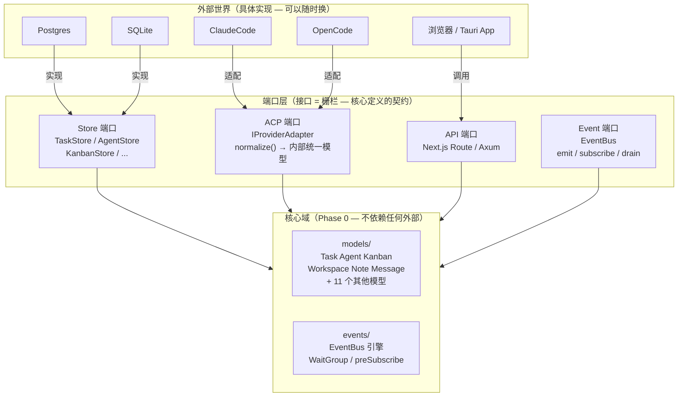
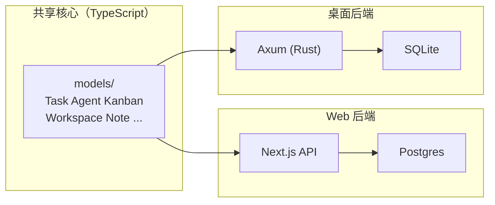

# Routa Phase 0 设计拆解

> **本文定位**：教学设计 / 解剖笔记，不是规格书或 API 文档。目标是解释「为什么这样设计」并提取可迁移模式，适合学习者和新加入的开发者阅读。如需快速定位关键决策，见 `docs/adr/`。
>
> 按「业务痛点 → 为什么这样设计 → 代码怎么落地 → 之前之后对比」的顺序，每个设计决策自闭环。
> 原始对话生成于 2026-07-03。所有「之后」代码引用指向 Routa 真实源文件，「之前」代码为说明问题的假设示例（非 Routa 历史代码）。
>
> **符号约定**：`k` = **变更传播比**（Change Propagation Ratio）——一项设计决策变化时需要连锁修改的文件数。k = 1 代表改一处即可（理想），k = N 代表霰弹式修改（Shotgun Surgery）。全文用 k 值度量变更放大效应，工厂函数、EventBus、纯函数映射等决策的核心目标就是把变更传播比从 N 降到 1。

## 「你在这里」锚点

```
Routa 全局施工图:

  models/ ──→ store/ ──→ worker/ ──→ acp/ ──→ kanban/ ──→ api/ ──→ app/
     ↑           ↑          ↑          ↑           ↑          ↑         ↑
  Phase 0     Phase 1    Phase 2    Phase 3     Phase 5   Phase 6  Phase 7
  类型底座    Store接口   Worker     ACP适配    看板引擎   API壳    页面壳

你现在在 Phase 0。这一层零依赖，但所有人依赖它。地基出问题 = 全楼重建。

本课进度    Phase 0 / 7。Routa 全栈已完成。
真实文件    ~/Desktop/my/routa/src/core/models/  14 个文件 + 1 个 barrel
            ~/Desktop/my/routa/src/core/events/   2 个文件
```

---

## 总体业务场景

Routa 是一个多 AI Agent 协作平台。一个典型的使用场景：

一个 Workspace（项目）里有一块看板，上面有 6 列：Backlog → Todo → Dev → Review → Done → Blocked。

用户创建一张 Task card「做一个登录页面」，从 Backlog 拖到 Dev 列。**一拖进 Dev 列**，发生以下一连串事情：

1. Routa 检查 Dev 列的自动化配置（`KanbanColumnAutomation`），发现有 `enabled: true`
2. 创建一个 BackgroundTask，分配一个 CRAFTER agent（负责写代码的 AI）
3. CRAFTER 被启动，拿到 card 的目标描述、验收条件、上下文代码
4. CRAFTER 开始工作：读文件、写代码、跑测试
5. CRAFTER 完成，触发 `AGENT_COMPLETED` 事件
6. 系统检测到 card 符合「进入 Review 列」的条件，**自动把 card 拖到 Review 列**
7. Review 列触发 GATE agent（审查者），审查代码
8. GATE 通过，card 拖到 Done

在这个场景里，Phase 0 作为地基，要回答五个基础问题。以下逐个拆解。

---

## 问题 1：词汇不统一 — 同一个概念,三个模块各自定义

### 业务场景：一条 card 创建链路穿过三个模块

用户在浏览器里点"新建 Task card"，填写标题「做一个登录页面」，目标栏位是 Dev 列，点击创建。

这条链路穿过三个模块，每个模块都需要"理解 Task 是什么"：

```
浏览器 POST /api/tasks  →  api/tasks/route.ts  解析 body，构造 Task 对象，写数据库
     ↓
看板收到新 card，检测 Dev 列有自动化配置  →  kanban/agent-trigger.ts  读 Task 字段，拼装 Agent prompt
     ↓
如果 card 描述里包含「委派子任务」指令  →  tools/agent-tools.ts  ROUTA agent 创建子 Task
```

三个模块各自在代码里"定义一个 Task 长什么样"——但不是 import 同一份定义，而是各自手写。

### 如果不管它：三个真实的腐烂后果

**后果 1：同一个字段有三种名字。** 这是 Routa 修复前的真实情况：

```typescript
// api/tasks/route.ts — API handler 自己拼 Task 对象字面量
const task = {
  id: "task-abc",
  title: "登录页面",
  status: "pending",              // string，不是 TaskStatus 枚举
  labels: undefined,              // 忘了设默认值
  columnId: "dev",                // 字段名叫 columnId
};
```

```typescript
// kanban/agent-trigger.ts — 用 any + fallback 链防御
function buildPrompt(task: any) {
  const col = task.column ?? task.columnId ?? "backlog";
  //             ↑ 兼容两个历史名字。说明 column 改过名，旧代码不敢删
  const lbs = task.labels ?? [];
  //             ↑ 不知道上游传的是 undefined 还是 []，每个消费方自己兜底
}
```

`task.column ?? task.columnId` 这条 fallback 链暴露了一个事实：历史上这个字段叫 `column`，某次重构改成了 `columnId`，但所有写过 `task.column` 的地方没人敢删——因为没人能确认所有消费方都改了。每改一次字段名，就多一条 fallback 链，永远不会缩短。

**后果 2：默认值散落在 17 个消费文件中。** 当前代码库里，`createTask` 被 17 个文件 import。如果有朝一日 `labels` 的默认值从 `[]` 改成 `["untriaged"]`——在没有工厂函数的情况下——这 17 个文件中每个手写了 `labels ?? []` 的地方都要改：

```
src/app/api/canvas/route.ts
src/app/api/tasks/[taskId]/route.ts
src/core/kanban/agent-trigger.ts
src/core/kanban/boards.ts
src/core/tools/agent-tools.ts
src/core/tools/kanban-tools.ts
src/core/orchestration/orchestrator.ts
... + 10 个测试文件（各自 mock 了 Task 对象）
```

**改漏一个不会报错。** TypeScript 不会告诉你"这个文件的 labels 默认值还是旧的"。没有编译错误、没有 lint 警告、不会 crash。前端可能一直显示旧标签，直到用户发现问题。

**后果 3：双后端漂移——TypeScript 侧和 Rust 侧各自定义了 Task。** 这是最致命的问题。

Routa 有两套后端：

| 后端 | 语言 | 数据库 | Task 定义位置 |
|------|------|--------|-------------|
| Web 版 | TypeScript | Postgres | `src/core/models/task.ts` — 51 个字段 |
| 桌面版 | Rust | SQLite | `crates/routa-core/src/models/task.rs` — 44 个字段 |

两个文件是**分别手写的**。Rust 侧用 `#[serde(rename_all = "camelCase")]` 保持 JSON 字段名一致，CI 里有 parity test 对比两边的序列化输出。但 parity test 只能抓"字段名不一致"，抓不了语义漂移：

- TypeScript 侧 `TaskStatus` 有 7 个值：`PENDING | IN_PROGRESS | REVIEW_REQUIRED | COMPLETED | NEEDS_FIX | BLOCKED | CANCELLED`
- Rust 侧 `TaskStatus` 必须和它一模一样。如果哪天 TypeScript 侧加了 `IN_QA`，Rust 侧忘记同步 → parity test 不会报错（新值在 Rust 侧会被反序列化为 `serde` 的默认值/未知变体），前端在桌面版看到的 Task 状态是错的。

**没有六边形架构的话，这条链路的总改动面**：新增一个 `Task.evidenceSummary` 字段 → TypeScript 侧 `interface Task` + `createTask` + 17 个消费方（含测试 mock）+ Rust 侧 `struct Task` + Rust 侧所有反序列化点 → k ≈ 25+。这不是"改起来有点累"，而是"大概率漏改"。

### 为什么需要六边形架构

Routa 的 ADR 0001（`docs/adr/0001-dual-backend-semantic-parity.md`）记录了核心约束：

> Routa.js ships as both a web app (Next.js) and a desktop app (Tauri + Rust/Axum). They must share the same domain model vocabulary.

**同一个产品，两套技术栈，但 Task/Agent/Kanban/Workspace 的概念不能有差异。**

六边形架构的核心主张是：把领域模型放在最内圈（Phase 0），让它零外部依赖，所有人依赖它。Web 后端和桌面后端都从同一份接口定义出发，不存在"各自主理解的 Task"。

**六边形全貌**：



**核心规则**：所有箭头指向内。`core/` 不知道 Postgres 和 SQLite 的存在，只知道 `TaskStore` 接口。换数据库 → 只换箭头最外端，`core/` 零改动。`IProviderAdapter` 就是 DDD 里的「防腐层」——ClaudeCode 和 OpenCode 的事件格式完全不同，但都通过 `normalize()` 翻译为内部统一模型。

**双后端共享核心**：



Rust 端的 `crates/routa-core/src/models/task.rs` 是同一份契约的 Rust 翻译，`#[serde(rename_all = "camelCase")]` 保证 JSON 字段名一致。CI parity test 比较两边输出，漂移在合并前被挡。

### 设计决策：14 个 interface + 14 个 createXxx 工厂函数

**核心思路**：所有模块从**一个地方**拿类型和创建逻辑。interface 锁定领域词汇的形状，工厂函数锁定默认值。

先看全貌——`src/core/models/` 目录下 13 个模型文件 + 1 个 barrel：

```
src/core/models/
├── agent.ts              # Agent — 9 字段，最简工厂
├── artifact.ts           # Artifact — 13 字段 + 双工厂
├── background-task.ts    # BackgroundTask — 29 字段，派生值工厂
├── canvas-artifact.ts    # CanvasArtifact — 纯类型，无工厂
├── codebase.ts           # Codebase — 纯类型 + 枚举
├── kanban.ts             # Kanban — 无领域对象工厂，有映射函数族 + 深克隆
├── message.ts            # Message — 8 字段，纯数据
├── note.ts               # Note — 8 字段 + 双工厂
├── schedule.ts           # Schedule — 14 字段 + 模板替换
├── task-requirements.ts  # TaskRequirements — 纯类型 + 常量
├── task.ts               # Task — 51 字段，最复杂工厂
├── workspace.ts          # Workspace — 6 字段 + 辅助函数
├── worktree.ts           # Worktree — 纯类型
└── index.ts              # barrel re-export — 一行 import 拿全部
```

barrel 把所有模型汇聚到一个入口：

```typescript
// src/core/models/index.ts — 全代码库唯一需要 import 的地方
export * from "./agent";
export * from "./task";
export * from "./message";
// + 其余 10 个模型同理

// 消费方只需一行:
//   import { createTask, Task, createAgent, Agent,... } from "@/core/models";
// 不需要记住"Task 在 task.ts、Agent 在 agent.ts"——barrel 屏蔽了文件布局细节
```

**每个模型文件遵循同一份结构契约**：

```typescript
// ─── 每个 model 文件的标准骨架 ───
// 1. 枚举 & 类型别名（如果有）
export enum XxxStatus { ... }
// 2. 嵌套子类型（如果有）
export interface XxxSubType { ... }
// 3. 主体 interface — 这是唯一的真相源
export interface Xxx { ... }
// 4. 工厂函数 — 接受最小入参，返回完整实例
export function createXxx(params: { /* 只暴露业务必需字段 */ }): Xxx { ... }
// 5. 辅助函数（如果有）— 如 normalize / parse / resolve
export function normalizeXxxField(...) { ... }
```

**为什么是 interface + 工厂，而不是 class？**

```typescript
// ❌ 如果用 class — 构造函数签名无法「选择性暴露」
class Agent {
  constructor(
    public id: string,
    public name: string,
    public status: AgentStatus,  // ← 调用方被迫传 status，但初始值永远是 PENDING
    public createdAt: Date,      // ← 调用方被迫传 createdAt，但永远是 new Date()
    // 9 个参数全在这里，每个调用方都要写 status: PENDING、createdAt: new Date()
  ) {}
}
const agent = new Agent("a1", "bot", AgentStatus.PENDING, new Date(), ...);
//                               ↑↑↑↑↑↑↑ 每个调用方都在重复同样的默认值

// ✅ interface + 工厂 — params 只暴露「调用方需要决定的字段」
const agent = createAgent({ id: "a1", name: "bot", role: AgentRole.CRAFTER, workspaceId: "ws1" });
// 只有 4 个必填 — 其余 5 个字段工厂自动填
```

14 个模型按复杂度分四档，以下逐一拆解。

---

**一档：简单工厂 — Agent（4 个必填 + 4 个系统字段自动填）**

`src/core/models/agent.ts` — 最简工厂：调用方只传业务参数，不碰系统字段。

```typescript
// ══════════════════════════════════════════════════════════════════════════════
// interface — 定义「一个 Agent 长什么样」。这是整份代码库对 Agent 的唯一理解。
// ══════════════════════════════════════════════════════════════════════════════
export interface Agent {
  // ─── 调用方负责的字段（创建时必须传）───────────────────────────────────
  id: string;            // 唯一标识，如 "agent-abc123"
  name: string;          // 展示名，如 "Code Reviewer"
  role: AgentRole;       // 角色枚举：CRAFTER(写代码) | GATE(审查) | ROUTA(协调) | ...
  workspaceId: string;   // 所属项目

  // ─── 调用方可以不传的字段（工厂有默认值）─────────────────────────────
  modelTier: ModelTier;  // 调用哪个级别模型：SMART(默认) | BALANCED | FAST
  parentId?: string;     // 谁创建了它（可选—子 Agent 才有）
  metadata: Record<string, string>;  // 任意键值对扩展（默认 {}）

  // ─── 系统字段（调用方绝对不碰—工厂独管）──────────────────────────────
  status: AgentStatus;   // PENDING(初始) → ACTIVE(就绪) | ERROR(启动失败)
  createdAt: Date;       // 什么时候创建的
  updatedAt: Date;       // 最后修改时间
}
// 关键：interface 上 status/createdAt/updatedAt 是「必选」字段——
// 这意味着任何拿到 Agent 的代码都能安全地读 agent.status，不会遇到 undefined。

// ══════════════════════════════════════════════════════════════════════════════
// 工厂函数 — params 的形状和 interface 完全不同。
// 调用方能传的字段少、系统字段不在 params 里 → 调用方根本没法手写错误值。
// ══════════════════════════════════════════════════════════════════════════════
export function createAgent(params: {
  // ─── 必传（业务身份）─────────────────────────────────────────────────
  id: string;
  name: string;
  role: AgentRole;
  workspaceId: string;
  // ─── 可选（工厂补齐）─────────────────────────────────────────────────
  parentId?: string;
  modelTier?: ModelTier;              // 不传 → ?? ModelTier.SMART
  metadata?: Record<string, string>;  // 不传 → ?? {}
  // 注意：params 里没有 status、createdAt、updatedAt — 调用方看不见这些字段
}): Agent {
  const now = new Date();             // 所有时间戳统一取同一个时刻
  return {
    // ─── 原样透传 ────────────────────────────────────────────────────────
    id: params.id,
    name: params.name,
    role: params.role,
    workspaceId: params.workspaceId,
    parentId: params.parentId,        // undefined 透传（可选字段就是 undefined）
    // ─── 默认值补齐 ──────────────────────────────────────────────────────
    modelTier: params.modelTier ?? ModelTier.SMART,  // 99% 的 Agent 用 SMART
    metadata: params.metadata ?? {},  // 空对象而非 undefined → 下游安全读属性
    // ─── 系统字段（调用方不知道这些字段存在，更不可能传错）───────────────
    status: AgentStatus.PENDING,      // 新建 Agent 总是从 PENDING 起步
    createdAt: now,                   // 所有消费方拿到的时间戳精确一致
    updatedAt: now,                   // 初始 = 创建时间
  };
}
```

**调用方怎么用** — API handler 创建 Agent（`src/app/api/agents/route.ts:56-62`）：

```typescript
// POST /api/agents  — 用户在前端填了表单，body 来到服务端
const result = await system.tools.createAgent({
  name: body.name,           // "Code Reviewer" — 用户在前端输入的名字
  role: body.role,           // AgentRole.GATE — 前端下拉框选的「审查者」
  workspaceId: body.workspaceId,  // 当前项目 ID
  parentId: body.parentId,   // 可选 — 如果是 ROUTA 委派的子 Agent，这里填父 Agent ID
  modelTier: body.modelTier, // 可选 — 不传就是 ModelTier.SMART（够用）
  // 注意：这里没有 status、createdAt、updatedAt、metadata
  // — 工厂自动填 PENDING / now / now / {}
  // 调用方写不出 status: "unknown" 这种错误值，因为 params 根本没这个字段
});
// 返回的 agent 对象：
//   agent.status    → AgentStatus.PENDING   (工厂填的)
//   agent.modelTier → ModelTier.SMART       (没传，工厂默认)
//   agent.metadata  → {}                     (没传，工厂默认)
//   agent.createdAt → 2026-07-04T...         (工厂填的)
// 调用方只管存：await agentStore.save(agent)
```

**工厂挡住了什么**：19 个调用方中，没有任何一个需要写 `status: "PENDING"` 或 `createdAt: new Date()`。将来如果新 Agent 的初始状态从 PENDING 改成 INACTIVE → 只改工厂函数一行，19 个调用方零改动。

同档：`createMessage`（5 必填 + timestamp 自动填）、`createArtifact`（4 必填 + status/createdAt/updatedAt 自动填）。

---

**二档：派生值工厂 — BackgroundTask（title 从 prompt 自动推导）**

`src/core/models/background-task.ts` — 比一档多一步：**入参字段之间有推导关系**，调用方不需要自己算。

```typescript
// ══════════════════════════════════════════════════════════════════════════════
// interface — 29 个字段，但调用方只管 12 个（见 CreateBackgroundTaskInput）
// ══════════════════════════════════════════════════════════════════════════════
export interface BackgroundTask {
  // ─── 调用方负责 ─────────────────────────────────────────────────────────
  id: string;            // 通常由工厂自动生成（crypto.randomUUID()）
  title: string;         // 人类可读标题。可以不传，工厂从 prompt 前 60 字符截取
  prompt: string;        // 发给 Agent 的完整提示词（核心业务数据）
  agentId: string;       // 用哪个 Agent/Provider，如 "claude-code"
  workspaceId: string;   // 所属项目

  // ─── 调用方可传，有默认值 ───────────────────────────────────────────────
  triggeredBy: string;                   // 谁触发——默认 "user"
  triggerSource: BackgroundTaskTriggerSource;  // 触发来源——默认 "manual"
  priority: BackgroundTaskPriority;      // 调度优先级——默认 "NORMAL"
  sandboxId?: string;                    // 沙箱隔离（可选）
  maxAttempts: number;                   // 最多尝试次数——默认 1

  // ─── 运行时状态（工厂设初始值，Worker 运行时更新）─────────────────────
  status: BackgroundTaskStatus;  // PENDING → RUNNING → COMPLETED/FAILED
  resultSessionId?: string;      // Agent 启动后返回的 session ID
  errorMessage?: string;         // 失败原因

  // ─── 系统字段（工厂独管）───────────────────────────────────────────────
  attempts: number;              // 已尝试次数——初始 0
  createdAt: Date;
  startedAt?: Date;              // 任务被 Worker 取走时才填
  completedAt?: Date;            // 任务结束时填
  updatedAt: Date;

  // ─── 进度追踪（Worker 在运行中持续更新）───────────────────────────────
  lastActivity?: Date;           // 最后一次收到 Agent 通知的时间
  currentActivity?: string;      // 当前在做什么，如 "Reading file..."
  toolCallCount?: number;        // 累计执行了多少个 tool call
  inputTokens?: number;          // 输入 token 消耗
  outputTokens?: number;         // 输出 token 消耗

  // ─── 工作流编排 ────────────────────────────────────────────────────────
  workflowRunId?: string;        // 所属 workflow run
  workflowStepName?: string;     // 对应哪个 workflow step
  dependsOnTaskIds?: string[];   // 等待哪些任务先完成
  taskOutput?: string;           // 任务产出（传给下一跳任务）
}

// ══════════════════════════════════════════════════════════════════════════════
// 入参接口 — 只有 12 个字段。29 - 12 = 17 个字段调用方根本看不到。
// 这就是「最小入参」模式：暴露的越少，调用方写错的概率越低。
// ══════════════════════════════════════════════════════════════════════════════
export interface CreateBackgroundTaskInput {
  id?: string;             // 可选—不传工厂生成 UUID
  title?: string;          // 可选—不传工厂从 prompt 推导
  prompt: string;          // 必传—发给 Agent 的完整提示词
  agentId: string;         // 必传
  workspaceId: string;     // 必传
  triggeredBy?: string;
  triggerSource?: BackgroundTaskTriggerSource;
  priority?: BackgroundTaskPriority;
  sandboxId?: string;
  maxAttempts?: number;
  workflowRunId?: string;
  workflowStepName?: string;
  dependsOnTaskIds?: string[];
  // 对比 BackgroundTask 的 29 字段：status、attempts、resultSessionId、
  // createdAt、updatedAt、lastActivity、toolCallCount 等 17 个字段
  // 完全不出现在这里——调用方不知道它们存在，更不可能传错
}

export function createBackgroundTask(input: CreateBackgroundTaskInput): BackgroundTask {
  const now = new Date();
  // 派生逻辑：title 不传 → 从 prompt 前 60 字符截取，换行变空格
  // 比如 prompt = "Analyze the login module for security issues\n..." → title = "Analyze the login module for security issues..."
  const title = input.title ?? input.prompt.slice(0, 60).replace(/\n/g, " ");

  return {
    id: input.id ?? crypto.randomUUID(),    // 默认 UUID
    title,                                   // 派生值—要么用户传，要么自动截取
    prompt: input.prompt,                    // 原样透传
    agentId: input.agentId,
    workspaceId: input.workspaceId,
    // ─── 系统默认值 — 如果调用方每个都自己写，17 个消费方 × 5 个默认值 = 85 处散落 ───
    status: "PENDING",                       // 初始状态永远是 PENDING
    triggeredBy: input.triggeredBy ?? "user",
    triggerSource: input.triggerSource ?? "manual",
    priority: input.priority ?? "NORMAL",
    sandboxId: input.sandboxId,              // undefined 透传
    attempts: 0,                             // 初始 0 次尝试
    maxAttempts: input.maxAttempts ?? 1,     // 默认重试 1 次
    createdAt: now,
    updatedAt: now,
    // ─── 工作流字段 — 透传即可，Worker 运行时填 ───
    workflowRunId: input.workflowRunId,
    workflowStepName: input.workflowStepName,
    dependsOnTaskIds: input.dependsOnTaskIds,
    // resultSessionId、startedAt、completedAt、lastActivity、
    // currentActivity、toolCallCount、inputTokens、outputTokens、
    // errorMessage、taskOutput — 全是 undefined，Worker 运行中慢慢填
  };
}
```

**调用方怎么用** — API handler 创建 BackgroundTask（`src/app/api/background-tasks/route.ts:110-120`）：

```typescript
// POST /api/background-tasks — 用户在 UI 上点「启动任务」
const task = createBackgroundTask({
  id: uuidv4(),
  prompt,                          // 从 body 拿到的完整提示词，如 "Please implement..."
  agentId,                         // 如 "claude-code"
  workspaceId: normalizedWorkspaceId,
  title: title ?? prompt.slice(0, 80),  // 调用方也可以自己传 title，覆盖工厂的推导
  triggerSource,                   // 如 "manual"
  triggeredBy,                     // 如 "user@example.com"
  priority,                        // 如 "HIGH"
  maxAttempts,                     // 如 3
});
// 返回的 task 对象 29 个字段齐全：
//   task.status       → "PENDING"        (工厂填)
//   task.attempts     → 0                 (工厂填)
//   task.createdAt    → 2026-07-04T...    (工厂填)
//   task.title        → "Please implement..." (调用方传了，走调用方的值)
//   task.resultSessionId → undefined       (Agent 还没启动)
//   task.toolCallCount → undefined         (还没开始执行)
// 调用方只管存：await backgroundTaskStore.save(task)
```

**和 Agent 工厂的关键差异**：
1. **入参和返回值是不同的 interface**——`CreateBackgroundTaskInput`（12 字段）vs `BackgroundTask`（29 字段）。这就是「最小入参」：调用方只传自己需要关心的 12 个字段，剩下 17 个运行时字段工厂全包，Worker 运行中再慢慢填充
2. **派生值**——`title` 不传时从 `prompt.slice(0, 60)` 自动推导。如果将来标题策略从「60 字符」改成「80 字符」→ 只改工厂一行（k = 1），6 个调用方（API + webhook + schedule + workflow executor + polling + testing）零改动
3. **id 自动生成**——`input.id ?? crypto.randomUUID()`，调用方不关心 id 生成策略，只有测试才显式传 id

同档：`createNote`（嵌套 metadata 5 子字段各有默认）、`createWorkspace`（metadata 通过辅助函数自动计算 `worktreeRoot`）、`createSchedule`（模板变量 `{timestamp}`/`{cronExpr}` 替换）。

---

**三档：复杂工厂 — Task（51 字段 + 历史兼容 + 双 normalize）**

`src/core/models/task.ts` — Routa 最复杂的领域对象，51 个字段，工厂 params 有 41 个可选属性。

```typescript
// ══════════════════════════════════════════════════════════════════════════════
// interface — 51 个字段。下半部分的 fields 不是摆设——它们告诉 TypeScript
// 「任何拿到 Task 的地方都能安全读这些字段，不会遇到 undefined」。
// ══════════════════════════════════════════════════════════════════════════════
export interface Task {
  // ─── 核心身份（调用方必须想清楚）───────────────────────────────────────
  id: string;            // 唯一标识，通常 uuidv4()
  title: string;         // 卡片标题，如 "做一个登录页面"
  objective: string;     // 详细需求描述，Agent 展开工作的核心输入
  status: TaskStatus;    // PENDING|IN_PROGRESS|REVIEW_REQUIRED|... — 工厂默认 PENDING
  workspaceId: string;   // 所属项目

  // ─── 看板定位 ──────────────────────────────────────────────────────────
  boardId?: string;      // 在哪个看板上（一个 workspace 可以有多个 board）
  columnId?: string;     // 在哪个列（backlog/todo/dev/review/done/blocked）
  position: number;      // 列内排序位——工厂默认 0（新 card 放在最上面）

  // ─── 集合字段 — 类型是 T[]（必选），工厂从空数组起步 ──────────────────
  // 语义：任何下游代码都能直接写 task.labels.includes("bug")，不会 TypeError
  labels: string[];             // 标签，如 ["bug", "frontend"]
  sessionIds: string[];         // 所有关联的 Agent session ID（历史记录）
  laneSessions: TaskLaneSession[];   // 每个 lane 列的 session 详情
  laneHandoffs: TaskLaneHandoff[];   // lane 之间的交接记录
  dependencies: string[];       // 依赖的其他 card ID（必须在这些 card 完成后才能开始）
  codebaseIds: string[];        // 关联的代码库

  // ─── 嵌套对象 — 入口处 normalize 清洗后才赋值 ─────────────────────────
  contextSearchSpec?: TaskContextSearchSpec;   // 7 个子字段：检索提示
  jitContextSnapshot?: TaskJitContextSnapshot; // 运行时上下文快照

  // ─── 历史兼容 — 新旧格式共存，工厂自动转换 ───────────────────────────
  comment?: string;              // 旧格式：单条字符串（向后兼容）
  comments: TaskCommentEntry[];  // 新格式：结构化数组 {id, body, createdAt}

  // ─── 时间戳 — 工厂独管 ────────────────────────────────────────────────
  createdAt: Date;
  updatedAt: Date;

  // + 30 余个可选字段：scope, acceptanceCriteria, github*, worktreeId, ...
}
// 关键观察：labels、sessionIds、laneSessions 等在 interface 上是必选 T[]，
// 但工厂保证创建时从 [] 起步。这是刻意的——任何下游代码不需要 `if(task.labels)`。

export function createTask(params: {
  // ─── 必传（至少要告诉系统「要做什么、在哪个项目」）───────────────────
  id: string;
  title: string;
  objective: string;
  workspaceId: string;

  // ─── 可选 — 不传工厂补默认值 ──────────────────────────────────────────
  comment?: string;              // 旧格式评论
  comments?: TaskCommentEntry[]; // 新格式评论
  status?: TaskStatus;
  columnId?: string;
  position?: number;
  labels?: string[];
  dependencies?: string[];
  codebaseIds?: string[];
  contextSearchSpec?: TaskContextSearchSpec;
  jitContextSnapshot?: TaskJitContextSnapshot;
  // + 28 个可选参数 — 全部有默认值
}): Task {
  const now = new Date();
  // ① 新旧格式兼容：优先用 comments（新格式），fallback 到 comment（旧格式）
  //    如果两都没传 → buildInitialTaskComments 创建一个空评论记录
  const comments = params.comments ?? buildInitialTaskComments(params.comment, now);

  return {
    // ─── 原样透传 ───────────────────────────────────────────────────────
    id: params.id,
    title: params.title,
    objective: params.objective,
    workspaceId: params.workspaceId,
    comment: params.comment,
    comments,                                    // ① 兼容后的结果

    // ─── 默认值补齐 ─────────────────────────────────────────────────────
    status: params.status ?? TaskStatus.PENDING,    // 新 card 总是 PENDING
    columnId: params.columnId,                      // undefined 透传（还没拖到列上）
    position: params.position ?? 0,                 // 新 card 放最上面
    labels: params.labels ?? [],                    // ③ 空数组起步
    dependencies: params.dependencies ?? [],
    codebaseIds: params.codebaseIds ?? [],

    // ─── ③ 集合字段 — 初始空数组，运行时慢慢填 ─────────────────────────
    sessionIds: [],        // 还没关联任何 session
    laneSessions: [],      // 还没经过任何 lane
    laneHandoffs: [],      // 还没有任何交接记录

    // ─── ② 嵌套对象 normalize — 入口处清洗后再赋值 ──────────────────────
    contextSearchSpec: normalizeTaskContextSearchSpec(params.contextSearchSpec),
    jitContextSnapshot: normalizeTaskJitContextSnapshot(params.jitContextSnapshot),

    // ─── 时间戳 ─────────────────────────────────────────────────────────
    createdAt: now,
    updatedAt: now,
    // + 30 余个字段按同样的默认值思路补齐
  };
}
```

**Task 工厂的四个独特设计**：

**调用方怎么用** — `create_card` 工具创建 Task（`src/core/tools/kanban-tools.ts:262-275`）：

```typescript
// "create_card" 工具 — Agent 或用户在 UI 上新建看板 card
const task = createTask({
  id: uuidv4(),
  title: params.title,                                // "做一个登录页面"
  objective: params.description ?? "",                // 详细需求—Agent 的核心工作输入
  workspaceId: params.workspaceId,
  boardId: board.id,                                  // 目标看板
  columnId: targetColumnId,                           // 目标列（如 "dev"）
  position,                                           // 列内排序位
  status: columnIdToTaskStatus(targetColumnId),       // 映射：dev → IN_PROGRESS
  priority: params.priority as TaskPriority | undefined,
  labels: params.labels,                              // 可选—不传默认 []
  assignedProvider: params.assignedProvider,
  contextSearchSpec: filteredContextSearchSpec.contextSearchSpec,
  // 调用方不需要关心的事（工厂全部接管）：
  //   ❌ comment → comments 格式转换 → buildInitialTaskComments
  //   ❌ contextSearchSpec 清洗去重 → normalizeTaskContextSearchSpec
  //   ❌ sessionIds/laneSessions/laneHandoffs 初始化 → []
  //   ❌ createdAt/updatedAt → new Date()
  //   ❌ 其余 30+ 可选字段的默认值
});
// → 返回 51 字段的 Task，直接 taskStore.save(task)
// → 如果新增强制字段 estimatedHours，只需在 interface + createTask 各加一行
//    17 个消费方通过 tsc 自动感知，不会漏
```

**① 新旧格式兼容** — `comment`（旧格式，单条字符串）和 `comments`（新格式，`TaskCommentEntry[]`）共存。工厂内部 `buildInitialTaskComments(params.comment, now)` 把旧格式自动转为新格式——调用方传哪个都行，不需要知道历史上发生过一次格式迁移。将来 `comment` 字段删除后，去掉工厂里的兼容逻辑即可，17 个调用方零改动。

**② 嵌套对象 normalize** — `contextSearchSpec`（7 个子字段）和 `jitContextSnapshot` 在赋值前过 normalize。以 `normalizeTaskContextSearchSpec` 为例（`task.ts:356-378`）：

```typescript
// normalize = 「洗干净脏数据」。不管调用方传了什么进来，出来的形状一定干净
export function normalizeTaskContextSearchSpec(
  value: TaskContextSearchSpec | null | undefined,
): TaskContextSearchSpec | undefined {
  if (!value) {
    return undefined;       // null/undefined → undefined，直接短路
  }

  // 每个子字段都过对应的清洗函数：去空字符串、去 null、去重
  const normalized: TaskContextSearchSpec = {
    query: normalizeTaskContextSearchText(value.query),
    featureCandidates: normalizeTaskContextSearchItems(value.featureCandidates),
    relatedFiles: normalizeTaskContextSearchItems(value.relatedFiles),
    routeCandidates: normalizeTaskContextSearchItems(value.routeCandidates),
    apiCandidates: normalizeTaskContextSearchItems(value.apiCandidates),
    moduleHints: normalizeTaskContextSearchItems(value.moduleHints),
    symptomHints: normalizeTaskContextSearchItems(value.symptomHints),
  };

  // ★ 关键细节：全部为空 → 返回 undefined 而非 {}
  //    这样下游只用 if (task.contextSearchSpec) 就够了，
  //    不需要 if (task.contextSearchSpec && task.contextSearchSpec.query)
  return Object.values(normalized).some((entry) =>
    typeof entry === "string" ? entry.length > 0 : Array.isArray(entry) && entry.length > 0
  ) ? normalized : undefined;
}
```

另外还有 `parseTaskContextSearchSpec`（`task.ts:380-407`），接收 `unknown`（JSON 反序列化的脏数据），先做类型过滤再做 normalize——系统边界入口的第二层防护。两条防线叠加：`parse` 挡非法类型 → `normalize` 洗合法但脏的值。

**③ 集合字段初始化为空数组** — `sessionIds: []`、`laneSessions: []`、`laneHandoffs: []`、`labels: params.labels ?? []`。interface 上是必选 `T[]`，工厂保证创建时从空数组起步——下游直接 `task.labels.includes("bug")` 或 `task.labels.map(...)`，永远不会因为 undefined 而 TypeError。这比 Optional Chaining (`task.labels?.includes(...)`) 更安全，因为 Optional Chaining 只会静默失败。

**④ 41 个可选参数 + 10 个工厂自填字段** — `position: 0` 作为默认值的意义在这里被放大到极致。如果每个调用方都要 `position: 0` 传一遍，41 个默认值散落在 N 个文件中。

---

**四档：带辅助函数的工厂 — Workspace（派生值由独立函数计算）**

`src/core/models/workspace.ts` — 比前面三档多了**独立辅助函数**。工厂不只是填默认值，还要调辅助函数做业务计算。关键是这个辅助函数可以被外部模块单独 import 复用。

```typescript
// ══════════════════════════════════════════════════════════════════════════════
// interface — 只有 6 个字段，是 14 个模型里最简洁的
// ══════════════════════════════════════════════════════════════════════════════
export interface Workspace {
  id: string;       // 唯一标识
  title: string;    // 展示名，如 "My Project"
  // metadata 是一个「隐含字段容器」——表面上只是 Record<string, string>，
  // 实际上装了 worktreeRoot、env、region 等配置。用 string map 而非强类型
  // 是为了让桌面版（Rust）和 Web 版（TypeScript）都能随意扩展，不互锁
  status: WorkspaceStatus;  // "active" | "archived" — 工厂默认 "active"
  metadata: Record<string, string>;
  createdAt: Date;
  updatedAt: Date;
}

// ══════════════════════════════════════════════════════════════════════════════
// 辅助函数 1：推导 worktree 根路径
// workspace 需要一个文件系统路径来存 Agent 的工作目录。
// 默认路径 = ~/.routa/workspace/{workspaceId}
// ══════════════════════════════════════════════════════════════════════════════
export function getDefaultWorkspaceWorktreeRoot(workspaceId: string): string {
  return path.join(os.homedir(), ".routa", "workspace", workspaceId);
}

// ══════════════════════════════════════════════════════════════════════════════
// 辅助函数 2：合并 metadata — 用户显式配置优先，否则自动推导
// 这就是「两路径策略」的落地：
//   路径 A：用户传了 metadata.worktreeRoot → 尊重用户
//   路径 B：用户没传 → 自动推导 ~/.routa/workspace/{id}
//
// 抽成独立函数的原因：「当前 workspace 的 worktree 路径在哪」是高频查询——
// 不只工厂调用，Worker、Git 操作、Sandbox 管理都需要这个值。
// 独立导出 → 外部模块 import { getEffectiveWorkspaceMetadata } 即可复用，
//            不需要依赖 createWorkspace 工厂
// ══════════════════════════════════════════════════════════════════════════════
export function getEffectiveWorkspaceMetadata(
  workspace: Pick<Workspace, "id" | "metadata">
): Record<string, string> {
  const metadata = { ...(workspace.metadata ?? {}) };     // 浅拷贝，不污染入参
  const explicitRoot = metadata.worktreeRoot?.trim();      // 用户有没有显式设
  metadata.worktreeRoot = explicitRoot || getDefaultWorkspaceWorktreeRoot(workspace.id);
  //  ↑ 有 → 用用户的；没有 → 自动推导
  return metadata;
}

// ══════════════════════════════════════════════════════════════════════════════
// 工厂 — params 只有 3 个字段，系统全包
// ══════════════════════════════════════════════════════════════════════════════
export function createWorkspace(params: {
  id: string;         // 必传
  title: string;      // 必传
  metadata?: Record<string, string>;  // 可选 — 不传 worktreeRoot 自动推导
}): Workspace {
  const now = new Date();
  return {
    id: params.id,
    title: params.title,
    status: "active",   // 新 workspace 总是 active
    // ★ 这是四档和前三档的最大区别 — 工厂不自己算，调独立函数
    metadata: getEffectiveWorkspaceMetadata({
      id: params.id,
      metadata: params.metadata ?? {},
    }),
    createdAt: now,
    updatedAt: now,
  };
}
```

**调用方怎么用** — POST `/api/workspaces` 创建 Workspace（`src/app/api/workspaces/route.ts:41-44`）：

```typescript
// POST /api/workspaces — 用户在前端点「新建项目」
const workspace = createWorkspace({
  id: crypto.randomUUID(),
  title,                              // "My Project"
  // metadata 可选 — 不传时 worktreeRoot 自动推导为 ~/.routa/workspace/{id}
  // metadata 也可以传：{ worktreeRoot: "/custom/path", env: "staging" }
  // 传了 worktreeRoot → getEffectiveWorkspaceMetadata 尊重用户配置
});
// → workspace.status            = "active"     (工厂填)
// → workspace.metadata.worktreeRoot = "~/.routa/workspace/{id}"  (辅助函数推导)
// → workspace.createdAt         = now          (工厂填)
await system.workspaceStore.save(workspace);

// ─── 外部模块复用辅助函数 ─────────────────────────────────────────────
// 任何需要知道 workspace 文件路径的地方，不依赖工厂，直接调辅助函数：
const meta = getEffectiveWorkspaceMetadata({ id: "ws-1", metadata: {} });
// → meta.worktreeRoot = "~/.routa/workspace/ws-1"
```

**`getEffectiveWorkspaceMetadata` 被抽成独立函数的理由**：「当前 workspace 的 worktree 路径在哪」不只创建时用，Worker 启动 Agent 时需要、Git worktree 操作时需要、Sandbox 管理时需要——如果把推导逻辑直接写在 `createWorkspace` 里，复用方必须构造一个完整 workspace 对象才能拿到同样的值。独立导出后，`import { getEffectiveWorkspaceMetadata }` 一行解决。

---

### 14 个模型全览

| 模型 | 文件 | interface 字段数 | 工厂函数 | 特征 |
|------|------|:---:|---------|------|
| Agent | `agent.ts` | 9 | `createAgent` | 最简 — 4 必填 + 4 系统字段自动填 |
| Message | `message.ts` | 8 | `createMessage` | 纯数据 — 仅 `timestamp` 自动填 |
| Task | `task.ts` | 51 | `createTask` | 最复杂 — 历史兼容 + 双 normalize + 41 参数 |
| BackgroundTask | `background-task.ts` | 29 | `createBackgroundTask` | 派生值 — title 从 prompt 截取 |
| Kanban | `kanban.ts` | — | — | 无领域对象工厂，有 `cloneKanbanColumns` 深克隆 + 4 个映射纯函数 |
| Workspace | `workspace.ts` | 6 | `createWorkspace` | 辅助函数 — `getEffectiveWorkspaceMetadata` |
| Note | `note.ts` | 8 | `createNote` + `createSpecNote` | 嵌套 metadata 默认 + 快捷工厂 |
| Artifact | `artifact.ts` | 13 | `createArtifact` + `createArtifactRequest` | 两相关对象各有工厂 |
| Schedule | `schedule.ts` | 14 | — | 无工厂—`resolveSchedulePrompt` 做模板替换不创建对象 |
| CanvasArtifact | `canvas-artifact.ts` | — | — | 纯类型，工厂在 artifact.ts 复用 |
| Codebase | `codebase.ts` | — | — | 纯类型 + 枚举 |
| Worktree | `worktree.ts` | — | — | 纯类型 |
| TaskRequirements | `task-requirements.ts` | — | — | 纯类型 + 常量 |
| index | `index.ts` | — | — | barrel re-export |

**规律**：字段越多、嵌套越深、派生逻辑越复杂 → 工厂函数收益越大。纯数据 DTO（Codebase, Worktree, TaskRequirements）不需要工厂——直接 `{ ... }` 就够。

---

### 之前 vs 之后：以 Task 的 50 个调用点为例

当前代码库中，`createTask` 在 **50 个文件**中被调用（9 个生产代码 + 41 个测试）。每次调用都创建一个完整的 Task 对象。

**之前（没有工厂函数时）每个调用方都在做同样的事**。以下四个调用方代表了四种不同的创建场景：

```typescript
// ══════════════════════════════════════════════════════════════════════════════
// 场景 1: API handler — POST /api/tasks
// 用户在前端点"新建 card"，body 到服务端
// ══════════════════════════════════════════════════════════════════════════════
// ❌ 之前：手写对象字面量，23 个字段逐一赋值
const task = {
  id: uuidv4(),
  title: normalizedTitle,
  objective: normalizedObjective,
  scope: normalizedScope,
  acceptanceCriteria: normalizedAcceptanceCriteria,
  verificationCommands: normalizedVerificationCommands,
  testCases: normalizedTestCases,
  status: columnIdToTaskStatus(normalizedColumnId),  // 手写映射
  columnId: normalizedColumnId ?? "backlog",          // 手写默认值
  boardId: normalizedBoardId ?? defaultBoard.id,      // 手写默认值
  position: typeof position === "number" ? position : 0, // 手写防御
  labels: labels ?? [],                                // 手写默认空数组
  dependencies: normalizedDependencies,
  parallelGroup: normalizedParallelGroup,
  workspaceId: normalizedWorkspaceId,
  sessionId: normalizedSessionId,
  comment: undefined,       // 忘了设？过几个月才发现
  comments: [],             // 新格式评论——谁记得初始化？
  sessionIds: [],           // 和上面的 comment/comments 一样，29 个字段
  laneSessions: [],         // 80% 的调用方不会记得全部填完
  laneHandoffs: [],
  codebaseIds: [],
  createdAt: new Date(),    // 每个文件都要写一遍 new Date()
  updatedAt: new Date(),    // 每个文件都要写一遍 new Date()
  // ... 还有 20+ 字段
};
// → 这个 handler 是 Routa 真实 API handler，createTask 调用处传了 20+ 个参数
//   如果其中漏了 comments → undefined → 下游 task.comments.map() → 💥

// ══════════════════════════════════════════════════════════════════════════════
// 场景 2: Agent 工具 — Agent 在处理过程中创建子 card
// kanban-tools.ts 的 create_card 工具（Agent 说"帮我建个 card"）
// ══════════════════════════════════════════════════════════════════════════════
// ❌ 之前：Agent 工具也在重复同样的手工拼装
const task = {
  id: uuidv4(),
  title: params.title,
  objective: params.description ?? "",
  status: columnIdToTaskStatus(targetColumnId),
  // labels、dependencies、sessionIds... 又是 29 个字段
};

// ══════════════════════════════════════════════════════════════════════════════
// 场景 3: ROUTA Orchestrator — 协调者委派子任务
// agent-tools.ts 的 delegate 功能
// ══════════════════════════════════════════════════════════════════════════════
// ❌ 之前：Orchestrator 也在手写
const subTask = {
  id: uuidv4(),
  title: `[Delegation] ${taskId.slice(0, 8)}`,
  objective: params.objective,
  // ...
};

// ══════════════════════════════════════════════════════════════════════════════
// 场景 4: 外部协议 — A2A、MCP 等协议入口把外部请求转成 Task
// routa-mcp-tool-manager.ts / mcp-tool-executor.ts
// ══════════════════════════════════════════════════════════════════════════════
// ❌ 之前：协议层也在手写 Task，而且协议层最容易遗漏字段
```

**问题不是"写 29 个字段很累"，而是"4 个场景各自独立维护 29 个字段的默认值"**。场景 1 的 API handler 可能在 `labels` 上写了 `?? []`，场景 2 的 Agent 工具可能写了 `?? ["untriaged"]`，场景 3 的 Orchestrator 可能干脆忘了写——三个场景、三个默认值、一个崩溃。

**之后（有工厂函数时）**：

```typescript
// ✅ 场景 1: API handler — 只传业务参数，系统字段工厂全包
// src/app/api/tasks/route.ts:411-426（真实代码，20+ 个参数但全部是业务语义）
const task = stripSpeculativeKanbanTaskAdaptiveSnapshot(createTask({
  id: uuidv4(),
  title: normalizedTitle,
  objective: normalizedObjective,
  workspaceId: normalizedWorkspaceId,
  sessionId: normalizedSessionId,
  scope: normalizedScope,
  acceptanceCriteria: normalizedAcceptanceCriteria,
  verificationCommands: normalizedVerificationCommands,
  testCases: normalizedTestCases,
  dependencies: normalizedDependencies,
  parallelGroup: normalizedParallelGroup,
  boardId: normalizedBoardId ?? defaultBoard.id,
  columnId: normalizedColumnId ?? "backlog",
  status: columnIdToTaskStatus(normalizedColumnId),
  position: typeof position === "number" ? position : 0,
  labels: normalizedLabels,
  // 注意：没有 comments、sessionIds、laneSessions、laneHandoffs、
  //       codebaseIds、createdAt、updatedAt... 工厂全包了
}));

// ✅ 场景 2: Agent 工具 — 同样的 createTask，同样的工厂
// src/core/tools/kanban-tools.ts:262-275
const task = createTask({
  id: uuidv4(),
  title: params.title,
  objective: params.description ?? "",
  workspaceId: params.workspaceId,
  boardId: board.id,
  columnId: targetColumnId,
  position,
  status: columnIdToTaskStatus(targetColumnId),
  labels: params.labels,
  contextSearchSpec: filteredContextSearchSpec.contextSearchSpec,
  // 同样没有系统字段
});

// ✅ 场景 3 + 4: Orchestrator、MCP、A2A — 全部走同一个 createTask 入口
// 不再展示重复代码——关键是"所有入口共享同一套默认值逻辑"
```

**"之后"的核心收益不是少打字，而是铸造了一把锁**：

```
                         createTask(params)
                              │
                  ┌───────────┼───────────┐
                  │           │           │
           API handler   Agent 工具   MCP 协议
           (route.ts)  (kanban-tools) (routa-mcp)
                  │           │           │
                  └───────────┼───────────┘
                              ▼
                    Task 对象（51 字段齐全）
                    status: PENDING    ← 工厂填
                    labels: []         ← 工厂填
                    comments: [...]    ← 工厂填
                    sessionIds: []     ← 工厂填
                    laneSessions: []   ← 工厂填
                    laneHandoffs: []   ← 工厂填
                    createdAt: now     ← 工厂填
                    updatedAt: now     ← 工厂填
                    contextSearchSpec: normalized ← 工厂清洗
```

**变更传播比（k）的量化对比**：

```
假设新增字段 estimatedHours（预估工时）:

❌ 无工厂:
  interface Task 加 estimatedHours?: number          →  1 处
  9 个生产代码各自加 estimatedHours: body.estimatedHours  →  9 处
  41 个测试 mock 各自加 estimatedHours: 8              → 41 处
  Rust 侧 struct Task 加 estimated_hours              →  1 处
  总计 → k = 52（很可能漏 5-10 处，而且不会报错）

✅ 有工厂:
  interface Task 加 estimatedHours?: number          →  1 处
  createTask params 加 estimatedHours?: number       →  1 处
  createTask 内加 estimatedHours: params.estimatedHours → 1 处
  Rust 侧 struct Task 加 estimated_hours              →  1 处
  总计 → k = 4（漏了任何一处 tsc 立即报错）
```

**为什么 tsc 能抓到漏改**：新增 `estimatedHours` 后，如果某个调用方没传 → 没问题（undefined 是合法的可选字段值）。但关键是——调用方如果要传，类型检查保证它传的是 `number | undefined`，不会传成 `string`。而且如果工厂忘了在返回值里写 `estimatedHours` → `Task` 类型不满足 → tsc 报错。没有工厂的情况下，手写对象字面量如果没有 `estimatedHours` → tsc 报错，但每个调用方都要独立被 tsc 检查到才能修复——**41 个测试 mock 可能因为 mock 对象用了 `as Task` 断言而绕过检查**。

---

### 什么时候值得写工厂函数？— 从 8 个函数的真实数据看拐点

不是字段多就一定要工厂，也不是字段少就一定不需要。Routa 的 8 个工厂函数（`createSchedule` 实际并不存在——schedule.ts 只有 `resolveSchedulePrompt` 模板替换辅助函数，从未被任何调用方当作对象工厂使用）给出了量化信号：

| 工厂函数 | 字段数 | 生产调用方 | 测试调用方 | 总调用方 | 有无派生逻辑 | 工厂的 ROI 来源 |
|---------|:---:|:---:|:---:|:---:|:---:|---------|
| `createTask` | 51 | 9 | 40 | **49** | 兼容 + normalize | 每个调用方省 41 个默认值 × 49 = 2009 次手写 |
| `createWorkspace` | 6 | 20 | 4 | **24** | `worktreeRoot` 推导 | 24 个调用方不必各自实现两路径推导 |
| `createAgent` | 9 | 12 | 8 | **20** | 无 | 20 个调用方不必写 `status: PENDING` |
| `createArtifact` | 13 | 3 | 6 | **9** | 无 | 9 个调用方不必写 `status/createdAt/updatedAt` |
| `createNote` | 8 | 5 | 2 | **7** | 嵌套 metadata | 7 个调用方不必写 5 层嵌套默认值 |
| `createBackgroundTask` | 29 | 6 | 0 | **6** | title 从 prompt 推导 | 6 个调用方不必各自实现 `.slice(0,60)` |
| `createMessage` | 8 | 2 | 2 | **4** | 无 | 4 个调用方不必写 `timestamp: new Date()` |
| `createSchedule` | 14 | **0** | **0** | **0** | 模板替换 (helper) | **不存在工厂** — 0 调用方证明不需要 |

**规律**：工厂收益 = **（系统字段数 + 派生逻辑复杂度）× 调用方数量**。三个信号叠加决定要不要写工厂：

```
                   调用方数量
                      ↑
            ┌─────────┼─────────┐
            │  够本    │  血赚    │  ← 派生逻辑复杂
  createMessage (8字段×4调用)   createBackgroundTask (29字段×6调用)
  createArtifact (13字段×9调用)  createTask (51字段×49调用)  ← 字段极多
            │         │         │
            │  不值    │  够本    │  ← 无派生逻辑
            │         │         │
   Codebase (纯类型,0调用方)   createAgent (9字段×20调用)
   Worktree (纯类型,0调用方)   createNote (8字段×7调用)
   CanvasArtifact (纯类型)     createWorkspace (6字段×24调用) ← 派生逻辑补足了字段少的短板
            │         │         │
            └─────────┼─────────┘
                      0  →  多
                   系统字段数 + 派生逻辑复杂度
```

**三个清晰的决策规则**：

| 条件 | 决策 | 反例 |
|------|------|------|
| 有派生逻辑（字段 B 由字段 A 推导） | **必须写工厂**，哪怕只有 1 个调用方 | BackgroundTask 的 title 推导——如果 6 个调用方各写 `.slice(0,60)`，改 80 就是霰弹式修改 |
| 有 ≥2 个系统字段（id、时间戳、状态默认值、集合初始化）且 ≥2 个调用方 | **写工厂** | Agent 的 status/createdAt/updatedAt/metadata——4 个系统字段 × 20 调用方，不写工厂就是 80 处散落 |
| 纯数据 DTO，无派生、无系统字段、0-1 调用方 | **不写工厂** | Codebase、Worktree、TaskRequirements——直接 `{ ... }` 即可 |

**`createSchedule` 为什么不存在？** `schedule.ts` 有 `CreateScheduleInput` interface（8 个字段）但没有任何调用方调 `createSchedule`。说明 Schedule 的创建路径走了其他方式（可能直接在 Store 层构造、或通过 API handler 手写），尚未达到"值得抽工厂"的拐点。这也反过来验证了规律——不是每个有 `CreateXxxInput` 的模型都自动需要工厂函数，**只有调用方数量和派生逻辑同时达到阈值时才值得**。

### 五镜头判断

**分（边界怎么画）** — 不是"把所有代码分开"，而是"谁负责什么，谁不负责什么"。

以 Task 为例，每次创建都要写 51 个字段。但如果仔细看，这 51 个字段分属两类人：

```
创建 Task 时需要填的 51 个字段，按「谁决定它的值」分成两拨：

  调用方决定的（业务参数）              工厂决定的（系统字段）
  ─────────────────────────────        ────────────────────────────
  title: "做一个登录页面"               id: crypto.randomUUID()
  objective: "实现登录和注册..."         status: TaskStatus.PENDING
  workspaceId: "ws-abc"                labels: []        (空数组起步)
  boardId: "board-1"                   sessionIds: []    (空数组起步)
  columnId: "dev"                      laneSessions: []  (空数组起步)
  position: 3                          laneHandoffs: []  (空数组起步)
  priority: "HIGH"                     dependencies: []  (空数组起步)
  labels: ["bug", "frontend"]          codebaseIds: []   (空数组起步)
  scope: "只改 login.tsx"              createdAt: now
  acceptanceCriteria: [...]            updatedAt: now
  ... 等 20+ 个业务字段                  comments: [...]   (工厂兼容了新旧格式)
                                       contextSearchSpec: normalized  (工厂清洗了脏数据)
                                       ... 等 10+ 个系统字段
```

**边界线就在中间这堵墙**。调用方负责左边——它知道业务要什么。工厂负责右边——它知道系统该给什么默认值。

如果边界模糊（调用方同时管左边和右边），就是之前展示的 API handler 代码——23 个字段逐一赋值，漏一个就炸。如果边界清晰（调用方只管左边，工厂接管右边），就是之后——`createTask({ title, objective, workspaceId, ... })` 一行。

**为什么是工厂函数而不是别的机制来画这条边界？** 试过三种方案：

```typescript
// 方案 A: 让调用方自己写全 51 个字段 — ❌ 边界不存在，每个调用方都在跨界
const task: Task = { id: ..., status: TaskStatus.PENDING, labels: [], ... };

// 方案 B: 用 class 构造函数 + 默认参数 — ❌ 语法上可以，但 41 个参数时调用方依然
//         需要知道"哪些参数有默认值、默认值是什么"，边界不清晰
const task = new Task({ id: ..., title: ..., status: TaskStatus.PENDING, ... });

// 方案 C: interface + 工厂函数 — ✅ params 只暴露 41 个业务参数，10 个系统字段在
//         params 类型里不存在 → 调用方根本看不见 → 不可能跨边界
const task = createTask({ title, objective, workspaceId, ... });
```

方案 C 的关键不是"工厂函数比 class 更好"——而是**工厂函数的 params 接口是一种物理隔离**：TypeScript 编译器会阻止调用方写 `status: TaskStatus.PENDING`，因为 params 类型里根本没有 `status` 字段。

**稳（变化怎么封）** — "封"的意思是：把变化关在一个地方，不让它走出来。

Routa 的三次真实变化，各自需要一个"封口"：

```
变化 1: "默认 modelTier 从 SMART 改成 BALANCED"
  → 这是一个「默认值」变化。它应该被封在「创建 Agent 的地方」。
  → 封口: createAgent 里的 params.modelTier ?? ModelTier.BALANCED

变化 2: "新卡片 labels 默认值从 [] 改成 ['untriaged']"
  → 这是一个「初始值」变化。它应该被封在「创建 Task 的地方」。
  → 封口: createTask 里的 labels: params.labels ?? ["untriaged"]

变化 3: "BackgroundTask 标题推导从 60 字符改成 80 字符"
  → 这是一个「推导值」变化。它应该被封在「创建 BackgroundTask 的地方」。
  → 封口: createBackgroundTask 里的 input.prompt.slice(0, 80)
```

**三种变化的封口在同一个地方——工厂函数**。工厂函数为每一种"可能变的东西"预留了一个 `??` 或推导表达式作为封口。变化发生时，只改封口里的值，其他地方不用动。

"封"不是"猜未来会怎么变"。而是：**凡是调用方不应该关心的值，都用一个表达式封装起来。** 将来变了，只改这一个表达式。

**向（依赖怎么流）** — models/ 目录的真实 import 情况：

先看全貌。13 个模型文件中，9 个零 import，3 个只 import 同层 models，1 个 import Node 标准库。**零**跨 Phase import。

```
13 个 model 文件的 import 统计:

  agent.ts             → 零 import
  artifact.ts          → 零 import
  background-task.ts   → 零 import
  canvas-artifact.ts   → 零 import
  codebase.ts          → 零 import
  schedule.ts          → 零 import
  task-requirements.ts → 零 import
  worktree.ts          → 零 import
  note.ts              → 零 import  ← 9 个文件，一个外部 import 都没有

  message.ts           → import { AgentRole, ModelTier } from "./agent"     (同层)
  task.ts              → import type { ... } from "./artifact"              (同层)
                       → import type { ... } from "./task-requirements"     (同层)
                       → import type { ... } from "../kanban/..."           (同 Phase 0)

  kanban.ts            → import { TaskStatus } from "./task"                (同层)

  workspace.ts         → import os from "os"        (Node 标准库)
                       → import path from "path"    (Node 标准库)

  ❌ 13 个文件中，没有任何一个 import 了:
     ../store/*        (Phase 1 — Store 接口)
     ../acp/*          (Phase 3 — ACP Provider Adapter)
     ../kanban/* 中除 task-creation-policy 外的任何文件 (Phase 5 — 引擎)
     ../../app/*       (Phase 7 — 页面壳)
```

**这个 import 统计说明了什么？— models/ 是"最底层"**

六边形架构里有一个反直觉的东西：**最"底层"不是数据库，而是领域模型**。从依赖角度看：

```
  Node 标准库  ←  models/  ←  store/  ←  acp/  ←  kanban/  ←  api/  ←  app/
   (os, path)     (Phase 0)  (Phase 1)  (Phase 3)  (Phase 5)  (Phase 6)  (Phase 7)
      ↑               ↑           ↑           ↑           ↑           ↑           ↑
   唯一的外部依赖    最内圈       最外圈

  箭头 = import 方向 = "谁依赖谁"。箭头指向「被依赖的那一方」。
  
  ← 最左边: Node 标准库 — 谁都可能依赖它，但它不依赖项目里任何东西
  ← 最内圈: models/ — 9 个文件零 import，不依赖 store/、不依赖 acp/、不依赖 api/
      它是「被所有人依赖，但不依赖任何人」的那一层。
      换数据库 → models/ 不改。换 AI 厂商 → models/ 不改。换前端框架 → models/ 不改。
  ← 最右边: app/ — 依赖所有人，但没人依赖它。换页面框架 → 只影响 app/，models/ 纹丝不动。
```

**反直觉的地方**：很多人觉得"数据库在最底层，业务逻辑在数据库上面"。但六边形架构把它翻过来了——**领域模型（models/）才是地基，数据库只是地基外面插的一个桩**。桩可以换（Postgres → SQLite），地基不用动。这就是 13 个文件零跨 Phase import 的统计在证明的事情。

**如果用代码翻译**：

```typescript
// ✅ 允许：外层 import 内层
// store/task-store.ts（Phase 1）→ import models/（Phase 0）
import { Task, createTask } from "../models/task";

// ✅ 允许：同层之间 import（且至少一条是 import type）
// models/kanban.ts → import models/task.ts
import { TaskStatus } from "./task";

// ❌ 禁止：内层 import 外层
// models/task.ts → 试图 import store/
import { TaskStore } from "../store/task-store";
// → 违反依赖拓扑: Phase 0 不该知道 Phase 1 的存在
```

**为什么这件事重要？— 换数据库的例子**

假设将来从 Postgres 切换到 MySQL，或者桌面版从 SQLite 切换到其他嵌入式数据库：

```
如果 models/task.ts 里写了:
  import { PgTaskStore } from "../db/pg/task-store";
                                           ↑ 内层依赖了外层

→ 换数据库时:
  ① 改 PgTaskStore → MySQLTaskStore  ← 预期内的
  ② models/task.ts 的 import 也要改  ← 不该改！Task 的定义和用什么数据库无关
  ③ 所有 import 了 models/task.ts 的 49 个文件都被牵连重编译  ← 连锁反应
  → k = 无法预测

如果 models/task.ts 保持零外部 import（现状）:
→ 换数据库 → 只改 store/ 层 + db/ 层 → models/ 0 改动 → k = 可控
```

**核心原则**：**Task 的定义不应该知道数据存在哪里。** 数据库是"怎么存"的问题，Task interface 是"Task 是什么"的问题——两个完全不同层次的概念。models/ 的零外部 import 不是在追求"干净"的审美满足，而是在保证"当外面换实现时，里面的定义纹丝不动"。

**约（协作契约怎么定）** — 契约不是"大家口头说好了"，而是"编译器替你检查，违约的直接报错"。

工厂函数的契约通过 **TypeScript 类型系统** 来强制。三个层次的约束，每个都有对应的违约后果：

```typescript
// ══════════════════════════════════════════════════════════════════════════════
// 约束 1: 枚举值必须是合法的 — 防止拼写错误
// ══════════════════════════════════════════════════════════════════════════════
createAgent({ modelTier: "ULTRA_SMART" });
// TypeScript error: Type '"ULTRA_SMART"' is not assignable to type 'ModelTier | undefined'
// → 违约后果: 编译不过。根本不会进入运行时。

// ══════════════════════════════════════════════════════════════════════════════
// 约束 2: 必填字段不能缺 — 防止"忘了传"
// ══════════════════════════════════════════════════════════════════════════════
createAgent({ id: "a1", name: "bot", workspaceId: "ws1" });
// TypeScript error: Property 'role' is missing
// → 违约后果: 编译不过。Agent 必须有 role，不传就不让创建。

// ══════════════════════════════════════════════════════════════════════════════
// 约束 3: 可选字段不传 = 工厂给默认值 — 防止"传了错误值"
// ══════════════════════════════════════════════════════════════════════════════
createAgent({ id: "a1", name: "bot", role: AgentRole.CRAFTER, workspaceId: "ws1" });
// ✅ 编译通过。modelTier → SMART（默认）、metadata → {}（默认）、status → PENDING（默认）
// → 契约履行: 调用方不传的，工厂补上合法默认值。下游拿到的一定是完整对象。
```

**三层约束的设计考量**：

| 约束层 | 违约时 | 为什么这样设计 |
|--------|--------|-------------|
| 枚举值非法 | 编译期阻止 | 枚举本来就是为了缩小合法范围——缩小到类型系统能验证的程度 |
| 必填字段缺失 | 编译期阻止 | 没有 role 的 Agent 在业务上无意义——不如在创建时就拦下来 |
| 可选字段不传 | 工厂补齐 | 这些字段有"合理的默认值"——调用方不需要知道默认值是什么 |

**契约的代价——`as` 可以绕过一切**。TypeScript 的类型系统是"建议"而非"强制"——运行时没有类型检查。如果有人写 `{ status: undefined } as Agent`，编译器不会报错，运行时会炸。这是契约的软肋：它只在编译期有效，`npx tsc --noEmit` 失败的人已经知道有问题，但用了 `as` 断言的人不会触发检查。

Routa 对此没有技术手段阻止（ESLint `no-object-literal-type-assertion` 规则可以部分缓解），但团队规范 + code review 是第二道防线。

**权（代价怎么选）** — 每项设计决策都同时带来收益和代价。知道代价是什么、选择了代价，比"看起来都是优点"要好。

工厂函数的核心权衡：**灵活 vs 安全**。

```
选择                      收益                          代价
─────────────────────────────────────────────────────────────────────────────
                          • 下游永远读到合法数据          • 不能直接构造对象
强制走 createAgent()      • 49 个调用方零散落默认值      • 必须多写一行 import
                          • 改默认值只改一处              • 增加了一个概念（工厂）

                          • 写法短: const t = {...} as Task  • 默认值散落在 50 个文件
允许直接用 {...} as Task  • 不需要知道工厂存在              • labels 可能是 undefined
                                                        • 换默认值要改 50 处
                                                        • 下游必须做防御式编程
```

**Routa 为什么选了左边？** 不是"灵活性不好"，而是 Routa 的场景里**安全的收益远大于灵活性的代价**。

看数字：
- 因为走了工厂，50 个调用方省了至少 10 个系统字段的手写 = **500 次写 `createdAt: new Date()` 被一笔勾销**
- 代价是每次创建多写一行 `import { createAgent } from "@/core/models"` = 50 个调用方各多写 1 行
- 500 次避免的重复 vs 50 行增加的 import → **收益是代价的 10 倍**

反过来，如果只有一个调用方、且字段只有 3 个——走工厂就是过度设计。`{ name, role, id }` 直接写远比 `createAgent({ name, role, id })` 清晰。这就是为什么 14 个模型中，纯 DTO 类型（Codebase, Worktree, TaskRequirements）不走工厂——它们不值得付这个代价。

**通用的权衡框架**：

```
工厂函数值得写 = 否？
  
  调用方数 ≥ 2 且 系统字段数 ≥ 2  → YES
  有派生逻辑（字段 B 由字段 A 推导）  → YES（哪怕只有 1 个调用方）
  纯数据 DTO + 0-1 调用方           → NO（浪费时间）
```

---

## 问题 2：通知链断裂 — 拖了 card，四个下游模块没有一个人知道

### 业务场景：一条拖拽动作穿过五层之后断掉了

回到开头那个看板场景。用户把 card-5「做一个登录页面」从 Todo 列拖进 Dev 列：

```
浏览器 onDragEnd  →  PUT /api/tasks/card-5  →  column-transition.ts  →  workflow-orchestrator.ts  →  background-worker.ts
       │                        │                        │                          │                            │
   拖拽结束           更新 DB columnId      检测到列变了，应该     查 Dev 列有 automation,     轮询到新 BackgroundTask,
                      改为 "dev"            发射 COLUMN_TRANSITION   应该创建 BackgroundTask      应该启动 CRAFTER agent
                      返回 200 OK           事件通知下游模块         并启动 Agent                 开始编码
                                                │
                                          ❌ 这里断了！
                                    column-transition.ts 完全不知道
                                    有人在等这个事件
```

**三个关键事实**：

1. `column-transition.ts`（`src/core/kanban/column-transition.ts`）是真实的 Routa 文件——它负责检测到 card 的 `columnId` 变了，然后发射 `COLUMN_TRANSITION` 事件
2. `workflow-orchestrator.ts`（`src/core/kanban/workflow-orchestrator.ts`）是另一个真实文件——它订阅了 `COLUMN_TRANSITION`，收到事件后检查目标列的自动化配置，创建 BackgroundTask，启动 Agent
3. 这两者之间**没有直接的函数调用关系**。它们通过 EventBus 通信。如果 column-transition 不知道 EventBus 的存在，或者 workflow-orchestrator 没注册订阅——card 移动了，Agent 永远不会启动。

### 如果不管它：四个具体的腐烂后果

**后果 1：emit 方被迫 import 所有下游。** 没有 EventBus 时，column-transition.ts 需要直接调用所有"卡移动后要做的事"：

```typescript
// ❌ column-transition.ts 变成了一个上帝函数
import { workflowOrchestrator } from "./workflow-orchestrator";
import { taskStore } from "../store/task-store";
import { agentRegistry } from "../acp/agent-registry";
import { auditLogger } from "../audit/audit-logger";       // 又加一个
import { slackNotifier } from "../integrations/slack";      // 又加一个

function onCardMoved(card: Task, fromCol: string, toCol: string) {
  taskStore.updateStatus(card.id, columnIdToTaskStatus(toCol));
  workflowOrchestrator.triggerAutomation(card, toCol);
  agentRegistry.assignAgent(card.assignedProvider, card);
  auditLogger.log("card_moved", { cardId: card.id, from: fromCol, to: toCol });
  slackNotifier.notify(`Card ${card.title} moved to ${toCol}`);
  // 每加一个下游 → 回来改这个文件 → 文件越来越大 → 每次改动都可能引入 bug
}
```

**后果 2：顺序隐式依赖。** 如果 `taskStore.updateStatus` 写在 `workflowOrchestrator.triggerAutomation` 前面——先更新 DB 再触发自动化，刚好能工作。但哪天有人调整了顺序（"优化"了一下代码）→ 可能变成先触发自动化再更新 DB → Agent 读到的是旧的 columnId → 创建到错误列的 card → 用户看到 card 在 Dev 列但 Agent 在 Review 列开始工作。

**后果 3：时序竞态——Agent 还没就绪，事件已经发出了。** 多 Agent 场景的特殊问题：

```
时间线:
  12:00:00  用户拖 card → eventBus.emit(COLUMN_TRANSITION)
  12:00:01  系统决定给这张 card 分配 Agent
  12:00:02  Agent 进程启动完成
  12:00:03  Agent 调用 eventBus.subscribe([COLUMN_TRANSITION])

→ 00 秒发出的事件 → 03 秒才有人订阅 → 事件已经丢了！
→ Agent 永远收不到 COLUMN_TRANSITION，不知道有 card 等它处理
→ 这类 bug 的特征：不是每次必现，取决于进程启动速度
→ 极难复现，极难调试
```

**后果 4：新增下游必须回改上游。** 假设需求："每次 card 移动，发一条 Slack 通知"。传统方案：加一个新的 `import { slackNotifier }` → 回 `column-transition.ts` 改代码。一个月后 Slack 换了 Teams → 又回来改。一年后加了 12 个下游 → `column-transition.ts` 的 import 列表 15 行 → 完全不可维护。

### 为什么用 EventBus — 三个方案推演

面对这个场景，Routa 试过三种方案：

```typescript
// ══════════════════════════════════════════════════════════════════════════════
// 方案 A: 直接调用 — column-transition 直接 import 所有下游
// ══════════════════════════════════════════════════════════════════════════════
// ✅ 简单直接，一看就懂
// ❌ emit 方知道所有下游 — 每次加新下游要改 emit 方
// ❌ 下游必须已经启动 — 时序竞态无法解决
// ❌ 投递顺序 = import 顺序 — 不可控
// → 适用: 2 个下游, 永远不变。Routa 的场景不满足。

// ══════════════════════════════════════════════════════════════════════════════
// 方案 B: Redis Pub/Sub — 把事件投递外包给消息队列
// ══════════════════════════════════════════════════════════════════════════════
// ✅ 成熟稳定，有持久化
// ❌ 桌面版（Tauri + Rust/SQLite）不能假设用户装了 Redis
// ❌ 每个 emit 增加 1-5ms I/O 延迟
// ❌ WaitGroup 需要在 Redis 里维护状态 — 与 emit 不在同一个事务里，可能不一致
// → 适用: 纯服务端 SaaS。Routa 需要双后端零外部依赖。

// ══════════════════════════════════════════════════════════════════════════════
// 方案 C: 进程内 EventBus（4 个 Map）— Routa 的选择
// ══════════════════════════════════════════════════════════════════════════════
// ✅ emit 方不知道谁在监听 — 加新下游 0 改动 emit 方
// ✅ pendingEvents 缓冲 — Agent 没就绪事件不丢
// ✅ 零 I/O — 4 个 Map 在内存，无网络开销，桌面版立即可用
// ❌ 崩溃丢事件 — 重启后订阅簿没了（可接受，见"权"镜头）
// ❌ 不支持跨进程 — 桌面版不需要，Web 版目前单进程 OK
```

三个机制各自解决一个后果：

| 机制 | 解决后果 # | 原理 |
|------|:---:|------|
| **pendingEvents（缓冲队列）** | 3（时序竞态） | Agent 没就绪时事件暂存队列，就绪后 drain 一次性取走——一个不丢 |
| **preSubscribe（双通道）** | 3（时序竞态的另一面） | handler 通道兜注册后、subscription 通道兜注册前——两个方向都覆盖 |
| **WaitGroup（after_all）** | 问题 5 的膨胀 | "等 N 个 Agent 完成"的基础设施放在 EventBus，Orchestrator 只写业务回调 |

### 代码落地：4 个 Map 的真实时序推演

**先看 EventBus 的骨架——4 个 Map 各自管什么事：**

```typescript
// src/core/events/event-bus.ts — 307 行零外部依赖的事件引擎
export class EventBus {
  // Map 1: 临时监听器。key = 监听 ID，value = 回调函数。
  //         单次使用 — 事件来了→resolve Promise→自删。
  //         "我是 ROUTA-1，我正在 await 一个事件，事件来了就 resolve"
  private handlers = new Map<string, EventHandler>();

  // Map 2: Agent 订阅簿。key = 订阅 ID, value = {agentId, eventTypes[], priority}。
  //         长生命周期 — Agent 创建时注册，Agent 注销时删。
  //         "我是 workflow-orchestrator，我对 COLUMN_TRANSITION / AGENT_COMPLETED / AGENT_FAILED 感兴趣"
  private subscriptions = new Map<string, EventSubscription>();

  // Map 3: 每 Agent 的事件缓冲队列。key = Agent ID, value = 暂存事件数组。
  //         Agent 没就绪时事件在这里排队。就绪后 drainPendingEvents 一次性取走
  private pendingEvents = new Map<string, AgentEvent[]>();

  // Map 4: fan-out / gather 协调。key = 组 ID, value = {expected[], completed Set, onComplete}。
  //         "ROUTA 在等 CRAFTER-A, B, C 三个都完成"
  private waitGroups = new Map<string, WaitGroup>();
}
```

**这四个 Map 如果用一句话概括**：handlers 管"一次性等等看"、subscriptions 管"长期感兴趣"、pendingEvents 管"先存着别丢"、waitGroups 管"等齐了再叫我"。

---

**现在回到同一个场景 — 用户把 card-5 从 Todo 拖进 Dev，ROUTA 在等 3 个子 Agent 完成**。我们用这个场景跟踪四个 Map 里的真实数据变化。

**场景设定**：系统启动后，以下模块已经注册了自己的订阅：

- `workflow-orchestrator` 订阅了 `[COLUMN_TRANSITION, AGENT_COMPLETED, AGENT_FAILED]`（关心 card 移动和 Agent 完成——长生命周期）
- `ROUTA-1`（协调者）订阅了 `[AGENT_COMPLETED, PERMISSION_REQUESTED]`（关心子 Agent 的进度——长生命周期）
- `ROUTA-1` 通过 `preSubscribe` 注册了一个临时 handler——它在等 `CRAFTER-A` 的 `AGENT_COMPLETED` 事件。`preSubscribe` 返回了 `{ promise }`，ROUTA 正在 `await promise`。

**初始状态 — 四个 Map 的内容**：

```
handlers Map:                           subscriptions Map:
┌──────────────────────────────┐       ┌───────────────────────────────────┐
│ "pre-subscribe-PERM-REQ"  →  │       │ "sub-orchestrator" → {            │
│   handler(event) {           │       │   agentId: "orchestrator",        │
│     if AGENT_COMPLETED →     │       │   eventTypes: [COLUMN_TRANSITION, │
│       resolvePromise(event)  │       │       AGENT_COMPLETED,            │
│   }                          │       │       AGENT_FAILED],              │
└──────────────────────────────┘       │   priority: 5                     │
                                       │ }                                 │
pendingEvents Map: (空)                │                                   │
┌──────────────────────────────┐       │ "sub-routa-1" → {                 │
│ (还没有任何 Agent 发事件)      │       │   agentId: "ROUTA-1",            │
└──────────────────────────────┘       │   eventTypes: [AGENT_COMPLETED,    │
                                           PERMISSION_REQUESTED],          │
waitGroups Map: (空)                      │   priority: 10                  │
┌──────────────────────────────┐       │ }                                 │
│ (ROUTA 还没创建 WaitGroup)    │       │                                   │
└──────────────────────────────┘       │ "sub-pre-perm" → {                 │
                                       │   agentId: "ROUTA-1",              │
                                       │   eventTypes: [AGENT_COMPLETED],   │
                                       │   oneShot: true,                   │
                                       │   priority: 10                     │
                                       │ }  ← preSubscribe 同时注册了这条订阅 │
                                       └───────────────────────────────────┘
```

说明：`preSubscribe` 一上来就在两个 Map 里各插了一条——handlers 里插了一个 handler（通道 1），subscriptions 里插了一条 oneShot 订阅（通道 2）。两条通道覆盖注册前/后的全时间线，保证事件无论在哪一刻到达都不会丢。

---

**时刻 1 — 用户拖 card-5 进 Dev 列，`column-transition.ts` 调 `eventBus.emit(...)`**

```
column-transition.ts 调用:
  eventBus.emit({
    type: AgentEventType.COLUMN_TRANSITION,
    agentId: "system",
    workspaceId: "ws-abc",
    data: { cardId: "card-5", fromColumnId: "todo", toColumnId: "dev", boardId: "board-1" },
    timestamp: new Date(),
  });
```

**emit 内部逐个处理三个 Map**：

**第 1 步 — handlers Map**：

遍历 `handlers` 的所有值。当前只有一个 handler — `"pre-subscribe-PERM-REQ"` 注册的 handler。这个 handler 只关心 `AGENT_COMPLETED` 事件。当前事件是 `COLUMN_TRANSITION` → 不匹配 → **跳过**。handlers Map 不变。

**第 2 步 — subscriptions Map + pendingEvents Map**：

对 subscriptions 里的每条订阅，检查 `eventTypes` 是否包含 `COLUMN_TRANSITION`：

```
遍历 "sub-orchestrator":
  eventTypes 包含 COLUMN_TRANSITION ✓ → 匹配！
  → pendingEvents["orchestrator"] 之前为空 → 创建 [事件1]

遍历 "sub-routa-1":
  eventTypes = [AGENT_COMPLETED, PERMISSION_REQUESTED]
  COLUMN_TRANSITION 不在里面 → 跳过

遍历 "sub-pre-perm":
  eventTypes = [AGENT_COMPLETED]
  COLUMN_TRANSITION 不在里面 → 跳过
```

**第 2 步结束后，pendingEvents Map 变了**：

```
pendingEvents Map: (第 2 步后的状态)
┌──────────────────────────────────────┐
│ "orchestrator" → [                   │
│   { type: COLUMN_TRANSITION,         │
│     data: { cardId: "card-5",        │
│       fromColumnId: "todo",          │
│       toColumnId: "dev" } },         │  ← 事件 1 在这里排队
│ ]                                    │
│ "ROUTA-1" → (还是空的)               │ ← 没有路由到它
└──────────────────────────────────────┘
```

**第 3 步 — waitGroups Map**：`COLUMN_TRANSITION` 不是终态事件（只有 AGENT_COMPLETED / AGENT_FAILED / AGENT_TIMEOUT / REPORT_SUBMITTED 是终态）→ **跳过**。waitGroups Map 不变（还是空的）。

---

**时刻 2 — workflow-orchestrator 就绪后取事件**

```
workflow-orchestrator.ts 调用:
  const events = eventBus.drainPendingEvents("orchestrator");
  // → 返回 [事件1]
```

**drainPendingEvents 内部**：

```typescript
const events = this.pendingEvents.get("orchestrator") ?? [];
// → 拿到 [事件1]
this.pendingEvents.delete("orchestrator");
// → pendingEvents["orchestrator"] 被清空
return events;
```

**pendingEvents Map 变了**：

```
pendingEvents Map: (drain 后的状态)
┌──────────────────────────────────────┐
│ "ROUTA-1" → (还是空的)               │
│ "orchestrator" 已被 delete — 不存在了 │
└──────────────────────────────────────┘
```

**workflow-orchestrator 拿到事件 1 后做的事**：解析 `toColumnId: "dev"` → 查 board 配置 → Dev 列有 `automation.enabled = true` → 创建 BackgroundTask → 启动 CRAFTER agent。这是一整条链，但 column-transition.ts 完全不知道。

---

**时刻 3 — ROUTA 创建 WaitGroup，等 3 个子 Agent 完成**

```
ROUTA 调用:
  eventBus.createWaitGroup({
    id: "grp-login-page",
    parentAgentId: "ROUTA-1",
    expectedAgentIds: [],   // ← 先空着，子 Agent 还没创建
    onComplete: (group) => { aggregateResults(group); },
  });
```

**waitGroups Map 的内容**：

```
waitGroups Map:
┌─────────────────────────────────────────────┐
│ "grp-login-page" → {                        │
│   id: "grp-login-page",                     │
│   parentAgentId: "ROUTA-1",                 │
│   expectedAgentIds: [],                      │  ← 空 — 子 Agent 还没创建
│   completedAgentIds: Set {},                 │  ← 空
│   onComplete: aggregateResults              │
│ }                                           │
└─────────────────────────────────────────────┘
```

**后续 — 3 个子 Agent 陆续创建并追加**：

```
eventBus.addToWaitGroup("grp-login-page", "CRAFTER-A");
// → expectedAgentIds = ["CRAFTER-A"]

eventBus.addToWaitGroup("grp-login-page", "CRAFTER-B");
// → expectedAgentIds = ["CRAFTER-A", "CRAFTER-B"]

eventBus.addToWaitGroup("grp-login-page", "CRAFTER-C");
// → expectedAgentIds = ["CRAFTER-A", "CRAFTER-B", "CRAFTER-C"]
```

**waitGroups Map 更新后**：

```
waitGroups Map:
┌─────────────────────────────────────────────┐
│ "grp-login-page" → {                        │
│   expectedAgentIds: ["CRAFTER-A",            │
│       "CRAFTER-B", "CRAFTER-C"],             │
│   completedAgentIds: Set {},                 │  ← 还是空 — 没一个完成
│ }                                           │
└─────────────────────────────────────────────┘
```

---

**时刻 4 — CRAFTER-A 完成工作，emit AGENT_COMPLETED**

```
CRAFTER-A 的 ACP 适配器调用:
  eventBus.emit({
    type: AgentEventType.AGENT_COMPLETED,
    agentId: "CRAFTER-A",
    workspaceId: "ws-abc",
    data: { sessionId: "sess-1", summary: "Login form done" },
    timestamp: new Date(),
  });
```

**emit 内部逐个处理三个 Map**：

**第 1 步 — handlers Map**：

遍历 handlers。`"pre-subscribe-PERM-REQ"` 的 handler 检查 `eventTypes.includes(AGENT_COMPLETED)` → ✓ 匹配！→ `resolvePromise(event)` → Promise 被 resolve → `await promise` 的 ROUTA 收到事件 → `this.off(handlerKey)` → **handler 被移除**。

```
handlers Map: (第 1 步后的状态)
┌──────────────────────────────┐
│ (空 — preSubscribe 的 handler 已 resolve 后自删) │
└──────────────────────────────┘
```

**第 2 步 — subscriptions Map + pendingEvents Map**：

```
遍历 "sub-orchestrator":
  eventTypes 包含 AGENT_COMPLETED ✓ → 匹配！
  → 事件推入 pendingEvents["orchestrator"]

遍历 "sub-routa-1":
  eventTypes 包含 AGENT_COMPLETED ✓ → 匹配！
  → 事件推入 pendingEvents["ROUTA-1"]

遍历 "sub-pre-perm" (preSubscribe 同时注册的):
  eventTypes 包含 AGENT_COMPLETED ✓ → 匹配！
  → 事件推入 pendingEvents["ROUTA-1"]
  → oneShot = true → 标记为待删除
```

**pendingEvents Map 变了**：

```
pendingEvents Map: (第 2 步后的状态)
┌──────────────────────────────────────┐
│ "orchestrator" → [                   │
│   { type: AGENT_COMPLETED,           │
│     agentId: "CRAFTER-A" }           │
│ ]                                    │
│ "ROUTA-1" → [                        │
│   { type: AGENT_COMPLETED,           │
│     agentId: "CRAFTER-A" },          │
│   { type: AGENT_COMPLETED,           │
│     agentId: "CRAFTER-A" },          │
│ ]                                    │
└──────────────────────────────────────┘
```

**subscriptions Map 变了**：

```
subscriptions Map: (第 2 步后的状态)
┌───────────────────────────────────┐
│ "sub-orchestrator" → { ... }      │  ← 长生命周期，不变
│ "sub-routa-1" → { ... }           │  ← 长生命周期，不变
│ "sub-pre-perm" → 已被删除          │  ← oneShot = true → emit 后自动删
└───────────────────────────────────┘
```

**第 3 步 — waitGroups Map**：

`AGENT_COMPLETED` 是终态事件 → 触发 `checkWaitGroups("CRAFTER-A")`：

```typescript
// checkWaitGroups 内部：
for (const [groupId, group] of this.waitGroups.entries()) {
  // 只有 "grp-login-page" 这一个 WaitGroup
  if (group.expectedAgentIds.includes("CRAFTER-A")) {
    // ✓ 包含！→ completedAgentIds 加 1
    group.completedAgentIds.add("CRAFTER-A");
    // → completedAgentIds = Set { "CRAFTER-A" }
    // → size = 1, expected = 3 → 还没完 → 不触发 onComplete
  }
}
```

```
waitGroups Map:
┌─────────────────────────────────────────────┐
│ "grp-login-page" → {                        │
│   expectedAgentIds: ["CRAFTER-A",            │
│       "CRAFTER-B", "CRAFTER-C"],             │
│   completedAgentIds: Set { "CRAFTER-A" },    │
│ }                                           │  ← size 1 < 3 → 没触发 onComplete
└─────────────────────────────────────────────┘
```

---

**时刻 5 — CRAFTER-B 失败，CRAFTER-C 完成**（同一时间线稍后）

CRAFTER-B 调用 `emit(AGENT_FAILED, agentId: "CRAFTER-B")` → checkWaitGroups 执行 → `completedAgentIds` 加 1 → Set { "CRAFTER-A", "CRAFTER-B" } → size = 2, 还是 < 3。

CRAFTER-C 调用 `emit(AGENT_COMPLETED, agentId: "CRAFTER-C")` → checkWaitGroups 执行 → `completedAgentIds` 加 1 → Set { "CRAFTER-A", "CRAFTER-B", "CRAFTER-C" } → size = 3 ≥ 3 → **onComplete 触发！**

```
→ aggregateResults(group) 执行
→ this.waitGroups.delete("grp-login-page")
```

```
waitGroups Map:
┌──────────────────────────┐
│ (空 — "grp-login-page" 已 delete) │
└──────────────────────────┘
```

---

### 四个 Map 总结：如果去餐厅吃饭

如果用去餐厅吃饭来比喻 EventBus：

| Map | 餐厅比喻 | 技术角色 |
|-----|---------|---------|
| `handlers` | 服务员：「做好了叫我一声」你答应后服务员就忘了 | 一次性回调，resolve 后自删 |
| `subscriptions` | 餐厅常客：「以后有新菜就告诉我」只要不搬家一直有效 | 长生命周期订阅簿 |
| `pendingEvents` | 前台暂存柜：「顾客还没到，餐先放这儿保温」顾客到了取走 | Agent 没就绪时暂存事件 |
| `waitGroups` | 团购：「6 个人到齐了才能进」到了 6 个 → 带位 | 等 N 个完成 → 触发回调 |

**如果缺了任何一个 Map**：

| 缺了谁 | 会发生什么 |
|--------|-----------|
| 缺 `handlers` | preSubscribe 无法 await → Agent 必须轮询 pendingEvents |
| 缺 `subscriptions` | emit 不知道该发给谁 → 所有 Agent 都得自己做 poll |
| 缺 `pendingEvents` | Agent 启动前的事件全丢 → 间歇性 bug，极难复现 |
| 缺 `waitGroups` | Orchestrator 手动维护 DelegationGroup（见问题 5）→ 两份实现 |

### 之前 vs 之后

| 场景 | 之前 | 之后 |
|------|------|------|
| `column-transition.ts` 发事件 | import 3 个下游模块，按顺序手动调 | import EventBus → `emit(event)` → 发完收工。不知道谁在听 |
| 新增「审计日志」 | 回 `column-transition.ts` 加 import + 调用 | 新建 `audit-logger.ts` → `subscribe` + `drain` → 老模块 0 改动 |
| Agent 没就绪时事件到达 | 直接丢失 → 间歇性 bug | `pendingEvents` 暂存 → Agent 就绪后 drain 取走 → 零丢失 |
| ROUTA 等 3 个子 Agent | 手动计数器 + Set + Promise.all | `createWaitGroup` + 3 次 `addToWaitGroup` → 自动触发 `onComplete` |

### 五镜头判断

**分（边界怎么画）** — EventBus 内部有两条完全独立的通路，它们虽然共享一个 `emit` 调用，但互不影响：

```
通路 A — 事件投递:     通路 B — Agent 协调:
  handlers Map            waitGroups Map
  subscriptions Map       
  pendingEvents Map       

两者在同一 emit 调用中先后执行:
  emit(event):
    第 1 步 → handlers  (通路 A)
    第 2 步 → subscriptions → pendingEvents (通路 A)
    第 3 步 → waitGroups (通路 B，仅终态事件触发)

  try-catch 保证: 通路 B 的 onComplete 抛错不影响通路 A 继续投递
```

**稳（变化怎么封）** — 三个典型变化的封口全部在 `event-bus.ts` 内：

```
变化 1 — 新增 AGENT_PAUSED 终态事件:
  → event-bus.ts emit 第 3 步条件判断加一行 event.type === AGENT_PAUSED
  → k = 1。所有 emit 点和 listener 自动感知

变化 2 — 底层存储换 Redis:
  → 4 个 Map → Redis 命令。改动面在 event-bus.ts 一个文件
  → 外部通过 emit/subscribe/drain 操作，不接触存储

变化 3 — WaitGroup 加超时:
  → checkWaitGroups 加一行 if(group.elapsed > timeout) {...}
  → 所有使用方自动获得超时保护
```

**向（依赖怎么流）** — event-bus.ts 的真实 import：

```
event-bus.ts:
  import { AgentEventType, EventSubscription, WaitGroup } from 自身
  (0 个外部 import — 不 import store/acp/kanban/api/app 的任何模块)

消费方:
  column-transition.ts       → import { EventBus } from "../events/event-bus"
  workflow-orchestrator.ts   → import { EventBus } from "../events/event-bus"
  background-worker.ts       → import { EventBus } from "../events/event-bus"

  ❌ 永远不会: event-bus.ts → import { TaskStore } from "../store/task-store"
     → 换数据库要改 EventBus → 箭头被反转，耦合开始
```

**约（协作契约怎么定）** — `AgentEvent.data` 为什么是 `Record<string, unknown>` 而非更严格的 Union Type：

23 种事件类型各有完全不同的 payload。Union Type 会让新增事件类型必须改契约签名——限制了扩展性。牺牲类型安全性（消费方自己做 `as` 断言），换取「新增事件类型不改契约」的扩展性。这是**有意的模糊**。

**权（代价怎么选）** — 崩溃丢事件 vs 持久化开销：

```
EventBus 的 4 个 Map 全在内存:
  ✅ 零 I/O — emit 纯同步操作（除非 handler 内部做异步）
  ✅ 桌面版立即可用 — 不需要装任何中间件
  ❌ 崩溃全丢 — handlers/subscriptions/pendingEvents/waitGroups 全部清空

Routa 的判断:
  不需要持久化。因为:
  ① 持久化事件 → Store 层（Phase 1）的职责，EventBus 只负责通知
  ② 已发出的事件 → Agent 重启后自然重新产生（Agent 状态机从 Store 恢复）
  ③ WaitGroup 丢失 → BackgroundWorker 超时兜底 → Agent FAILED 触发替代路径

  307 行零依赖引擎 = 牺牲持久性 × 换取零 I/O + 跨平台运行
```

---

## 问题 3：并发冲突 — 为什么不在 Phase 0 解决（每层只解决自己能解决的问题）

### 业务场景：两张 card 同时拖进 Dev 列

用户拖了两张 card 进 Dev 列，间隔不到 1 秒。系统分配两个 CRAFTER agent：

```
card-A: 实现登录页面   → CRAFTER-1
card-B: 修复注册 bug   → CRAFTER-2

两个 CRAFTER 操作同一个 Git 仓库 /Users/waybi/projects/app:

12:00  CRAFTER-1: git checkout -b feat/login   → git commit → git push ✓
12:00  CRAFTER-2: git checkout -b fix/register → git commit → git push ✓

12:05  CRAFTER-1: 创建 PR → main
12:05  CRAFTER-2: 创建 PR → main
       合并后 → merge conflict — 两个 PR 改了同一个文件的相近行
```

两个 Agent 各自在自己的 Git branch 上工作，用 Git worktree 隔离。但还有一个更致命的场景：**并发 bug 导致两个 CRAFTER 被分配到同一个 worktree**——两个进程写入同一个文件，文件内容交错损坏。

### 如果不管它：不在这层解决问题是正确的，但"强行在这一层解决"反而更糟

很多人看到"并发冲突没解决"会觉得这是遗漏。但仔细看 Phase 0 的位置——models/ 层不知道 store/、acp/、kanban/ 的存在——它**不具备**解决并发冲突的条件：

```
并发控制需要知道什么？              Phase 0 具备吗？
────────────────────────────────────────────────────────
"当前有多少个 Agent 在跑？"         ❌ 需要 BackgroundTaskStore.listByStatus(RUNNING) → Phase 1
"新来的任务应该等还是应该启动？"      ❌ 需要 BackgroundWorker 的调度循环 → Phase 2
"Dev 列最多同时跑几个 Agent？"       ❌ 需要 kanban-session-queue.ts 的列级并发限制 → Phase 5
```

**如果在 Phase 0 强行做并发控制，会发生什么？**

```typescript
// ❌ Phase 0 强行做并发控制的后果
// models/task.ts 里加一个全局变量:
let runningAgentCount = 0;  // ← Phase 0 不该管理运行时状态
const MAX_CONCURRENT = 3;   // ← 硬编码，列配置变了怎么办？

export function createTask(params: {...}): Task {
  if (runningAgentCount >= MAX_CONCURRENT) {
    throw new Error("Too many agents running");  // ← 谁接这个 Error？怎么重试？
  }
  runningAgentCount++;  // ← 谁减 1？Agent 完成后谁来释放？
  // ...
}
```

**三个具体问题**：
1. **假数据**：`runningAgentCount` 初始值是 0——但 Phase 0 启动时可能已经有 5 个 Agent 在跑。计数不准 = 控制失效
2. **无法减 1**：谁来 `runningAgentCount--`？Phase 0 不知道 Agent 什么时候完成（那是 `AGENT_COMPLETED` 事件 → Phase 2 的 Worker 才监听）
3. **配置硬编码**：`MAX_CONCURRENT = 3` 写死——但不同列可能有不同的并发限制（Dev 列允许 3 个，Review 列只允许 1 个）

**结论**：Phase 0 强行做并发控制 → 不是"做了但不够好"，而是"做了比不做更危险"——加了无效计数，给了虚假的安全感。

### 设计决策：不是"不做"，是"不在这一层做"

这个问题实际上被拆到了三层：

| 层 | 解决的问题 | 代码位置 |
|----|----------|---------|
| Phase 1（Store） | 查询当前 running 的 BackgroundTask 数量 | `BackgroundTaskStore.listByStatus(RUNNING)` |
| Phase 2（Worker） | 调度循环：用 Store 的数据决定是否启动新作业 | `BackgroundWorker` 调度循环 |
| Phase 5（Kanban） | 列级并发限制、session queue 管理 | `kanban-session-queue.ts` |

每一层只依赖自己左边的层：Phase 1 依赖 Phase 0（models）→ Phase 2 依赖 Phase 1（Store）→ Phase 5 依赖 Phase 1 + 2。**当依赖具备时，控制自然生效；不具备时强行做，做出来的控制是假的。**

### 五镜头判断

**分** — 并发控制没有画在 Phase 0 的边界内，而是拆到三层各自负责：Store 负责查询、Worker 负责决策、Kanban 负责列级限制。Phase 0 的职责是定义 Task 长什么样，不是定义"系统里最多有几个 Task"。

**稳** — 如果将来并发策略从"列级限制"升级为"全局限制 + 列级覆盖"：改 Phase 5 的 kanban-session-queue + Phase 2 的调度循环。Phase 0 零改动。

**向** — Phase 2 → Phase 1 → Phase 0。依赖方向没有反转。Phase 0 不被 Phase 5 的并发变更影响。

**约** — 层之间的契约是 Phase 边界。Phase 0 的契约上写着「我不知道并发控制是什么，也不应该知道」。违反这个契约（在 Phase 0 加并发控制）＝ 违约的后果是依赖拓扑被破坏。

**权** — 代价是当前版本不支持用户拖 5 张 card 时自动排队——要等到 Phase 5。但如果在 Phase 0 强行做 → 代价更大：做了假的控制，将来重构时还需要多删一份假实现。

**可执行的检查清单**：

```
做 Phase 0 时，每加一个函数前问自己:
  □ 这个函数需要读数据库吗？ → YES → 留到 Phase 1
  □ 这个函数需要知道 Agent 的运行状态吗？ → YES → 留到 Phase 2
  □ 这个函数需要做调度决策吗？ → YES → 留到 Phase 2
  □ 这个函数需要看板配置（列数、每列并发限制）吗？ → YES → 留到 Phase 5
  □ 以上全部 NO → 可以在 Phase 0
```

---

## 问题 4：状态映射散落 — 同一个 if-else 写了 3 遍

### 业务场景：一条 card 拖拽穿过三个地方需要列映射

### 业务场景：一条 card 拖拽穿过三个地方需要列映射

Routa 的看板有 6 列：backlog → todo → dev → review → done → blocked。每列对应确定的任务状态：

```
backlog  →  TaskStatus.PENDING             ("待处理")
todo     →  TaskStatus.PENDING             ("待处理")
dev      →  TaskStatus.IN_PROGRESS         ("进行中")
review   →  TaskStatus.REVIEW_REQUIRED     ("待审查")
done     →  TaskStatus.COMPLETED           ("已完成")
blocked  →  TaskStatus.BLOCKED             ("已阻塞")
```

这组映射关系在**三个完全不同的地方**需要用到：

1. **API handler**（`src/app/api/tasks/route.ts`）：用户 POST 新建 card 指定 `columnId: "dev"` → 需要推断 `status: IN_PROGRESS`
2. **Kanban 引擎**（`src/core/kanban/column-transition.ts`）：card 从 dev 拖到 review → 需要更新 `TaskStore` 中的 `status: REVIEW_REQUIRED`
3. **前端渲染**（`src/client/components/TaskCard.tsx`）：根据 `columnId: "dev"` 显示中文标签「进行中」

三个文件，同一套映射。但历史上有段时间，三份 if-else 是各自手写的。

### 如果不管它：三个散落的维护点

假设新增一个 "QA" 列（映射到 `TaskStatus.IN_QA`）：

| 文件 | 之前写的 | 需要改 | 漏改的后果 |
|------|---------|--------|-----------|
| `api/tasks/route.ts` | `if (colId === "dev") ...` | 加 `"qa" → IN_QA` | POST 创建的 card 状态不对 |
| `column-transition.ts` | `switch(columnId) { case "dev": ... }` | 加 `"qa" → IN_QA` | 拖进 QA 列后状态不更新 → 自动化不触发 |
| 前端 `TaskCard.tsx` | `{ "dev": "进行中", ... }` | 加 `"qa" → "测试中"` | UI 显示「待处理」而非「测试中」 |

**改漏一个不会报错。** 前端可能一直显示「待处理」，系统不会 crash、不会 500——任何告警都触发不了。这种 bug 只能靠人工发现，用户等几个月才反馈「为什么 QA 列的 card 一直显示待处理」。

### 设计决策：纯函数族 vs 配置驱动 vs 数据库

三种方案的推演：

```typescript
// ══════════════════════════════════════════════════════════════════════════════
// 方案 A: 纯函数 switch-case — Routa 的选择
// ══════════════════════════════════════════════════════════════════════════════
// ✅ TypeScript 穷举检查 — 新增枚举值时 tsc 提醒漏了 case
// ✅ 零运行时开销 — 6 个 case，O(1)，无 I/O
// ✅ 一眼看全 — 打开 kanban.ts 就看到所有映射
// ❌ 列预设 — 用户不能在运行时创建新列
// → 适用: 列是预设的、有限的、变化极慢的

// ══════════════════════════════════════════════════════════════════════════════
// 方案 B: JSON/YAML 配置文件
// ══════════════════════════════════════════════════════════════════════════════
// ✅ 运行时可变 — 非开发人员也能改
// ❌ 配置和代码分离 — 改了 config 不知道哪个函数受影响
// ❌ 需加载、解析、缓存 — 多一层基础设施
// → 适用: 列是用户可创建的、数量会增长的

// ══════════════════════════════════════════════════════════════════════════════
// 方案 C: 数据库存储
// ══════════════════════════════════════════════════════════════════════════════
// ✅ 无限列 — 运行时 UI 增删
// ❌ 每次映射查库 → I/O 开销 → 需缓存策略
// ❌ 缓存失效 → 看到的映射是旧的 → 更难调试
// → 适用: SaaS 多租户、每租户自定义列
```

Routa 当前 6 列不变 → 方案 A 最优。升级触发信号：① 用户能自建列 → 方案 B ② switch-case 超 20 个 case → 方案 B ③ 多租户不同列 → 方案 C。在触发信号出现之前，纯函数就是最优解。

### 代码落地：4 个纯函数 + 1 个调用方

`src/core/models/kanban.ts:319-373` — 四个纯函数组成映射族。每个函数标注了「谁会调它」和「为什么需要它」：

```typescript
// ══════════════════════════════════════════════════════════════════════════════
// 映射 1：列 ID → TaskStatus
// 使用者: api/tasks/route.ts, tools/kanban-tools.ts (创建 card 时推断状态)
// 参数 columnId 可选 — 不传默认 "backlog"
// ══════════════════════════════════════════════════════════════════════════════
export function columnIdToTaskStatus(columnId?: string): TaskStatus {
  switch ((columnId ?? "backlog").toLowerCase()) {
    case "dev":     return TaskStatus.IN_PROGRESS;
    case "review":  return TaskStatus.REVIEW_REQUIRED;
    case "blocked": return TaskStatus.BLOCKED;
    case "done":    return TaskStatus.COMPLETED;
    default:        return TaskStatus.PENDING;    // "backlog", "todo", 或未知列
  }
}

// ══════════════════════════════════════════════════════════════════════════════
// 映射 2：列 Stage → TaskStatus
// 使用者: resolveTaskStatusForBoardColumn (见映射 3)
// 和映射 1 的区别: 参数是 KanbanColumnStage 枚举而非 string → 编译期保证合法
// ══════════════════════════════════════════════════════════════════════════════
export function columnStageToTaskStatus(stage?: KanbanColumnStage): TaskStatus {
  switch (stage ?? "backlog") {
    case "dev":     return TaskStatus.IN_PROGRESS;
    case "review":  return TaskStatus.REVIEW_REQUIRED;
    case "blocked": return TaskStatus.BLOCKED;
    case "done":    return TaskStatus.COMPLETED;
    default:        return TaskStatus.PENDING;
  }
}

// ══════════════════════════════════════════════════════════════════════════════
// 映射 3：聚合函数 — 外部最常用的入口
// 使用者: column-transition.ts (card 移动时更新状态)
// 自动决定: 如果传了 columns → 走 stage 映射；如果只有 columnId → 走 ID 映射
// Pick<KanbanColumn, "id" | "stage"> 而非完整 14 字段 → 测试 mock 只需 2 字段
// ══════════════════════════════════════════════════════════════════════════════
export function resolveTaskStatusForBoardColumn(
  columns: Pick<KanbanColumn, "id" | "stage">[] = [],
  columnId?: string,
): TaskStatus {
  const column = columns.find((entry) => entry.id === columnId);
  if (column) return columnStageToTaskStatus(column.stage);   // 有列信息 → 走 stage
  return columnIdToTaskStatus(columnId);                       // 没列信息 → 走 ID fallback
}

// ══════════════════════════════════════════════════════════════════════════════
// 映射 4：反向映射 — TaskStatus → 列 ID
// 使用者: workflow-orchestrator (自动化移动 card 时，「IN_PROGRESS 应该在哪列？」)
// 参数兼容枚举值或 API 序列化后的 string → 防御式输入处理
// ══════════════════════════════════════════════════════════════════════════════
export function taskStatusToColumnId(status: TaskStatus | string | undefined): string {
  switch ((status ?? TaskStatus.PENDING).toString().toUpperCase()) {
    case TaskStatus.IN_PROGRESS:     return "dev";
    case TaskStatus.REVIEW_REQUIRED: return "review";
    case TaskStatus.BLOCKED:         return "blocked";
    case TaskStatus.COMPLETED:       return "done";
    default:                         return "backlog";  // PENDING, CANCELLED, NEEDS_FIX
  }
}
```

**调用方怎么用** — `resolveTaskStatusForBoardColumn` 是最常用入口：

```typescript
// column-transition.ts — card 从 X 列拖到 Y 列
const newStatus = resolveTaskStatusForBoardColumn(board.columns, toColumnId);
// → board.columns 有 14 个字段但函数只 Pick 了 id + stage → 松弛输入
// → 不传 columns 也行 → 回退到 columnIdToTaskStatus
await taskStore.updateStatus(task.id, newStatus);
```

**新增 "QA" 列的改动面对比**：

```
❌ 散落维护时:
  api/tasks/route.ts      → 改 1 处
  column-transition.ts    → 改 1 处
  TaskCard.tsx            → 改 1 处
  → k = 3（可能漏，漏了不报错）

✅ 纯函数收敛时:
  kanban.ts → 4 个函数各加 1 个 case + 常量数组 → k = 5（同一文件内）
  所有调用方自动生效 → tsc 检查枚举覆盖
```

**封闭映射验证**：`taskStatusToColumnId(columnIdToTaskStatus("qa")) === "qa"`，往返不丢信息。

### 五镜头判断

以下五镜头已完全展开，不用差异点压缩。

**分** — 边界线在「数据转换规则」和「使用数据的地方」之间。映射从三个目录（api/、kanban/、client/）收口到 `models/kanban.ts` 一个文件。消费方只知道 `columnIdToTaskStatus("dev") → IN_PROGRESS`，不需要知道映射怎么算的。

**稳** — 三种变化的封口都在 `kanban.ts` 内：新增列 → 4 个函数 + 常量数组（5 处，同一文件）；列名变更 → 4 个 case label（4 处）；映射关系变 → 4 个 case return 值（4 处）。所有变化传播比 k ≤ 5，同一文件内。

**向** — `kanban.ts → import { TaskStatus } from "./task"`（运行时）与 `task.ts → import type { TaskCreationSource } from "../kanban/"`（编译时擦除）。双向引用但 `import type` 保证无运行时循环。

**约** — `resolveTaskStatusForBoardColumn` 用 `Pick<KanbanColumn, "id" | "stage">` 而非完整 `KanbanColumn`（14 字段）。松弛输入 = 降低测试 mock 成本 = 降低消费方门槛。与问题 2 中 `AgentEvent.data` 用 `Record<string, unknown>` 同一思路。

**权** — 纯函数 vs 配置驱动的边界：当前 6 列预设、变化极慢 → 纯函数最优。升级触发信号：用户能自建列 / switch-case 超 20 个 case / 多租户不同列。触发信号出现前，纯函数就是最优解。

**封闭映射验证**：

```typescript
// 往返测试 — Routa 当前未将此测试落地 src/ 中，往返一致性由 switch-case 穷举 + 审查保证
// 如需加固，应加入 src/core/models/__tests__/kanban.test.ts：
for (const colId of ["backlog", "todo", "dev", "review", "done", "blocked"]) {
  const status = columnIdToTaskStatus(colId);
  const back = taskStatusToColumnId(status);
  assert(back === colId, `往返映射失败: ${colId} → ${status} → ${back}`);
}

---

## 问题 5：协调逻辑膨胀 — 同一个「等 N 个完成」的逻辑出现在两份代码里

### 业务场景：ROUTA 拆了 3 个子任务，想等它们都完成再继续

ROUTA agent 调用 `delegate_task_to_agent` 工具，把「做一个登录页面」拆成 3 个子任务：

```
ROUTA-1: "做一个登录页面" → 拆成三个子任务:
  CRAFTER-A:  写登录页 UI
  CRAFTER-B:  写登录 API
  CRAFTER-C:  写单元测试

ROUTA-1 指定 waitMode: "after_all" — 三个都完成后，我才能聚合结果、推进下一步
```

这个需求的核心是一个基础原语：**启动 N 个异步任务 → 等全部完成（无论成功还是失败）→ 触发回调**。

### 痛点：Routa 真实代码里这个原语被复制了两份

两份代码分别在两个文件里，**几乎一模一样**：

**位置 1：EventBus 的 `WaitGroup`** — 在 `src/core/events/event-bus.ts` 里，作为 EventBus 的内置机制。

**位置 2：Orchestrator 的 `DelegationGroup`** — 在 `src/core/orchestration/orchestrator.ts` 里，Orchestrator 内部自己定义的一套：

```typescript
// orchestrator.ts:117-123 — 和 WaitGroup 结构几乎相同
interface DelegationGroup {
  groupId: string;
  parentAgentId: string;
  parentSessionId: string;          // ← WaitGroup 没有这个字段
  childAgentIds: string[];          // ← WaitGroup 叫 expectedAgentIds
  completedAgentIds: Set<string>;
  // WaitGroup 还有 onComplete 回调 — DelegationGroup 没有（写死在 wakeParent 里）
}

// orchestrator.ts:231-234 — 两个 Map 手动管理
private delegationGroups = new Map<string, DelegationGroup>();
private activeGroupByAgent = new Map<string, string>();
```

**创建逻辑写在 `delegateTaskWithSpawn` 内部**：

```typescript
// orchestrator.ts:718-733 — 每次委派子任务时自己创建组、自己管理
if (waitMode === "after_all") {
  let groupId = this.activeGroupByAgent.get(callerAgentId);
  if (!groupId) {
    groupId = `delegation-group-${uuidv4()}`;
    this.delegationGroups.set(groupId, {
      groupId, parentAgentId, parentSessionId,
      childAgentIds: [], completedAgentIds: new Set(),
    });
  }
  const group = this.delegationGroups.get(groupId)!;
  group.childAgentIds.push(agentId);
}
```

**检查逻辑写在 `handleChildCompletion` 内部**：

```typescript
// orchestrator.ts:1298-1317 — 每次子 Agent 完成时自己遍历、自己计数、自己清理
for (const [groupId, group] of this.delegationGroups.entries()) {
  if (group.childAgentIds.includes(childAgentId)) {
    group.completedAgentIds.add(childAgentId);
    if (group.completedAgentIds.size >= group.childAgentIds.length) {
      await this.wakeParent(record, groupId);      // ← onComplete 写死了
      this.delegationGroups.delete(groupId);
      this.activeGroupByAgent.delete(record.parentAgentId);
    }
    return;
  }
}
```

### 这暴露什么问题：基础设施和业务逻辑混在一起

两份代码不是在解决不同的问题——它们是**同一个问题的两个副本**。两个结构对比：

| | EventBus WaitGroup | Orchestrator DelegationGroup |
|---|---|---|
| 数据结构 | `{id, expectedAgentIds[], completedAgentIds Set, onComplete}` | `{groupId, childAgentIds[], completedAgentIds Set, ...}` 无回调 |
| 创建 | `createWaitGroup({...})` | 在 `delegateTaskWithSpawn` 内部手动 new Map |
| 追加 | `addToWaitGroup(id, agentId)` | `group.childAgentIds.push(agentId)` |
| 检查 | `checkWaitGroups` 在 emit 时自动触发 | `handleChildCompletion` 内部手写 for 循环 |
| 清理 | `delete(groupId)` | `delete(groupId)` + `delete(activeGroupByAgent)` |

**将来某个需求来了（如"WaitGroup 加 30 秒超时"）——两份代码都要改，而且很可能改得不一样。**

**更深的问题：概念的混淆。** Orchestrator 的业务是「子 Agent 完成了，接下来做什么（聚合结果、更新状态、发通知）」。**但 Orchestrator 不应该负责「怎么检查子 Agent 完成了没有（计数器、Set、Map 管理、清理逻辑）」**——前者是业务，后者是基础设施。

### 设计决策：WaitGroup 和 preSubscribe 作为协调整原语

**WaitGroup** 抽象「等 N 个异步单元全部完成」。**preSubscribe** 抽象「先占位、异步等一个事件，支持取消」。两个都放在 EventBus——因为它们和 emit/subscribe 共享同一套 Map 和事件通道。

### 代码落地：WaitGroup + preSubscribe 两个原语

**WaitGroup 数据结构**（`src/core/events/event-bus.ts:72-78`）：

```typescript
// ══════════════════════════════════════════════════════════════════════════════
// WaitGroup — "等 N 个 Agent 完成"的通用原语
// 和 Orchestrator 的 DelegationGroup 的区别:
//   ① 有 onComplete 回调（业务方注册，WaitGroup 不关心回调内容）
//   ② expectedAgentIds 可以在创建后动态追加（addToWaitGroup）
//   ③ checkWaitGroups 在 emit 时自动触发（不需要 Orchestrator 手写 for 循环）
// ══════════════════════════════════════════════════════════════════════════════
export interface WaitGroup {
  id: string;
  parentAgentId: string;          // 谁在等 — 如 "ROUTA-1"
  expectedAgentIds: string[];     // 等谁 — 如 ["CRAFTER-A", "CRAFTER-B"]
  completedAgentIds: Set<string>; // 已完成 — Set 天然去重，重复 event 不重复计数
  onComplete?: (group: WaitGroup) => void;
}
```

**创建 + 动态追加**（`event-bus.ts:188-211`）：

```typescript
createWaitGroup(params): void {
  this.waitGroups.set(params.id, {
    id: params.id,
    parentAgentId: params.parentAgentId,
    expectedAgentIds: params.expectedAgentIds ?? [],  // 可以一开始填好，也可以空着后面追加
    completedAgentIds: new Set(),
    onComplete: params.onComplete,
  });
}

addToWaitGroup(groupId: string, agentId: string): void {
  const group = this.waitGroups.get(groupId);
  if (group && !group.expectedAgentIds.includes(agentId)) {
    group.expectedAgentIds.push(agentId);  // 运行时动态追加—子 Agent 数量不固定
  }
}
```

**检查逻辑 — 不需要 Orchestrator 手写**（`event-bus.ts:230-254`）：

```typescript
// emit 第 3 步自动调用 — 终态事件触发检查
private checkWaitGroups(completedAgentId: string): void {
  for (const [groupId, group] of this.waitGroups.entries()) {
    if (group.expectedAgentIds.includes(completedAgentId)) {
      group.completedAgentIds.add(completedAgentId);  // Set 去重

      if (group.completedAgentIds.size >= group.expectedAgentIds.length) {
        if (group.onComplete) {
          try { group.onComplete(group); } catch (err) { console.error(...); }
          // ↑ try-catch 保证某个 WaitGroup 的 onComplete 炸了不影响其他 WaitGroup
        }
        this.waitGroups.delete(groupId);  // 触发后自动清理 — 不泄漏
      }
    }
  }
}
```

**preSubscribe 双通道**（`event-bus.ts:263-306`）— 解决"Agent 在等一个还不知道什么时候到达的事件"：

```typescript
// ══════════════════════════════════════════════════════════════════════════════
// preSubscribe — "我先占个位，事件来了告诉我。万一事件已经来了，也告诉我。"
//
// 双通道设计解决时序竞态:
//   通道 1 (handler)     — 事件在注册之后到达 → handler 立刻 resolve Promise
//   通道 2 (subscription) — 事件在注册之前到达 → 已在 pendingEvents 里，drain 时取走
//
// 返回 { dispose, promise }: 调用方可以 await promise 或 Promise.race 加超时
// ══════════════════════════════════════════════════════════════════════════════
preSubscribe(params): { dispose: () => void; promise: Promise<AgentEvent> } {
  let resolvePromise: (event: AgentEvent) => void;
  const promise = new Promise<AgentEvent>((resolve) => { resolvePromise = resolve; });

  // 通道 1: 直接 handler — 事件在注册之后到达
  const handler: EventHandler = (event) => {
    if (params.excludeSelf !== false && event.agentId === params.agentId) return;
    if (!params.eventTypes.includes(event.type)) return;
    resolvePromise!(event);
    this.off(handlerKey);
  };
  this.on(handlerKey, handler);

  // 通道 2: Agent 订阅 — 事件在注册之前到达（已在 pendingEvents 队列里）
  this.subscribe({
    id: params.id, agentId: params.agentId,
    eventTypes: params.eventTypes,
    excludeSelf: params.excludeSelf ?? true,  // 防死循环: Agent 不收到自己发的事件
    oneShot: true, priority: params.priority ?? 10,
  });

  const dispose = () => { this.off(handlerKey); this.unsubscribe(params.id); };
  return { dispose, promise };
}
```

**双通道时间线**：

```
                  事件到达时间线
          ←── 注册前 ──│── 注册后 ──→

通道 1 (handler):       ✗ 收不到         ✓ 立刻 resolve Promise
通道 2 (subscription):  ✓ 已在 pendingEvents 队列里，drain 时取走

→ 无论事件在什么时候到达，至少有一条通道能收到
→ 这就是 "preSubscribe" 的 pre 的含义: 订阅发生在事件可能到达之前
```

### 运作链路

```
① ROUTA 创建 WaitGroup:
   createWaitGroup({ id: "grp-login-page", expectedAgentIds: [], onComplete: aggregateResults })

② 子 Agent 陆续创建:
   addToWaitGroup("grp-login-page", "CRAFTER-A")
   addToWaitGroup("grp-login-page", "CRAFTER-B")
   addToWaitGroup("grp-login-page", "CRAFTER-C")

③ 子 Agent 陆续完成（emit AGENT_COMPLETED/AGENT_FAILED → emit 第 3 步自触发）:
   CRAFTER-A → emit → checkWaitGroups → size = 1, 1 < 3 → 继续等
   CRAFTER-B → emit → checkWaitGroups → size = 2, 2 < 3 → 继续等
   CRAFTER-C → emit → checkWaitGroups → size = 3 ≥ 3 → onComplete 触发
   → aggregateResults(group) → waitGroups.delete("grp-login-page")

④ 如果 CRAFTER-B 失败:
   emit(AGENT_FAILED) → checkWaitGroups 仍然执行
   → onComplete 内 completedAgentIds vs expectedAgentIds → 知道谁成功、谁失败
```

### 之前 vs 之后

| 之前（Orchestrator 手动维护 ~60 行） | WaitGroup / preSubscribe（~10 行调用） |
|---|---|
| `DelegationGroup` interface 自己定义 + 两个 Map | `WaitGroup` — EventBus 内一份 |
| `for...group.childAgentIds.includes` 手动遍历 | `checkWaitGroups` emit 自动触发 |
| 手动 `delete(groupId)` + `delete(activeGroupByAgent)` | `delete(groupId)` 一次清 |
| `new Promise(...)` + `Promise.all([p1,p2,p3])` | `createWaitGroup` + `addToWaitGroup` 动态追加 |
| 如果子 Agent 数量动态变 → 重写协调 | `addToWaitGroup` 随时追加 |

### 五镜头判断

**分** — 边界线在「怎么等」和「等完了干什么」之间。WaitGroup 负责前一半（在 EventBus），Orchestrator 负责后一半（`onComplete: aggregateResults`）。这条边界是整篇文档最核心的「基础设施 vs 业务」分离。
  
**稳** — 给 WaitGroup 加超时：在 Orchestrator 手动维护时需改 `delegationGroups.set` + `handleCompletion` 两处（k = 2）。统一后在 `event-bus.ts` 的 `checkWaitGroups` 加一行超时判断（k = 1），所有使用方自动获得保护。

**向** — `orchestrator.ts → event-bus.ts`。EventBus 不知道 Orchestrator 的存在。与问题 2 的依赖方向一致。

**约** — `preSubscribe` 返回 `{ dispose, promise }`。四个关键契约：① `excludeSelf` 默认 true（防死循环）② `priority` 默认 10（高于普通订阅的 0）③ `dispose()` 双通道一起清理 ④ `oneShot: true` 自动移除。调用方可 `Promise.race` 自行加超时——WaitGroup 不强制超时策略。

**权** — 崩溃丢 WaitGroup → ROUTA 永远等不到回调。三层兜底：① WaitGroup 不保证可靠性（刻意简化）② BackgroundWorker 超时兜底（BackgroundTask 超时 → emit AGENT_FAILED → 触发替代路径）③ Orchestrator 手动检查（"X 分钟后还没聚合 → 重新分配"）。98% 可靠 + 2% 兜底在其他层补。

---

## Phase 0 全景清单

| 解决的问题 | 设计决策 | 模式 | 代码位置 |
|-----------|---------|------|---------|
| 词汇不统一 | 14 个 `interface` + 14 个 `createXxx` 工厂函数 | 工厂 / Builder-light | `models/*.ts` |
| 通知链断裂 | 4 个 Map 构成的 pub/sub 引擎 | 观察者 / 端口 | `event-bus.ts:82-307` |
| 时序不确定性 | `preSubscribe` 双通道（handler + subscription） | Observer + Future | `event-bus.ts:263-306` |
| fan-out/gather 协调 | `WaitGroup` after_all | Barrier | `event-bus.ts:188-254` |
| 状态映射散落 | 4 个双向映射纯函数 | 纯函数映射族 | `kanban.ts:319-373` |
| 常量被意外修改 | `cloneKanbanColumns` 深克隆 | 不可变 | `kanban.ts:207-232` |
| 入口数据脏 | `normalizeTaskContextSearchSpec` 系列 | Normalizer | `task.ts:332-386` |
| 并发冲突 | 不在 Phase 0 解决 | 留给 Phase 5 | — |

---

## 你以后怎么用 — 五个可迁移模式

学 Routa 的目标不是「记住 Routa 怎么写的」，而是**把模式镜头装上，下个项目里一眼认出同一种形状**。

---

### 模式 1：工厂函数（createXxx）— 防半初始化对象

**触发信号**：你的项目里有一个 `interface`，它有超过 3 个字段是「必须设但调用方不应该自己算的」。典型的：`createdAt`、`updatedAt`、`id`、`status` 初始值、`items` 默认空数组。当你在 3 个以上的地方看到类似 `{ ...data, status: "pending", createdAt: new Date() }` 这种字段拼装 → 工厂函数就是正确的重构方向。

**可迁移配方**：

```
1. 定义 interface（不被 export 的 internal 版本，标记必选字段）
2. 定义 createXxx(params) 函数
   - params 里只放「业务必需」的参数（2-5 个必填 + 其余可选）
   - 函数内部补上所有系统字段的默认值
   - 复杂嵌套对象在 export 之前 normalize 一次
3. 所有模块 import { createXxx, Xxx } 从同一个文件
4. 禁止外部裸构造 interface 的实例
```

**注意度 / 别过度**：
- ✅ 实体类（Entity）、聚合根、有状态机的对象 → 工厂函数
- ✅ 参数超过 5 个必选字段 + 有派生值的对象 → 工厂函数
- ❌ 纯数据 DTO（只有字段、无状态、无默认值）→ 直接 `{ ... }`，不需要工厂
- ❌ 只有 1 个消费方的临时对象 → 不需要工厂，过度抽象

**去你的项目里试**：找 3 个不同的文件，看它们是否各自手写了同一个对象的默认值。如果有 → 那个对象就是工厂函数的候选。

---

### 模式 2：pub/sub EventBus（进程内）— 模块间解耦通知

**触发信号**：你的项目里有一个模块 A，它做完某件事之后，需要通知 B、C、D 三个模块。如果 A 的代码里直接 import 了 B、C、D → 每次加一个新的通知方都要回 A 改代码 → A 的 import 列表持续膨胀。

**可迁移配方**：

```
1. 定义事件类型枚举（AgentEventType），穷举所有需要跨模块通知的事件
2. 定义事件形状（Event interface）：type + 来源 ID + payload + timestamp
3. EventBus 类：
   - handlers Map（直接 handler，用于一次性等待）
   - subscriptions Map（长生命周期订阅簿）
   - pendingEvents Map（缓冲队列，Agent 没就绪时暂存）
4. emit(event) → 投递 handlers + 推入 pending queue
5. subscribe + drainPendingEvents 配对使用
```

**注意度 / 别过度**：
- ✅ 模块之间完全解耦，emit 方不知道谁在听 → EventBus
- ✅ 同一个事件有 3+ 个消费方，且消费方可能动态增减 → EventBus
- ❌ 只有 1 个消费方，且绑定关系永远不变 → 直接调用即可，别引入事件层
- ❌ 跨进程、跨服务通信 → 这不是进程内 EventBus 的事，用消息队列
- ❌ 需要保证「事件被处理完才继续」的强一致场景 → EventBus 是异步的，不合适

**Routa 给的一个关键洞察**：`drainPendingEvents` 是 EventBus 和普通 pub/sub 的分界线。没有它，Agent 启动前的事件会全部丢失。如果你在自己的 EventBus 里不做 pending buffer → 时序竞态会不定期让你丢事件。

---

### 模式 3：纯函数映射族 — 收口散落的 if-else

**触发信号**：你的项目里两个枚举/类型之间有固定的映射关系，而且散落在 2+ 个文件中各自维护一套 if-else / switch。典型场景：状态码 ↔ 文案、角色 ↔ 权限、列 ↔ 分类。

**可迁移配方**：

```
1. 定义 N 个纯函数，每个函数覆盖一个方向
   - 正向映射：A → B
   - 反向映射：B → A
   - 聚合函数：接收额外上下文（如 board columns），内部决定走哪条分支
2. 所有函数放在同一个文件里，和映射相关的常量（如 DEFAULT_COLUMNS）放一起
3. 所有调用方不写 if-else，只调函数
4. 测试写往返一致性：f⁻¹(f(x)) === x
```

**注意度 / 别过度**：
- ✅ 枚举是预设的、有限的、变化极慢的 → 纯函数 switch-case
- ✅ 映射逻辑需要 TypeScript 穷举检查做安全网 → switch-case 比 if-else 好（编译器会提醒缺分支）
- ❌ 枚举值可能被用户运行时动态创建（如自定义列）→ 升级为配置驱动 / 数据库存储
- ❌ 映射关系每天都在变 → 配置驱动，不要写死在代码里

**判断升级的边界**：当你在 switch-case 里加了第 20 个 case，或者产品经理说「用户要能自己加列」→ 从纯函数升级到查配置表。不然就留在纯函数里。

---

### 模式 4：WaitGroup（after_all）— fan-out/gather 协调

**触发信号**：你的代码里出现「启动 N 个异步任务 → 等全部完成 → 聚合结果」。你发现自己手动维护计数器（`let completed = 0`）+ Set + `if (completed >= N)` + listener 注册/注销。如果 N 的数量是动态决定的（运行时才知道有几个子任务），这个模式就更必要了。

**可迁移配方**：

```
1. 定义 WaitGroup 结构：id + 等谁 + expectedIds[] + completedIds: Set + onComplete
2. createWaitGroup(params) — 创建组，可以一开始就填好 expectedIds
3. addToWaitGroup(id, unitId) — 支持运行时动态追加（N 不固定）
4. 当每个单元完成时 → markComplete(unitId)
5. markComplete 内部：if completedIds.size >= expectedIds.length → onComplete
6. onComplete 触发后自动 delete → 不泄漏
```

**注意度 / 别过度**：
- ✅ 子单元数量动态 → WaitGroup（`addToWaitGroup` 随时追加）
- ✅ 子单元可能在不同时间完成、有人失败 → WaitGroup（失败也是一种完成）
- ❌ N 固定且创建时就知道 → `Promise.all()` 足够，别引入 WaitGroup
- ❌ 需要 any-completed（竞速模式），谁先到用谁的 → `Promise.race`，不是 WaitGroup
- ❌ 需要超时策略 → WaitGroup 不管超时，超时逻辑放在调用层

**Routa 给的一个教训**：不要在自己的业务模块里重新实现 WaitGroup。如果你发现有一个 `DelegationGroup` 和 EventBus 的 `WaitGroup` 几乎一模一样 → 那大概率是该抽出来的基础设施，不是你业务代码里该自己维护的状态。

---

### 模式 5：六边形架构的落地节奏 —「先冻结类型，再填实现」

**触发信号**：你的项目要支持多套基础设施（如两个数据库、两种 AI 提供商、Web + CLI 两个入口）。你不想让核心业务逻辑因为换基础设施而大面积改动。

**可迁移配方**：

```
Phase 0 — 纯类型底座:
  1. 定义所有领域模型（interface + enum + 工厂函数）
  2. 定义跨模块通信契约（EventBus 接口）
  3. 验证：npx tsc --noEmit 通过，models/ 不 import 任何外部模块

Phase 1 — 接口层:
  1. 定义端口接口（Store / Adapter / ...），只写签名
  2. 实现 in-memory 参考实现（方便测试和快速启动）

Phase 2+ — 逐层填实现:
  1. 每次只依赖上一层的接口，不跨层 import
  2. 每层完成时 tsc --noEmit + 该层的测试都通过
```

**注意度 / 别过度**：
- ✅ 多后端 / 多数据源 / 可能换技术栈的项目 → 值得建六边形
- ✅ 多人并行施工，需要硬契约防止接口漂移 → 先定 Phase 0 的 interface
- ❌ 只有 1 个后端 + 1 个数据库 + 2 个人的项目 → 过度架构。直接写，别建六边形
- ❌ 「也许未来会换数据库」→ 不是建六边形的理由。等真的需要换的时候再抽象

**Routa 给的关键判断**：六边形的成本是接口层（Store 接口、Adapter 接口）的维护。收益是换实现时核心 0 改动。**只有当 k（换实现时需要改的文件数）> 2N 时，六边形才划得来**。Routa 因为双后端这个硬约束，k = 每次改字段要改两套后端 → 六边形是刚需，不是炫技。

---

## 一句话带走

> Phase 0 用一个文件定义一种类型、用四个 Map 构建事件引擎、用四个纯函数收口映射——不是架构的终点，而是六边形的圆心。从这里出发，后续 7 层都在这个地基上搭建，没人重新定义 Task 长什么样。
