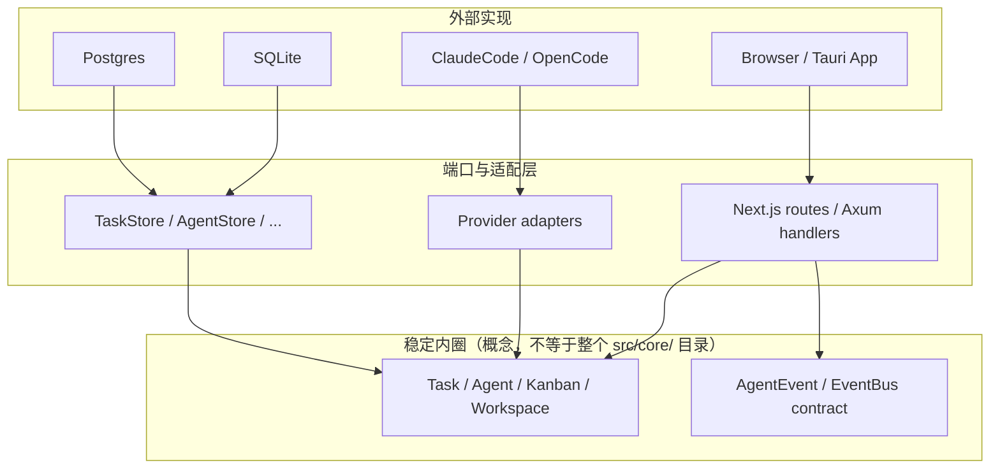
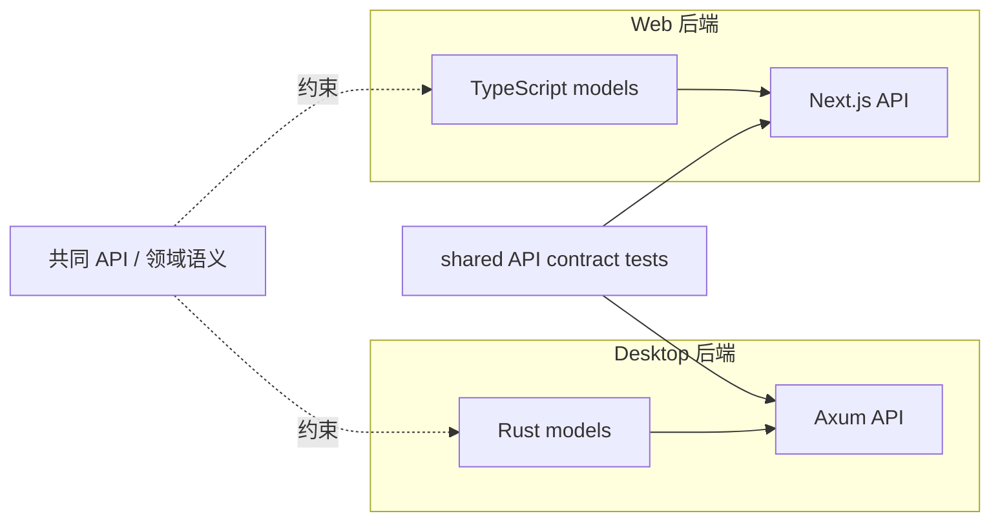

# Routa Phase 0：领域地基如何挡住五种腐烂

> **本文定位**：教学设计 / 解剖笔记，不是规格书或 API 文档。目标是解释「为什么这样设计」并提取可迁移模式，适合学习者和新加入的开发者阅读。如需快速定位关键决策，见 `docs/adr/`。
>
> 按「业务痛点 → 为什么这样设计 → 代码怎么落地 → 之前之后对比」的顺序，每个设计决策自闭环。
> **阅读方式**：建议从头顺序阅读；每章先沿业务问题完成推导，再用五镜头和一句话收束。
> 原始对话生成于 2026-07-03。为避免把教学演示误认成项目历史，全文代码分四类标记：**真实代码摘录**（可按 file:line 回查）、**基于真实代码的简化**（省略无关字段）、**假设反例**（说明没有该设计时会怎样，非 Routa 历史代码）、**目标设计**（尚未落地的重构方向）。
>
> **符号约定**：`k` = **变更传播比**（Change Propagation Ratio）——一项设计决策变化时需要连锁修改的文件数。k = 1 代表改一处即可（理想），k = N 代表霰弹式修改（Shotgun Surgery）。全文用 k 值度量变更放大效应，工厂函数、EventBus、纯函数映射等决策的核心目标就是把变更传播比从 N 降到 1。

## 目录

- [「你在这里」锚点](#你在这里锚点)
- [总体业务场景](#总体业务场景)
- [问题 1：词汇不统一](#问题-1词汇不统一)
- [问题 2：通知链断裂](#问题-2通知链断裂)
- [问题 3：并发冲突](#问题-3并发冲突)
- [问题 4：状态映射散落](#问题-4状态映射散落)
- [问题 5：协调逻辑膨胀](#问题-5协调逻辑膨胀)
- [五个可迁移模式](#五个可迁移模式)
- [附录 A：models/ 工厂函数深度拆解](#附录-amodels-工厂函数深度拆解)
- [一句话带走](#一句话带走)

## 「你在这里」锚点

**基于真实代码的简化** — 将真实结构压缩成便于阅读的图或清单。

```
Routa 全局施工图:

  models/ ──→ store/ ──→ worker/ ──→ acp/ ──→ kanban/ ──→ api/ ──→ app/
     ↑           ↑          ↑          ↑           ↑          ↑         ↑
  Phase 0     Phase 1    Phase 2    Phase 3     Phase 5   Phase 6  Phase 7
  类型底座    Store接口   Worker     ACP适配    看板引擎   API壳    页面壳

你现在在 Phase 0。这一层零依赖，但所有人依赖它。地基出问题 = 全楼重建。

本课进度    Phase 0 / 7。Routa 全栈已完成。
真实文件    ~/Desktop/my/routa/src/core/models/  13 个模型文件 + 1 个 barrel
            ~/Desktop/my/routa/src/core/events/   1 个 EventBus 实现 + 1 个 barrel
```

**Phase 0 只做一件事：搭建领域地基。** `models/` 中 13 个模型文件定义"这个系统里有哪些东西、长什么样、复杂对象怎么造"；`events/event-bus.ts` 定义"这些东西之间怎么互相通知与协调"。前者是静态词汇表，后者是动态通知管道。

以下 5 个问题，是 Phase 0 作为地基必须回答的。全文用 `k`（变更传播比）度量每个设计决策的变更放大效应，核心目标是把 k 从 N 降到 1。

| 问题 | 核心矛盾 | 解决方案 |
|------|---------|---------|
| 1. 词汇不统一 | 没有统一模型和创建入口时，字段名、默认值以及 TS/Rust 合约容易漂移 | 领域 `interface` + `createXxx()` 工厂；双后端用共享 API contract 测试校验可观察行为 |
| 2. 通知链断裂 | card 移动后既要触发编排器，将来还可能增加审计、通知等下游 | `EventBus.emit + on`，发布方与进程内消费方互不 import |
| 3. 并发冲突 | 多个 Agent 同时启动时需要全局和看板级并发控制 | 不把运行时状态塞进 Phase 0 模型；当前由 Store、BackgroundWorker、KanbanSessionQueue 分层处理 |
| 4. 状态映射散落 | 列 ID / 列阶段与 TaskStatus 的转换若散落，会产生静默漂移 | `columnIdToTaskStatus` 等纯函数族集中领域映射 |
| 5. 协调逻辑膨胀 | EventBus 的 `WaitGroup` 与 Orchestrator 的 `DelegationGroup` 都在实现「等 N 个完成」 | 已识别的架构债务：目标是让 Orchestrator 复用 `WaitGroup`，但迁移尚未落地 |

---

## 总体业务场景

Routa 是一个多 AI Agent 协作平台。一个典型的使用场景：

一个 Workspace（项目）里有一块看板，上面有 6 列：Backlog → Todo → Dev → Review → Done → Blocked。

用户创建一张 Task card「做一个登录页面」，从 Backlog 拖到 Dev 列。**一拖进 Dev 列**，发生以下一连串事情：

1. Routa 检查 Dev 列的自动化配置（`KanbanColumnAutomation`），发现有 `enabled: true`
2. 创建一个 BackgroundTask，分配一个 CRAFTER agent（负责写代码的 AI）
3. CRAFTER 被启动，拿到 card 的目标描述、验收条件、上下文代码
4. CRAFTER 开始工作：读文件、写代码、跑测试
5. CRAFTER 完成，触发 `AGENT_COMPLETED` 事件
6. 系统检测到 card 符合「进入 Review 列」的条件，**自动把 card 拖到 Review 列**
7. Review 列触发 GATE agent（审查者），审查代码
8. GATE 通过，card 拖到 Done

在这个场景里，Phase 0 作为地基，要回答五个基础问题。以下逐个拆解。

---

## 问题 1：词汇不统一

> **本节路线**：Task 创建链路 → 三种腐烂 → 三道防线 → 六边形架构 → 工厂落地 → 边界与权衡  
> **证据类型**：真实代码摘录 + 基于真实代码的简化 + 假设反例

### 业务场景：一条 card 创建链路穿过三个模块

用户在浏览器里点"新建 Task card"，填写标题「做一个登录页面」，目标栏位是 Dev 列，点击创建。

这条链路穿过三个模块，每个模块都需要"理解 Task 是什么"：

**基于真实代码的简化** — 将真实结构压缩成便于阅读的图或清单。

```
浏览器 POST /api/tasks  →  api/tasks/route.ts  解析 body，构造 Task 对象，写数据库
     ↓
看板收到新 card，检测 Dev 列有自动化配置  →  kanban/agent-trigger.ts  读 Task 字段，拼装 Agent prompt
     ↓
如果 card 描述里包含「委派子任务」指令  →  tools/agent-tools.ts  ROUTA agent 创建子 Task
```

当前代码已经统一使用 `Task` interface 和 `createTask()` 工厂。下面前两个后果是**假设反例**：不是在声称 Routa 历史上真的出现过这些代码，而是在回答"如果没有统一入口，会腐烂成什么样"。第三个后果则是当前真实存在的双后端维护风险。

### 如果不管它：三个腐烂后果

**后果 1：同一个字段逐渐长出多个名字。**

**真实代码摘录**

```typescript
// ❌ 假设反例（非 Routa 历史代码）
// API 层创建对象时写 columnId
const task = {
  id: "task-abc",
  title: "登录页面",
  status: "pending",
  labels: undefined,
  columnId: "dev",
};

// 另一个模块却以为字段叫 column，只能写 fallback 链
function buildPrompt(task: any) {
  const col = task.column ?? task.columnId ?? "backlog";
  const labels = task.labels ?? [];
}
```

问题不只是"两个名字不好看"。一旦消费方开始接受 `column` 和 `columnId` 两种形状，任何一次重命名都不敢彻底删旧字段：没人能确定还有多少调用方依赖旧名字，于是 fallback 链越积越长。

**堵法：`interface` 是整份 TypeScript 代码对 Task 的统一理解。** 当前 `Task` 只定义 `columnId`（`src/core/models/task.ts:835-899`）。API、Kanban、tools 都从 `core/models` 导入类型；谁写 `task.column`，TypeScript 就在编译期报错，不需要靠运行时 fallback 猜字段名。

**后果 2：默认值散落在大量创建入口里。** 当前 `createTask` 在 **51 个文件**中被调用（9 个生产文件 + 42 个测试文件，共 283 次调用；统计口径是"调用文件数"，不含工厂定义本身）。如果没有工厂，这些入口就可能各自写一套默认值：

**真实代码摘录**

```typescript
// ❌ 假设反例（非 Routa 历史代码）
const fromApi = { ...input, labels: input.labels ?? [] };
const fromAgentTool = { ...input, labels: input.labels ?? ["untriaged"] };
const fromTest = { ...input }; // 忘了 labels
```

**改漏一个未必会报错。** 特别是测试 fixture 用了 `as Task` 时，类型断言会绕过完整性检查；结果是不同入口产生不同默认值，问题直到运行时才暴露。

**堵法：`createTask()` 把默认值写一次。** 当前真实实现是 `labels: params.labels ?? []`（`src/core/models/task.ts:956-962`），并统一初始化 `sessionIds`、`laneSessions`、`laneHandoffs` 等集合（`task.ts:970-986`）。将默认标签从 `[]` 改成 `["untriaged"]`，工厂内部只改一处；51 个调用文件不用各自维护默认值。

**后果 3：双后端漂移——TypeScript 侧和 Rust 侧各自定义了 Task。** 这是最致命的问题。

Routa 有两套后端：

| 后端 | 语言 | 数据库 | Task 定义位置 |
|------|------|--------|-------------|
| Web 版 | TypeScript | Postgres | `src/core/models/task.ts` — 51 个字段 |
| 桌面版 | Rust | SQLite | `crates/routa-core/src/models/task.rs` — 44 个字段 |

两个文件是**分别手写的**。当前 TypeScript `Task` 有 51 个字段（`src/core/models/task.ts:835-899`），Rust `Task` 有 44 个字段（`crates/routa-core/src/models/task.rs:431-519`）；字段数不同本身不等于错误，但两边对外暴露的 JSON 语义必须兼容。

以 `TaskStatus` 为例，两边当前都有同样 7 个值：`PENDING | IN_PROGRESS | REVIEW_REQUIRED | COMPLETED | NEEDS_FIX | BLOCKED | CANCELLED`。如果 TypeScript 新增 `IN_QA`、Rust 忘记同步，Rust **不会**自动落到默认值或 unknown 变体——当前枚举没有这类兜底（`task.rs:203-219`），收到未知值会反序列化失败。

**堵法是三道能力不同的防线，不是一道万能 parity test：**

1. `Task` interface / Rust `Task` struct 分别约束各自语言内部的形状；
2. Rust 的 `serde(rename...)` 把 snake_case 字段和大写枚举值翻译成 API JSON 契约；
3. `tests/api-contract/run.ts` 用同一套测试分别请求 Next.js（3000）和 Rust（3210）后端，验证可观察行为；其中 `test-schema-validation.ts:329-339` 明确检查 7 个 TaskStatus 值。

第三道防线的边界也要说清楚：**contract test 只能抓它实际覆盖到的行为。** 测试没有构造过的新字段或新枚举场景，不会因为"两边源码不同"自动报错。因此双后端仍需要同步修改 + contract test 用例更新，不能把 parity 当成自动代码生成。

**变更传播比怎么变化？** 假设新增 `Task.evidenceSummary`：有工厂时，TypeScript 侧至少改 `Task` interface、`createTask` 入参和返回对象；桌面语义也需要时，再改 Rust struct，并补共享 contract test。调用文件只有真正提供该业务值的入口才需要改，不必在 51 个文件里重复补默认值。关键收益不是一个永远固定的 `k = 4`，而是把"默认值与完整对象构造"的变化封在工厂和跨后端契约边界内。

**三个腐烂点，各自违反了一条不同的设计原则：**

| 腐烂 | 违反的原则 | 具体表现 |
|------|-----------|---------|
| 字段名漂移 | 没有单一真相源 | 各模块各自理解 Task，字段重命名后长出 fallback 链 |
| 默认值散落 | 变化没有封装 | 大量创建入口各写一份默认值，改漏后行为悄悄分叉 |
| 双后端漂移 | 没有跨语言自动类型检查 | TS 与 Rust 分别手写模型，只能靠同步修改和共享 contract test 校验 |

反过来，`interface` 建立 TypeScript 侧的单一真相源，`createXxx()` 封装创建变化，共享 API contract test 检查两个后端的可观察行为——三个机制各有边界，不能互相替代。

但三个机制不是各自孤立的技巧，它们能成立是因为同一个架构前提——**领域模型被放在最内圈，零外部依赖，所有人依赖它**。这个前提就是六边形架构。

### 为什么需要六边形架构

六边形架构不是在解决某一个具体腐烂，而是定义了"谁可以依赖谁"的规则。Routa 的 ADR 0001（`docs/adr/0001-dual-backend-semantic-parity.md`）记录了核心约束：

> Routa.js ships as both a web app (Next.js) and a desktop app (Tauri + Rust/Axum). They must share the same domain model vocabulary.

**同一个产品，两套技术栈，但 Task/Agent/Kanban/Workspace 的概念不能有差异。** 这本质上是"车同轨，书同文"——`interface` 是轨距（双后端必须对齐），枚举和字段名是文字（同一个词不能各写各的）。

六边形架构的核心主张是：把领域概念放在内圈，让数据库、框架和 AI Provider 等实现细节依赖领域，而不是反过来。TypeScript 侧通过 `interface` + `createXxx()` 形成统一模型和创建入口；Rust 侧仍有独立手写的模型，双方通过共同的 API 语义与 contract tests 对齐。这里没有跨语言的自动单一真相源——六边形控制依赖方向，contract tests 控制已覆盖的行为漂移，两者职责不同。

**六边形全貌**：

**基于真实代码的简化** — 将真实结构压缩成便于阅读的图或清单。



**核心规则**：箭头从实现细节指向稳定契约。这里的"内圈"主要对应 `src/core/models/` 与事件契约，**不是整个 `src/core/` 目录**——`src/core/` 里也包含 db、worker、kanban、acp 等外层实现。换数据库时领域模型不该变化；Provider adapter 则负责把不同厂商的事件翻译成内部模型。

**双后端共享的是 API 语义，不是同一份 TypeScript 源码**：

**基于真实代码的简化** — 将真实结构压缩成便于阅读的图或清单。



Rust 端的 `crates/routa-core/src/models/task.rs` 是同一产品语义的独立翻译，`serde` rename 规则负责 JSON 命名转换；共享 API contract suite 分别运行在 Next.js 和 Rust 后端上，检查测试覆盖到的行为。它能挡住已写进契约测试的漂移，但不能自动证明两份源码完全等价。

### 设计决策：用 Task 看懂 interface + 工厂

问题 1 不需要记住 13 个模型文件。先抓住一条主线：

**基于真实代码的简化** — 将真实结构压缩成便于阅读的图或清单。

```text
Task interface 规定"完整对象必须长什么样"
        ↓
createTask(params) 规定"调用方最少要决定什么，系统字段怎么补齐"
        ↓
API / Agent tools / MCP / A2A / tests 全部从同一入口创建
```

#### 第一步：完整对象和创建入参不是一回事

`Task` 是消费方拿到的完整对象，`createTask` 的 params 则只暴露创建时允许决定的字段：

**真实代码摘录**

```typescript
// 基于真实代码的简化：src/core/models/task.ts:835-943
export interface Task {
  id: string;
  title: string;
  objective: string;
  status: TaskStatus;
  labels: string[];
  comments: TaskCommentEntry[];
  sessionIds: string[];
  laneSessions: TaskLaneSession[];
  laneHandoffs: TaskLaneHandoff[];
  dependencies: string[];
  codebaseIds: string[];
  createdAt: Date;
  updatedAt: Date;
  // + 其余业务字段
}

export function createTask(params: {
  id: string;
  title: string;
  objective: string;
  workspaceId: string;
  status?: TaskStatus;
  labels?: string[];
  comments?: TaskCommentEntry[];
  // + 其余可选业务输入
}): Task { /* ... */ }
```

关键区别：`labels` 在完整 `Task` 上是必选数组，但在创建入参里可选。调用方可以不传，工厂必须保证返回值可直接消费。

#### 第二步：工厂把系统规则集中在一个出口

**真实代码摘录**

```typescript
// 真实代码摘录：src/core/models/task.ts:944-993
const now = new Date();
const comments = params.comments ?? buildInitialTaskComments(params.comment, now);
return {
  id: params.id,
  title: params.title,
  objective: params.objective,
  comments,
  status: params.status ?? TaskStatus.PENDING,
  position: params.position ?? 0,
  labels: params.labels ?? [],
  sessionIds: [],
  laneSessions: [],
  laneHandoffs: [],
  dependencies: params.dependencies ?? [],
  codebaseIds: params.codebaseIds ?? [],
  contextSearchSpec: normalizeTaskContextSearchSpec(params.contextSearchSpec),
  jitContextSnapshot: normalizeTaskJitContextSnapshot(params.jitContextSnapshot),
  createdAt: now,
  updatedAt: now,
  // + 其余字段
};
```

它集中处理四类变化：

| 变化 | 工厂里的封口 |
|------|-------------|
| 初始状态变化 | `status: params.status ?? TaskStatus.PENDING` |
| 集合默认值变化 | `labels/sessionIds/...: []` |
| 兼容旧输入 | `comment → comments` |
| 边界数据清洗 | `normalizeTaskContextSearchSpec(...)` |

#### 第三步：真实调用方只决定业务值

创建 Task 的真实 API 入口在 `src/app/api/tasks/route.ts:411-431` 附近。简化后是：

**真实代码摘录**

```typescript
// 基于真实代码的简化
const task = createTask({
  id: uuidv4(),
  title: normalizedTitle,
  objective: normalizedObjective,
  workspaceId: normalizedWorkspaceId,
  boardId: normalizedBoardId ?? defaultBoard.id,
  columnId: normalizedColumnId ?? "backlog",
  status: columnIdToTaskStatus(normalizedColumnId),
  labels: normalizedLabels,
  acceptanceCriteria: normalizedAcceptanceCriteria,
});
```

API 负责回答"用户要创建什么"；工厂负责回答"一个合法的新 Task 还必须具备什么"。两种职责没有混在一起。

### Before / After：变化面到底缩小在哪里

**真实代码摘录**

```typescript
// ❌ 假设反例（非 Routa 历史代码）：每个入口裸构造
const task = {
  ...input,
  status: input.status ?? TaskStatus.PENDING,
  labels: input.labels ?? [],
  comments: [],
  sessionIds: [],
  createdAt: new Date(),
  updatedAt: new Date(),
};

// ✅ 当前模式：入口只传业务输入
const task = createTask(input);
```

当前 `createTask` 分布在 51 个调用文件、283 次调用中。工厂的收益不是"所有变更永远 k = 1"，而是：

- 改系统默认值时，规则集中在工厂；
- 新增可选业务字段时，只有真正提供该值的入口需要修改；
- 新增必填完整字段时，工厂返回类型会成为编译期检查点；
- 测试仍需覆盖默认值与透传，`as Task` 仍可能绕过类型系统。

### 什么时候值得写工厂

| 触发信号 | 建议 |
|----------|------|
| 有派生逻辑或兼容/normalize 规则 | 写工厂，即使调用方不多 |
| 有多个系统字段，且多个入口重复创建 | 写工厂，集中默认值和时间戳 |
| 纯 DTO、无默认值、只有一个局部入口 | 直接对象字面量通常更清晰 |

不要从"文件名是 model"机械推出"必须有 createXxx"。Schedule 和 TaskRequirements 没有对象工厂；Codebase、Worktree 虽然简单，但因为要集中系统字段而提供了工厂。其他工厂变体和当前调用数据见附录 A。

### 用五镜头检查这项设计

- **分** — 调用方决定业务输入，工厂决定系统初始值和规范化，完整 interface 约束消费方拿到的结果。边界不是"文件分开"，而是"谁有权决定这个值"。

- **稳** — 默认值、派生值、兼容和 normalize 都有单一出口。变化发生时先找出口，而不是扫描 51 个调用文件。

- **向** — API、tools、MCP、tests 依赖 `core/models`；模型不反向 import Store、Worker、API。数据库和页面变化不应改写 Task 的领域定义。

- **约** — TypeScript 检查字段名、必填字段和枚举；工厂测试检查默认值与透传；共享 API contract tests 检查 TS/Rust 后端已覆盖的可观察行为。三层契约互补，但都不是万能证明。

- **权** — 统一入口增加了一个必须学习和维护的抽象，也限制了随手裸构造的灵活性。对象越简单、调用方越少，收益越低；有系统规则且调用面广时，安全收益才明显超过代价。

> **一句话带走**：`interface` 统一"完整对象长什么样"，工厂统一"新对象怎么合法地造出来"，共享 contract tests 再约束两套后端对外表现一致。

**下一章连接**：通知链断裂。看 EventBus 如何把"发什么"和"谁来收"拆开。

---

## 问题 2：通知链断裂

> **本节路线**：card 移动 → 空间耦合 → EventBus 堵法 → 演化耦合 → 注册前提 → 同步权衡  
> **证据类型**：真实代码摘录 + 基于真实代码的简化 + 假设反例

### 业务场景

用户把 card-5 从 Todo 拖到 Dev 列。`emitColumnTransition`（`src/core/kanban/column-transition.ts:28`）发出 `COLUMN_TRANSITION` 事件。真实下游是 `KanbanWorkflowOrchestrator`（`workflow-orchestrator.ts:220` 用 `on` 订阅了它，收到后启动 Column Agent）。将来可能还要加审计日志、Slack 通知等更多下游。`emitColumnTransition` 和它们之间**没有任何直接函数调用**——全靠 EventBus 通信。

一句话锁定问题：**发事件的人，该不该知道谁在收？** 答案是不该。下面两种耦合，都是"让 emit 方知道下游"埋的雷——一个静态、一个动态。

### 两种耦合

**腐烂 1：空间耦合 — emit 方被迫 import 所有下游。** 没有 EventBus 时，`emitColumnTransition` 必须亲自 import 并调用每一个下游：

**真实代码摘录**

```typescript
// ❌ emitColumnTransition 变成上帝函数：它认识每一个下游
import { workflowOrchestrator } from "./workflow-orchestrator";
import { auditLogger } from "../audit/audit-logger";
import { slackNotifier } from "../integrations/slack";

function emitColumnTransition(data) {
  workflowOrchestrator.triggerAutomation(data);
  auditLogger.log("card_moved", data);
  slackNotifier.notify(`Card moved to ${data.toColumnId}`);
}
```

一个"发看板通知"的函数，被迫依赖编排器、审计、Slack SDK 三个八竿子打不着的模块——看板逻辑和 Slack 焊死在一起，连单测 `emitColumnTransition` 都得把三个下游全 mock 一遍。

**堵法：EventBus 当中间人，emit 方只管发。**

**真实代码摘录**

```typescript
// ✅ emitColumnTransition 只认识 EventBus，不知道下游是谁
function emitColumnTransition(eventBus, data) {
  eventBus.emit({ type: AgentEventType.COLUMN_TRANSITION, data });
  // 发完收工。谁在听、听了干什么，与它无关。
}
```

下游各自向 EventBus 注册，`emitColumnTransition` 一个都不认识（真实代码，`workflow-orchestrator.ts:220`）：

**真实代码摘录**

```typescript
// ✅ 每个下游自己 on 注册，彼此也互不相识
eventBus.on("orchestrator", (event) => {
  if (event.type === AgentEventType.COLUMN_TRANSITION) {
    // 查目标列的自动化配置，启动 Column Agent
  }
});
```

| 之前 | 之后 |
|------|------|
| `emitColumnTransition` import 编排器 / 审计 / Slack | 只 import EventBus，不知道下游存在 |
| 单测要 mock 三个下游 | 入口测试只需断言 transition 通知被发出（真实写法，`src/app/api/tasks/__tests__/route.test.ts:291-297`） |

---

**腐烂 2：演化耦合 — 每加一个下游，都要回改 emit 方。** 空间耦合的动态版：就算今天只有一个下游，只要"发通知"和"处理通知"焊在一起，明天加需求就得回来动这个函数。

产品说"card 移动时发一条 Slack 通知"。没有 EventBus 时：

**真实代码摘录**

```typescript
// ❌ 回到 emitColumnTransition，加 import、加调用
import { slackNotifier } from "../integrations/slack";  // 新增一行 import
function emitColumnTransition(data) {
  workflowOrchestrator.triggerAutomation(data);
  slackNotifier.notify(`Card moved to ${data.toColumnId}`);  // 新增一行调用
}
```

一年后 12 个下游 → `emitColumnTransition` 的 import 列表 15 行，每次加需求都在同一个函数上动刀 → 每次都可能碰坏已经在跑的逻辑。

**堵法：新下游自己 `on` 注册，emit 方一行不碰。**

**真实代码摘录**

```typescript
// ✅ 加 Slack 通知：新建文件，自己订阅，emitColumnTransition 零改动
eventBus.on("slack-notifier", (event) => {
  if (event.type === AgentEventType.COLUMN_TRANSITION) {
    slack.send(`Card moved to ${event.data.toColumnId}`);
  }
});
```

| 之前 | 之后 |
|------|------|
| 加下游 → 回改 `emitColumnTransition` | 加下游 → 新模块自己 `on`，上游零改动 |
| 变更集中在一个越来越肥的函数 | 变更分散到各下游自己的文件 |

---

### 总结

| 耦合 | 堵法 | 机制 |
|------|------|------|
| 空间耦合（emit 方 import 所有下游） | EventBus 当中间人 | `emit` + `on` |
| 演化耦合（加下游回改 emit 方） | 新模块自己订阅 | `on` |

本质是**发布-订阅解耦**：生产者不 import 消费者，消费者不 import 生产者，双方只依赖 EventBus 和事件类型。事件类型是稳定的（"card 移动"这个概念不会变），下游列表是变化的（今天 3 个，明天 5 个）。稳定的部分焊成契约，变化的部分只影响新模块自己。

> **一个前提**：`on` 是"推"模式——`emit` 时同步直达每个已注册的 handler（`event-bus.ts:110-117`）。它成立的前提是**下游在 emit 之前已经 `on` 好**。进程内模块（编排器、审计）在系统启动时就注册了，天然满足。但如果下游是独立生命周期、可能晚于 emit 才就绪的 **Agent**，推模式就会漏事件——那需要另一套"拉"模式（`subscribe` + `pendingEvents` 缓冲 + `drainPendingEvents` 自取），详见后文「模式 2」的两档投递语义。

### 用五镜头检查这项设计

- **分（谁管什么）** — `emitColumnTransition` 只管"card 移动了"这件事，不管"移动之后要干嘛"。下游只管"我关心的事件来了怎么处理"，不管事件从哪来。双方互不认识。

- **稳（改了谁）** — 加一个下游：新模块自己 `on`，`emitColumnTransition` 改 0 行。加一种事件类型：`AgentEventType` 枚举加一个值，emit/on 代码一行不动。变化只影响"新增"，碰不到既有代码。

- **向（谁依赖谁）** — 所有箭头指向 EventBus，EventBus 不 import 任何业务模块。箭头只进不出，换数据库、换 AI 厂商、换前端框架，EventBus 纹丝不动。

- **约（怎么定规矩）** — 规矩就两样：`AgentEventType` 枚举（有哪些事件类型）+ `AgentEvent`（事件长什么样）。`data` 字段故意用宽松类型，不锁死每种事件的 payload 形状——牺牲一点类型安全，换取"新增事件类型不改接口"的扩展性。

- **权（代价换什么）** — `emit` 同步跑完所有 handler，一个慢的会拖累后面。但换来了零延迟、零中间件、桌面版立即可用。Routa 的判断：进程内通知场景，简单和零依赖的价值大于"可靠投递"。

> **一句话带走**：发布方只说"发生了什么"，消费方自己决定"收到后做什么"，EventBus 让双方不必互相认识。

**下一章连接**：并发冲突。看运行态控制为什么不该塞进模型层。

---

## 问题 3：并发冲突

> **本节路线**：三类并发问题 → Task 计数器伪解法 → 分层准入 → 生命周期边界 → 权衡  
> **证据类型**：真实代码摘录 + 基于真实代码的简化 + 假设反例

### 业务场景：五张 card 几乎同时进入自动化列

用户在很短时间内把 5 张 card 拖进启用了自动化的 Dev 列。如果系统不做准入控制，5 个 Agent session 会同时启动，争抢 CPU、模型额度和 Git 资源。

先把容易混在一起的三种"并发问题"分开：

| 问题 | 例子 | 对应机制 |
|------|------|---------|
| **启动过多** | 5 张 card 同时启动 5 个 Agent | BackgroundWorker / KanbanSessionQueue 限流和排队 |
| **文件相互覆盖** | 两个 Agent 写同一个工作目录 | 每任务独立 Git worktree |
| **逻辑修改冲突** | 两个独立分支修改同一段代码 | Git merge/rebase + 人工或 Agent 解决冲突 |

Phase 0 讨论的是第一类机制应该放在哪一层。排队只能控制"同时跑几个"，不能承诺两个分支永远没有 merge conflict，也不能替代 worktree 隔离。

### 假设反例：把运行时计数塞进 Task 工厂

**真实代码摘录**

```typescript
// ❌ 假设反例（非 Routa 真实代码）
// models/task.ts 里维护进程内计数
let runningAgentCount = 0;
const MAX_CONCURRENT = 3;

export function createTask(params: {...}): Task {
  if (runningAgentCount >= MAX_CONCURRENT) {
    throw new Error("Too many agents running");
  }
  runningAgentCount++;
  return { ... };
}
```

这段代码看似"保护了并发"，其实造了三份假象：

1. **计数来源不可靠**：进程重启后从 0 开始，持久化系统里可能已有运行中的任务；
2. **生命周期不闭合**：创建 Task 不等于启动 Agent，Task 工厂也不知道 session 何时结束；
3. **策略被写死**：全局上限和每块看板的上限是两种策略，不该塞进领域对象构造函数。

### 当前真实实现：运行态数据在哪里，控制就在哪里

Routa 已经把准入控制放在掌握运行态信息的层，而不是留到未来再做：

| 控制范围 | 当前实现 | 真实机制 |
|----------|----------|----------|
| 全局 BackgroundTask | `src/core/background-worker/index.ts:25-108` | `MAX_CONCURRENT_TASKS = 2`；从 Store 读取 running tasks，按可用槽位启动 pending tasks |
| 每块 Kanban board | `src/core/kanban/kanban-session-queue.ts:78-110` | 读取 board limit；达到上限就进入 `queuedByBoard`，否则立即启动 |
| 队列续跑 | `kanban-session-queue.ts:251-287` | 收到 Agent 终态事件后释放 running entry，再 drain 下一批 |
| board 限额配置 | `src/core/kanban/board-session-limits.ts:1-34` | 默认每块 board 同时 1 个 session，可写入 workspace metadata 覆盖 |

真实的 Kanban 准入决策可以压成三行：

**真实代码摘录**

```typescript
// 基于真实代码的简化：kanban-session-queue.ts:96-110
const limit = await getConcurrencyLimit(workspaceId, boardId);
if (countRunning(boardId) >= limit) {
  pushQueuedEntry(job);
  return { queued: true };
}
return startEntry(job);
```

关键不是"Phase 0 什么都没做"，而是：**Phase 0 只定义 Task/Event 等契约；Store 提供运行态事实；Worker 和 KanbanQueue 根据各自范围作调度决策。**

### 用五镜头检查这项设计

- **分** — 数据在哪，决策就在哪。Task 工厂管"对象怎么创建"；Store 管"当前状态是什么"；Worker 管全局后台作业槽位；KanbanSessionQueue 管每块 board 的 session 槽位。文件隔离和 Git 合并冲突则由另外的机制负责。

- **稳** — 修改全局上限只影响 BackgroundWorker；修改 board 默认上限只影响 `board-session-limits.ts`；Task 模型不需要跟着并发策略变化。

- **向** — Worker/Queue 依赖 Store 和领域类型，领域模型不反向 import Worker/Queue。运行时策略不会污染模型层。

- **约** — `enqueue()` 的返回值明确告诉调用方 `{ queued: boolean, sessionId?, error? }`（`kanban-session-queue.ts:78`）；调用方不需要读取 Queue 内部 Map 来猜任务是否启动。

- **权** — 当前有两套不同粒度的上限：BackgroundWorker 的全局常量和 Kanban 的 per-board 配置。它们解决不同入口的压力控制，但也意味着系统没有一个统一的"所有 Agent 全局额度"策略。这里应诚实承认边界，而不是把两套限流说成一把万能锁。

**可执行的检查清单**：

**基于真实代码的简化** — 将真实结构压缩成便于阅读的图或清单。

```
设计并发控制时先问:
  □ 控制的是全局作业、单个 board，还是单个 worktree？
  □ running 数量从持久化 Store 还是进程内 Map 得到？
  □ 任务完成/失败/超时后，谁负责释放槽位？
  □ 排队是否只解决准入，而没有被误写成"解决所有并发冲突"？
```

- **权** — 当前有两套不同粒度的上限：BackgroundWorker 的全局常量和 Kanban 的 per-board 配置。它们解决不同入口的压力控制，但也意味着系统没有一个统一的"所有 Agent 全局额度"策略。这里应诚实承认边界，而不是把两套限流说成一把万能锁。

> **一句话带走**：并发控制必须放在看得见运行态和生命周期的层，模型只定义对象，不能靠一个内存计数器假装掌握全局。

**下一章连接**：状态映射散落。看四个纯函数如何把领域映射收口。

---

## 问题 4：状态映射散落

> **本节路线**：三个映射方向 → 散落 switch → 四个纯函数 → QA 边界 → 权衡  
> **证据类型**：真实代码摘录 + 基于真实代码的简化 + 假设反例

### 业务场景：同一领域关系有三个方向

Routa 的默认看板有 6 个 stage，它们和 `TaskStatus` 存在领域映射：

**基于真实代码的简化** — 将真实结构压缩成便于阅读的图或清单。

```
backlog / todo → PENDING
 dev           → IN_PROGRESS
 review        → REVIEW_REQUIRED
 blocked       → BLOCKED
 done          → COMPLETED
```

这不是一条单向 if-else，而是三个相关问题：

1. 已知默认列 ID，Task 初始状态是什么？
2. 已知自定义 board 上某列的 `stage`，Task 状态是什么？
3. 只有 TaskStatus、没有 board 上下文时，默认应该落回哪一列？

前端显示"进行中""待审查"是**展示/i18n 映射**，不是同一领域函数的第四个方向。UI 可以消费 TaskStatus，但不应该为了显示文案去复用 `columnIdToTaskStatus`。

### 假设反例：每个入口各写一套 switch

**真实代码摘录**

```typescript
// ❌ 假设反例（非 Routa 真实代码）
// API 创建入口
if (columnId === "dev") status = TaskStatus.IN_PROGRESS;

// Agent 工具移动 card
if (targetColumnId === "dev") task.status = TaskStatus.IN_PROGRESS;

// Workflow 自动推进
if (nextColumn.stage === "review") task.status = TaskStatus.REVIEW_REQUIRED;
```

三处代码表面相似，却分别按列 ID 或列 stage 判断。某处漏掉 `blocked`，不会产生类型错误，只会让 card 的列和状态悄悄不一致。

### 当前真实实现：四个纯函数各管一个方向

映射集中在 `src/core/models/kanban.ts:319-372`：

| 函数 | 输入 → 输出 | 用途 |
|------|-------------|------|
| `columnIdToTaskStatus` | 默认列 ID → TaskStatus | 没有完整 board 配置时的 fallback |
| `columnStageToTaskStatus` | `KanbanColumnStage` → TaskStatus | 自定义列名不重要，领域 stage 才决定状态 |
| `resolveTaskStatusForBoardColumn` | board columns + column ID → TaskStatus | 先查真实列的 stage，找不到才 fallback |
| `taskStatusToColumnId` | TaskStatus → 默认列 ID | 缺少 board 上下文时做反向收敛 |

真实调用方包括：

- 创建 Task：`src/app/api/tasks/route.ts:425`
- 更新 column/status 并收敛：`src/app/api/tasks/[taskId]/route.ts:346-379`
- Agent 工具移动 card：`src/core/tools/kanban-tools.ts:418,563`
- Workflow 自动推进：`src/core/kanban/workflow-orchestrator.ts:926`

核心函数的真实代码是：

**真实代码摘录**

```typescript
// 真实代码摘录：src/core/models/kanban.ts:349-357
export function resolveTaskStatusForBoardColumn(
  columns: Pick<KanbanColumn, "id" | "stage">[] = [],
  columnId?: string,
): TaskStatus {
  const column = columns.find((entry) => entry.id === columnId);
  if (column) {
    return columnStageToTaskStatus(column.stage);
  }
  return columnIdToTaskStatus(columnId);
}
```

这里最值得学的不是 switch，而是 `Pick<KanbanColumn, "id" | "stage">`：映射只依赖两个字段，调用方和测试不必构造完整 `KanbanColumn`。

### 新增 QA 列到底要改几处？

要先区分两种需求：

- **自定义列名叫 QA，但领域阶段仍是 review**：列配置写 `stage: "review"` 即可，状态映射函数零改动；
- **产品新增全新的 QA 领域阶段和 `IN_QA` 状态**：这不是"多加一个列名"，而是扩展领域状态机，至少要同步 `KanbanColumnStage`、`TaskStatus`、正反向映射、TS/Rust API 契约和对应测试。

所以纯函数族把**重复规则**收口了，但不能把真正的领域扩展魔法般压成 `k = 1`。

### 用五镜头检查这项设计

- **分** — 领域映射和 UI 文案分开；默认列 ID、领域 stage、反向 fallback 也分别由不同函数承担。

- **稳** — 自定义列改名不影响状态语义，因为 `resolveTaskStatusForBoardColumn` 读取的是稳定的 `stage`；只有新增领域 stage 才需要修改状态机契约。

- **向** — API、tools、workflow 都依赖 `core/models/kanban.ts` 的映射函数，映射函数不反向依赖这些调用方。

- **约** — `KanbanColumnStage` 是封闭 union（`kanban.ts:11`）；`resolveTaskStatusForBoardColumn` 只要求 `id + stage`，既限制合法领域阶段，又降低调用门槛。

- **权** — `taskStatusToColumnId` 只能返回默认列 ID，无法凭一个 status 推断自定义 board 的真实列。它是没有 board 上下文时的 fallback，不是全局可逆映射。

> **一句话带走**：把同一种领域映射收口成函数族，但别把列名、领域状态和 UI 文案误当成同一个映射。

**下一章连接**：协调。看 WaitGroup 和 Orchestrator 的边界为什么还没合并。

---

## 问题 5：协调逻辑膨胀

> **本节路线**：委派场景 → 通用协调与业务唤醒 → 当前双机制 → 目标设计 → 迁移边界  
> **证据类型**：真实代码摘录 + 基于真实代码的简化 + 目标设计（尚未落地）

### 业务场景

ROUTA agent 把"做一个登录页面"拆成 3 个子任务，分别交给 CRAFTER-A、B、C。调用方指定 `waitMode: "after_all"`：三个子 Agent 都结束后，父 Agent 才收到汇总通知。

这个需求包含两部分：

1. **通用协调**：记录等谁、谁已完成、何时算全部完成；
2. **Routa 业务**：读取子任务报告、拼接唤醒消息、继续父 session。

边界应该画在"怎么等齐"和"等齐后做什么"之间。

### 当前真实状态：两套相似机制仍然并存

**EventBus 已有通用 `WaitGroup`**（`src/core/events/event-bus.ts:182-253`）：保存 `expectedAgentIds` / `completedAgentIds`，终态事件到达时自动检查并调用 `onComplete`。

**Orchestrator 仍有专用 `DelegationGroup`**（`src/core/orchestration/orchestrator.ts:114-123`）：

**真实代码摘录**

```typescript
// 真实代码摘录
interface DelegationGroup {
  groupId: string;
  parentAgentId: string;
  parentSessionId: string;
  childAgentIds: string[];
  completedAgentIds: Set<string>;
}
```

`waitMode === "after_all"` 时，Orchestrator 仍会自己建组并追加 child（`orchestrator.ts:718-734`）；子 Agent 完成时，它又自己遍历、计数、判断和清理（`orchestrator.ts:1298-1316`），最后调用业务方法 `wakeParent`。

两者不是逐字段复制：`DelegationGroup` 多了 `parentSessionId`，并绑定了 `wakeParent` 业务流程。但**"维护 expected/completed 集合并判断等齐"这部分职责重复了**。

### 为什么这是架构债务，而不是已完成的设计

当前生产代码里没有 Orchestrator 调用 `eventBus.createWaitGroup()`；因此不能写成"之后已经只剩一份实现"。准确状态是：

| 当前 | 目标 |
|------|------|
| EventBus 有通用 WaitGroup，但生产编排尚未使用 | Orchestrator 复用 WaitGroup 的计数/完成判断 |
| Orchestrator 自己维护 DelegationGroup 和两个 Map | Orchestrator 只保留 parentSessionId、报告聚合、wakeParent 等业务状态 |
| 两处都实现等齐判断 | 等齐判断只有 EventBus 一处 |

> **当前事实**：EventBus 已经有通用 WaitGroup，但 Orchestrator 仍在用 DelegationGroup 自己计数；迁移目标还没落地。

### 目标设计（尚未落地）

**目标设计** — 尚未落地；参数形状遵循当前真实 `createWaitGroup` 签名。

```typescript
// 目标设计：参数形状遵循当前真实 createWaitGroup 签名
const groupId = `delegation-group-${uuidv4()}`;
eventBus.createWaitGroup({
  id: groupId,
  parentAgentId: callerAgentId,
  expectedAgentIds: ["CRAFTER-A", "CRAFTER-B", "CRAFTER-C"],
  onComplete: () => {
    void wakeParentWithAggregatedReports(groupId, callerSessionId);
  },
});
```

这里不能简单"删掉 DelegationGroup 就完事"。迁移还要解决：

- `parentSessionId` 放在哪个业务结构里；
- `onComplete` 是同步回调，而 `wakeParent` 是异步流程，错误如何观测；
- Agent failed/timeout 是否也算"等齐"，以及汇总里如何区分成功失败；
- 重启后内存 WaitGroup 丢失时，是否需要 Store 恢复。

### 用五镜头检查这项设计

- **分** — WaitGroup 负责集合和完成判定；Orchestrator 负责 session、报告和唤醒消息。当前代码还没有完全沿这条边界切开。

- **稳** — 完成判定统一后，去重、动态追加等通用规则只改 EventBus；"父 Agent 收到什么消息"只改 Orchestrator。

- **向** — 目标依赖方向是 `orchestrator.ts → event-bus.ts`，EventBus 不知道 `wakeParent`、session 或报告格式。

- **约** — 当前 `createWaitGroup` 要求 `id`、`parentAgentId`、`expectedAgentIds`；终态事件集合固定为 completed/failed/timeout/report submitted（`event-bus.ts:145-153`）。迁移必须尊重这些真实契约，不能用缺字段的伪调用代替设计。

- **权** — 统一能消除重复计数，但 EventBus 的 WaitGroup 是进程内、回调同步、无持久化。若 Orchestrator 需要可靠恢复，直接复用仍不够；可能需要把等待状态持久化，而不是只做机械替换。这个权衡尚未在当前代码里解决。

> **一句话带走**：WaitGroup 应只负责"怎么等齐"，Orchestrator 负责"等齐后做什么"；Routa 已有原语，但这条迁移尚未完成。

**下一章连接**：五个问题讲完后，下面把它们压成可迁移的模式速查卡。

---

## 五个可迁移模式

学 Routa 的目标不是「记住 Routa 怎么写的」，而是**把模式镜头装上，下个项目里一眼认出同一种形状**。

---

### 模式 1：工厂函数（createXxx）— 防半初始化对象

**触发信号**：你的项目里有一个 `interface`，它有超过 3 个字段是「必须设但调用方不应该自己算的」。典型的：`createdAt`、`updatedAt`、`id`、`status` 初始值、`items` 默认空数组。当你在 3 个以上的地方看到类似 `{ ...data, status: "pending", createdAt: new Date() }` 这种字段拼装 → 工厂函数就是正确的重构方向。

**可迁移配方**：

**基于真实代码的简化** — 将真实结构压缩成便于阅读的图或清单。

```
1. 定义对外领域 interface，完整对象上的系统字段保持必选
2. 定义更小的 createXxx(params) 入参类型
   - params 里只放「业务必需」的参数（2-5 个必填 + 其余可选）
   - 函数内部补上所有系统字段的默认值
   - 复杂嵌套对象在 export 之前 normalize 一次
3. 所有模块 import { createXxx, Xxx } 从同一个文件
4. 禁止外部裸构造 interface 的实例
```

**注意度 / 别过度**：
- ✅ 实体类（Entity）、聚合根、有状态机的对象 → 工厂函数
- ✅ 参数超过 5 个必选字段 + 有派生值的对象 → 工厂函数
- ❌ 纯数据 DTO（只有字段、无状态、无默认值）→ 直接 `{ ... }`，不需要工厂
- ❌ 只有 1 个消费方的临时对象 → 不需要工厂，过度抽象

**去你的项目里试**：找 3 个不同的文件，看它们是否各自手写了同一个对象的默认值。如果有 → 那个对象就是工厂函数的候选。

---

### 模式 2：pub/sub EventBus（进程内）— 模块间解耦通知

**触发信号**：你的项目里有一个模块 A，它做完某件事之后，需要通知 B、C、D 三个模块。如果 A 的代码里直接 import 了 B、C、D → 每次加一个新的通知方都要回 A 改代码 → A 的 import 列表持续膨胀。

**可迁移配方：先选投递语义，再选 Map。**

**基于真实代码的简化** — 将真实结构压缩成便于阅读的图或清单。

```
共同契约:
  1. 定义事件类型和事件形状：type + 来源 ID + payload + timestamp
  2. 发布方只 emit，不 import 消费方

档位 A — 进程内推模式（Routa 的 emit + on）:
  3. handlers Map 保存回调
  4. emit 同步调用已经注册的 handlers
  适合：模块都在同一进程，启动时已完成接线

档位 B — Agent 拉模式（subscribe + pendingEvents + drain）:
  3. subscriptions Map 保存 Agent 关心的事件类型
  4. emit 把匹配事件放进每个 Agent 的 pendingEvents
  5. Agent 就绪后 drainPendingEvents 自取
  适合：消费方有独立生命周期，可能晚于事件就绪
```

**注意度 / 别过度**：
- ✅ 发布方不应认识多个可变下游 → EventBus
- ✅ Agent 可能晚启动且事件不能立即丢 → 拉模式 + buffer
- ❌ 只有 1 个固定消费方 → 直接调用通常更清晰
- ❌ 跨进程、跨服务可靠通信 → 使用真正的消息系统，不要把内存 Map 当队列
- ❌ 需要"处理成功后才提交"的强一致场景 → 当前 EventBus 没有 ack/事务语义

**Routa 给的关键洞察**：EventBus 不是天然异步。`on` handler 在 `emit` 内同步执行；`subscribe` 通道则先缓冲、后 drain。先把投递语义说清楚，才不会以为加了 EventBus 就自动解决时序和可靠性。

---

### 模式 3：纯函数映射族 — 收口散落的 if-else

**是什么**：两个领域概念之间有稳定对应关系，而且多个业务入口需要同一个答案。不要在每个入口手写 switch；把每个**映射方向**各收口成纯函数。

**真实代码摘录**

```typescript
// ❌ 假设反例：API、工具、workflow 各写一套领域映射
if (columnId === "dev") status = TaskStatus.IN_PROGRESS;
switch (nextColumn.stage) { case "review": return TaskStatus.REVIEW_REQUIRED; }
```

**真实代码摘录**

```typescript
// ✅ 真实模式：相关方向组成函数族
columnIdToTaskStatus(columnId);                  // 默认列 ID → status
columnStageToTaskStatus(column.stage);           // 稳定 stage → status
resolveTaskStatusForBoardColumn(columns, id);    // 自定义 board 列 → status
taskStatusToColumnId(status);                    // status → 默认列 ID fallback
```

**边界纪律**：只收口同一种领域知识。`"dev" → IN_PROGRESS` 是领域映射；`IN_PROGRESS → t("status.inProgress")` 是 UI/i18n 映射，不应该硬塞进同一个函数。新增自定义列名可能零改动；新增全新领域 stage 则必须扩展类型、正反向映射和跨后端契约，不能承诺永远 `k = 1`。

---

### 模式 4：WaitGroup（after_all）— 等 N 个异步任务全部完成

**是什么**：你启动了 N 个异步任务，需要等全部进入终态后再继续。通用原语可以维护 expected/completed 集合和"是否等齐"的判断；业务方仍负责定义等齐后做什么。

**真实代码摘录**

```typescript
// ❌ 每个业务模块都复制 Set + 遍历 + 清理
const completedIds = new Set<string>();
completedIds.add(agentId);
if (completedIds.size >= expectedIds.length) aggregateResults();
```

**真实代码摘录**

```typescript
// ✅ 目标调用形状（当前 EventBus 原语已存在，Orchestrator 尚未迁移）
eventBus.createWaitGroup({
  id: "grp-login-page",
  parentAgentId: "ROUTA-1",
  expectedAgentIds: ["CRAFTER-A", "CRAFTER-B", "CRAFTER-C"],
  onComplete: () => { aggregateResults(); },
});
```

**不要把原语存在误写成重构完成**：Routa 当前 Orchestrator 仍使用 `DelegationGroup` 自己计数。复用 WaitGroup 是目标设计，还要处理异步回调错误、持久化恢复、成功/失败结果聚合等问题。通用计数器能消除重复，但不能吞掉业务状态。

---

### 模式 5：六边形架构的落地节奏 — "先稳定内圈契约，再接外圈实现"

**是什么**：不是一口气建完整个系统，而是先建立领域模型和端口，再逐层接入存储、调度、Provider、API 与 UI。外层可以依赖多个允许的内层模块，不要求机械地"只依赖紧邻上一层"；真正禁止的是内层反向 import 外层实现。

**基于真实代码的简化** — 将真实结构压缩成便于阅读的图或清单。

```
领域模型 / 事件契约：Task、Agent、Kanban、AgentEvent
             ↑
Store 端口与实现：TaskStore、BackgroundTaskStore、Postgres/SQLite
             ↑
运行时策略：BackgroundWorker、KanbanSessionQueue、Orchestrator
             ↑
边界适配：ACP Provider、API、前端 / Desktop

箭头表达"外层依赖内层契约"；数据库和 UI 都不应该反过来定义 Task 是什么。
```

**关键纪律**：每层先用测试验证自己的契约，再让外层消费；跨层依赖看"是否指向稳定内圈"，而不是只看目录是否相邻。双后端仍各自维护模型翻译，所以还需要共享 API contract tests 校验已覆盖的语义。

---

## 附录 A：models/ 工厂函数深度拆解

> 本附录用于按需深挖，不是理解五个问题的前置条件。主线只需要先掌握 Task；这里再看同一工厂模式如何随复杂度变化。
> **跳读提示**：如果你只想先把五个问题读完，可以直接跳到"一句话带走"，附录之后再回来看。

### A1. 简单默认值工厂：Agent

`createAgent` 的调用方决定身份字段，工厂集中初始状态、模型档位、metadata 和时间戳。

**真实代码摘录**

```typescript
// 基于真实代码的简化：src/core/models/agent.ts
createAgent({ id, name, role, workspaceId, modelTier? })
  → status: PENDING
  → modelTier: SMART（未传时）
  → metadata: {}
  → createdAt / updatedAt: 同一个 now
```

**适用信号**：对象本身不复杂，但系统字段会在很多入口重复出现。

### A2. 派生值工厂：BackgroundTask

`createBackgroundTask` 不只补默认值，还会从输入推导输出：title 未提供时，从 prompt 截取并清理换行。

**真实代码摘录**

```typescript
// 基于真实代码的简化：src/core/models/background-task.ts
const title = input.title ?? input.prompt.slice(0, 60).replace(/\n/g, " ");
return {
  id: input.id ?? crypto.randomUUID(),
  title,
  status: "PENDING",
  attempts: 0,
  maxAttempts: input.maxAttempts ?? 1,
  createdAt: now,
  updatedAt: now,
};
```

**适用信号**：字段 B 由字段 A 推导。规则若散在 6 个调用文件里，将来从 60 字符改成 80 字符就会产生霰弹式修改。

### A3. 复杂兼容工厂：Task

Task 同时承担默认值、集合初始化、旧 `comment` 到新 `comments` 的兼容，以及两个嵌套对象的 normalize。它是工厂收益最大的例子，但完整代码已在问题 1 主线讲过，这里只保留复杂度清单：

- 完整 Task 当前 51 个字段；
- 创建入参只暴露业务可决定字段；
- `sessionIds/laneSessions/laneHandoffs` 从空数组开始；
- `contextSearchSpec/jitContextSnapshot` 在出口统一清洗；
- 51 个调用文件、283 次调用共享创建规则。

### A4. 带独立辅助函数的工厂：Workspace

Workspace 的特殊点是派生规则不只创建时使用，所以规则没有藏死在工厂里：

**真实代码摘录**

```typescript
// 基于真实代码的简化：src/core/models/workspace.ts
getDefaultWorkspaceWorktreeRoot(id)
  → ~/.routa/workspace/{id}

getEffectiveWorkspaceMetadata({ id, metadata })
  → 用户显式 worktreeRoot 优先，否则使用默认路径

createWorkspace(params)
  → 调用 getEffectiveWorkspaceMetadata(...)
```

**适用信号**：同一派生规则既用于创建，也被 Worker、Git 或 Sandbox 查询。此时应把可复用规则提成独立纯函数，工厂只是调用方之一。

### A5. 模型与创建入口全览

| 模型 | 主要创建入口 | 特征 |
|------|-------------|------|
| Agent | `createAgent` | 初始状态和时间戳 |
| Message | `createMessage` | timestamp 默认值 |
| Task | `createTask` | 兼容 + normalize + 集合初始化 |
| BackgroundTask | `createBackgroundTask` | title 派生 |
| KanbanBoard | `createKanbanBoard` | 默认列深拷贝 |
| Workspace | `createWorkspace` | worktreeRoot 推导 |
| Note | `createNote` / `createSpecNote` | 通用入口 + 快捷入口 |
| Artifact | `createArtifact` / `createArtifactRequest` | 两个相关对象 |
| Codebase | `createCodebase` | 系统字段集中填充 |
| Worktree | `createWorktree` | 身份和时间字段 |
| CanvasArtifact metadata | `createCanvasMetadata` | 创建 metadata，不是本体 |
| Schedule | 无对象工厂 | 只有 prompt 模板替换 |
| TaskRequirements | 无对象工厂 | 纯类型 + 常量 |

### A6. 代表性工厂 ROI 快照

以下按"调用文件数"统计当前代码；数字是版本快照，规律比数字本身更重要。

| 工厂 | 生产文件 | 测试文件 | 总文件 | ROI 来源 |
|------|:---:|:---:|:---:|----------|
| `createTask` | 9 | 42 | 51 | 大调用面 + 兼容/normalize |
| `createWorkspace` | 22 | 4 | 26 | worktreeRoot 派生 |
| `createAgent` | 12 | 8 | 20 | 系统初始字段 |
| `createArtifact` | 3 | 7 | 10 | 状态和时间戳 |
| `createNote` | 6 | 3 | 9 | 嵌套 metadata |
| `createBackgroundTask` | 6 | 0 | 6 | title 派生 |
| `createMessage` | 2 | 2 | 4 | timestamp |

可以把判断压成一个近似公式：

**基于真实代码的简化** — 将真实结构压缩成便于阅读的图或清单。

```text
工厂收益 ≈（系统字段数量 + 派生/兼容规则复杂度）× 创建入口数量
```

它不是机械门槛，而是提醒：规则越多、入口越多，统一出口越值钱。

---

## 一句话带走

> Phase 0 把领域类型、创建规则、事件通道和状态映射集中到稳定内圈；外层的 Store、Worker、Kanban、API 与 UI 围绕这些契约协作。TypeScript 与 Rust 仍各自维护模型翻译，因此真正的纪律不是"绝不重复定义"，而是依赖指向内、重复规则有单一入口、跨后端行为用 contract tests 持续对齐。