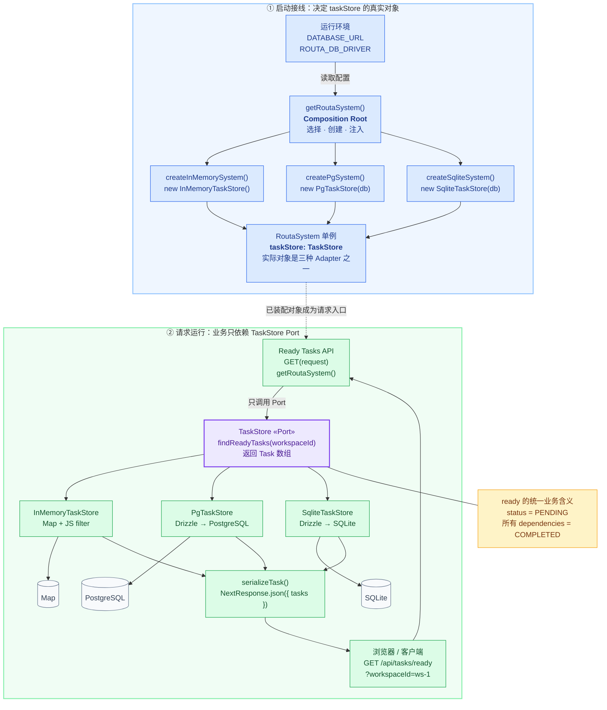

# Routa Phase 1 设计拆解：Store 接口 + InMemory 参考实现

> **本文定位**：教学设计 / 解剖笔记，不是数据库 API 手册。目标是解释 Phase 1 为什么要在领域模型和数据库之间加 Store 端口，以及 InMemory 实现为什么既是参考实现、又是测试替身。
>
> 阅读顺序沿用 Phase 0：**业务痛点 → 如果不管会怎样腐烂 → 当前设计怎么堵 → Before / After → 权衡与边界**。每个问题尽量自闭环。
>
> 为避免把教学演示误认成项目历史，全文代码分四类标记：**真实代码摘录**（可按 `file:line` 回查）、**基于真实代码的简化**（省略无关字段）、**假设反例**（说明没有该设计时会怎样，非 Routa 历史代码）、**目标建议**（用于说明更强契约，未必已在当前代码落地）。

## 目录

- [「你在这里」锚点](#anchor-here)
- [总体业务场景](#anchor-scene)
  - [完整对象依赖图](#anchor-object-map)
  - [为什么系统要长成这个形状](#anchor-philosophy)
- [问题 1：业务代码为什么不能直接操作数据库](#anchor-q1)
- [问题 2：Store 为什么不能只有通用 CRUD](#anchor-q2)
- [问题 3：InMemory 为什么不只是测试假货](#anchor-q3)
- [问题 4：换数据库时，什么不变、什么会变](#anchor-q4)
- [问题 5：接口相同，行为就一定相同吗](#anchor-q5)
- [四个可迁移模式](#anchor-patterns)
- [Phase 1 如何交棒给 Phase 2](#anchor-next)
- [一句话带走](#anchor-takeaway)

---

## 「你在这里」锚点 {#anchor-here}

```text
Routa 全局施工图：

  models/ ──→ store/ ──→ worker/ ──→ acp/ ──→ kanban/ ──→ api/ ──→ app/
     ↑           ↑          ↑
  Phase 0     Phase 1    Phase 2
  领域词汇    数据端口    运行策略

上一课 Phase 0：Task / Agent / BackgroundTask 是什么、怎样合法创建。
这一课 Phase 1：业务需要怎样保存、查找、筛选这些对象，而不绑定某种数据库。
下一课 Phase 2：Worker 怎样使用 Store 提供的事实做调度和生命周期推进。
```

**Phase 1 只解决一个核心矛盾：业务需要数据，但业务不应该被某种数据技术绑死。**

Phase 0 已经定义了 `Task`、`Agent`、`BackgroundTask` 等领域对象。现在用户创建一张 Task card，系统必须把它保存起来；Worker 要找出可以启动的任务；Kanban 要更新任务状态。问题是，这些调用方究竟应该面对什么：`Map`、SQL、Drizzle，还是“保存 Task”“找出就绪 Task”这样的领域能力？

Routa 的答案是 Store：

```text
业务调用方                         Store 端口                   外部实现

API / Worker / Tools / Kanban  →  TaskStore              ←  InMemoryTaskStore
                                  BackgroundTaskStore     ←  PgTaskStore
                                  AgentStore              ←  SqliteTaskStore
                                                          ←  Rust/SQLite 的独立实现
```

这里要先校准最后一行：TypeScript 的 InMemory、Postgres、SQLite 实现可以实现同一个 TypeScript Store 接口；Rust desktop 则是在另一种语言中独立重现相同产品语义，**不是**在实现 TypeScript interface。

Phase 1 的原始施工范围见 `docs/learning/koda-replication/BUILD_ORDER.md:79-116`。其中要求保留多种 Store 接口与 InMemory 参考实现，并把数据库实现挡在 Phase 1 骨架之外。本课不逐文件背诵所有 Store，而是用 `TaskStore` 与 `BackgroundTaskStore` 抓住五个根问题。

| 问题 | 如果不处理 | 当前堵法 |
|---|---|---|
| 1. 数据库耦合 | API、Worker、Tools 都知道 SQL/Drizzle，换存储要霰弹式修改 | Store interface 作为端口，组装根选择 adapter |
| 2. 只有通用 CRUD | “就绪任务”判断散落在调用方，各写一套过滤规则 | 用 `findReadyTasks()` / `listReadyToRun()` 表达领域查询 |
| 3. 接口只有签名 | 接口能编译，却看不出真实行为；测试还要 mock 每个方法 | InMemory 实现成为可执行参考与轻量测试替身 |
| 4. 实现差异泄漏 | 业务知道 Map、Drizzle、SQL row 和版本列 | adapter 在边界内完成持久化与模型映射 |
| 5. 同接口行为漂移 | 方法名相同，但排序、拷贝和并发语义不同 | 实现测试 / 契约测试补足类型系统的盲区 |

---

## 总体业务场景：一张 Task 从创建到被 Worker 选中 {#anchor-scene}

用一条真实链路把 Phase 1 放回业务现场。

### 先看完整画面：对象如何组装，又如何被请求使用 {#anchor-object-map}

下面这张就是 **Routa Task Store 的完整对象依赖图**。先不拆概念，只看所有对象怎样站位、怎样连接。

```text
┌──────────────────────────────────────────────────────────────────────────────┐
│                         Routa Task 数据访问全景图                             │
└──────────────────────────────────────────────────────────────────────────────┘


【1. 应用启动：选择并组装对象】

                         环境配置
                            │
                            ▼
                 getDatabaseDriver()
                            │
                            ▼
              ┌────── getRoutaSystem() ──────┐
              │       Composition Root       │
              │          组装根入口           │
              └─────────────┬────────────────┘
                            │ 根据 driver 选择
            ┌───────────────┼────────────────┐
            │               │                │
            ▼               ▼                ▼
 createInMemorySystem() createPgSystem() createSqliteSystem()
            │               │                │
            │               │                │
            ▼               ▼                ▼
  new InMemoryTaskStore() new PgTaskStore(db) new SqliteTaskStore(db)
            │               │                │
            └───────────────┼────────────────┘
                            │ 装入统一系统对象
                            ▼
               ┌─────────────────────────┐
               │       RoutaSystem       │
               │                         │
               │ taskStore: TaskStore ───┼─────────────┐
               │ agentStore: AgentStore  │             │
               │ tools: AgentTools       │             │
               │ eventBus: EventBus      │             │
               └─────────────────────────┘             │
                                                       │
                                                       ▼

【2. 稳定的业务端口】

                    ┌──────────────────────────────┐
                    │      TaskStore «Port»        │
                    │       业务定义的插座          │
                    │                              │
                    │ save(task)                   │
                    │ get(taskId)                  │
                    │ listByWorkspace(workspaceId) │
                    │ findReadyTasks(workspaceId)  │
                    │ updateStatus(taskId, status) │
                    │ delete(taskId)               │
                    └──────────────▲───────────────┘
                                   │
                                   │ implements
                    ┌──────────────┼──────────────┐
                    │              │              │
                    │              │              │

【3. 三种 Adapter：实现同一个 Port】

       ┌────────────┴───────┐ ┌────┴─────────────┐ ┌────┴──────────────┐
       │InMemoryTaskStore   │ │PgTaskStore       │ │SqliteTaskStore   │
       │«Adapter»           │ │«Adapter»         │ │«Adapter»         │
       │                    │ │                  │ │                  │
       │Task ↔ Map 数据     │ │Task ↔ PG row     │ │Task ↔ SQLite row│
       │filter/every        │ │Drizzle query     │ │Drizzle query    │
       └──────────┬─────────┘ └────────┬─────────┘ └─────────┬────────┘
                  │                    │                     │
                  │ 使用               │ 使用                │ 使用
                  ▼                    ▼                     ▼

【4. 底层存储技术】

       ┌────────────────────┐ ┌──────────────────┐ ┌──────────────────┐
       │Map<string, Task>   │ │Drizzle ORM       │ │Drizzle ORM      │
       │                    │ │       │          │ │       │         │
       │进程内数据           │ │       ▼          │ │       ▼         │
       │不持久化             │ │PostgreSQL / Neon │ │SQLite           │
       └────────────────────┘ └──────────────────┘ └──────────────────┘


【5. 运行时业务调用链】

用户请求
GET /api/tasks/ready?workspaceId=ws-1
        │
        ▼
┌──────────────────────────────┐
│ Ready Tasks API              │
│ route.ts                     │
│                              │
│ const system =               │
│   getRoutaSystem();          │
└──────────────┬───────────────┘
               │
               │ 只通过 Port 调用
               ▼
┌────────────────────────────────────────────────────┐
│ system.taskStore.findReadyTasks("ws-1")           │
│                                                    │
│ API 只知道 taskStore 是 TaskStore                  │
│ 不知道当前对象是哪一种具体实现                     │
└────────────────────────┬───────────────────────────┘
                         │
                         │ 实际对象由组装根提前决定
          ┌──────────────┼──────────────────┐
          │              │                  │
          ▼              ▼                  ▼
 InMemoryTaskStore   PgTaskStore       SqliteTaskStore
          │              │                  │
          ▼              ▼                  ▼
 读取 Map 中 Task    查询 PostgreSQL     查询 SQLite
          │              │                  │
          │              ▼                  ▼
          │        PG row → Task      SQLite row → Task
          │              │                  │
          └──────────────┼──────────────────┘
                         │
                         ▼
              筛选 ready task：
              ① Task 是 PENDING
              ② 所有依赖都是 COMPLETED
                         │
                         ▼
                      Task[]
                         │
                         ▼
                  API 序列化为 JSON
                         │
                         ▼
                    返回给用户
```

这张单色图已经可以独立阅读。支持 Mermaid 的工具还可以继续看下面的彩色双泳道版；两张图表达同一组对象关系，Mermaid 只增强空间分区与视觉扫描。



- **蓝色**：启动时的构造与组装关系。
- **紫色虚线**：已装配对象从启动阶段进入请求阶段。
- **绿色**：一次请求的真实调用方向。
- **黄色**：不同 Adapter 必须保持一致的业务语义。

先把整张图压成一句话：**上半区决定“插哪个插头”，下半区只负责“通过插座使用它”；API 永远调用 `TaskStore`，Composition Root 决定它背后实际站着 InMemory、Postgres 还是 SQLite Adapter。**

### 为什么系统要长成这个形状：把变化关进笼子 {#anchor-philosophy}

只看对象图，容易把 Port、Adapter、Composition Root 误解成一套代码排版习惯。它们真正共同回答的是一个架构母问题：

> **当存储技术、运行环境或实现行为发生变化时，哪些代码必须跟着改？怎样让变化只砸在少数可预期的位置，而不扩散到 API、Worker、Tools 和 Kanban？**

这也是判断架构设计是否值得的根问题：不是“用了几个模式”，而是**它把哪类变化挡在了哪道边界之外，变化来临时改动面缩小了多少**。

#### 为什么 Routa 真的需要这道边界

这里不是因为某本架构书说“应该面向接口”，而是 Routa 已经出现了足够强的变化证据：

| 真实压力 | 如果没有边界会怎样扩散 |
|---|---|
| 同时存在 InMemory、Postgres、SQLite 三种 TypeScript Store 实现 | API、Worker、Tools 需要知道不同连接、查询和 row 映射 |
| Web 使用 Postgres，桌面和本地开发使用 SQLite，不带数据库时还要能用 InMemory | 部署环境判断会渗入每一个业务入口 |
| API、Worker、Tools、Kanban 共同读写 Task | 同一条数据库变化会在多个调用方重复修改 |
| 测试需要快速、隔离地验证任务行为 | 每个测试都要启动数据库或手写只会返回预设值的 mock |
| 不同实现已经出现排序、对象引用、并发能力等行为差异 | 只有相同方法签名，业务仍可能在切换实现后悄悄变义 |

所以，抽象不是从想象中的“未来也许会换库”推出来的；**多个调用方、多个实现、多个运行表面已经真实存在**。抽象成本是现在付一次，不隔离的成本则会在每次变化时由所有调用方重复支付。

#### 从压力到结构：因为 → 所以 → 否则

```text
因为：Task、workspace、ready 等业务语义比数据库驱动、ORM 和表结构更稳定
所以：由业务定义 TaskStore Port，只描述“需要什么能力”
否则：SQL、Drizzle、row 和 connection 会成为业务词汇

因为：同一个业务能力需要落到 Map、Postgres、SQLite
所以：每种技术各写一个 Adapter，负责模型与存储表示之间的翻译
否则：每个调用方都要理解三套技术细节与映射规则

因为：选择数据库是部署决策，不是每次业务请求的职责
所以：Composition Root 在系统启动边界集中选择、创建并注入 Adapter
否则：API 会一边处理业务，一边判断环境并 new 具体 Store

因为：interface 只能证明方法存在，不能证明排序、缺失、复制和并发语义一致
所以：用 InMemory 提供可执行行为样本，再用实现测试和 Contract Test 钉住必要语义
否则：多个 Adapter 会“长得一样”，却在运行时表现不同
```

这四步分别形成四道边界：

```text
TaskStore Port       = 笼子的栅栏：业务规定外部必须提供什么
Adapter              = 差异的居住区：技术细节只允许活在这里
Composition Root     = 笼子的门：具体实现只允许在这里被选择
Behavior Contract    = 笼子的巡检：实现不能悄悄改变业务承诺
```

#### 五镜头验收：设计动机怎样落到代码结构

前面的架构哲学说明“为什么要这样设计”；五个镜头不是另一套哲学，而是验收工具——检查这些动机有没有真正变成能限制变化传播的代码结构。

这里不要先背“分、稳、向、约、权”的定义。每一格都先指回上面的对象图：**先看见具体对象和依赖箭头，再理解为什么这样摆，最后看它挡住了哪类变化。**

| 镜头 | 先看图里的具体事实 | 为什么这样设计 | 挡住什么变化 |
|---|---|---|---|
| **分** | `TaskStore` 定义数据能力；三个 Adapter 负责 Map/SQL；`getRoutaSystem()` 选择实现；Worker 负责调度 | 数据能力、技术翻译、对象组装、运行策略不是同一种职责，不应塞进同一个模块 | 换数据库时，不会连 Worker 的并发和调度逻辑一起修改 |
| **稳** | API 始终调用 `taskStore.findReadyTasks(workspaceId)`，不管背后是 Map、Postgres 还是 SQLite | “哪些 Task 已经 ready”是相对稳定的业务问题，具体怎样查询更容易变化 | ORM、schema、查询方式和数据库驱动的变化被留在 Adapter 内 |
| **向** | API → `TaskStore`；`PgTaskStore implements TaskStore`；图中没有 API → `PgTaskStore` | 业务先规定自己需要什么，外部实现再满足这个要求，而不是让数据库 API 塑造业务代码 | 业务不会追着某个数据库的接口、row 形状和连接方式变化 |
| **约** | 三个 Adapter 都提供 `save/get/findReadyTasks`；测试继续检查 ready、排序和缺失语义 | 相同方法名只保证“能调用”，还必须明确调用后怎样表现 | 防止切换实现后出现“仍能编译，但排序、缺失或 ready 语义已经变了” |
| **权** | Routa 已有三个实现、多个调用方，以及 Web/Desktop 两种运行表面 | 多出的 Port、Adapter、装配和测试确实能减少重复修改，不是为想象中的未来预埋层次 | 如果只有一个局部 `Map` 和一个调用方，这套结构可能不值；这里防的是已经发生的多点变化 |

后面的五个问题不是五个零散知识点，而是在逐项验证这张仪表盘：问题 1 验证依赖方向，问题 2 验证 Port 的业务语言，问题 3 验证抽象如何获得可执行语义，问题 4 验证差异怎样被 Adapter 收住，问题 5 验证结构契约为什么还不够。

**元认知回看**：如果 Routa 只有一个调用方和一个永远不会替换的局部 `Map`，那么“稳、向、权”三格都缺少足够证据，这套完整抽象就未必成立。因此这里的判断依赖真实的多实现、多调用方和双运行表面，而不是“所有数据库访问都必须套 Repository”。五镜头负责验收结构，反向追问则负责防止我们把一次成立的判断误写成普遍教条。

#### 反向判断：什么时候不该照搬

同样的代码形状换个场景，结论可能相反。如果系统只是一个 500 行的一次性脚本，只有一个局部 `Map`、一个调用方，没有替换实现、隔离测试或长期演化需求，那么完整的 Store + Adapter + Composition Root 家族可能只是让代码空转。

判断是否值得，不看“有没有数据库”，而看两组成本：

```text
抽象成本：接口 + Adapter + 映射 + 组装 + 契约维护
                              对比
不抽象成本：每次技术变化 × 被波及的调用方数量 × 未来变化次数
```

Routa 选择这套结构，是因为右边的成本已经由真实代码证明会持续发生；如果右边接近零，就应该忍住不抽象。**会使用模式不等于会做架构判断，知道什么时候不用，才说明理解了背后的设计哲学。**

### 再沿一次真实请求下钻

用户创建一张 Task card。API 把输入转换成 Phase 0 定义的 `Task`，然后保存。稍后系统查询“哪些 Task 已经满足依赖，可以执行”。对于后台工作流，Worker 还要读取正在运行的任务数、读取可运行任务，并只启动空余槽位能容纳的那部分。

真实入口可以看到这种依赖方向：

```typescript
// 真实代码摘录：src/app/api/tasks/ready/route.ts:25-38
export async function GET(request: NextRequest) {
  const { searchParams } = request.nextUrl;
  const workspaceId = requireWorkspaceId(searchParams.get("workspaceId"));

  if (!workspaceId) {
    return NextResponse.json({ error: "workspaceId is required" }, { status: 400 });
  }

  const system = getRoutaSystem();
  const tasks = await system.taskStore.findReadyTasks(workspaceId);

  return NextResponse.json({
    tasks: await Promise.all(tasks.map((task) => serializeTask(task, system))),
  });
}
```

API 只说：**请 Store 给我这个 workspace 中已经 ready 的 Task。** 它没有写 SQL，也没有问当前是 Postgres、SQLite 还是内存模式。

Worker 也是同一种形状：

```typescript
// 基于真实代码的简化：src/core/background-worker/index.ts:73-111
const system = getRoutaSystem();
const running = await system.backgroundTaskStore.listRunning();

if (running.length >= MAX_CONCURRENT_TASKS) return;

const slotsAvailable = MAX_CONCURRENT_TASKS - running.length;
const readyTasks = await system.backgroundTaskStore.listReadyToRun();
const toDispatch = readyTasks.slice(0, slotsAvailable);

for (const task of toDispatch) {
  await this.dispatchTask(task);
}
```

这里有一道非常重要的分界线：

- Store 回答事实：哪些任务 `RUNNING`，哪些任务依赖已满足；
- Worker 制定策略：并发上限是 2，本轮启动几个。

因此 Phase 1 不是 Worker 的简化版。它只建立数据端口和参考语义；Phase 2 才消费这些能力做运行时决策。

---

## 问题 1：业务代码为什么不能直接操作数据库 {#anchor-q1}

> **本节验证的设计判断**：技术细节不应拥有业务依赖方向。数据库可以依赖业务定义的 `TaskStore` 契约，业务不应反过来依赖 Drizzle、schema 或某个具体数据库。

### 业务场景：同一份 Task 数据被多个模块使用

假设 API 创建 Task、Kanban 更新状态、Worker 查询就绪任务时，都直接操作 Postgres。短期看起来少了一层接口，长期却会让每个业务模块都知道：

- 表叫什么；
- 字段怎样映射；
- JSON 字段怎样序列化；
- 使用哪一个 ORM；
- 查询返回的是 row 还是领域对象；
- 测试时怎样启动或 mock 数据库。

### 如果不管它：数据库知识向业务层扩散

```typescript
// ❌ 假设反例（非 Routa 历史代码）
// API / Worker 直接依赖 Drizzle schema
import { db } from "@/core/db";
import { tasks } from "@/core/db/schema";
import { and, eq } from "drizzle-orm";

const rows = await db
  .select()
  .from(tasks)
  .where(and(
    eq(tasks.workspaceId, workspaceId),
    eq(tasks.status, "PENDING"),
  ));

// 调用方继续自己判断 dependencies 是否全部完成……
```

这段代码真正的问题不是 SQL 不优雅，而是**变化传播方向反了**。数据库本来是外部实现细节，现在业务模块却依赖了数据库 schema 和 ORM。换 SQLite、调整表映射或改查询实现时，API、Worker、Tools 都可能跟着改。

### 堵法：Store interface 只暴露领域能力

Routa 的 `TaskStore` 真实接口是：

```typescript
// 真实代码摘录：src/core/store/task-store.ts:10-20
export interface TaskStore {
  save(task: Task): Promise<void>;
  get(taskId: string): Promise<Task | undefined>;
  listByWorkspace(workspaceId: string): Promise<Task[]>;
  listByStatus(workspaceId: string, status: TaskStatus): Promise<Task[]>;
  listByAssignee(agentId: string): Promise<Task[]>;
  findReadyTasks(workspaceId: string): Promise<Task[]>;
  updateStatus(taskId: string, status: TaskStatus): Promise<void>;
  delete(taskId: string): Promise<void>;
  deleteByWorkspace(workspaceId: string): Promise<number>;
}
```

注意它的词汇：`Task`、`TaskStatus`、`workspaceId`、`assignee`、`ready tasks`。接口没有暴露：

- SQL 字符串；
- Drizzle 的 query builder；
- 数据库 row；
- Postgres connection；
- SQLite transaction handle。

这就是六边形架构里的 **Port（端口）**：它描述内层业务需要外界提供什么能力，而不是规定外界必须用什么技术完成。

### 谁选择具体实现：组装根，而不是业务调用方

`RoutaSystem` 对外保存的是接口类型：

```typescript
// 真实代码摘录：src/core/routa-system.ts:38-55
export interface RoutaSystem {
  agentStore: AgentStore;
  conversationStore: ConversationStore;
  taskStore: TaskStore;
  noteStore: NoteStore;
  workspaceStore: WorkspaceStore;
  codebaseStore: CodebaseStore;
  worktreeStore: WorktreeStore;
  backgroundTaskStore: BackgroundTaskStore;
  scheduleStore: ScheduleStore;
  workflowRunStore: WorkflowRunStore;
  kanbanBoardStore: KanbanBoardStore;
  artifactStore: ArtifactStore;
  permissionStore: PermissionStore;
  eventBus: EventBus;
  // ...
}
```

但创建系统时，组装函数决定注入哪一个 adapter：

```typescript
// 基于真实代码的简化：src/core/routa-system.ts:70-81
export function createInMemorySystem(): RoutaSystem {
  const agentStore = new InMemoryAgentStore();
  const taskStore = new InMemoryTaskStore();
  const backgroundTaskStore = new InMemoryBackgroundTaskStore();
  // ...组装 tools 和其他依赖
}
```

```typescript
// 基于真实代码的简化：src/core/routa-system.ts:131-157
export function createPgSystem(): RoutaSystem {
  const db = getPostgresDatabase();
  const agentStore = new PgAgentStore(db);
  const taskStore = new PgTaskStore(db);
  const backgroundTaskStore = new PgBackgroundTaskStore(db);
  // ...
}
```

```typescript
// 基于真实代码的简化：src/core/routa-system.ts:212-267
export function createSqliteSystem(): RoutaSystem {
  const db = getSqliteDatabase();
  const agentStore = new SqliteAgentStore(db);
  const taskStore = new SqliteTaskStore(db);
  const backgroundTaskStore = new SqliteBackgroundTaskStore(db);
  // ...
}
```

业务拿到的始终是 `system.taskStore`。只有 composition root 知道它背后究竟是 Map、Postgres 还是 SQLite。

### Before / After：变化面缩在哪里

```text
❌ 之前（假设反例）

API ───────→ Drizzle/Postgres
Worker ────→ Drizzle/Postgres
Tools ─────→ Drizzle/Postgres
Kanban ────→ Drizzle/Postgres

换数据库：多个业务模块一起改。
```

```text
✅ 之后（当前模式）

API ─────┐
Worker ──┼──→ TaskStore ←── InMemoryTaskStore
Tools ───┤              ←── PgTaskStore
Kanban ──┘              ←── SqliteTaskStore

换实现：主要改 adapter 与组装根；业务继续调用同一端口。
```

这里的收益不是“换数据库永远只改一行”。schema、迁移、adapter 和组装仍然要改；真正被挡住的是数据库技术向业务调用方的传播。

### 五镜头判断

**分** — Store port 定义业务需要的数据能力；adapter 负责 Map/SQL 与领域模型的转换；组装根负责选择实现。

**稳** — `TaskStore` 的领域操作相对稳定，数据库驱动和表结构是更易变化的部分。稳定接口留在内侧，变化实现留在外侧。

**向** — `PgTaskStore implements TaskStore`（`src/core/db/pg-task-store.ts:13-16`），依赖从数据库 adapter 指向 Store 契约；调用方同样依赖 Store 契约，而不是反向依赖某个 adapter。

**约** — TypeScript 会检查 adapter 是否提供接口列出的全部方法及签名，但不会自动检查排序、事务和对象拷贝等行为。

**权** — 多了一层 interface、adapter 和组装代码。只有一个局部 Map、没有替换需求的微型模块未必值得建完整 Repository；但当同一领域能力被 API、Worker、Tools 共同消费，且有多种持久化后端时，这层边界的收益很高。

**一句话带走**：Store 是业务面向数据世界的插座；业务规定插座形状，Map、Postgres、SQLite 各自提供插头。

---

## 问题 2：Store 为什么不能只有通用 CRUD {#anchor-q2}

> **本节验证的设计判断**：Port 应表达调用方反复需要的稳定业务问题，而不是照搬数据库的增删改查；否则抽象只是给 SQL 换了名字，并没有收住业务语义。

### 业务场景：Worker 不是要“全部任务”，而是要“现在能跑的任务”

后台任务 A、B、C 组成依赖链：C 只有在 A、B 都完成之后才能启动。Worker 每轮轮询时真正想问的是：

> 当前有哪些 PENDING task，其所有依赖都已经 COMPLETED？

如果 Store 只有 `listAll()`，每个调用方就要自己取出全量数据，再复制一套“就绪”判断。

### 如果不管它：领域规则散落在调用方

```typescript
// ❌ 假设反例（非 Routa 历史代码）
const tasks = await store.listAll();
const ready = tasks.filter((task) => {
  if (task.status !== "PENDING") return false;
  return task.dependsOnTaskIds.every((id) => {
    const dependency = tasks.find((candidate) => candidate.id === id);
    return dependency?.status === "COMPLETED";
  });
});
```

随后 API 写一份、Worker 写一份、Workflow Executor 再写一份。某处把 `FAILED` 也当完成，某处漏掉不存在的 dependency，规则就会静默分叉。

### 堵法：接口直接说领域语言

`TaskStore` 不是只有通用 CRUD，它暴露 `findReadyTasks(workspaceId)`（`src/core/store/task-store.ts:16`）。`BackgroundTaskStore` 则进一步提供了 Worker 所需的运行态查询：

```typescript
// 真实代码摘录：src/core/store/background-task-store.ts:20-27,65-77
/** List all PENDING tasks across all workspaces (used by the worker). */
listPending(): Promise<BackgroundTask[]>;

/** List all RUNNING tasks with resultSessionId (for completion checking). */
listRunning(): Promise<BackgroundTask[]>;

/** List orphaned tasks: RUNNING but no resultSessionId and startedAt > threshold. */
listOrphaned(thresholdMinutes?: number): Promise<BackgroundTask[]>;

/** List all tasks belonging to a workflow run. */
listByWorkflowRunId(workflowRunId: string): Promise<BackgroundTask[]>;

/** List PENDING tasks whose dependencies are all COMPLETED. */
listReadyToRun(): Promise<BackgroundTask[]>;

/** Update task output (for chaining to dependent tasks). */
updateTaskOutput(taskId: string, output: string): Promise<void>;
```

这些方法不是数据库术语，而是调用方真正需要的问题：pending、running、orphaned、ready、workflow run。

### 真实算法 1：Task 的依赖就绪

```typescript
// 真实代码摘录：src/core/store/task-store.ts:55-65
async findReadyTasks(workspaceId: string): Promise<Task[]> {
  const allTasks = await this.listByWorkspace(workspaceId);
  return allTasks.filter((task) => {
    if (task.status !== TaskStatus.PENDING) return false;
    // Check all dependencies are completed
    return task.dependencies.every((depId) => {
      const dep = this.tasks.get(depId);
      return dep && dep.status === TaskStatus.COMPLETED;
    });
  });
}
```

它定义了三个语义：

1. 只有 `PENDING` Task 才可能 ready；
2. `dependencies` 为空时，`every(...)` 对空数组返回 true，所以立即 ready；
3. 依赖不存在或不是 `COMPLETED` 时，不 ready。

### 真实算法 2：BackgroundTask 的依赖就绪与调度顺序

```typescript
// 真实代码摘录：src/core/store/background-task-store.ts:218-235
async listReadyToRun(): Promise<BackgroundTask[]> {
  const priorityOrder = { HIGH: 0, NORMAL: 1, LOW: 2 };
  return Array.from(this.tasks.values())
    .filter((t) => {
      if (t.status !== "PENDING") return false;
      if (!t.dependsOnTaskIds || t.dependsOnTaskIds.length === 0) return true;
      return t.dependsOnTaskIds.every((depId) => {
        const dep = this.tasks.get(depId);
        return dep && dep.status === "COMPLETED";
      });
    })
    .sort((a, b) => {
      const priorityDiff = priorityOrder[a.priority] - priorityOrder[b.priority];
      if (priorityDiff !== 0) return priorityDiff;
      return a.createdAt.getTime() - b.createdAt.getTime();
    });
}
```

除了就绪判断，它还定义了选择顺序：

```text
HIGH → NORMAL → LOW
同优先级：createdAt 更早的先返回
```

Worker 在 `src/core/background-worker/index.ts:95-110` 直接消费这个顺序，然后按可用槽位 `slice(0, slotsAvailable)`。因此排序不是无关紧要的 UI 展示，而会影响哪个任务先启动。

### 真实测试把哪些语义钉住了

`src/core/workflows/__tests__/task-dependency.test.ts:36-138` 验证：

- 无依赖任务会返回；
- PENDING / RUNNING 依赖会阻塞；
- 全部依赖 COMPLETED 后才返回；
- 多依赖必须全部完成；
- 只返回 PENDING，不返回 RUNNING、COMPLETED、CANCELLED、FAILED；
- HIGH、NORMAL、LOW 按优先级返回（`task-dependency.test.ts:96-106`）。

这说明 `listReadyToRun()` 不是一个随手写的过滤 helper，而是一条可执行的调度前置契约。

### 这算不算把业务逻辑塞进 Repository？

算一部分，但要分清层级。

- “任务完成后唤醒谁”“并发上限是多少”“怎样启动 ACP session”是运行策略，属于 Worker/Orchestrator；
- “按当前持久化事实，哪些任务的依赖已完成”是数据查询语义，Store 可以提供；
- 如果就绪规则继续膨胀成复杂政策，例如额度、时间窗、角色许可和外部服务状态混在一起，就不应继续塞进 Store，而应由独立领域服务组合多个端口。

当前实现选择让 Store 持有就绪查询，是因为它掌握完整任务集合，能避免每个调用方重复扫描和解释依赖状态。但这不是“所有业务规则都应该下沉数据库”的许可证。

### Before / After

| 之前：只有 `listAll()` | 之后：领域查询 |
|---|---|
| 调用方自己筛 PENDING | Store 统一筛选 |
| 调用方自己解释依赖状态 | `findReadyTasks` / `listReadyToRun` 给出统一答案 |
| 排序规则散落 | BackgroundTask ready 查询集中优先级顺序 |
| 每个调用方各写测试 | 端口实现测试可复用同一契约 |

**一句话带走**：好的 Store 不只会“把表倒出来”，还会用领域语言回答调用方稳定、重复的数据问题。

---

## 问题 3：InMemory 为什么不只是测试假货 {#anchor-q3}

> **本节验证的设计判断**：抽象如果只有接口签名，就只有结构、没有可观察行为；InMemory 参考实现让 Port 先成为一份可运行的说明书，再成为测试和其他 Adapter 的校准样本。

### 常见误解：interface 才是设计，Map 实现只是临时 mock

如果只有：

```typescript
interface TaskStore {
  save(task: Task): Promise<void>;
  get(taskId: string): Promise<Task | undefined>;
}
```

我们只知道方法能被调用，却不知道：

- `save` 是 insert 还是 upsert；
- 找不到返回 `undefined` 还是抛错；
- 返回对象是否与内部对象共享引用；
- list 按什么顺序；
- update 不存在的 ID 怎么处理；
- “ready”到底怎样判断。

接口签名是一份**结构契约**，InMemory 实现让它成为一份**可运行的行为样本**。

### 角色 1：最短路径的可执行参考实现

```typescript
// 真实代码摘录：src/core/store/task-store.ts:22-38
export class InMemoryTaskStore implements TaskStore {
  private tasks = new Map<string, Task>();

  async save(task: Task): Promise<void> {
    this.tasks.set(task.id, { ...stripSpeculativeKanbanTaskAdaptiveSnapshot(task) });
  }

  async get(taskId: string): Promise<Task | undefined> {
    const task = this.tasks.get(taskId);
    return task ? this.hydrateTask(task) : undefined;
  }

  async listByWorkspace(workspaceId: string): Promise<Task[]> {
    return Array.from(this.tasks.values())
      .filter((t) => t.workspaceId === workspaceId)
      .map((task) => this.hydrateTask(task));
  }
}
```

这几行已经回答了一组行为问题：

- 同 ID 再次 `save` 会覆盖 Map 中旧值，因此是内存 upsert；
- `get` 找不到返回 `undefined`；
- `save` 和 `get` 对顶层对象做了浅复制；
- Task 读取时会补齐 comments 兼容形状，并剥离 speculative adaptive snapshot（`task-store.ts:89-94`）。

但“浅复制”三个字不能被夸大成完整值隔离。`{ ...task }` 只复制顶层对象，`labels`、`dependencies`、`comments` 等嵌套数组/对象仍可能共享引用，除非后续 helper 另行重建。因此当前实现不是 immutable store，也不是 deep-clone 边界。

### 角色 2：不依赖数据库的完整系统运行模式

`createInMemorySystem()` 不是只在某个单测里 new 一个 Store。它会组装整套系统：

```typescript
// 基于真实代码的简化：src/core/routa-system.ts:70-92
export function createInMemorySystem(): RoutaSystem {
  const agentStore = new InMemoryAgentStore();
  const conversationStore = new InMemoryConversationStore();
  const taskStore = new InMemoryTaskStore();
  const workspaceStore = new InMemoryWorkspaceStore();
  const backgroundTaskStore = new InMemoryBackgroundTaskStore();
  const scheduleStore = new InMemoryScheduleStore();
  const workflowRunStore = new InMemoryWorkflowRunStore();
  const kanbanBoardStore = new InMemoryKanbanBoardStore();
  const artifactStore = new InMemoryArtifactStore();

  const eventBus = new EventBus();
  const tools = new AgentTools(agentStore, conversationStore, taskStore, eventBus);
  // ...
}
```

返回值明确标记 `isPersistent: false`（`src/core/routa-system.ts:103-124`）。也就是说，InMemory 是一档真实运行模式，但系统诚实承认它不持久化。

### 角色 3：比逐方法 mock 更接近真实行为的测试替身

Workflow 依赖测试直接实例化真实 `InMemoryBackgroundTaskStore`：

```typescript
// 真实代码摘录：src/core/workflows/__tests__/task-dependency.test.ts:32-44
beforeEach(() => {
  store = new InMemoryBackgroundTaskStore();
});

it("should return tasks with no dependencies", async () => {
  const task = createTask({ id: "task-1", dependsOnTaskIds: [] });
  await store.save(task);

  const ready = await store.listReadyToRun();
  expect(ready).toHaveLength(1);
  expect(ready[0].id).toBe("task-1");
});
```

如果这里换成：

```typescript
// ❌ 假设反例（非 Routa 当前测试）
const store = {
  listReadyToRun: vi.fn().mockResolvedValue([task]),
};
```

测试只能证明调用方处理了 mock 返回值，无法证明依赖判断本身正确。InMemory 参考实现则能让测试走过真实的 save、filter、sort、update 路径。

### InMemory 的边界：它不是小型生产数据库

| 能力 | InMemory 可以提供 | InMemory 不能证明 |
|---|---|---|
| 接口完整性 | TypeScript 检查 `implements` | 生产 adapter 行为完全等价 |
| 基本 CRUD | Map 中真实执行 | DB constraint、migration、网络错误 |
| 领域筛选 | 真实 filter/sort | SQL 查询在大数据量下的性能 |
| 单进程测试 | 快、隔离、无需基础设施 | 多进程并发和跨请求持久化 |
| 顶层复制 | 部分实现有浅复制 | 深层对象不可变 |
| 失败语义 | 展示当前 no-op / undefined 选择 | 事务回滚、deadlock、连接中断 |

而且不同 InMemory Store 的复制纪律并不统一。比如：

```typescript
// 真实代码摘录：src/core/store/agent-store.ts:27-35
async get(agentId: string): Promise<Agent | undefined> {
  const agent = this.agents.get(agentId);
  return agent ? { ...agent } : undefined;
}

async listByWorkspace(workspaceId: string): Promise<Agent[]> {
  return Array.from(this.agents.values()).filter(
    (a) => a.workspaceId === workspaceId
  );
}
```

`get()` 返回顶层副本，`listByWorkspace()` 却直接返回 Map 中的 Agent 对象引用。调用者若修改 list 结果，可能直接改到 Store 内部状态。这个差异说明：不能从“InMemory Store”这个名字自动推出统一的值语义；需要测试明确约束，或接受它只是轻量参考实现。

### 还有一个必须诚实指出的边界漂移

Phase 1 的理想依赖图是 `store → models`，但当前 `TaskStore` 文件还 import 了 Kanban helper：

```typescript
// 真实代码摘录：src/core/store/task-store.ts:7-8
import { hydrateTaskComments, Task, TaskStatus } from "../models/task";
import { stripSpeculativeKanbanTaskAdaptiveSnapshot } from "../kanban/task-adaptive";
```

这意味着当前 `task-store.ts` 并非严格只依赖 Phase 0 模型；它还承担了剥离 speculative Kanban snapshot 的策略。Phase 1 教学骨架可以把“Store 端口只依赖模型”作为目标纪律，但解读 Routa 现状时不能假装这条边界已经完全纯净。

**一句话带走**：InMemory 是端口的第一份可执行说明书，但当前实现只有进程内 Map、无事务语义，也不自动拥有深拷贝和并发保证。

---

## 问题 4：换数据库时，什么不变、什么会变 {#anchor-q4}

> **本节验证的设计判断**：Adapter 不是让技术差异消失，而是给差异划定居住区；业务语义留在 Port 一侧，schema、row 映射、事务与数据库特性留在具体实现一侧。

### TypeScript 内：同一个端口，三种 adapter

以 Task 为例：

| 实现 | 位置 | 存储技术 | 与端口关系 |
|---|---|---|---|
| `InMemoryTaskStore` | `src/core/store/task-store.ts:22-95` | `Map<string, Task>` | `implements TaskStore` |
| `PgTaskStore` | `src/core/db/pg-task-store.ts:15-280` | Drizzle + Postgres | `implements TaskStore` |
| `SqliteTaskStore` | `src/core/db/sqlite-task-store.ts:11-287` | Drizzle + better-sqlite3 | `implements TaskStore` |

三者对业务共同提供 `save/get/list/findReady/update/delete`。但内部工作完全不同。

#### InMemory：领域对象直接放进 Map

```typescript
// 真实代码摘录：src/core/store/task-store.ts:22-31
private tasks = new Map<string, Task>();

async save(task: Task): Promise<void> {
  this.tasks.set(task.id, { ...stripSpeculativeKanbanTaskAdaptiveSnapshot(task) });
}

async get(taskId: string): Promise<Task | undefined> {
  const task = this.tasks.get(taskId);
  return task ? this.hydrateTask(task) : undefined;
}
```

#### Postgres：领域对象翻译成表字段，再从 row 还原

```typescript
// 基于真实代码的简化：src/core/db/pg-task-store.ts:18-77
async save(task: Task): Promise<void> {
  task = stripSpeculativeKanbanTaskAdaptiveSnapshot(task);
  const version = (task as Task & { version?: number }).version ?? 1;

  await this.db
    .insert(tasks)
    .values({
      id: task.id,
      title: task.title,
      status: task.status,
      labels: task.labels,
      dependencies: task.dependencies,
      workspaceId: task.workspaceId,
      version,
      createdAt: task.createdAt,
      updatedAt: task.updatedAt,
      // ...其余持久化字段
    })
    .onConflictDoUpdate({ /* ... */ });
}
```

真实 `toModel()` 位于 `pg-task-store.ts:218-279`，负责把 nullable row、JSON 字段和创建来源重新收敛为 `Task`。这些映射细节留在 adapter 内，API 和 Worker 不需要知道。

#### SQLite：接口相同，数据库 API 不同

```typescript
// 真实结构：src/core/db/sqlite-task-store.ts:11-17,129-143
export class SqliteTaskStore implements TaskStore {
  constructor(private db: SqliteDb) {}

  async save(task: Task): Promise<void> {
    // Drizzle SQLite upsert
  }

  async get(taskId: string): Promise<Task | undefined> {
    const rows = await this.db
      .select()
      .from(sqliteSchema.tasks)
      .where(eq(sqliteSchema.tasks.id, taskId))
      .limit(1);
    return rows[0] ? this.toModel(rows[0]) : undefined;
  }
}
```

### 什么不变

对通过 `TaskStore` 消费的调用方而言：

- 输入输出仍是 Phase 0 的 `Task` / `TaskStatus`；
- 找不到仍表示为 `undefined`；
- `findReadyTasks(workspaceId)` 仍表达同一个领域问题；
- API/Worker 不需要改成 Drizzle 或 rusqlite 调用。

### 什么会变

adapter 内部仍需处理：

- schema 与 migration；
- JSON / null / Date 的映射；
- upsert 语法；
- 数据库错误；
- 并发与事务；
- 查询性能和索引；
- 数据库特有能力。

因此端口不是“数据库差异消失器”，而是“数据库差异隔离带”。

### adapter 可以有端口之外的额外能力吗

当前答案是：可以存在，但不要误认成共享契约。

`PgTaskStore` 有 `atomicUpdate()`：

```typescript
// 真实代码摘录：src/core/db/pg-task-store.ts:195-216
async atomicUpdate(
  taskId: string,
  expectedVersion: number,
  updates: Partial<Pick<
    Task,
    "status" |
    "completionSummary" |
    "verificationVerdict" |
    "verificationReport" |
    "assignedTo"
  >>
): Promise<boolean> {
  const result = await this.db
    .update(tasks)
    .set({
      ...updates,
      version: sql`${tasks.version} + 1`,
      updatedAt: new Date(),
    })
    .where(and(eq(tasks.id, taskId), eq(tasks.version, expectedVersion)));

  const rowCount = (result as unknown as { rowCount?: number }).rowCount ?? 0;
  return rowCount > 0;
}
```

SQLite adapter 也有形状相近的 `atomicUpdate()`（`src/core/db/sqlite-task-store.ts:198-223`）。但 `TaskStore` interface 在 `task-store.ts:10-20` 没有这个方法，InMemory 也没有实现它。

所以：

```text
TaskStore 类型的调用方 → 不能依赖 atomicUpdate
PgTaskStore 类型的调用方 → 可以调用，但会绑定具体 adapter
```

如果 optimistic locking 是所有业务路径必须依赖的领域能力，目标设计应把它提升为共享端口能力，并为每种实现定义语义；如果它只是持久化 adapter 的局部优化，则可以留在具体类中。当前代码处在“具体 adapter 有能力、主端口未承诺”的状态。

### Rust desktop：共享语义，不共享 TypeScript interface

Rust 端定义的是具体 struct：

```rust
// 真实代码摘录：crates/routa-core/src/store/task_store.rs:12-23
#[derive(Clone)]
pub struct TaskStore {
    db: Database,
}

impl TaskStore {
    pub fn new(db: Database) -> Self {
        Self { db }
    }

    pub async fn save(&self, task: &Task) -> Result<(), ServerError> {
        // ...rusqlite persistence
    }
}
```

它的方法返回 Rust 的 `Result`：

```rust
// 基于真实代码的简化：task_store.rs:146-164
pub async fn get(&self, task_id: &str) -> Result<Option<Task>, ServerError> {
    // SELECT ... FROM tasks WHERE id = ?1
}
```

它也实现相近的 ready 语义：

```rust
// 真实代码摘录：task_store.rs:261-276
pub async fn find_ready_tasks(&self, workspace_id: &str) -> Result<Vec<Task>, ServerError> {
    let all_tasks = self.list_by_workspace(workspace_id).await?;
    let completed_ids: std::collections::HashSet<String> = all_tasks
        .iter()
        .filter(|t| t.status == TaskStatus::Completed)
        .map(|t| t.id.clone())
        .collect();

    Ok(all_tasks
        .into_iter()
        .filter(|t| {
            t.status == TaskStatus::Pending
                && t.dependencies.iter().all(|dep| completed_ids.contains(dep))
        })
        .collect())
}
```

这能说明两个后端在努力维持同一产品词汇和就绪规则，却不能写成“Rust TaskStore implements TypeScript TaskStore”。两种语言没有共享编译期接口；它们的对齐仍依赖同步设计、实现测试和 API contract tests 覆盖到的外部行为。

### Before / After：adapter 挡住了什么

| 没有 adapter 边界 | 有 Store + adapter |
|---|---|
| row/null/JSON 映射散在 API | 映射集中在 `toModel()` / `save()` |
| 业务 import Drizzle/rusqlite | 业务依赖 `TaskStore` |
| 换实现时业务一起改 | 主要修改 adapter 与组装根 |
| 数据库特性被当成全局能力 | 额外能力必须明确是否进入共享端口 |

**一句话带走**：Store 端口固定业务需要什么，adapter 吸收每种数据库怎样做到；跨语言只能共享语义，不能共享 TypeScript 类型检查。

---

## 问题 5：接口相同，行为就一定相同吗 {#anchor-q5}

> **本节验证的设计判断**：类型契约只能约束“能不能这样调用”，行为契约才约束“调用后必须怎样表现”；多 Adapter 架构的可靠性最终取决于必要语义是否被可执行测试钉住。

### 先给结论：不一定

TypeScript `implements TaskStore` 能证明：

- 方法存在；
- 参数类型兼容；
- 返回类型兼容。

它不能证明：

- list 的排序相同；
- save 的 upsert、时间戳和版本语义相同；
- get/list 返回副本还是共享引用；
- 更新不存在的 ID 是 no-op、false 还是 error；
- 并发更新是否会丢失；
- 事务边界是否相同。

### 真实对抗案例：同一个 list，三种排序契约

#### InMemory TypeScript

```typescript
// 真实代码摘录：src/core/store/task-store.ts:34-38
async listByWorkspace(workspaceId: string): Promise<Task[]> {
  return Array.from(this.tasks.values())
    .filter((t) => t.workspaceId === workspaceId)
    .map((task) => this.hydrateTask(task));
}
```

这里没有 `.sort(...)`。JavaScript `Map` 迭代保持插入顺序，所以当前结果随保存顺序返回。

#### Postgres TypeScript

```typescript
// 真实代码摘录：src/core/db/pg-task-store.ts:142-148
async listByWorkspace(workspaceId: string): Promise<Task[]> {
  const rows = await this.db
    .select()
    .from(tasks)
    .where(eq(tasks.workspaceId, workspaceId));
  return rows.map(this.toModel);
}
```

这里也没有显式 `ORDER BY`。关系数据库在没有排序子句时不承诺稳定顺序，不能把当前观察到的返回次序当成契约。

#### Rust SQLite

```rust
// 真实 SQL 摘录：crates/routa-core/src/store/task_store.rs:166-185
// ...
"... FROM tasks WHERE workspace_id = ?1 ORDER BY created_at DESC"
```

Rust 版本明确按 `created_at DESC` 返回。

三者的方法概念相似，排序却不同：

| 实现 | 当前顺序 |
|---|---|
| InMemory TypeScript | Map 插入顺序 |
| Postgres TypeScript | 未声明；数据库可自由返回 |
| Rust SQLite | createdAt 新到旧 |

所以“同名方法 + 相同返回类型”不是行为 parity。

### 真实对抗案例：对象身份也不统一

- `InMemoryTaskStore.get()` 通过 `hydrateTask()` 创建顶层新对象（`task-store.ts:29-31,89-94`）；
- `InMemoryAgentStore.get()` 返回顶层副本（`agent-store.ts:27-30`）；
- `InMemoryAgentStore.listByWorkspace()` 直接返回内部 Agent 引用（`agent-store.ts:32-36`）；
- 数据库 adapter 的 `toModel()` 每次从 row 构造新对象。

如果调用方依赖“修改查询结果不会影响 Store”，那么当前 InMemoryAgentStore 的 list 行为会违背这个隐含假设。接口本身没有表达对象身份语义。

### 真实对抗案例：不存在的记录如何更新

`InMemoryTaskStore.updateStatus()` 找不到 Task 时直接结束：

```typescript
// 真实代码摘录：src/core/store/task-store.ts:67-73
async updateStatus(taskId: string, status: TaskStatus): Promise<void> {
  const task = this.tasks.get(taskId);
  if (task) {
    task.status = status;
    task.updatedAt = new Date();
  }
}
```

Postgres 版本同样返回 `Promise<void>`，但 SQL update 影响 0 行时调用方也拿不到“没找到”的信号（`src/core/db/pg-task-store.ts:179-184`）。这里两者表面一致，却是因为端口选择了 no-result 契约；如果业务必须区分“更新成功”和“目标不存在”，方法就应返回 boolean/result，或抛出明确领域错误。

### 堵法：为端口写行为契约，而不只写接口

目标建议不是再加一层抽象，而是让同一组测试运行在每种实现上：

```typescript
// 目标建议（当前仓库未展示为统一 Store contract suite）
function taskStoreContract(createStore: () => Promise<TaskStore>) {
  it("returns undefined when task does not exist", async () => { /* ... */ });
  it("upserts by task id", async () => { /* ... */ });
  it("returns only tasks in the requested workspace", async () => { /* ... */ });
  it("uses the declared list ordering", async () => { /* ... */ });
  it("does not expose mutable internal references", async () => { /* ... */ });
  it("returns only pending tasks whose dependencies completed", async () => { /* ... */ });
}
```

每个 adapter 都跑同一份 suite：

```text
contract suite ──→ InMemoryTaskStore
               ├→ PgTaskStore
               └→ SqliteTaskStore
```

Rust 无法直接执行 TypeScript suite，因此还需要：

- Rust 实现测试固定内部语义；
- 共享 API contract tests 从 HTTP 边界分别请求 Web 与 desktop 后端；
- 只对测试实际覆盖到的行为作 parity 声明。

Phase 0 已经说明 `tests/api-contract/run.ts` 会分别测试 Next.js 与 Rust 后端。这里仍要重复同一条诚实边界：共享 API tests 能抓住已写进测试的外部差异，不能自动证明所有 Store 方法、排序、事务和字段映射完全等价。

### 哪些行为值得明确钉住

| 契约维度 | 要回答的问题 |
|---|---|
| 保存 | insert、upsert 还是重复 ID 报错？谁更新 `updatedAt`？ |
| 缺失 | get 返回 undefined，还是抛 NotFound？update/delete 呢？ |
| 筛选 | workspace/status/assignee 的边界是否一致？ |
| 排序 | 未声明、插入顺序、createdAt，还是 priority？ |
| 对象身份 | 返回内部引用、浅拷贝还是深拷贝？ |
| 就绪规则 | 空依赖、缺失依赖、失败依赖分别怎样处理？ |
| 并发 | 是否支持 version/CAS？冲突如何反馈？ |
| 持久化 | Date、JSON、undefined/null 如何往返？ |

不是每个 Store 都需要最强保证。关键是：**不保证的行为不要让调用方偷偷依赖；需要保证的行为必须写进可重复执行的测试。**

### 五镜头判断

**分** — interface 管结构；实现测试管单 adapter 行为；跨后端 API contract tests 管已覆盖的外部语义。三者不能互相替代。

**稳** — 一旦排序或缺失语义被声明，所有 adapter 都必须遵守；否则调用方不应依赖它。

**向** — 测试依赖端口契约并驱动每个 adapter；不让某个具体实现的偶然行为反过来成为无文档的全局规则。

**约** — 编译期契约挡方法漂移，行为 suite 挡语义漂移，API suite 挡语言边界上已覆盖的可观察漂移。

**权** — 契约越强，实现成本越高。例如承诺深拷贝、全局稳定排序和 optimistic locking，会让简单 InMemory adapter 也承担额外复杂度。只固定业务真正需要的保证。

**一句话带走**：接口保证“能这样调用”，契约测试才保证“调用之后会这样表现”。

---

## 四个可迁移模式 {#anchor-patterns}

学习 Phase 1 的目标不是记住十几个 Store 文件，而是以后看到相同变化形状时，能迅速选出正确边界。

### 模式 1：Repository / Store Port——隔离领域对象与持久化技术

#### 是什么

把“保存、查找、筛选领域对象”的能力定义成接口。业务依赖接口，数据库 adapter 实现接口。

生活类比：Store 是插座标准。电器只依赖插座电压和形状，不需要知道墙后是火电、水电还是太阳能。

#### Before / After

```typescript
// ❌ 假设反例：业务知道数据库技术
await db.select().from(tasks).where(eq(tasks.workspaceId, workspaceId));

// ✅ 当前模式：业务说领域语言
await system.taskStore.listByWorkspace(workspaceId);
```

#### Routa 怎么用

- Port：`src/core/store/task-store.ts:10-20`
- InMemory adapter：`task-store.ts:22-95`
- Postgres adapter：`src/core/db/pg-task-store.ts:15-280`
- SQLite adapter：`src/core/db/sqlite-task-store.ts:11-287`
- 组装根：`src/core/routa-system.ts:67-324`

#### 你以后怎么用

触发信号：

- 同一个领域实体被两个以上业务模块读写；
- 需要 InMemory + 生产数据库两档实现；
- 测试经常被数据库基础设施拖慢；
- ORM row 形状开始泄漏到业务层。

配方：

```text
1. 用领域词汇定义 Store interface；
2. 不在接口里暴露 ORM/connection/row；
3. 写最小 InMemory 实现跑通契约；
4. 写持久化 adapter 处理 schema 与模型映射；
5. 在 composition root 选择实现；
6. 用同一行为 suite 校验所有 adapter。
```

别过度：一个函数内部使用、没有替换和独立测试需求的临时 Map，不必先造 Repository 家族。

**一句话带走**：Repository 把“我要什么数据能力”和“数据库怎样做到”切开。

---

### 模式 2：依赖倒置——稳定业务不依赖易变实现

#### 是什么

高层策略和底层实现都依赖稳定抽象。不是“接口文件放在哪”就算依赖倒置，而是业务调用方不能 import 具体数据库 adapter。

#### Before / After

```text
❌ Worker → PgBackgroundTaskStore → Postgres
✅ Worker → BackgroundTaskStore ← PgBackgroundTaskStore
                            ← InMemoryBackgroundTaskStore
```

#### Routa 怎么用

Worker 通过 `getRoutaSystem()` 取得 `backgroundTaskStore`，调用 `listRunning()` 与 `listReadyToRun()`（`src/core/background-worker/index.ts:73-108`）。选择 Pg/InMemory/SQLite 的工作留给 `routa-system.ts`。

但边界不是绝对纯净：`src/core/store/task-store.ts:8` 仍依赖 `../kanban/task-adaptive`。这是一处当前实现与理想 Phase 边界之间的偏离，不能因为整体方向正确就忽略。

#### 你以后怎么用

判断箭头时问：

```text
□ 业务文件是否 import 具体数据库类？
□ interface 是否出现 ORM 类型？
□ 更换 adapter 时，业务调用方是否需要修改？
□ composition root 是否是唯一知道具体实现的地方？
```

别过度：依赖倒置不等于“每个 class 前都加 interface”。只有变化边界、替换点或重要测试缝值得抽象。

**一句话带走**：不是高层调用低层，而是高层与低层在稳定契约处会合。

---

### 模式 3：InMemory 参考实现——把抽象变成可执行样本

#### 是什么

用最简单的数据结构实现完整端口，让设计在接数据库前就能运行和测试。

#### Before / After

```typescript
// ❌ 只有接口：能编译，但行为仍悬空
interface TaskStore { save(...); get(...); }

// ✅ 接口 + Map：save/get/filter/update 可以真实执行
class InMemoryTaskStore implements TaskStore {
  private tasks = new Map<string, Task>();
  // ...
}
```

#### Routa 怎么用

- `createInMemorySystem()` 组装真实内存运行模式（`routa-system.ts:67-124`）；
- Workflow 测试通过真实 save/update/list 验证依赖就绪（`task-dependency.test.ts:32-150`）；
- Worker、Tools、Kanban 测试可以使用相同 Store，而不逐方法伪造返回值。

#### 你以后怎么用

适合：

- 领域逻辑测试；
- 本地 demo；
- 端口设计的第一份反馈；
- 无基础设施的快速运行模式。

不适合替代：

- migration / schema 测试；
- SQL 查询性能；
- 事务和锁；
- 跨进程并发；
- 数据库错误恢复。

尤其要明确复制语义：直接返回 Map 内对象、浅拷贝和深拷贝是三种不同契约。

**一句话带走**：InMemory 让接口能跑，但只能代表你明确实现并测试过的那部分数据库语义。

---

### 模式 4：Contract Test——让多个 adapter 不只“长得一样”

#### 是什么

对端口定义一组与具体实现无关的行为测试，然后让每个 adapter 都执行。

#### Before / After

```text
❌ implements 通过
   但 A 按插入顺序，B 无排序，C 按时间倒序

✅ 同一 contract suite
   明确并验证排序、缺失、更新、引用和依赖规则
```

#### Routa 当前状态

当前已有强针对性的 InMemory BackgroundTask 依赖测试（`src/core/workflows/__tests__/task-dependency.test.ts:36-167`），也有 SQLite store 测试，例如 `src/core/db/__tests__/sqlite-foundation-stores.test.ts:267` 验证 ready task。Phase 0 所述共享 API suite 还能从 HTTP 边界分别检查双后端已覆盖行为。

但从当前证据不能宣称所有 TypeScript Store adapter 都在跑同一份统一 contract suite，也不能宣称排序、对象引用等差异已经全部被约束。这里应把“统一 suite”视为可迁移的目标方法，而不是已完成事实。

#### 你以后怎么用

最小行为矩阵：

```text
save/get round-trip
missing get/update/delete
workspace/status filtering
ordering
upsert semantics
copy/reference semantics
domain query semantics
concurrent update semantics（只有业务需要时）
```

别过度：不要测试数据库内部用了哪条 SQL；测试端口承诺的可观察结果。否则 contract test 会反过来锁死 adapter 实现。

**一句话带走**：多个实现共享接口只是起点，共享可执行行为才是可替换性的证据。

---

## Phase 1 如何交棒给 Phase 2 {#anchor-next}

Phase 0、1、2 的职责可以压成三句话：

```text
Phase 0：Task / BackgroundTask 是什么，合法对象怎样创建。
Phase 1：当前保存了哪些对象，它们处于什么状态，哪些依赖已满足。
Phase 2：根据这些事实，本轮启动谁、允许同时跑几个、结束后怎样推进。
```

真实 Worker 已经展示这条接力：

```text
BackgroundTaskStore.listRunning()
        ↓
Worker 计算 MAX_CONCURRENT_TASKS - running.length
        ↓
BackgroundTaskStore.listReadyToRun()
        ↓
Worker slice 可用槽位并 dispatch
```

对应证据在 `src/core/background-worker/index.ts:75-111`。

这里有两条边界纪律：

1. Store 不决定 `MAX_CONCURRENT_TASKS = 2`；这是 Worker 策略（`background-worker/index.ts:25-26`）。
2. Worker 不重新解释依赖完成规则；它消费 `listReadyToRun()` 的答案（`background-worker/index.ts:95-108`）。

如果把并发上限塞进 Store，数据端口就会变成调度器；如果让 Worker 自己 `listAll + filter dependencies`，领域查询又会散回调用方。Phase 1 和 Phase 2 的接缝正好切在：

> Store 提供运行事实，Worker 根据事实制定运行策略。

---

## 一句话带走 {#anchor-takeaway}

> Phase 1 用 Store 把领域数据能力定义成稳定端口，用 InMemory 把端口变成可执行参考，再让 Postgres、SQLite 和 Rust desktop 各自翻译到本地存储技术；但接口只保证调用形状，排序、对象身份、缺失处理与并发等行为仍必须靠实现测试和跨后端 contract tests 明确约束。
