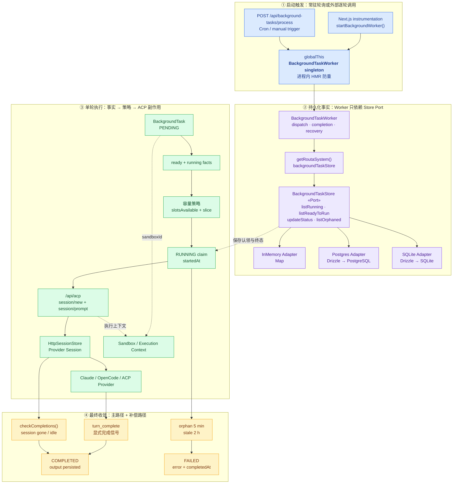

# Routa Phase 2 设计拆解：Task 生命周期 + BackgroundTaskWorker

> **本文定位**：教学设计 / 运行时解剖笔记，不是 BackgroundWorker API 手册。目标是解释一项异步工作怎样从“等待执行”推进到“运行、完成或失败”，以及 Store、Worker、ACP session 各自应该负责哪部分事实。
>
> 阅读顺序沿用 Phase 0/1：**业务痛点 → 如果不管会怎样腐烂 → 当前设计怎么堵 → Before / After → 权衡与边界**。每个问题尽量自闭环。
>
> 全文代码分四类标记：**真实代码摘录**（可按 `file:line` 回查）、**基于真实代码的简化**（省略无关字段）、**假设反例**（说明没有该设计时会怎样，非 Routa 历史代码）、**目标建议**（用于说明更强契约，未必已在当前代码落地）。

## 目录

- [「你在这里」锚点](#anchor-here)
- [总体业务场景](#anchor-scene)
  - [完整对象依赖图](#anchor-object-map)
  - [设计动机与设计哲学](#anchor-philosophy)
- [问题 1：为什么 Task 和 BackgroundTask 必须是两套生命周期](#anchor-q1)
- [问题 2：状态枚举为什么还不等于状态机](#anchor-q2)
- [问题 3：Worker 怎样选出这一轮该启动谁](#anchor-q3)
- [问题 4：为什么先标记 RUNNING，再创建 session](#anchor-q4)
- [问题 5：完成信号、轮询与恢复怎样共同维持生命周期](#anchor-q5)
- [四个可迁移模式](#anchor-patterns)
- [Phase 2 如何向 Phase 3/4 交棒](#anchor-next)
- [一句话带走](#anchor-takeaway)

---

## 「你在这里」锚点 {#anchor-here}

```text
Routa 全局施工图：

  models/ ──→ store/ ──→ worker/ ──→ acp/ ──→ workflows/ ──→ kanban/
     ↑           ↑          ↑           ↑           ↑
  Phase 0     Phase 1    Phase 2     Phase 3     Phase 4
  领域词汇    数据事实    运行策略     协议适配     流程编排
```

上一课 Phase 1 建立了 `BackgroundTaskStore`：它回答“现在有哪些任务、谁在运行、谁的依赖已满足”。

这一课 Phase 2 看三个真实模块：

- `src/core/models/background-task.ts`：异步执行作业的状态和数据；
- `src/core/background-worker/index.ts`：选择、派发、检查和恢复策略；
- `src/core/worker/`：不同执行环境的统一 Worker 抽象。

下一课 Phase 3 才深入 ACP provider 和 session 协议；Phase 4 才把多个后台任务组织成完整 Workflow。

**Phase 2 只解决一个核心矛盾：队列里保存的是静态事实，但系统必须持续做出动态决策，把事实安全地推进到下一状态。**

Phase 1 的交棒可以压成一句：

> Store 提供运行事实，Worker 根据事实制定运行策略。

但“制定策略”不是简单地遍历数组。Worker 至少要回答：

1. 这个对象是业务工作项，还是一次异步执行作业？
2. 当前状态允许执行什么动作？
3. 依赖已满足的任务中，本轮能启动几个？
4. 如何避免同一个任务被反复派发？
5. 进程重启、session 丢失或长时间无响应后，状态怎样收敛？

Phase 2 的原始施工范围见 `docs/learning/koda-replication/BUILD_ORDER.md:119-151`。其中列出了 `background-worker/`、`worker/`、`sandbox/` 等骨架，并要求 BackgroundWorker 通过 Store 而不是直接操作数据库。

这里先校准一处文档漂移：BUILD_ORDER 的验收项写的是 `ENQUEUED → IN_PROGRESS → COMPLETED`（`BUILD_ORDER.md:144-148`），但当前 `BackgroundTask` 的真实状态是：

```text
PENDING → RUNNING → COMPLETED | FAILED | CANCELLED
```

证据在 `src/core/models/background-task.ts:9-18`。本文以当前代码为事实源，不把旧验收词汇伪装成现状。

---

## 总体业务场景：用户关闭浏览器后，任务仍要继续 {#anchor-scene}

用户在 Routa 中提交一项后台工作，例如让 agent 在某个 workspace 中执行长任务。浏览器请求只负责创建 `BackgroundTask` 并保存；真正执行可能发生在几秒后，甚至由另一轮 cron 触发。

这就是 BackgroundTask 存在的业务原因：

> 用户请求的生命周期很短，agent 执行的生命周期可能很长，两者不能绑在同一条 HTTP 连接上。

### 先看完整画面：对象如何启动、协作与收敛 {#anchor-object-map}

下面这张是 **Routa BackgroundTask 运行时的完整对象依赖图**。它不只画“先做什么、后做什么”，还标出谁创建 Worker、谁持有 Store、谁实现 Port、谁发起外部副作用，以及完成信号和补偿路径怎样汇合。

```text
┌──────────────────────────────────────────────────────────────────────────────┐
│                    Routa BackgroundTask 运行时全景图                          │
└──────────────────────────────────────────────────────────────────────────────┘


【1. 运行时启动：决定由谁触发一轮处理】

  本地 Node.js 启动                         Serverless / Cron / 手动触发
          │                                           │
          ▼                                           ▼
 src/instrumentation.ts              POST /api/background-tasks/process
          │                                           │
          │ startBackgroundWorker()                   │ getBackgroundWorker()
          ▼                                           │
 ┌──────────────────────────┐                         │
 │ globalThis               │◄────────────────────────┘
 │                          │
 │ __routa_bg_worker__      │  进程内单例
 │ __routa_bg_worker_started│  HMR 启动标记
 └────────────┬─────────────┘
              │ 持有 / 返回
              ▼
 ┌──────────────────────────────────────────────────────────────┐
 │ BackgroundTaskWorker                                       │
 │                                                             │
 │ start() → dispatch timer(5s) + completion timer(15s)        │
 │ dispatchPending() / dispatchTask() / checkCompletions()     │
 └───────────────┬─────────────────────────────┬────────────────┘
                 │                             │
                 │ getRoutaSystem()            │ /api/acp
                 ▼                             ▼


【2. 稳定事实端口：Worker 不直接操作数据库】

 ┌─────────────────────────────┐       ┌──────────────────────────────┐
 │ RoutaSystem                 │       │ BackgroundTaskStore «Port»   │
 │                             │       │                              │
 │ backgroundTaskStore ────────┼──────►│ save/get                     │
 │ workflowRunStore            │       │ listRunning/listReadyToRun   │
 │ ...                         │       │ listOrphaned/updateStatus    │
 └─────────────────────────────┘       └──────────────▲───────────────┘
                                                     │ implements
                            ┌────────────────────────┼──────────────────────┐
                            │                        │                      │
                            ▼                        ▼                      ▼
              InMemoryBackgroundTaskStore  PgBackgroundTaskStore  SqliteBackgroundTaskStore
                            │                        │                      │
                            ▼                        ▼                      ▼
                  Map<string, BackgroundTask>   PostgreSQL              SQLite


【3. 入队：把短请求中的意图变成可恢复事实】

 用户 / Workflow / Webhook / Schedule
                    │
                    │ createBackgroundTask(input)
                    ▼
        BackgroundTask(status=PENDING)
                    │
                    │ backgroundTaskStore.save(task)
                    ▼
              持久化任务事实


【4. 一轮调度：Store 给事实，Worker 定策略】

 BackgroundTaskWorker.dispatchPending()
                    │
                    ├─ listRunning() ───────────────► 已占用多少槽位
                    ├─ MAX_CONCURRENT_TASKS - running.length
                    ├─ listReadyToRun() ────────────► PENDING 且依赖已完成
                    ├─ readyTasks.slice(0, slotsAvailable)
                    │
                    ▼
          dispatchTask(selectedTask)
                    │
                    │ updateStatus(RUNNING, startedAt)
                    ▼
       RUNNING（可能暂时没有 resultSessionId）


【5. 外部执行：从持久化作业到 ACP session】

 BackgroundTaskWorker
          │
          │ POST /api/acp  session/new
          ▼
 ┌────────────────────────────┐
 │ ACP Route / Runtime        │
 │ Provider Adapter           │
 │ HttpSessionStore           │
 └──────────────┬─────────────┘
                │ 创建具体 provider session
                ▼
       Claude / OpenCode / 其他 ACP Provider
                │
                │ sessionId
                ▼
 BackgroundTaskStore.updateStatus(RUNNING, resultSessionId)
                │
                └─ session/prompt（fire-and-forget）

 BackgroundTask.sandboxId ─────────► session/new ─────────► 执行环境 / Sandbox


【6. 状态收敛：正常信号、恢复巡检与时间上界】

                 ACP session 运行
                        │
          ┌─────────────┼──────────────────────────┐
          │             │                          │
          ▼             ▼                          ▼
 turn_complete      session 消失/空闲         长时间没有进展
          │             │                          │
          │             │ checkCompletions()       ├─ 无 session > 5 min
          │             │                          └─ RUNNING > 2 h
          ▼             ▼                          ▼
 HttpSessionStore   Worker reconciliation       Worker watchdog
          │             │                          │
          ├─────────────┴──────► COMPLETED          └──────────► FAILED
          │
          └─ updateTaskOutput() / workflow step output（best-effort）
```

先把整张图压成一句话：**启动入口只负责唤醒 Worker；Worker 通过 Store Port 读取可恢复事实、用调度策略认领任务、通过 ACP 创建外部执行，再让显式完成信号、恢复巡检和 watchdog 共同把状态收敛到终态。**

支持 Mermaid 的工具还可以看下面的分区版。它和上面的单色图表达同一组对象关系，只增强启动、事实、执行和恢复四个区域的视觉扫描。



图中的颜色只表达职责区域：

- **蓝色**：谁在什么运行环境中触发 Worker；
- **紫色**：可跨请求和重启保存的事实端口与 Adapter；
- **绿色**：一轮任务从 ready 到真实 provider session 的运行方向；
- **黄色**：事件丢失或执行悬挂后负责最终收敛的补偿机制。

### 为什么系统要长成这个形状：把失控的异步时间关进笼子 {#anchor-philosophy}

只看对象图，容易把 BackgroundTask、Worker 和几个 timer 理解成“后台轮询的代码写法”。它们真正共同回答的是一个更困难的架构母问题：

> **当异步执行跨越 HTTP 请求、进程生命周期和 ACP session 时，谁负责保存事实，谁负责制定策略，谁负责执行副作用，又怎样让中断后的任务最终收敛？**

Phase 1 的母问题主要是“变化来临时改多少代码”；Phase 2 在此基础上再加入时间和失败：**变化不仅来自替换实现，也来自事情没有按预期时间、顺序和次数发生。**

#### 为什么 Routa 真的需要后台生命周期边界

这不是因为“复杂系统都应该有 Worker”，而是当前代码已经出现了真实运行压力：

| 真实压力 | 如果没有边界会怎样失控 |
|---|---|
| HTTP 请求的寿命远短于 agent 执行 | 浏览器关闭、请求超时或服务重启会带走执行状态 |
| PENDING 任务具有依赖、优先级和容量约束 | 每个触发入口都要重新解释“谁现在可以运行” |
| 数据库写入与 `session/new` 无法放进同一事务 | 慢调用可能重复派发，崩溃可能留下无法解释的中间态 |
| HMR 和 Node 重启会丢失 `sessionToTask` Map | 已创建的 session 与持久化任务失去关联 |
| ACP 有显式 `turn_complete`，但事件处理仍可能中断 | 只依赖一次通知会让任务永久停在 RUNNING |
| 本地 interval 与 serverless process route 两种入口并存 | 部署触发机制会渗入调度和生命周期核心 |
| Local、Docker、Remote Worker 的能力和容量不同 | Scheduler 会写死具体进程、容器或远程协议 |
| 多个实例可能同时执行 dispatch cycle | 进程内 `MAX_CONCURRENT_TASKS = 2` 会被误当成全局强保证 |

所以 BackgroundTask 不是“把函数丢到后台”这么简单。它把短请求中的执行意图保存成可恢复事实；Worker 则把这个事实逐步推进，并负责偿还跨系统非原子操作产生的失败窗口。

#### 从压力到结构：因为 → 所以 → 否则

```text
因为：用户请求和 agent 执行具有不同生命周期
所以：把执行意图持久化成 BackgroundTask，由后台 Worker 推进
否则：请求断开就会带走执行状态

因为：Store 中保存的是事实，并发上限与本轮选择属于运行策略
所以：Store 提供 listRunning/listReadyToRun，Worker 计算槽位
否则：Store 会膨胀成 Scheduler，或 ready 规则散回各调用方

因为：数据库写入和 ACP session 创建无法放进同一事务
所以：先留下 RUNNING 认领事实，再创建 session，并设计补偿路径
否则：要么慢调用期间重复派发，要么崩溃后留下无法解释的状态

因为：事件、内存 Map 和进程都可能丢失
所以：显式 turn_complete 之外，再用数据库 reconciliation 恢复
否则：一次漏事件就可能让任务永久停在 RUNNING

因为：外部执行可能永久挂起
所以：用 orphan 和 stale watchdog 为中间态设置时间上界
否则：系统只能无限等待，运行容量也会被永久占用

因为：Local、Docker、Remote 是不同执行技术
所以：用 Worker Port + Registry 隔离执行环境与选择策略
否则：调度代码会直接依赖具体进程、容器或远程协议

因为：进程内 singleton 不能协调多个部署实例
所以：必须区分当前轻量保证与目标原子认领契约
否则：代码看起来有并发上限，生产环境却仍可能重复执行
```

#### 这套架构把什么关进了什么笼子

```text
BackgroundTask       = 时间胶囊：请求结束后，执行意图仍可恢复
BackgroundTaskStore  = 事实账本：保存任务现在实际处于什么状态
Ready Query          = 准入栅栏：依赖未满足的任务不能进入运行区
Worker Policy        = 调度闸门：决定本轮放行谁、放行几个
RUNNING Claim        = 认领标记：告诉后续轮次任务已有人处理
resultSessionId      = 执行凭证：连接持久化任务与外部 ACP session
Completion Event     = 正常出口：及时推进成功终态
Reconciliation Loop = 巡检员：修复漏事件和进程重启造成的漂移
Watchdog             = 熔断时钟：不允许中间态无限悬挂
Worker Port          = 执行栅栏：调度不依赖 Local/Docker/Remote 细节
Atomic Transition    = 尚待加固的锁：防止多入口覆盖彼此终态
```

这里最重要的设计哲学不是“多加几层”，而是：**让每一种不确定性都有明确住所。**

- 部署时机的不确定性住在启动入口；
- 数据技术差异住在 Store Adapter；
- 依赖和容量选择住在 Worker policy；
- provider 差异住在 ACP adapter；
- 中断与漏事件住在 reconciliation；
- 永久悬挂风险住在 watchdog；
- 多实例竞争则必须由更强的原子认领契约处理，不能假装进程内 singleton 已经解决。

#### 五镜头验收：设计动机怎样落到运行结构

前面的架构哲学解释“为什么需要这套后台生命周期”；五个镜头不是另一套需要背诵的概念，而是验收工具——检查异步时间、外部副作用和失败恢复是否真的被关进了明确边界。

这里不要先背“分、稳、向、约、权”的定义。先沿对象图看三个问题：

1. 哪个对象保存事实？
2. 哪个对象做运行决策？
3. 哪个机制负责失败后的最终收敛？

然后再看每种安排挡住了什么失控。

| 镜头 | 先看图里的具体事实 | 为什么这样设计 | 挡住什么失控 |
|---|---|---|---|
| **分** | `Task` 表达看板工作；`BackgroundTask` 表达一次异步执行；Store 保存状态；Worker 计算槽位；ACP 创建真实 session | 业务进度、执行进度、持久化、调度和外部协议由不同原因变化，不能塞进一个对象 | provider、数据库或调度策略变化时，不会连看板生命周期一起修改 |
| **稳** | HTTP 请求结束后，`BackgroundTask` 仍保存在 Store；`resultSessionId` 把任务连接到外部 session；重启后 Worker 能通过 `listRunning()` 恢复检查 | 请求、进程和内存 Map 都不稳定，持久化任务事实才是跨时间恢复的稳定支点 | 浏览器关闭、HMR 或 Node 重启不会直接抹掉任务正在执行的事实 |
| **向** | Worker → `BackgroundTaskStore`；Worker → `/api/acp`；图中没有 Store → Worker，也没有 ACP → 调度策略 | Worker 是流程协调者；Store 只提供事实，ACP 只执行 session，Sandbox 只解释执行环境 | Store 不会膨胀成 Scheduler，ACP/provider 细节也不会反向塑造任务调度 |
| **约** | `PENDING/RUNNING/COMPLETED` 约束状态集合；`RUNNING + resultSessionId` 表示已创建 session；orphan 5 分钟、stale 2 小时规定恢复边界 | 只有状态名无法说明谁能迁移、何时算卡死、重复写入怎样处理；生命周期还需要边和时间契约 | 防止任务无限 RUNNING、漏事件后无人恢复，以及并发入口随意覆盖终态；当前缺少 CAS，说明这格尚未完全验收通过 |
| **权** | Worker 每 5 秒派发、每 15 秒检查；session idle 2 分钟推断完成；orphan 5 分钟、stale 2 小时判失败 | 更快轮询能更快收敛，却增加查询；更短超时能更快释放容量，却更容易误判 | 这里挡的不是某项技术变化，而是“可靠性越强越好”的教条；阈值必须在恢复速度、成本和误判之间取舍 |

后面的五个问题不是五段独立源码说明，而是在依次验证这张仪表盘：问题 1 验证为什么必须拆生命周期；问题 2 验证枚举为什么不足以形成行动契约；问题 3 验证事实与策略的职责边界；问题 4 验证跨数据库与 ACP 的非原子边界怎样补偿；问题 5 验证事件、reconciliation 和 watchdog 如何共同收敛。

**元认知回看**：如果任务总能在一次 HTTP 请求内完成，那么“稳”没有跨时间恢复价值；如果没有外部 session，“约”也不需要 orphan 和 stale；如果永远只有一个执行端，“分”和“向”不需要 Worker Port。五镜头不是用来证明层次越多越专业，而是逐格检查这些复杂度是否有真实压力作为证据。

读这张表的路径可以压成：

```text
对象图里的事实
      ↓
为什么这样分工
      ↓
挡住哪种变化或失败
      ↓
当前哪一格仍未完全成立
```

#### 反向判断：什么时候不该照搬

如果一项工作始终能在一次短 HTTP 请求内完成，失败可以直接返回给用户，没有依赖、优先级、并发限制和跨进程恢复需求，只有一个执行环境，而且重复执行没有损失，那么完整的 BackgroundTask、WorkerRegistry、reconciliation、watchdog 和状态持久化可能只是额外复杂度。

判断是否值得，可以比较两组成本：

```text
后台架构成本：
状态模型 + 持久化 + 调度 + 恢复 + 观测 + 并发契约

                         对比

不做后台架构的损失：
中断概率 × 重复副作用 × 悬挂时间 × 恢复难度 × 运行规模
```

Routa 选择这套结构，是因为异步 agent 执行、多个触发入口、外部 session 和跨重启恢复已经真实存在；如果右边接近零，就应该使用普通函数调用或简单进程内队列。**会实现 Worker 不等于会做后台架构判断，知道什么时候不需要 Worker，才说明理解了它的设计哲学。**

### 再沿一轮真实调度下钻

对象图给出所有角色，接下来把它压回一轮真实运行：

```text
启动入口取得 BackgroundTaskWorker
        ↓
Worker 通过 RoutaSystem 取得 BackgroundTaskStore
        ↓
listRunning() + listReadyToRun()
        ↓
容量策略切出本轮候选
        ↓
先标 RUNNING，再调用 session/new
        ↓
保存 resultSessionId，发送 session/prompt
        ↓
turn_complete 主路径 / reconciliation 补偿 / watchdog 失败上界
        ↓
COMPLETED 或 FAILED
```

后面的五个问题会沿这条链逐段下钻，而不是重新从文件清单开始。

---

### 原有四步流程的速查压缩

```text
入队：短请求意图 → BackgroundTask(PENDING) → Store
调度：running/ready 事实 → 容量策略 → RUNNING claim
执行：session/new → resultSessionId → session/prompt
收敛：turn_complete / reconciliation / watchdog → COMPLETED | FAILED
```

### 两个入口，不是一种运行环境

本地 Node.js 后端会在 Next.js instrumentation 中延迟启动后台服务：

```typescript
// 真实代码摘录：src/instrumentation.ts:42-62
setTimeout(() => {
  const skipRuntimeServices = process.env.ROUTA_SKIP_RUNTIME_SERVICES === "1";

  if (!skipRuntimeServices) {
    startSchedulerService();
    startBackgroundWorker();
  }
}, resolveRuntimeServicesDelayMs());
```

另一方面，部署环境可以显式触发一次处理循环：

```typescript
// 真实代码摘录：src/app/api/background-tasks/process/route.ts:13-17
export async function POST() {
  const worker = getBackgroundWorker();
  await worker.dispatchPending();
  await worker.checkCompletions();
  return NextResponse.json({ ok: true, dispatched: true });
}
```

因此 BackgroundTaskWorker 不是“只能常驻的线程”。它的核心动作 `dispatchPending()` 与 `checkCompletions()` 也能被外部调度器逐轮调用。

### 本课的五个根问题

| 问题 | 如果不处理 | 当前堵法 |
|---|---|---|
| 1. 两种 Task 混为一谈 | 看板完成等同于进程完成，业务状态和执行状态互相污染 | `TaskStatus` 与 `BackgroundTaskStatus` 分开建模 |
| 2. 只有状态字符串 | 任意调用方都能随意跳状态，时间戳和副作用漂移 | Worker、route 和 Store 分担迁移责任，但现状尚非集中式 FSM |
| 3. 直接启动所有 PENDING | 依赖未满足、并发失控、优先级失效 | Store 给 ready/running 事实，Worker 计算槽位并切片 |
| 4. 创建 session 后才留记录 | 慢调用窗口内可能重复派发同一任务 | 先乐观标记 RUNNING，再创建 session，失败时补偿 |
| 5. 只依赖内存回调 | HMR、重启、session 丢失后任务永远卡住 | 显式完成信号 + DB 恢复查询 + orphan/stale 超时兜底 |

---

## 问题 1：为什么 Task 和 BackgroundTask 必须是两套生命周期 {#anchor-q1}

> **本节验证的设计判断**：状态相似不代表生命周期相同。业务工作项与异步执行作业具有不同的不变量、失败含义和推进者，只有分开建模，执行技术的变化才不会污染业务流程。

### 先说人话：工作项不等于执行进程

Routa 中有两个名字很像的对象：

- `Task`：看板与多 agent 协作中的**业务工作项**；
- `BackgroundTask`：启动一次后台 agent session 的**异步执行作业**。

生活类比：维修工单和维修师傅这一次上门不是同一个对象。

- 工单可以等待补充材料、进入复核、打回修改；
- 一次上门执行则是等待出发、进行中、成功、失败或取消。

同一张工单甚至可能经历多次执行尝试。如果把两者压成一个状态字段，就无法回答“业务还没完成，但这一轮执行已经失败”这种真实情况。

### 两套状态回答不同问题

```typescript
// 真实代码摘录：src/core/models/task.ts:11-19
export enum TaskStatus {
  PENDING = "PENDING",
  IN_PROGRESS = "IN_PROGRESS",
  REVIEW_REQUIRED = "REVIEW_REQUIRED",
  COMPLETED = "COMPLETED",
  NEEDS_FIX = "NEEDS_FIX",
  BLOCKED = "BLOCKED",
  CANCELLED = "CANCELLED",
}
```

```typescript
// 真实代码摘录：src/core/models/background-task.ts:13-18
export type BackgroundTaskStatus =
  | "PENDING"
  | "RUNNING"
  | "COMPLETED"
  | "FAILED"
  | "CANCELLED";
```

`TaskStatus` 包含 `REVIEW_REQUIRED`、`NEEDS_FIX`、`BLOCKED`，因为它表达的是协作流程。

`BackgroundTaskStatus` 包含 `RUNNING`、`FAILED`，并带 `resultSessionId`、`startedAt`、`completedAt`，因为它表达的是一次异步执行。

### 如果硬合并会怎样腐烂

```typescript
// ❌ 假设反例：一套状态同时表达业务和执行
interface Task {
  status: "PENDING" | "RUNNING" | "REVIEW" | "FAILED" | "DONE";
}
```

马上出现无法稳定回答的问题：

- agent 运行结束，产物等待 Reviewer，应该是 `DONE` 还是 `REVIEW`？
- Reviewer 打回后，是 `FAILED` 还是 `NEEDS_FIX`？
- 第一次执行失败但准备重试，业务 Task 是否也必须变成 `FAILED`？
- 用户取消这一轮执行，是否等于永久取消业务工作项？

结果通常是每个调用方用自己的解释读同一个字符串，状态名相同，语义却不同。

### 当前设计怎样堵住变化

```text
业务流程变化                         运行环境变化
    │                                    │
    ▼                                    ▼
TaskStatus                        BackgroundTaskStatus
REVIEW_REQUIRED                   RUNNING
NEEDS_FIX                         FAILED
BLOCKED                           resultSessionId
    │                                    │
    └──── 看板 / Orchestrator             └──── BackgroundWorker / ACP
```

这样，新增业务复核步骤主要影响 `Task`；新增执行超时、重试或 session 关联主要影响 `BackgroundTask`。

### 这是什么模式

这是 **DDD 的聚合边界 / Separate Model**，不是 GoF 设计模式。核心判断是：两个对象虽然都叫 Task，但它们拥有不同的不变量、状态迁移原因和生命周期，所以不能因为名字相近就合并。

它也使用了**显式有限状态机（FSM）的数据表示**：状态通过有限枚举表示；但当前实现不是 GoF State 模式，因为没有用多个状态类承载行为。

### 五镜头判断

**分** — 把业务工作项与执行作业分开，避免一个状态承担两套语义。

**稳** — `Task.id` 和 `BackgroundTask.id` 各自稳定；执行变化不会迫使看板状态表跟着膨胀。

**向** — BackgroundWorker 依赖 BackgroundTask，不让 ACP 执行细节反向进入业务 Task 模型。

**约** — 两套枚举分别限定可表达状态，但枚举本身还没有限定合法迁移。

**权** — 分开后需要显式建立关联并同步结果；这是换取边界清晰的成本。

### 你以后怎么用

当两个对象满足以下任意两项时，应警惕“同名所以合并”：

- 状态集合不同；
- 生命周期长短不同；
- 由不同角色推进；
- 失败含义不同；
- 一个业务对象可能对应多个运行实例；
- 持久化和恢复要求不同。

别过度：如果两个对象始终一一对应、由同一事务推进、没有独立失败和重试语义，拆成双模型反而增加同步成本。

**一句话带走**：Task 说明“业务做到哪了”，BackgroundTask 说明“这一轮异步执行跑到哪了”。

---

## 问题 2：状态枚举为什么还不等于状态机 {#anchor-q2}

> **本节验证的设计判断**：类型系统只能约束有哪些状态，不能独自约束谁能在什么前提下完成哪次迁移。可靠生命周期需要把状态的“边”、并发条件和伴随副作用也写进契约。

### 枚举只回答“有哪些状态”

`BackgroundTaskStatus` 能阻止拼写出 `"FLYING"`，但它不能阻止：

```text
COMPLETED → RUNNING
CANCELLED → COMPLETED
PENDING → COMPLETED
```

真正的状态机还要回答：

1. 当前状态允许迁移到哪里；
2. 谁有权发起迁移；
3. 迁移时必须一起修改哪些字段；
4. 迁移失败怎样反馈；
5. 重复执行是否幂等。

### 生命周期不仅是一条快乐路径

```text
                      dispatch 成功
                  ┌──────────────────┐
                  │                  ▼
PENDING ──────────┴──────────────→ RUNNING ─────────→ COMPLETED
  │                                     │
  │ 用户取消                            ├─ dispatch/session 异常
  ▼                                     ├─ orphan > 5 min
CANCELLED                               └─ stale > 2 h
                                          │
                                          ▼
                                        FAILED

RUNNING ──用户取消──→ CANCELLED
FAILED ──显式 retry──→ PENDING（受 attempts/maxAttempts 约束）
```

这张图是**基于当前代码的简化**。它表达已观察到的路径，不等于当前项目存在一个集中式 `transition()` 函数。

### 当前迁移责任分散在哪里

| 迁移 | 当前责任人 | 证据 |
|---|---|---|
| 创建 → PENDING | `createBackgroundTask()` | `models/background-task.ts:124-148` |
| PENDING → RUNNING | `BackgroundTaskWorker.dispatchTask()` | `background-worker/index.ts:132-145` |
| RUNNING → COMPLETED | ACP 完成通知与 Worker 恢复检查 | `acp/http-session-store.ts:1014-1081`；`background-worker/index.ts:340-377` |
| RUNNING → FAILED | dispatch catch / orphan / stale 检查 | `background-worker/index.ts:149-156,386-418` |
| RUNNING → CANCELLED | background task route | `app/api/background-tasks/[id]/route.ts` |
| FAILED → PENDING | retry route | `app/api/background-tasks/[id]/retry/route.ts` |

Store 的 `updateStatus()` 只提供写入能力：

```typescript
// 真实代码摘录：src/core/store/background-task-store.ts:35-45
updateStatus(
  taskId: string,
  status: BackgroundTaskStatus,
  opts?: {
    resultSessionId?: string;
    errorMessage?: string;
    startedAt?: Date;
    completedAt?: Date;
  }
): Promise<void>;
```

它没有接收 `expectedStatus`，也没有集中验证迁移图。因此当前更准确的说法是：

> Routa 有显式状态集合和分散的迁移规则，但尚不是由单一领域状态机统一执法。

### 分散规则会怎样腐烂

```typescript
// ❌ 假设反例：每个调用方都直接赋值
await store.updateStatus(id, "COMPLETED");
await store.updateStatus(id, "FAILED");
await store.updateStatus(id, "CANCELLED");
```

单线程快乐路径可能没问题，但并发时会出现：

```text
T1 completion checker 读到 RUNNING
T2 用户取消，写入 CANCELLED
T1 没有 expectedStatus 条件，又写入 COMPLETED
```

当前 `checkCompletions()` 的更新调用没有显式状态条件（`background-worker/index.ts:340-375`），Store API 也不支持 CAS。这是应当诚实记录的现状边界，不应把枚举包装成强状态机保证。

### 更强契约长什么样

```typescript
// 🎯 目标建议：条件迁移，不代表当前已实现
await store.transitionStatus({
  taskId,
  from: "RUNNING",
  to: "COMPLETED",
  completedAt: new Date(),
});
```

数据库 adapter 可以翻译为：

```sql
UPDATE background_tasks
SET status = 'COMPLETED', completed_at = NOW()
WHERE id = ? AND status = 'RUNNING';
```

这样“读取旧状态 + 判断 + 写新状态”在持久化边界内成为一个原子动作。

### attempts 暴露出的契约缺口

模型包含：

```typescript
// 真实代码摘录：src/core/models/background-task.ts:72-75
attempts: number;
maxAttempts: number;
```

retry route 会检查 `attempts < maxAttempts`，但本轮核查没有在 Worker、retry route 或 `updateStatus()` 路径发现 attempts 自增。于是当前证据只支持：**重试门槛存在，完整的尝试次数推进没有在这些路径中闭环。**

不能进一步断言所有实现都永远不会更新 attempts；但也不能把字段存在当作重试机制已经完成。

### 这是什么模式

- **显式 FSM**：有限状态 + 迁移图 + 迁移守卫；
- **Optimistic Concurrency / Compare-and-Set**：只在状态仍符合预期时写入；
- **Command–Query Separation**：查询当前事实与执行状态迁移是不同职责。

这仍不是 GoF State 多态版。GoF State 会把不同状态的行为放进状态对象；当前问题更适合数据枚举 + 集中 transition policy，不必为五个状态建立五个 class。

### 五镜头判断

**分** — 枚举负责可表达集合；transition policy 负责合法边；Store adapter 负责原子写入。

**稳** — 迁移规则集中后，route、cron、Worker 不再各自复制状态判断。

**向** — 调用方请求“从 RUNNING 完成”，而不是命令数据库无条件覆盖成 COMPLETED。

**约** — `from → to`、时间戳、副作用和幂等规则共同形成行动契约。

**权** — 条件迁移和冲突反馈提高实现复杂度；单进程原型未必一开始就需要最强事务保证。

### 你以后怎么用

看到以下信号时，枚举应该升级为显式迁移契约：

- 两个以上入口能修改同一状态；
- 存在重试、取消、超时或恢复；
- 迁移需要同步更新时间、错误、版本号；
- 同一任务可能被多个进程处理；
- 终态被覆盖会造成业务损失。

别过度：只有线性、单入口、无并发的 UI 展示状态，简单枚举加局部校验可能已经足够。

**一句话带走**：枚举划出状态的“点”，状态机还必须管住点之间的“边”。

---

## 问题 3：Worker 怎样选出这一轮该启动谁 {#anchor-q3}

> **本节验证的设计判断**：持久化层应回答当前事实，调度层应根据事实制定运行策略。只有守住这条边界，依赖查询不会散回调用方，并发政策也不会污染 Store。

### 调度不是“找出所有 PENDING”

Worker 每轮面对三个约束：

1. **依赖**：前置任务必须全部完成；
2. **优先级**：HIGH 应先于 NORMAL 和 LOW；
3. **容量**：当前最多只允许两个后台任务并发。

如果 Worker 自己 `listAll()` 再复制所有筛选规则，Phase 1 的领域查询就失去意义；如果 Store 直接决定并发上限，数据端口又变成调度器。

### 真实调度链

```typescript
// 真实代码摘录：src/core/background-worker/index.ts:75-111
running = await system.backgroundTaskStore.listRunning();

if (running.length >= MAX_CONCURRENT_TASKS) {
  return;
}

const slotsAvailable = MAX_CONCURRENT_TASKS - running.length;
readyTasks = await system.backgroundTaskStore.listReadyToRun();
const toDispatch = readyTasks.slice(0, slotsAvailable);

for (const task of toDispatch) {
  await this.dispatchTask(task);
}
```

把它翻译成业务语言：

```text
当前最多并发 2 个
        │
        ├─ 已运行 2 个 → 本轮不启动
        ├─ 已运行 1 个 → 还有 1 个槽位
        └─ 已运行 0 个 → 还有 2 个槽位
                          │
                          ▼
               从“依赖已满足”的有序队列中
               取前 slotsAvailable 个
```

### Store 与 Worker 的接缝

`listReadyToRun()` 在 InMemory 实现中负责：

```typescript
// 基于真实代码的简化：src/core/store/background-task-store.ts:218-235
return tasks
  .filter((task) => {
    if (task.status !== "PENDING") return false;
    if (!task.dependsOnTaskIds?.length) return true;
    return task.dependsOnTaskIds.every(
      (depId) => tasks.get(depId)?.status === "COMPLETED"
    );
  })
  .sort(byPriorityThenOldest);
```

因此边界是：

| 问题 | 所属层 |
|---|---|
| 哪些任务是 PENDING | Store 事实 |
| 哪些任务依赖已完成 | Store 领域查询 |
| ready task 的优先顺序 | Store 行为契约 |
| 系统最多同时跑几个 | Worker 策略 |
| 本轮切出几个 | Worker 策略 |
| 怎样创建真实 session | Worker → ACP 边界 |

### 如果边界切错会怎样

```typescript
// ❌ 假设反例 1：Worker 重写依赖语义
const ready = (await store.listPending()).filter(task =>
  task.dependsOnTaskIds?.every(id => /* Worker 自己查 */)
);
```

后果：API、Workflow Executor、Worker 可能各写一套“ready”规则。

```typescript
// ❌ 假设反例 2：Store 决定运行策略
await store.listReadyToRun({ maxConcurrency: 2 });
```

后果：数据端口开始知道部署容量、Worker 健康和调度政策，Store 很快膨胀成 Scheduler。

### 当前并发保证的真实强度

`MAX_CONCURRENT_TASKS = 2` 位于 `background-worker/index.ts:25-26`。当前算法是：

```text
读 running 数量 → 算槽位 → 读 ready → 标记 RUNNING
```

这些步骤不是一个原子事务。`globalThis` 单例和 started flag（`background-worker/index.ts:433-448`）能减少同一 Node 进程内 HMR 重复启动，但不能证明跨进程、并发 HTTP 触发或多实例部署下不会同时认领同一任务。

因此准确结论是：

> 当前实现提供进程内的容量策略和乐观占位，不提供已核验的跨进程强并发上限。

### Worker 抽象解决的是另一个维度

`BackgroundTaskWorker` 是队列调度循环；`src/core/worker/types.ts` 中的 `Worker` 则代表执行环境：

```typescript
// 真实代码摘录：src/core/worker/types.ts:65-91
export interface Worker {
  readonly id: string;
  readonly type: WorkerType;
  readonly capabilities: readonly WorkerCapability[];
  status: WorkerStatus;
  currentLoad: number;
  readonly maxConcurrency: number;
  execute(task: BackgroundTask): Promise<TaskExecutionResult>;
  // ...
}
```

二者不要混叫：

```text
BackgroundTaskWorker：什么时候从队列取任务、取几个、怎样补偿
Worker：由哪个执行环境接任务、能力是什么、健康和负载怎样
WorkerRegistry：有哪些 Worker 可选，谁健康且有容量
```

当前 `WorkerRegistry.getAvailable()` 会按健康、容量、类型和 capability 过滤，再按负载比例排序（`src/core/worker/registry.ts:83-137`）。这是更一般的 Worker Orchestration 方向；Phase 2 骨架只需守住接口和注册查询，不必把完整分布式 Scheduler 提前搬进来。

### 这是什么模式

- **Policy / Strategy**：并发上限、切片和 Worker 选择属于可变运行策略；
- **Repository Query**：Store 用领域查询提供 ready/running 事实；
- **Registry**：集中登记和发现不同 Worker；
- **Scheduler**：根据依赖、容量和优先级做资源分配，它是架构组件，不是 GoF 模式。

### 五镜头判断

**分** — Store 管事实，Scheduler 管选择，Worker 管执行环境。

**稳** — `listReadyToRun()` 隔离依赖判断；并发策略变化不要求修改数据库 adapter 的领域模型。

**向** — Worker 向内依赖 Store port，向外调用执行端口，不直接操作数据库。

**约** — 排序、依赖缺失处理和容量计算都应有行为测试；接口签名不足以证明公平性。

**权** — 简单 read-then-slice 易懂，但多实例下需要原子 claim、lease 或队列系统才能给出强保证。

### 你以后怎么用

最小调度配方：

```text
1. Store 提供 ready/running 的领域事实；
2. Scheduler 根据容量和政策选候选；
3. 用原子 claim 或明确的乐观占位认领；
4. 通过执行端口启动任务；
5. 持久化执行句柄；
6. 由完成信号和恢复循环收敛状态。
```

别过度：单进程、低吞吐、任务可重复执行的工具，不必一开始引入 Kafka、分布式锁或复杂 lease；但文档必须诚实说明保证强度。

**一句话带走**：Store 回答“谁有资格跑”，Worker 回答“这一轮让谁跑”。

---

## 问题 4：为什么先标记 RUNNING，再创建 session {#anchor-q4}

> **本节验证的设计判断**：数据库状态与外部 ACP 副作用无法天然原子提交。设计不能消灭这个事实，只能显式暴露中间态，并用认领、幂等和补偿把失败窗口控制在可恢复边界内。

### 先看真实顺序

```typescript
// 真实代码摘录：src/core/background-worker/index.ts:132-156
const prompt = await this.resolveTaskPrompt(task);

await system.backgroundTaskStore.updateStatus(task.id, "RUNNING", {
  startedAt: new Date(),
});

try {
  const sessionId = await this.createAndSendPrompt(task, prompt);
  await system.backgroundTaskStore.updateStatus(task.id, "RUNNING", {
    startedAt: task.startedAt ?? new Date(),
    resultSessionId: sessionId,
  });
  this.sessionToTask.set(sessionId, task.id);
} catch (err) {
  await system.backgroundTaskStore.updateStatus(task.id, "FAILED", {
    errorMessage,
    completedAt: new Date(),
  });
}
```

顺序是：

```text
PENDING
   │
   │ ① 先写 RUNNING + startedAt
   ▼
RUNNING（暂时无 resultSessionId）
   │
   │ ② session/new
   ▼
RUNNING + resultSessionId
   │
   │ ③ session/prompt（fire-and-forget）
   ▼
真实执行开始
```

### 为什么不先创建 session 再写 RUNNING

```text
❌ 假设反例

Worker A 读到任务 PENDING
Worker A 开始 session/new ──────────────┐
                                       │ 网络较慢
Worker B 又读到同一任务 PENDING         │
Worker B 也开始 session/new ────────────┘

结果：同一个后台任务创建两个 agent session。
```

先写 `RUNNING` 是一种**乐观认领**：尽快让后续轮询看见“这个任务已经有人处理”。

### 代价：出现一个中间态

Store 明确把两类 RUNNING 分开查询：

```text
RUNNING + resultSessionId       → listRunning()，可检查完成
RUNNING + 无 resultSessionId    → listOrphaned()，可能派发中或已卡死
```

InMemory 证据：

```typescript
// 真实代码摘录：src/core/store/background-task-store.ts:113-127
async listRunning(): Promise<BackgroundTask[]> {
  return [...this.tasks.values()]
    .filter((t) => t.status === "RUNNING" && t.resultSessionId);
}

async listOrphaned(thresholdMinutes = 5): Promise<BackgroundTask[]> {
  return [...this.tasks.values()].filter((t) => {
    if (t.status !== "RUNNING" || t.resultSessionId) return false;
    const startedAt = t.startedAt?.getTime() ?? t.createdAt.getTime();
    return Date.now() - startedAt > thresholdMinutes * 60 * 1000;
  });
}
```

这个中间态不是偶然脏数据，而是两步外部操作无法放进同一数据库事务后的可观察事实。

### 三条失败路径

#### 路径 A：session/new 同步报错

`createAndSendPrompt()` 抛错后，catch 立即把任务标为 `FAILED`（`background-worker/index.ts:149-156`）。

```text
RUNNING(no session) → FAILED
```

#### 路径 B：进程在两次写入之间崩溃

catch 没机会执行，任务会留在 `RUNNING` 且没有 session。五分钟后 orphan 检查把它改为 `FAILED`：

```typescript
// 真实代码摘录：src/core/background-worker/index.ts:386-397
const orphanedTasks = await system.backgroundTaskStore.listOrphaned(5);
for (const task of orphanedTasks) {
  await system.backgroundTaskStore.updateStatus(task.id, "FAILED", {
    completedAt: new Date(),
    errorMessage: "Orphaned task: dispatch failed without creating a session",
  });
}
```

#### 路径 C：session 创建成功，但 prompt 发送失败

`session/prompt` 是 fire-and-forget：

```typescript
// 真实代码摘录：src/core/background-worker/index.ts:292-304
void fetch(`${base}/api/acp`, {
  method: "POST",
  // ...
}).catch((err) => {
  console.warn(`[BGWorker] session/prompt fire-and-forget error:`, err);
});
```

此时 `createAndSendPrompt()` 仍返回 sessionId。也就是说，当前“已创建 session”与“prompt 已被可靠接受”不是同一个保证。后续要依靠 session 生命周期、进度信号与 stale 检查收敛。

### 为什么不用一个数据库事务解决全部问题

因为数据库事务只能原子控制数据库里的行，不能把外部 HTTP `/api/acp`、provider 进程和数据库提交变成天然的一次原子操作。

```text
数据库事务边界        外部副作用边界
┌─────────────┐       ┌────────────────┐
│ 标 RUNNING   │  ──→  │ 创建 ACP session │
└─────────────┘       └────────────────┘
```

跨越两个边界后，系统只能选择：

- 幂等 key；
- 状态中间态；
- 补偿动作；
- 超时恢复；
- 更强的消息队列 / outbox 协议。

当前 Routa 选择的是“乐观占位 + 补偿性恢复”的轻量方案。

### 这是什么模式

- **Saga / Compensating Action 的轻量形状**：外部步骤失败后，用状态更新补偿；
- **Process Manager**：Worker 记住长流程目前推进到哪一步；
- **Timeout Recovery**：没有回调时用时间阈值把悬挂状态收敛；
- **Idempotent Consumer / Atomic Claim（目标方向）**：多实例场景下应让认领本身可判重。

这里不能声称实现了完整 Saga：当前没有通用 saga log、步骤编排器或自动反向操作，只是出现了同类的补偿思想。

### 五镜头判断

**分** — DB 状态推进与 ACP 外部副作用是两个无法天然原子的边界。

**稳** — 中间态被显式保存后，进程重启仍可观察和恢复。

**向** — Worker 编排 Store 与 ACP；Store 不主动调用 ACP，ACP 也不决定队列政策。

**约** — `RUNNING` 不再意味着“session 一定存在”；`resultSessionId` 才补足这个事实。

**权** — 先占位减少重复派发，却引入 orphan 和补偿逻辑；这是可靠性换复杂度。

### 你以后怎么用

凡是遇到“写数据库 + 调外部系统”，先画出故障窗口：

```text
□ DB 写成功，外部调用失败怎么办？
□ 外部调用成功，DB 写失败怎么办？
□ 进程在两步之间崩溃怎么办？
□ 重试会不会产生重复副作用？
□ 用什么字段识别中间态？
□ 谁在多久后负责恢复？
```

别过度：如果外部操作天然幂等、失败无损且人工可恢复，轻量状态补偿可能足够；不要为了理论完整直接引入重型工作流引擎。

**一句话带走**：先标 RUNNING 是为了尽快留下认领事实，orphan 恢复则为这次非原子选择偿还可靠性成本。

---

## 问题 5：完成信号、轮询与恢复怎样共同维持生命周期 {#anchor-q5}

> **本节验证的设计判断**：正常事件负责低延迟推进，reconciliation 负责修复漏信号，watchdog 负责给悬挂状态设置上界。可靠性来自三者分工，而不是把任意一种机制想象成永不失败。

### 只靠一种完成机制为什么不够

理想世界里，ACP session 完成时发一个 `turn_complete`，系统立即把 BackgroundTask 标成 `COMPLETED`。现实中还要面对：

- 完成通知处理时进程重启；
- HMR 清空 Worker 内存 Map；
- session 已被移除，但任务仍是 RUNNING；
- session 还存在，却早已不再 streaming；
- session 永久挂起；
- Worker 创建 session 前崩溃。

因此可靠生命周期通常不是“一个 callback”，而是：

```text
主路径：显式完成信号，低延迟推进
补偿路径：轮询持久化事实，修复漏信号
兜底路径：超时，把永久悬挂转成明确失败
```

### 先纠正一个容易产生的误解

不能把当前设计概括成“BackgroundWorker 只靠 session 消失推断完成”。ACP 路径存在显式完成信号：`HttpSessionStore.updateBackgroundTaskProgress()` 收到 `turn_complete` 后会把任务更新为 `COMPLETED` 并保存输出（`src/core/acp/http-session-store.ts:1014-1081`）。

Worker 的 `checkCompletions()` 是恢复与兜底路径，不是唯一完成机制。

### Worker 的四种检查策略

#### 策略 1：进程内 Map 快路径

```typescript
// 真实代码摘录：src/core/background-worker/index.ts:340-354
for (const [sessionId, taskId] of [...this.sessionToTask.entries()]) {
  if (!activeSessions.has(sessionId)) {
    const task = await system.backgroundTaskStore.get(taskId);
    if (task) await this.persistCompletedTaskOutput(task);
    await system.backgroundTaskStore.updateStatus(taskId, "COMPLETED", {
      completedAt: new Date(),
      resultSessionId: sessionId,
    });
    this.sessionToTask.delete(sessionId);
  }
}
```

优点：不必遍历所有任务。缺点：Map 是内存状态，进程重启即丢失。

#### 策略 2：数据库恢复路径

```typescript
// 基于真实代码的简化：background-worker/index.ts:357-377
const runningTasks = await store.listRunning();
for (const task of runningTasks) {
  const sessionGone = !activeSessions.has(task.resultSessionId);
  const sessionIdleAndDone = sessionExists
    && !isSessionStreaming(task.resultSessionId)
    && runningForMoreThanTwoMinutes;

  if (sessionGone || sessionIdleAndDone) {
    await store.updateStatus(task.id, "COMPLETED", ...);
  }
}
```

它让 HMR 或重启后的新 Worker 仍能从数据库恢复关联，不依赖旧进程的 Map。

这里要诚实标注：`sessionIdleAndDone` 是启发式策略。非 streaming 超过两分钟被视为完成，不等于协议层严格证明任务成功。

#### 策略 3：orphan 检查

```text
RUNNING + 无 resultSessionId + 超过 5 分钟 → FAILED
```

它修复“先占位后崩溃”的窗口。Worker 只标记失败，不自动重试；显式 retry 是另一条路径。

#### 策略 4：stale 检查

```typescript
// 真实代码摘录：src/core/background-worker/index.ts:403-418
const staleThreshold = new Date(Date.now() - 2 * 60 * 60 * 1000);
const runningTasks = await system.backgroundTaskStore.listRunning();
for (const task of runningTasks) {
  if (!task.startedAt || task.startedAt > staleThreshold) continue;
  await system.backgroundTaskStore.updateStatus(task.id, "FAILED", {
    completedAt: new Date(),
    errorMessage: `Stale task: been running > 2 hours (session: ${task.resultSessionId})`,
  });
}
```

它为“session 还活着但永远不结束”提供上界。

### 两个时钟为什么不同

Worker 使用两个 interval：

```typescript
// 真实代码摘录：src/core/background-worker/index.ts:21-26
const DISPATCH_INTERVAL_MS = 5_000;
const COMPLETION_INTERVAL_MS = 15_000;
const MAX_CONCURRENT_TASKS = 2;
```

```text
每 5 秒：是否有新任务可以启动？
每 15 秒：已运行任务是否需要完成或恢复？
```

派发通常要求较低等待延迟；完成检查可以稍慢，以减少数据库与 session store 查询。两个节奏分开，是性能和状态收敛速度之间的策略权衡。

### Singleton 能保证什么，不能保证什么

```typescript
// 真实代码摘录：src/core/background-worker/index.ts:435-448
export function getBackgroundWorker(): BackgroundTaskWorker {
  const g = globalThis as Record<string, unknown>;
  if (!g[WORKER_GLOBAL_KEY]) g[WORKER_GLOBAL_KEY] = new BackgroundTaskWorker();
  return g[WORKER_GLOBAL_KEY] as BackgroundTaskWorker;
}

export function startBackgroundWorker(): void {
  const g = globalThis as Record<string, unknown>;
  if (g[WORKER_STARTED_KEY]) return;
  g[WORKER_STARTED_KEY] = true;
  getBackgroundWorker().start();
}
```

它主要解决同一 Node 进程内的 HMR 重复实例问题。

它不能保证：

- 多个 Node 实例只有一个 Worker；
- 两个 cron 请求不会重叠；
- Vercel 多实例共享 `sessionToTask`；
- 跨进程只有一个任务认领者。

这也是为什么 DB 恢复路径比内存 Map 更重要。

### 定时轮询和显式触发怎样共存

```text
本地常驻 Node
instrumentation → setTimeout → startBackgroundWorker()
                              → setInterval dispatch/check

Serverless / Cron
POST /api/background-tasks/process
  → dispatchPending()
  → checkCompletions()
  → 请求结束
```

核心业务动作被做成可独立调用的异步方法，所以“常驻轮询”和“外部逐轮触发”可以复用同一套逻辑。这是把调度时机与调度动作分开的结果。

### Sandbox 为什么在 Phase 2 只保留接口

BackgroundTask 可以携带 `sandboxId`（`models/background-task.ts:68-69`），Worker 创建 session 时把它传给 ACP（`background-worker/index.ts:269-276`）。

Sandbox 的网络、环境变量、挂载和能力策略定义在 `src/core/sandbox/types.ts`。Phase 2 只需要知道“执行上下文可以被引用”；不需要在 BackgroundWorker 中实现容器创建和权限细节。

```text
BackgroundTask ── sandboxId ──→ session/new
                                   │
                                   ▼
                         后续执行环境解释 sandbox
```

这样 BackgroundWorker 不会同时变成容器管理器。

### 这是什么模式

- **Reconciliation Loop**：周期性比较“期望状态”和“观察状态”，让系统最终收敛；
- **Watchdog**：超过阈值仍未进展就判定异常；
- **Process Manager**：保存并推进跨时间、跨系统的流程状态；
- **Singleton（进程内）**：HMR 下复用实例，但不是分布式单例；
- **Ports and Adapters**：轮询入口与 cron 入口复用同一应用动作。

### 五镜头判断

**分** — 显式事件负责主路径，reconciliation 负责漏事件恢复，watchdog 负责时间上界。

**稳** — 数据库存储的 task/session 关联比进程内 Map 更稳定，可跨重启恢复。

**向** — runtime 入口触发 Worker；Worker 读取 Store 和 session store，不让部署平台侵入领域模型。

**约** — 2 分钟 idle、5 分钟 orphan、2 小时 stale 都是业务可观察策略，不应藏成“实现细节”。

**权** — 轮询提升容错，却增加延迟、查询成本和误判可能；阈值必须通过真实运行数据校准。

### 你以后怎么用

可靠后台任务最小检查表：

```text
□ 有显式成功/失败信号吗？
□ 信号丢失后能从持久化事实恢复吗？
□ 内存索引丢失后还能重建吗？
□ 创建执行句柄前崩溃怎样识别？
□ 执行永久挂起的时间上界是什么？
□ 超时后是 FAILED、重试还是人工介入？
□ 多实例下认领和状态迁移是否原子？
```

别过度：轮询不是默认答案。如果协议能提供可靠、可重放、持久化的事件流，恢复循环可以更轻；但“只要有事件就永远不丢”通常需要证据，而不是信念。

**一句话带走**：事件让正常路径快，轮询让漏信号可恢复，超时让系统最终不再悬挂。

---

## 四个可迁移模式 {#anchor-patterns}

### 模式 1：Separate Lifecycle Model——按不同不变量拆模型

#### 是什么

当“业务工作项”和“执行实例”有不同状态、失败和重试语义时，用不同模型表达。

#### Before / After

```text
❌ 一个 Task.status 同时表示看板进度和进程状态
✅ TaskStatus 管业务；BackgroundTaskStatus 管异步执行
```

#### Routa 怎么用

- `TaskStatus`：`src/core/models/task.ts:11-19`
- `BackgroundTaskStatus`：`src/core/models/background-task.ts:13-18`
- BackgroundTask 的 session/timestamp：`background-task.ts:66-79`

#### 你以后怎么用

触发信号：一个业务对象可能重试多次、等待审核或由不同执行器处理。先写出两套状态图；如果状态和迁移原因明显不同，就不要硬合并。

**一句话带走**：生命周期不同，通常意味着模型边界也不同。

---

### 模式 2：Process Manager——推进跨时间、跨边界的长流程

#### 是什么

Process Manager 不亲自完成每个外部动作，而是记住流程位置，协调 Store、ACP 与恢复策略推进下一步。

#### Before / After

```text
❌ HTTP 请求里同步等待 agent 全部执行完
✅ 创建 BackgroundTask 后返回；Worker 后台推进 session 生命周期
```

#### Routa 怎么用

`BackgroundTaskWorker` 负责：

- 选 ready task：`background-worker/index.ts:64-115`；
- 创建 session：`117-160,223-309`；
- 检查完成和异常：`320-430`。

#### 你以后怎么用

适合需要跨请求、跨进程重启或跨外部系统的流程。把流程状态持久化，把每一步做成可重试动作，并明确中间态。

别过度：一次函数调用内即可完成、失败直接返回的逻辑，不需要 Process Manager。

**一句话带走**：Process Manager 把“一个长调用”改造成“可观察、可恢复的一串状态推进”。

---

### 模式 3：Reconciliation Loop + Watchdog——用观察事实修复漏事件

#### 是什么

Reconciliation Loop 周期性比较持久化状态和运行时状态；Watchdog 为长期无进展设置失败上界。

#### Before / After

```text
❌ 只等一次完成回调，丢了就永远 RUNNING
✅ 显式事件主路径 + DB 恢复查询 + orphan/stale 超时
```

#### Routa 怎么用

- 内存关联恢复：`background-worker/index.ts:340-355`；
- DB RUNNING 恢复：`357-379`；
- orphan：`386-401`；
- stale：`403-422`。

#### 你以后怎么用

先确定权威事实源，再定义：检查周期、允许漂移时间、收敛动作和误判处理。阈值必须可观察，最好有 telemetry。

**一句话带走**：回调告诉你“刚发生了什么”，reconciliation 告诉你“现在实际是什么”。

---

### 模式 4：Registry + Strategy——把执行环境发现与选择分开

#### 是什么

Registry 保存有哪些执行者；Strategy 根据健康、能力、负载和亲和性选择执行者。

#### Before / After

```text
❌ Scheduler 写死 new LocalWorker()
✅ WorkerRegistry 保存 local/docker/remote，选择逻辑只看统一 Worker 契约
```

#### Routa 怎么用

- Worker port：`src/core/worker/types.ts:65-115`；
- 注册和发现：`src/core/worker/registry.ts:23-80`；
- 可用性与负载排序：`registry.ts:83-137`。

#### 易混区别

| 名称 | 回答的问题 |
|---|---|
| BackgroundTaskWorker | 队列何时推进，如何恢复 |
| Scheduler | 本轮选择哪个任务和执行者 |
| Worker | 具体执行环境如何接受任务 |
| WorkerRegistry | 当前有哪些 Worker 可用 |
| Sandbox | Worker 执行时具有什么隔离与权限 |

#### 你以后怎么用

当执行端从单一本地进程扩展到 Docker、remote 或不同 capability 时，再引入 Registry。选择策略依赖统一状态快照，不依赖具体 Worker 内部类。

别过度：永远只有一个执行端时，数组或直接注入一个 Worker 比 Registry 更简单。

**一句话带走**：Registry 管“有谁”，Strategy 管“选谁”，Worker 管“怎么执行”。

---

## Phase 2 如何向 Phase 3/4 交棒 {#anchor-next}

Phase 2 到此只需要知道 ACP 能创建 session、接收 prompt，并暴露 session 生命周期。它不负责解释不同 provider 的协议差异。

```text
Phase 2 BackgroundTaskWorker
  │
  │ session/new + session/prompt
  ▼
Phase 3 ACP Provider Adapter
  │
  │ 把 Claude / OpenCode / 标准 ACP 差异归一化
  ▼
Normalized session updates
```

Phase 2 也只执行一个已经入队且依赖满足的 BackgroundTask；它不负责把完整 Workflow 定义展开成 DAG、收集每一步输出或决定整条 Workflow 的终态。

```text
Phase 4 Workflow Executor
  │ 创建多个 BackgroundTask + dependsOnTaskIds
  ▼
Phase 1 Store
  │ listReadyToRun()
  ▼
Phase 2 Worker
  │ 并发受控地逐个 dispatch
  ▼
Phase 4 收集 stepOutputs 并推进 WorkflowRun
```

当前真实 Worker 已包含少量 Workflow 接缝：

- dispatch 前解析 `${steps.<name>.output}`：`background-worker/index.ts:162-195`；
- 完成时 best-effort 写入 `workflowRunStore.updateStepOutput()`：`197-217`。

这说明现状并非教科书式纯 Phase 边界。Phase 2 教学骨架可以只保留接口接缝，但解读当前 Routa 时必须承认 BackgroundWorker 已承担部分 workflow output glue。

Sandbox 的交棒类似：Phase 2 只传递 `sandboxId`；具体网络、挂载、环境变量和 capability 由 sandbox/runtime 边界解释。

### 三阶段职责压缩

```text
Phase 1：现在有哪些任务，谁 ready，谁 running。
Phase 2：本轮启动谁，如何认领，怎样完成与恢复。
Phase 3：怎样把统一 session 动作翻译给具体 provider。
Phase 4：怎样把多个任务组成有依赖和输出传递的 Workflow。
```

### Phase 2 的验收应该验证什么

BUILD_ORDER 的基础验收是 Worker 可实例化、Registry 可注册查询、生命周期接口存在。更有价值的行为验收应集中在：

```text
□ MAX_CONCURRENT_TASKS 已满时不派发；
□ 只取依赖已完成的任务；
□ 优先级和 createdAt 顺序稳定；
□ dispatch 成功会保存 resultSessionId；
□ session/new 失败会转 FAILED；
□ 重启后能用 DB running tasks 恢复检查；
□ orphan 与 stale 阈值触发正确终态；
□ start()/stop() 幂等且不泄漏 timer；
□ 多入口并发的保证强度被明确记录。
```

测试不要锁死 `setInterval` 的内部实现；应通过 fake clock、fake Store 和受控 session port 验证可观察状态迁移。

---

## 学习笔记（用你自己的话补充）

```text
1. 为什么 Task 与 BackgroundTask 不能只用一个 status？


2. Store 与 Worker 的接缝为什么切在“事实 / 策略”？


3. 先标 RUNNING 会制造什么故障窗口？系统怎样补偿？


4. 显式完成事件、reconciliation 和 watchdog 各自解决什么？


5. 如果部署成多个实例，当前并发控制还缺哪类保证？

```

---

## 一句话带走 {#anchor-takeaway}

> Phase 2 用独立的 BackgroundTask 生命周期承载异步执行事实，让 Store 提供 ready/running 查询、Worker 决定依赖与容量下本轮启动谁，再用乐观占位、显式完成信号、数据库恢复轮询和超时 watchdog 把非原子的 ACP session 生命周期最终收敛；但当前状态迁移和任务认领仍缺少跨进程原子契约，不能把进程内单例与枚举误认成分布式强状态机。
