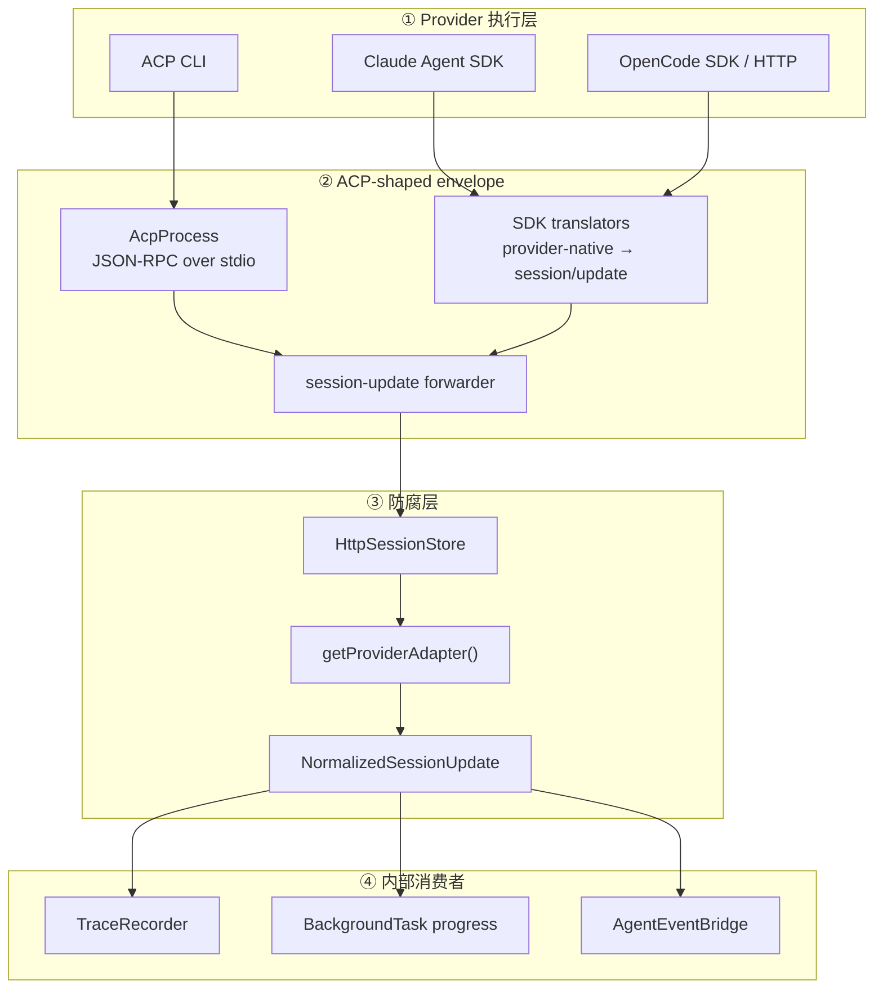

# Routa Phase 3 设计拆解：ACP Provider Adapter

> **本文定位**：教学设计 / 协议边界解剖笔记，不是 ACP API 手册。目标是解释不同 agent provider 的事件为什么必须先经过防腐层，才能被 Trace、BackgroundTask、语义事件和 UI 统一消费。
>
> 阅读顺序沿用 Phase 0–2：**业务痛点 → 如果不管会怎样腐烂 → 当前设计怎么堵 → Before / After → 权衡与边界**。每个问题尽量自闭环。
>
> 全文代码分四类标记：**真实代码摘录**（可按 `file:line` 回查）、**基于真实代码的简化**（省略无关字段）、**假设反例**（说明没有该设计时会怎样，非 Routa 历史代码）、**目标建议**（用于说明更强契约，未必已在当前代码落地）。

## 目录

- [「你在这里」锚点](#anchor-here)
- [总体业务场景](#anchor-scene)
  - [完整对象依赖图](#anchor-object-map)
  - [先校准四个容易混在一起的层](#anchor-layers)
  - [设计动机与设计哲学](#anchor-philosophy)
- [问题 1：为什么“都叫 ACP”仍然需要 Provider Adapter](#anchor-q1)
- [问题 2：统一类型为什么必须表达时间差](#anchor-q2)
- [问题 3：Adapter 为什么应该尽量无状态](#anchor-q3)
- [问题 4：怎样选择 Adapter，而不让调用方认识具体类](#anchor-q4)
- [问题 5：归一化之后，谁负责把事件变成系统行为](#anchor-q5)
- [四个可迁移模式](#anchor-patterns)
- [Phase 3 如何向 Phase 2/4 交棒](#anchor-next)
- [学习笔记](#anchor-notes)
- [一句话带走](#anchor-takeaway)

---

## 「你在这里」锚点 {#anchor-here}

```text
Routa 全局施工图：

  models/ ──→ store/ ──→ worker/ ──→ acp/ ──→ workflows/ ──→ kanban/
     ↑           ↑          ↑          ↑           ↑
  Phase 0     Phase 1    Phase 2    Phase 3     Phase 4
  领域词汇    数据事实    运行策略    协议适配     流程编排
```

上一课 Phase 2 讲到：`BackgroundTaskWorker` 会创建 ACP session、发送 prompt，再根据 session 的完成或失败信号推进后台任务。

这一课 Phase 3 看五组真实模块：

- `src/core/acp/provider-adapter/types.ts`：归一化契约；
- `base-adapter.ts` + `claude-adapter.ts` / `opencode-adapter.ts` / `standard-acp-adapter.ts`：厂商事件翻译；
- `provider-adapter/index.ts`：Adapter 选择与缓存；
- `http-session-store.ts`：原始 notification 进入归一化管线的汇合点；
- `trace-recorder.ts` + `agent-event-bridge/`：归一化事件的下游消费者。

**Phase 3 只解决一个核心矛盾：外部 agent 的事件形状和时序各不相同，但内部系统不能为每家 provider 重写一套 Trace、进度、生命周期和 UI 逻辑。**

BUILD_ORDER 将本阶段标成“依赖 Phase 0 类型”（`BUILD_ORDER.md:155-159`）。这里需要精确理解：

- 对**整个 Phase 3 文件集**，这个依赖仍然成立；例如 `acp-process.ts`、`acp-presets.ts` 等会使用 Phase 0 的 Agent 类型；
- 但 `provider-adapter/types.ts` 与几个核心 normalizer 自己定义 ACP 局部类型，并不直接 import `models/`；
- 因而“Phase 3 依赖 Phase 0”是施工顺序，不等于“每个 Adapter 文件都依赖 Phase 0”。

这是本课第一条边界纪律：**阶段依赖图描述施工单元，文件 import 图描述编译依赖，两者不能混为一谈。**

---

## 总体业务场景：同一次“读文件”，两家 provider 可能分两种节奏说话 {#anchor-scene}

用户让 agent 读取一个文件。对 Routa 内部来说，这是一条统一的工具调用生命周期：

```text
tool_call(running, input)
  → tool_call_update(completed, output)
  → agent_message
  → turn_complete
```

但 provider 发来的事实不一定同时到齐：

- Claude 的 `tool_call` 通常立刻带 `rawInput`；
- OpenCode 可能先发一个空输入的 `tool_call`，稍后才在 `tool_call_update` 里补上 `rawInput`；
- 标准 ACP provider 可能采用其中任意一种；
- provider 名称还可能写成 `claude-code`、`OpenCode`、`codex-acp` 等别名。

如果 Trace 或 UI 直接理解这些差异，它们就会一起腐烂：

```text
TraceRecorder: if provider === "opencode" ...
BackgroundTask: if provider === "opencode" ...
UI mapper: if provider === "claude" ...
Review pipeline: if provider === "codex" ...
```

每新增一家 provider，都要修改所有下游。变更传播比从理想的 `k = 1` 退化成 `k = N`。

Routa 的选择是先把 provider 事件翻译成 `NormalizedSessionUpdate`：

```text
外部差异                         内部统一语言

Claude raw notification   ─┐
OpenCode raw notification ─┼─→ IProviderAdapter.normalize()
Standard ACP notification ─┘          │
                                      ▼
                            NormalizedSessionUpdate
                                      │
                  ┌───────────────────┼──────────────────┐
                  ▼                   ▼                  ▼
               Trace             Task progress    AgentEventBridge
```

### 先看完整画面：对象怎样从进程走到系统行为 {#anchor-object-map}

下面是 Phase 3 的运行时全景图。重点不是记类名，而是先看清四次“换语言”：

```text
┌──────────────────────────────────────────────────────────────────────────────┐
│                   Routa ACP Provider Adapter 运行时全景                       │
└──────────────────────────────────────────────────────────────────────────────┘

【1. Provider 执行：不同运行方式】

  标准 ACP CLI              Claude Agent SDK             OpenCode SDK / HTTP
       │                           │                              │
       │ JSON-RPC / stdio          │ SDK + JSONL stream           │ REST / SSE
       ▼                           ▼                              ▼
  AcpProcess              ClaudeCodeSdkAdapter          OpencodeSdkAdapter
       │                           │                              │
       └───────────────┬───────────┴──────────────────────────────┘
                       │ 发送或转成 ACP-shaped session/update
                       ▼

【2. Session notification 汇合：保存原始历史，进入语义归一化】

             API session-update forwarder
                       │
                       ▼
              HttpSessionStore.pushNotification()
                       │
                       ├─ 保存 raw notification history / SSE
                       │
                       ├─ 根据 session.provider
                       ▼
               getProviderAdapter(provider)
                       │
          ┌────────────┼─────────────────┐
          ▼            ▼                 ▼
 ClaudeCodeAdapter  OpenCodeAdapter  StandardAcpAdapter
          │            │                 │
          └────────────┴─────────────────┘
                       │ normalize(sessionId, raw)
                       ▼

【3. 防腐层产物：内部统一的事件语汇】

              NormalizedSessionUpdate
              ├─ eventType
              ├─ toolCall + inputFinalized
              ├─ message + isChunk
              ├─ planItems
              ├─ turnComplete + usage
              └─ error
                       │
          ┌────────────┼────────────────────┐
          ▼            ▼                    ▼
   TraceRecorder   activity/progress   AgentEventBridge
          │            │                    │
          ▼            ▼                    ▼
   JSONL traces   BackgroundTask       WorkspaceAgentEvent
                                           │
                                           ▼
                                  subscribers / EventBus seam

【4. 状态归属：不要塞回 Adapter】

  Provider Adapter       TraceRecorder           AgentEventBridge
  ────────────────       ─────────────           ────────────────
  单条消息纯翻译          跨消息等 deferred input   每 session 合并 tool 状态
  不拥有 session          累积 message chunks       生成语义 block / complete
```

支持 Mermaid 的工具可以看分层版：



整张图压成一句话：**执行层负责让 provider 说话，ACP envelope 负责把话送到系统，Provider Adapter 负责翻译语义，下游消费者负责记忆和行动。**

### 先校准四个容易混在一起的层 {#anchor-layers}

| 层               | 真实模块                                                | 回答的问题                                               |
| ---------------- | ------------------------------------------------------- | -------------------------------------------------------- |
| 进程传输         | `acp-process.ts`                                        | 怎样通过 stdio 收发 JSON-RPC、关联 request/response      |
| SDK 翻译         | `claude-code-sdk-adapter.ts`、`opencode-sdk-adapter.ts` | 怎样把 SDK 原生流转成 ACP-shaped `session/update`        |
| Provider 归一化  | `provider-adapter/*.ts`                                 | 怎样把 notification 变成 `NormalizedSessionUpdate`       |
| Runtime 生命周期 | `acp-process-manager.ts`                                | 当前 session 由哪种进程/SDK backend 执行，怎样创建和关闭 |

它们都出现“adapter”或“ACP”，但不是同一层。

`JsonRpcMessage` 只定义 transport envelope（`protocol-types.ts:1-16`）：

```ts
export interface JsonRpcMessage {
  jsonrpc: "2.0";
  id?: number | string;
  method?: string;
  params?: Record<string, unknown>;
  result?: unknown;
  error?: { code: number; message: string; data?: unknown };
}
```

`NormalizedSessionUpdate` 则定义内部语义（`provider-adapter/types.ts:65-100`）。前者回答“这是不是 JSON-RPC 消息”，后者回答“系统刚刚观察到了什么事件”。

再校准一个现状漂移：ADR 把 `acp-session-manager.ts` 标成 session lifecycle manager（`docs/adr/0002-provider-normalization-via-acp.md:41-44`），但当前实现只有一个 `Map` 和注册/查询/删除（`acp-session-manager.ts:30-79`）。真正协调多种 runtime 创建、查询和关闭的是 `AcpProcessManager`，它持有六类 backend map（`acp-process-manager.ts:97-110`）。

因此本文以当前可执行代码为事实源，不按文件名推断职责。

### 设计动机与设计哲学 {#anchor-philosophy}

这套设计同时用了三个不同层次的思想：

1. **DDD 防腐层（Anti-Corruption Layer）**：外部模型先翻译，不能直接污染内部语言；
2. **GoF Adapter**：每种 provider 用一个适配器满足统一接口；
3. **依赖倒置**：Trace、进度和语义事件依赖 `NormalizedSessionUpdate`，而不是依赖 Claude/OpenCode 的具体 payload。

它们的关系是：

```text
依赖倒置 = 方向原则
Adapter   = 对象级实现手段
防腐层    = 系统边界上的组合结果
```

防腐层不是“多写一个 mapper”这么简单。它要决定：

- 哪些外部差异值得进入内部契约；
- 哪些缺失信息必须显式表达；
- 哪些未知事件可以丢弃；
- 哪些跨消息状态不应由 Adapter 自己偷偷持有。

后面五个问题逐一拆开。

---

## 问题 1：为什么“都叫 ACP”仍然需要 Provider Adapter {#anchor-q1}

### 业务痛点：协议同名，不代表行为同构

ACP-shaped 消息能统一外壳：都有 `session/update`、`tool_call`、`turn_complete`。但外壳相同不代表事件行为相同。

**假设反例**：让 Trace 直接处理 raw notification。

```ts
function record(raw: unknown, provider: string) {
  if (provider === "claude") {
    // 从 Claude payload 取 tool input
  } else if (provider === "opencode") {
    // 等下一条 update 才取 input
  } else if (provider === "codex") {
    // 又一套字段与状态规则
  }
}
```

当同样的分支复制到 UI、BackgroundTask 和 Review，provider 差异就穿透全系统。

### 当前堵法：把变化关在 `normalize()` 里

`IProviderAdapter` 的核心契约在 `provider-adapter/types.ts:121-148`：

```ts
export interface IProviderAdapter {
  getBehavior(): ProviderBehavior;

  normalize(
    sessionId: string,
    rawNotification: unknown,
  ): NormalizedSessionUpdate | NormalizedSessionUpdate[] | null;

  handleDeferredInput?(
    toolCallId: string,
    update: unknown,
  ): NormalizedToolCall | null;
}
```

这里有三个有意的选择：

1. 输入是 `unknown`：承认系统边界外的数据不可信；
2. 输出是内部类型：调用方只面对统一语汇；
3. 可以返回 `null`：不是所有 provider notification 都值得进入内部事件流。

`BaseProviderAdapter` 再集中实现共同骨架（`base-adapter.ts:37-48,82-123`）：

```ts
protected createUpdate(
  sessionId: string,
  eventType: NormalizedEventType,
  rawNotification?: unknown
): NormalizedSessionUpdate {
  return {
    sessionId,
    provider: this.provider,
    eventType,
    timestamp: new Date(),
    rawNotification,
  };
}
```

以及两种真实输入形状：

```text
{ update: { sessionUpdate: "tool_call" } }
{ sessionUpdate: "tool_call" }
{ type: "error" }
```

### Before / After

```text
Before
Trace ───────→ Claude payload
Trace ───────→ OpenCode payload
UI ──────────→ Claude payload
UI ──────────→ OpenCode payload

After
Claude payload ─┐
OpenCode payload ├─→ Adapter ─→ NormalizedSessionUpdate ─→ Trace / UI / Progress
Other payload ──┘
```

变化传播比因此从“每个消费者都修改”收缩为“新增或修改一个 adapter”。

### 现状边界：统一契约还不是绝对密封

ADR 说“domain layer never sees raw provider events”（`docs/adr/0002-provider-normalization-via-acp.md:32-35`），但当前 `NormalizedSessionUpdate` 仍有：

```ts
rawNotification?: unknown;
```

而 `createUpdate()` 会把原始 notification 放进去。当前 Trace 和 AgentEventBridge 没有读取这个字段，所以这是**边界可穿透**，不是已经发生的业务耦合。

更准确的现状表述是：

> 下游行为目前只依赖 normalized fields，但类型系统没有禁止它未来读取 `rawNotification`。

这也是防腐层的权衡：保留 raw 数据便于调试，却会削弱边界的强制力。

### 这段用了哪些模式

| 模式 / 原则             | 在这里的角色                                            |
| ----------------------- | ------------------------------------------------------- |
| Adapter                 | 把具体 provider notification 转成统一接口               |
| 防腐层                  | 阻止外部协议语义扩散到内部系统                          |
| 依赖倒置                | 下游依赖 normalized contract，不依赖 provider 类        |
| Template Method（轻量） | Base class 提供创建和提取共同步骤，子类填 `normalize()` |

**一句话带走**：协议外壳统一不了行为差异，Adapter 要把“厂商怎样说”翻译成“系统观察到什么”。

---

## 问题 2：统一类型为什么必须表达时间差 {#anchor-q2}

### 业务痛点：字段相同，抵达时间不同

最关键的真实差异不是字段名，而是 tool input 何时完整。

Claude 的实现明确声明立即输入（`claude-adapter.ts:27-33`）：

```ts
getBehavior(): ProviderBehavior {
  return {
    type: "claude",
    immediateToolInput: true,
    streaming: true,
  };
}
```

其 `tool_call` 直接产出：

```ts
update.toolCall = this.createToolCall(toolCallId, kind ?? title ?? "unknown", {
  title,
  status: "running",
  input: rawInput,
  inputFinalized: true,
});
```

OpenCode 则可能延迟输入（`opencode-adapter.ts:45-89`）：

```ts
const hasInput = !!(
  rawInput &&
  typeof rawInput === "object" &&
  Object.keys(rawInput).length > 0
);

update.toolCall = this.createToolCall(toolCallId, kind ?? title ?? "unknown", {
  title,
  status: "running",
  input: rawInput ?? undefined,
  inputFinalized: hasInput,
});
```

随后 `tool_call_update` 再补：

```ts
input: rawInput ?? undefined,
output: rawOutput,
inputFinalized: hasInput || isComplete,
```

### 为什么不能用 `input?: object` 代替

如果只有 optional input，下游无法区分：

```text
input 不存在 = provider 还没发？
input 不存在 = 这个工具本来没有参数？
input 不存在 = 数据丢了？
```

`inputFinalized` 把“值”与“信息是否完整”拆开：

| input           | inputFinalized | 含义                           |
| --------------- | -------------: | ------------------------------ |
| `{ path: ... }` |         `true` | 参数已到齐，可以记录 tool_call |
| `{}`            |        `false` | 只是占位，后续 update 还会补   |
| `undefined`     |        `false` | 当前没有参数，仍需等待         |
| `undefined`     |         `true` | 生命周期已结束，不会再补       |

这属于**时序语义进入类型**：类型不只描述对象长什么样，还描述我们现在知道多少。

### 一条真实测试怎样锁住行为

`src/core/acp/provider-adapter/__tests__/provider-adapters.test.ts:122-192` 验证 OpenCode 的两阶段输入：

```text
1. tool_call(rawInput = {})
   → inputFinalized = false

2. tool_call_update(rawInput = { filePath }, status = in_progress)
   → inputFinalized = true

3. tool_call_update(status = completed, rawOutput = ...)
   → status = completed + output
```

`src/core/acp/provider-adapter/__tests__/integration-scenarios.test.ts:52-152` 再把它接到 `TraceRecorder`：

```text
user_message                     → 立即记 trace
tool_call(inputFinalized=false)  → 暂不记 tool_call
tool_call_update(真实 input)     → 补记 tool_call
tool_call_update(completed)      → 记 tool_result
turn_complete                    → flush message buffer
```

这类测试比“normalize 返回对象”更有价值，因为它锁住了**跨消息时序**。

### Before / After

```text
❌ 只统一字段
NormalizedToolCall { input?: object }
下游只能猜：没有 input 到底是什么意思？

✅ 统一字段 + 完整性
NormalizedToolCall {
  input?: object;
  inputFinalized: boolean;
}
下游明确决定：立即消费，还是等待更新。
```

### 现状边界：归一化也可能做出错误推断

OpenCode 与 Standard adapter 当前把以下任一条件视为完成（`opencode-adapter.ts:78-89`、`standard-acp-adapter.ts:79-90`）：

```ts
const isComplete =
  status === "completed" || status === "failed" || rawOutput !== undefined;
```

如果某个 provider 在 `status: "running"` 时就流出部分 `rawOutput`，它会被提前归一化为 `completed`。仓库当前自有 producer 通常只在终态附带 `rawOutput`，因此常规路径受“生产端约定”保护；但 Standard adapter 面向外部 provider，契约本身没有强制这个前提。

这揭示一个通用原则：

> Normalizer 不只是搬字段，它也在做语义推断；每个推断都应该写清前提并由反例测试保护。

**一句话带走**：真正难统一的不是字段名，而是信息何时完整；把时间差显式放进类型，才不会逼下游猜测。

---

## 问题 3：Adapter 为什么应该尽量无状态 {#anchor-q3}

### 业务痛点：单条消息翻译与跨消息拼装是两种职责

`normalize(raw)` 最容易理解成纯函数：给一条外部消息，返回一条内部消息。可 OpenCode 的 deferred input 明明跨两条消息，状态应该放哪里？

有三个候选位置：

1. 放进 `OpenCodeAdapter`；
2. 放进统一的 Trace / Bridge 消费者；
3. 放进 session store。

Routa 的核心 normalizer 选择尽量不保存 session 状态。`getProviderAdapter()` 甚至会按 provider 缓存单例（`provider-adapter/index.ts:23-43`）：

```ts
const adapterCache = new Map<ProviderType, IProviderAdapter>();

export function getProviderAdapter(provider: ProviderType | string) {
  const normalizedProvider = normalizeProviderType(provider);
  const cached = adapterCache.get(normalizedProvider);
  if (cached) return cached;

  const adapter = createAdapter(normalizedProvider);
  adapterCache.set(normalizedProvider, adapter);
  return adapter;
}
```

如果 Adapter 把“当前 tool call”存在实例字段里，同一 provider 的多个 session 会共享这份状态，串话风险极高。

### 当前堵法：翻译无状态，拼装状态由消费者按用途持有

`TraceRecorder` 持有 deferred tool call、message chunk 和 thought chunk buffer（`trace-recorder.ts:40-48`）：

```ts
private pendingToolCalls = new Map<string, PendingToolCall>();
private messageBuffer = new Map<string, string>();
private thoughtBuffer = new Map<string, string>();
```

`AgentEventBridge` 则明确是一 session 一实例，并按 `toolCallId` 保存工具状态（`src/core/acp/agent-event-bridge/agent-event-bridge.ts:37-49,98-138`）：

```ts
export class AgentEventBridge {
  private readonly sessionId: string;
  private toolCalls = new Map<string, TrackedToolCall>();

  process(update: NormalizedSessionUpdate): WorkspaceAgentEvent[] {
    // tool_call 创建 block
    // tool_call_update 合并 input/output/status
    // 完成后清理
  }
}
```

两个消费者保存的状态不同：

| 消费者           | 保存什么                       | 为什么                                      |
| ---------------- | ------------------------------ | ------------------------------------------- |
| TraceRecorder    | deferred input、文本 chunk     | 为了形成完整、可审计的 trace record         |
| AgentEventBridge | tool call 当前状态             | 为了把 update 合并成 UI/语义 block 生命周期 |
| HttpSessionStore | session、raw history、activity | 为了 session 访问、SSE 与运行状态           |

这就是“状态跟着用途走”，而不是“看到跨消息就全塞进 Adapter”。

### Before / After

```text
❌ Stateful singleton Adapter
OpenCodeAdapter.pendingCall = ...
session A 与 session B 共用实例，容易串状态

✅ Stateless normalizer + session-scoped/state-purpose consumer
Adapter: raw → normalized
Bridge(sessionId): normalized → semantic lifecycle
Recorder: normalized → trace lifecycle
```

### 已确认的现状瑕疵：状态 key 必须包含隔离边界

当前 `HttpSessionStore` 共享一个 `TraceRecorder`，但 `pendingToolCalls` 只以 `toolCallId` 为 key（`trace-recorder.ts:40-42,100-143`）。虽然 value 保存了 `sessionId`，读取和删除时没有校验它。

因此，如果两个 session 恰好复用相同 `toolCallId`：

```text
session A: call_1 pending
session B: call_1 pending  → 覆盖 A
session A: call_1 update   → 可能读取 B 的 pending metadata
```

当前测试验证了“同一 session、不同 call ID 的并发”（`src/core/acp/provider-adapter/__tests__/integration-scenarios.test.ts:186-252`），没有覆盖“不同 session、相同 call ID”。

这里最值得迁移的不是具体 bug，而是规则：

> Stateful consumer 的 key 必须包含它承诺隔离的作用域；per-session 状态就不能只拿 provider-local ID 当全局 key。

### 这段用了哪些模式

- **Functional Core / Imperative Shell**：normalizer 尽量纯，session/trace shell 持有必要状态；
- **Single Responsibility**：翻译、追踪、语义聚合分开；
- **Identity Map（局部形态）**：Bridge 按 toolCallId 追踪同一个工具调用的持续状态；
- **会话隔离**：不是 GoF 模式，但属于状态边界的核心纪律。

**一句话带走**：Adapter 负责“这一句怎么翻”，跨句记忆由明确的 session-scoped 消费者负责。

---

## 问题 4：怎样选择 Adapter，而不让调用方认识具体类 {#anchor-q4}

### 业务痛点：调用方拿到的是字符串，不是类

session record 保存的是 provider 名称。它可能来自配置、API 或 preset：

```text
claude
Claude
claude-code
opencode-sdk
codex-acp
some-unknown-provider
```

`HttpSessionStore` 不应该写一串 `new ClaudeCodeAdapter()`。它只调用（`http-session-store.ts:513-526`）：

```ts
const provider = sessionRecord?.provider ?? "unknown";
const adapter = getProviderAdapter(provider);
const normalized = adapter.normalize(sessionId, notification);
```

### 当前堵法：Factory 集中名称归一化和实现选择

`provider-adapter/index.ts:49-97` 把别名压成 `ProviderType`：

```text
claude-code / claudecode / claude-code-sdk → claude
open-code / opencode-sdk                  → opencode
codex / codex-acp                         → codex
workspace-agent / routa-native            → workspace
unknown                                   → standard
```

随后 `createAdapter()` 集中选择（`index.ts:103-127`）：

```text
claude          → ClaudeCodeAdapter
opencode        → OpenCodeAdapter
docker-opencode → DockerOpenCodeProviderAdapter
workspace       → WorkspaceAgentProviderAdapter
其他标准 ACP    → StandardAcpAdapter(provider)
```

调用方因此只认识工厂和接口。

### Factory、Strategy、Registry 不要混叫

| 名称             | 本课回答的问题                      | 当前实现                                                |
| ---------------- | ----------------------------------- | ------------------------------------------------------- |
| Factory          | 应该创建哪种 Adapter                | `createAdapter()` 的 switch                             |
| Strategy         | 对这条消息采用哪套 normalize 算法   | 各个 `IProviderAdapter` 实现                            |
| Cache / Multiton | 同一种 provider 是否复用实例        | `adapterCache` 每 provider 一个                         |
| Registry         | 能否运行时注册新的 provider factory | `provider-registry.ts` 有骨架，但未接入 adapter factory |

ADR 写 `ProviderRegistry` 负责 discovery 和 instantiation（`docs/adr/0002-provider-normalization-via-acp.md:25-30`），但当前 adapter 选择仍是静态 switch。`ProviderRegistry.createDefault()` 的注册也是未完成骨架。

所以准确描述是：

> 当前 Provider Adapter 使用 closed factory；ProviderRegistry 是另一套 provider runtime factory/选择抽象，尚未成为 Adapter 的插件注册中心。

### 权衡：closed factory 不是天然坏设计

优点：

- 显式、容易搜索；
- provider 集合较小时类型安全；
- alias 与 fallback 行为集中；
- 不需要动态注册的生命周期与错误处理。

代价：

- 新增非标准 provider 必须修改 factory；
- 插件不能在运行时增加 adapter；
- `unknown → standard` 可能隐藏拼写错误；
- factory 与 registry 的命名容易制造“已经插件化”的错觉。

当 provider 数量稳定、都随应用发布时，switch 比通用插件框架更诚实。只有外部插件、运行时加载或独立部署真的出现，Registry 才值得成为主路径。

### 现状边界：统一接口不等于统一丢弃策略

当前 Standard adapter 会把 `error` 归一化（`standard-acp-adapter.ts:159-176`），但 OpenCode 没有 `error` case，会走 `default → null`；Claude 也丢弃未知类型（`claude-adapter.ts:145-147`）。

同时接口允许一条 raw message 返回 `NormalizedSessionUpdate[]`，但当前具体 normalizer 都只返回单条或 `null`。

这说明接口的“形状统一”还没有自动保证“策略统一”。验收不能只问是否实现 `IProviderAdapter`，还要问：

```text
□ 同一种 error 在不同 provider 下是否都保留？
□ unknown event 应丢弃、记录还是透传？
□ 一对多返回是否真有用，还是超前设计？
□ fallback 到 standard 是否应该留下诊断信号？
```

**一句话带走**：Factory 管“选哪位翻译”，Strategy 管“怎么翻”；Registry 只有在运行时可扩展真的存在时才成立。

---

## 问题 5：归一化之后，谁负责把事件变成系统行为 {#anchor-q5}

### 业务痛点：翻译完成不等于业务完成

`NormalizedSessionUpdate` 只是事实：

```text
发生了 tool_call
来了一段 agent_message
计划更新了
这一轮完成了
发生了 error
```

系统还要决定：

- 是否写 trace；
- 是否增加 BackgroundTask 的 tool count；
- 是否把 `turn_complete` 转成 `agent_completed`；
- 是否更新 session activity；
- 是否发送给实时订阅者。

如果 Adapter 直接做这些副作用，它就会同时依赖 Trace、Store、EventBus 和 UI，防腐层会变成新的上帝对象。

### 当前堵法：HttpSessionStore 做管线编排，下游各自解释

`pushNotification()` 的核心顺序在 `http-session-store.ts:513-542`：

```text
1. 找 session 对应 provider
2. getProviderAdapter(provider)
3. normalize(sessionId, notification)
4. 对每个 normalized update：
   - recordSessionActivity()
   - traceRecorder.recordFromUpdate()
   - bridge.process()
   - dispatchAgentEvent()
5. best-effort 更新 BackgroundTask progress
6. 同步 runtime error state
```

注意这里同时保留两条管线：

```text
raw notification
  ├─ history / persistence / SSE（保留协议原貌）
  └─ normalize → semantic consumers（统一内部行为）
```

这是合理的“双轨”：回放和协议调试可能需要 raw；业务判断应该依赖 normalized。

### AgentEventBridge：第二次翻译

为什么已经 normalize 了，还要 Bridge？因为两层回答不同问题：

```text
Provider Adapter:
  OpenCode tool_call_update
    → NormalizedSessionUpdate(eventType=tool_call_update)

AgentEventBridge:
  Normalized tool call + 前一条状态
    → WorkspaceAgentEvent(read_block / terminal_block / file_changes_block)
```

Bridge 会（`src/core/acp/agent-event-bridge/agent-event-bridge.ts:98-138,141-221`）：

- 保存 tool call 初始 input；
- 在 update 到来时合并 input/output/status；
- 根据工具种类生成语义 block；
- 把 `turn_complete` 变成 `usage_reported` + `agent_completed`；
- 把 normalized error 变成 `agent_failed`。

这不是重复 Adapter，而是**协议语义 → 产品语义**的第二道边界。

### 三层事件语汇

| 层                     | 示例                            | 面向谁              |
| ---------------------- | ------------------------------- | ------------------- |
| Wire event             | `session/update` + `rawInput`   | 协议与 provider     |
| Normalized event       | `tool_call` + `inputFinalized`  | ACP 内部基础设施    |
| Product semantic event | `read_block`、`agent_completed` | Workspace、UI、编排 |

如果直接从 wire event 跳到产品 event，每个产品消费者都要理解 provider 差异；如果把产品语义塞进 Provider Adapter，Adapter 又会依赖 Workspace 领域。两次翻译正好把两类变化隔开。

### 已确认的现状边界 1：best-effort 进度更新可能竞争

`pushNotification()` 用 `void this.updateBackgroundTaskProgress(...)` 启动异步更新，没有按 session 串行化。该方法先读 task，再在内存中增加 counter，最后写绝对值。

并发 notification 可能出现：

```text
update A 读 toolCallCount = 3
update B 读 toolCallCount = 3
A 写 4
B 写 4              ← 丢失一次增量
```

当前 InMemory、Postgres、SQLite store 都没有把这段“读—改—写”变成原子 increment。由于该进度被设计为 best-effort telemetry，影响低于核心 session 执行，但若 workflow 依赖 task output，仍应把它视为真实一致性边界。

### 已确认的现状边界 2：恢复 activity 时 terminal metadata 可能残留

当 timeout session 收到新的非 error notification，`pushNotification()` 会把 ACP status 恢复为 `ready`（`http-session-store.ts:480-483`）。但 `recordSessionActivity()` 更新活动时间时保留已有 `terminalState / terminalReason / terminalAt`（`http-session-store.ts:728-745`）。

于是同一 session 可能同时表现为：

```text
acpStatus = ready
lastActivity = just now
terminalState = timed_out
```

这说明“连接状态”和“终态记录”是两套状态机，恢复路径必须同时定义二者怎样收敛。

### 已确认的现状边界 3：语义订阅是 live-only

`upsertSession()` 创建 Bridge 后会立即 dispatch `agent_started`（`http-session-store.ts:252-259`），而 `subscribeToAgentEvents()` 只是把 handler 加进 Set，不回放旧事件（`309-324`）。当前仓库也没有生产调用方使用这项 subscription API。

raw notification 有 history/SSE replay，trace 也能单独重建事件；但这些都没有接入 `subscribeToAgentEvents()`。所以应准确称它为：

> 当前的 per-session semantic live channel，而不是可恢复事件流。

### 这段用了哪些模式

- **Pipes and Filters**：raw → normalized → semantic event；
- **Mediator / Orchestration Shell**：HttpSessionStore 组织多个消费者，但不实现每种解释；
- **Stateful Translator**：AgentEventBridge 用上下文把增量事件合成产品语义；
- **Event-driven seam**：语义事件可交给 subscriber / EventBus，而不让 Adapter认识业务调用方。

**一句话带走**：Adapter 只产出统一事实；Trace、进度与 Bridge 分别决定怎样记、怎样累计、怎样变成产品行为。

---

## 四个可迁移模式 {#anchor-patterns}

### 模式 1：防腐层先统一语义，不只统一 JSON 外壳

#### 是什么

像外交翻译官：不只逐字翻译，还要把对方制度里的概念换成己方能稳定理解的概念。

#### 触发信号

```text
□ 两个外部系统都叫 tool_call，但字段时序不同；
□ 下游出现 provider === ... 分支；
□ 新增 provider 要同时改 UI、日志和业务；
□ 外部 SDK 升级会穿透多个内部模块。
```

#### 配方

```text
1. 先列内部真正关心的事件语汇；
2. 把外部输入留在 unknown；
3. 每个 provider 单独 normalize；
4. 下游只消费 normalized contract；
5. 用行为契约测试覆盖相同场景。
```

#### 别过度

只有一种稳定输入，且没有多消费者时，一个局部 mapper 就够了，不必先建 class hierarchy。

---

### 模式 2：用“完整性位”表达延迟信息

#### 是什么

值是否存在与值是否最终确定，是两个维度。

#### 触发信号

```text
□ 字段会在后续事件补齐；
□ undefined 同时代表“尚未到达”和“确实没有”；
□ 消费者不得不 setTimeout 等一等；
□ 系统错误地把占位数据当最终数据。
```

#### 配方

可采用：

```ts
{ value?: T; finalized: boolean }
```

或更强的 discriminated union：

```ts
type Deferred<T> =
  { state: "pending" } | { state: "ready"; value: T } | { state: "absent" };
```

#### 别过度

如果值在同一个原子响应中永远完整，不要引入额外状态。

---

### 模式 3：无状态翻译器 + 有状态聚合器

#### 是什么

单条转换保持可复用、可测试；只有需要跨事件关联的组件保存状态，而且状态 key 包含隔离范围。

#### 配方

```text
Normalizer(raw) → normalized
Aggregator(sessionId).process(normalized) → semantic events
```

检查 key：

```text
全局状态     → global identity
workspace 状态 → workspaceId + localId
session 状态   → sessionId + toolCallId
```

#### 别过度

如果转换天然只看一条消息，不要为了“以后也许需要”提前创建 session object。

---

### 模式 4：分清 Transport Adapter、Provider Adapter 与 Product Bridge

#### 是什么

把“如何送达”“如何归一化”“如何变成产品行为”拆成三个变化轴。

```text
Transport：字节/请求怎样到达
Provider Adapter：外部事件怎样变成内部基础事件
Product Bridge：基础事件怎样变成产品语义
```

#### 触发信号

一个叫 `Adapter` 的类同时出现：

```text
spawn / fetch / stdin
normalize payload
update task / emit UI event
```

这通常说明三个变化轴黏在一起了。

#### 别过度

模块很小时可以同文件，但职责和测试仍应分段；不要为三十行代码强拆三个 npm package。

---

## Phase 3 如何向 Phase 2/4 交棒 {#anchor-next}

### 向 Phase 2 回答：Worker 为什么不用认识 provider

```text
Phase 2 BackgroundTaskWorker
  │ session/new + session/prompt
  ▼
Provider runtime
  │ provider-specific notifications
  ▼
Phase 3 normalize
  │ turn_complete / error / progress
  ▼
BackgroundTask 状态收敛
```

Phase 2 只需要相信 session 会暴露统一生命周期信号，不需要知道 OpenCode 何时补 `rawInput`。

### 向 Phase 4 回答：Workflow 为什么不用解析协议

```text
Provider event
  → NormalizedSessionUpdate
  → BackgroundTask progress / output
  → Workflow step output
  → 下一步依赖解除
```

Workflow 应依赖 BackgroundTask/step output，不应直接 import Claude/OpenCode adapter。否则 provider 差异会穿过任务边界污染 DAG 编排。

### Phase 3 的验收应该验证什么

BUILD_ORDER 的基础验收在 `BUILD_ORDER.md:229` 之后。结合当前实现，更有价值的行为验收是：

```text
□ provider alias 选择稳定，unknown fallback 有明确策略；
□ Claude immediate input 被标为 finalized；
□ OpenCode deferred input 能在 update 中补齐；
□ tool status 映射覆盖 running / in_progress / completed / failed；
□ rawOutput 与显式 status 冲突时，优先级有契约测试；
□ error / unknown event 的跨 provider 策略一致或明确记录；
□ 不完整 notification 安全返回 null，不污染下游；
□ 同一 session 多个 tool call 可乱序完成；
□ 不同 session 复用相同 toolCallId 不串 trace；
□ normalized update 能驱动 trace、semantic event 与 task progress；
□ Adapter 不拥有 process、SDK 或 session 生命周期；
□ rawNotification 只用于诊断，不参与领域判断；
□ recovery 同时收敛 acpStatus 与 terminal metadata。
```

测试层次建议：

| 测试层             | 重点                                               |
| ------------------ | -------------------------------------------------- |
| Adapter unit       | 单条 raw → normalized 的字段与丢弃规则             |
| Sequence test      | deferred input、chunk、completion 的事件序列       |
| Consumer contract  | Trace / Bridge 对统一事件的相同行为                |
| Cross-session test | state key 与隔离范围                               |
| End-to-end         | provider notification 最终推进 task / UI lifecycle |

---

## 学习笔记（用你自己的话补充） {#anchor-notes}

```text
1. 为什么 ACP-shaped session/update 之后还需要 Provider Adapter？


2. inputFinalized 解决了哪一种“值不存在”的歧义？


3. 为什么 getProviderAdapter() 缓存单例后，Adapter 更不应该保存 session 状态？


4. Factory、Strategy、Registry 在这一层分别回答什么问题？


5. Provider Adapter 与 AgentEventBridge 为什么不是重复翻译？


6. 如果你接入一家新 provider，最先写哪三组契约测试？

```

---

## 一句话带走 {#anchor-takeaway}

> **Phase 3 的本质不是“支持更多 AI”，而是建立一道防腐层：执行层可以用不同进程、SDK 和时序说话，内部系统始终只听统一事件，再由有明确状态边界的消费者把事件变成 Trace、任务进度和产品语义。**
