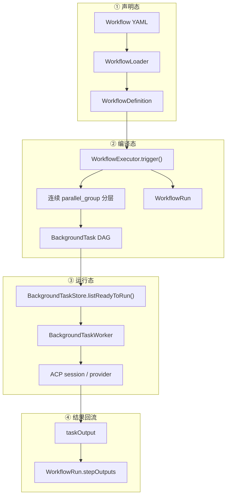

# Routa Phase 4 设计拆解：Workflow Executor

> **本文定位**：教学设计 / 流程编排解剖笔记，不是 Workflow YAML API 手册。目标是解释一份高层流程定义怎样被“编译”为可恢复的后台任务依赖图，以及 Workflow、WorkflowRun、BackgroundTask、Worker 各自应该负责哪一层事实。
>
> 阅读顺序沿用 Phase 0–3：**业务痛点 → 如果不管会怎样腐烂 → 当前设计怎么堵 → Before / After → 权衡与边界**。每个问题尽量自闭环。
>
> 全文代码分四类标记：**真实代码摘录**（可按 `file:line` 回查）、**基于真实代码的简化**（省略无关字段）、**假设反例**（说明没有该设计时会怎样，非 Routa 历史代码）、**目标建议**（用于说明更强契约，未必已在当前代码落地）。

## 目录

- [「你在这里」锚点](#anchor-here)
- [总体业务场景](#anchor-scene)
  - [完整对象依赖图](#anchor-object-map)
  - [设计动机与设计哲学](#anchor-philosophy)
- [问题 1：Workflow 为什么不直接执行 agent](#anchor-q1)
- [问题 2：parallel_group 怎样变成任务依赖图](#anchor-q2)
- [问题 3：步骤输出为什么要延迟到派发时替换](#anchor-q3)
- [问题 4：WorkflowDefinition、WorkflowRun、BackgroundTask 为什么要分开](#anchor-q4)
- [问题 5：创建完任务为什么还不等于运行闭环](#anchor-q5)
- [四个可迁移模式](#anchor-patterns)
- [Phase 4 如何向 Phase 5 交棒](#anchor-next)
- [学习笔记](#anchor-notes)
- [一句话带走](#anchor-takeaway)

---

## 「你在这里」锚点 {#anchor-here}

```text
Routa 全局施工图：

  models/ ──→ store/ ──→ worker/ ──→ acp/ ──→ workflows/ ──→ kanban/
     ↑           ↑          ↑          ↑           ↑
  Phase 0     Phase 1    Phase 2    Phase 3     Phase 4
  领域词汇    数据事实    运行策略    协议适配     流程编排
```

前四个阶段已经回答：

- Phase 0：`BackgroundTask`、事件与状态用什么语言表达；
- Phase 1：任务与运行记录怎样通过 Store 保存和查询；
- Phase 2：Worker 怎样选择 ready task，并把它推进到终态；
- Phase 3：不同 provider 怎样被归一化为内部统一事件。

Phase 4 不再发明一种新的执行技术。它解决的是更高一层的问题：

> 用户描述的是“先分析，再并行测试，最后发布”；系统底层只认识一条条可以等待、运行和完成的 BackgroundTask。两者怎样可靠地接起来？

本课重点看六个真实模块：

- `src/core/workflows/workflow-types.ts`：声明态与运行态模型；
- `workflow-loader.ts`：YAML 加载和最低限度校验；
- `workflow-executor.ts`：把步骤序列编译成 BackgroundTask 依赖图；
- `workflow-store.ts`：父级 WorkflowRun 的运行记录；
- `src/core/store/background-task-store.ts`：依赖就绪查询；
- `src/core/background-worker/index.ts`：真正派发前的输出解析和执行接力。

BUILD_ORDER 把本阶段写成“依赖 Phase 1–2”（`docs/learning/koda-replication/BUILD_ORDER.md:239-269`）。这不是偶然排序：

```text
没有 Store，就没有可恢复的任务图；
没有 Worker，任务图只是静态数据；
Workflow Executor 自己不应重新实现持久化和执行。
```

先校准两处文档漂移：

1. BUILD_ORDER 写的是 `src/core/workflows/`，当前代码确实使用复数目录，不是 `workflow/`；
2. BUILD_ORDER 把 `trigger()` 描述成“group steps by parallel_group，再依赖 Store 判断 ready”，但当前 Executor 自己不调用 `listReadyToRun()`；它只生成 `dependsOnTaskIds`，真正的 ready 判断由 BackgroundTaskStore 与 Worker 接棒。

**Phase 4 只解决一个核心矛盾：流程定义是声明式意图，运行系统需要可持久化、可调度、可恢复的执行事实。**

---

## 总体业务场景：把“先后与并行”翻译成一张任务图 {#anchor-scene}

设想一个四步流程：

```text
Setup
  ↓
Test A ─┐
        ├─ 并行
Test B ─┘
  ↓
Deploy
```

用户在 YAML 中写的是有顺序的步骤与 `parallel_group` 标签：

```yaml
name: Parallel Flow
steps:
  - name: Setup
    specialist: developer

  - name: Test A
    specialist: tester
    parallel_group: tests

  - name: Test B
    specialist: tester
    parallel_group: tests

  - name: Deploy
    specialist: devops
```

但 BackgroundWorker 不读取 Workflow YAML。它只会问：

```text
哪些 BackgroundTask 是 PENDING？
它们的 dependsOnTaskIds 是否全部 COMPLETED？
当前还有几个运行槽位？
```

因此 WorkflowExecutor 的核心工作不是“执行步骤”，而是一次翻译：

```text
声明式步骤序列
      ↓
分组 + 生成 taskId
      ↓
显式 dependsOnTaskIds
      ↓
BackgroundTaskStore 保存图
      ↓
Worker 按 ready query 逐步释放节点
```

### 完整对象依赖图 {#anchor-object-map}

```text
┌──────────────────────────────────────────────────────────────────────────────┐
│                      Routa Workflow 运行时全景                               │
└──────────────────────────────────────────────────────────────────────────────┘

【1. 声明态：描述想要什么】

 resources/flows/*.yaml
          │
          ▼
 WorkflowLoader
   ├─ YAML parse
   ├─ 校验 name / steps / step.name / step.specialist
   └─ cache by idOrPath + definition.name
          │
          ▼
 WorkflowDefinition
   ├─ trigger / variables
   ├─ ordered steps
   ├─ input
   ├─ parallel_group
   └─ adapter/config/actions/failure policy 等声明字段
          │
          ▼

【2. 编译态：把流程翻译成持久化任务图】

 WorkflowExecutor.trigger()
          │
          ├─ workflowRunStore.create() ─────────────► WorkflowRun(PENDING)
          │
          ├─ groupStepsByParallel(steps)
          │       │
          │       └─ 只把连续且标签相同的步骤放进同一组
          │
          ├─ 每个 step → createBackgroundTask()
          │       ├─ workflowRunId
          │       ├─ workflowStepName = step.name
          │       └─ dependsOnTaskIds = 之前组的任务 ID
          │
          ├─ backgroundTaskStore.save(task)
          │
          └─ workflowRunStore.updateStatus(RUNNING)
                  │
                  ▼

【3. 运行态：任务图自行释放可执行节点】

 BackgroundTaskStore
   └─ listReadyToRun()
        ├─ status === PENDING
        └─ every dependency.status === COMPLETED
                  │
                  ▼
 BackgroundTaskWorker
   ├─ 计算并发槽位
   ├─ resolveTaskPrompt()
   │    └─ 此时才替换 ${steps.<name>.output}
   ├─ 创建 ACP session
   └─ 推进 BackgroundTask 生命周期
                  │
                  ▼
 Provider Adapter / ACP runtime

【4. 结果回流：子任务输出回到父运行记录】

 turn_complete / Worker reconciliation
                  │
                  ├─ BackgroundTask → COMPLETED
                  ├─ taskOutput 持久化
                  └─ WorkflowRunStore.updateStepOutput(
                         runId,
                         workflowStepName,
                         output
                     )
```

支持 Mermaid 的工具可以看分区版：



整张图压成一句话：

> **WorkflowExecutor 是编译器，不是运行时：它把高层流程编译成 BackgroundTask 依赖图，再由 Phase 1 的 Store 保存事实、Phase 2 的 Worker 推进生命周期。**

### 设计动机与设计哲学 {#anchor-philosophy}

这套结构面对五种不同变化：

| 变化 | 应该住在哪里 |
|---|---|
| 流程有几个步骤、谁先谁后 | WorkflowDefinition |
| 声明怎样变成任务依赖 | WorkflowExecutor |
| 任务现在是什么状态 | BackgroundTaskStore |
| 当前能启动几个、怎样恢复 | BackgroundTaskWorker |
| 外部 agent 怎样通信 | ACP / Provider Adapter |

如果没有这些边界，最容易出现两种极端。

第一种是“YAML 解释器变成上帝对象”：

```text
读取 YAML
  → 直接调用 provider
  → 自己维护重试
  → 自己保存输出
  → 自己判断并发
  → 自己恢复崩溃任务
```

第二种是“Worker 反过来理解所有流程语义”：

```text
Worker 读取 parallel_group
Worker 解析 output_key
Worker 判断 if/on_failure
Worker 重新加载 YAML
Worker 还要知道 workflow 版本
```

Routa 当前选择中间路线：

```text
声明语义先降解成通用 BackgroundTask 图；
运行时只消费任务状态、依赖和执行上下文。
```

这是一种 **Compiler + Durable Task Graph** 思路：

- WorkflowDefinition 类似源语言；
- BackgroundTask DAG 类似中间表示（IR）；
- BackgroundTaskStore 是持久化 IR；
- Worker 类似执行引擎；
- WorkflowRun 是父级运行投影。

#### 五镜头验收

| 镜头 | 当前结构 | 挡住什么变化 | 当前缺口 |
|---|---|---|---|
| **分** | Definition、Run、Task、Worker 分开 | 声明变化不会直接污染执行协议 | 部分声明字段尚未编译进 Task |
| **稳** | `dependsOnTaskIds` 是稳定中间表示 | Worker 不必理解 `parallel_group` | 父 WorkflowRun 仍是内存态 |
| **向** | Executor → Store port；Worker → Store port | 编排不依赖数据库或具体 provider | 运行终态没有反向汇总到父 Run |
| **约** | ready 只接受全部依赖 `COMPLETED` | 保证下游不会提前运行 | 重名步骤、环、失败传播缺少完整约束 |
| **权** | 先物化全图，换取恢复与解耦 | 请求断开不带走整个流程 | 预创建会让动态条件和失败策略更难表达 |

后面五个问题依次验证这五格。

---

## 问题 1：Workflow 为什么不直接执行 agent {#anchor-q1}

> **本节验证的设计判断**：流程编排负责产生可执行计划，后台运行时负责执行计划。把“计划生成”和“外部副作用”分开，才能让流程跨请求保存、由统一 Worker 调度，并复用已有恢复机制。

### 业务痛点：一次 Workflow 比一次 HTTP 请求长得多

一个 workflow 可能包含多个 agent step。每一步都可能持续数分钟，后续步骤还要等待前序输出。如果 trigger route 直接 `await` 每一步：

```typescript
// ❌ 假设反例
for (const step of workflow.steps) {
  const output = await callAgent(step);
  outputs[step.name] = output;
}
```

它立刻继承一整套问题：

- HTTP 连接断开是否终止流程；
- 进程重启后从哪一步恢复；
- 并行步骤怎样共享容量；
- provider session 怎样持久化；
- 漏掉完成事件后谁巡检；
- Workflow 是否要复制 BackgroundWorker 的 orphan/stale 逻辑。

### 当前堵法：先把每一步物化为 BackgroundTask

`WorkflowExecutor.trigger()` 首先创建父运行记录（`workflow-executor.ts:42-54`）：

```typescript
const run = await this.deps.workflowRunStore.create({
  workflowId,
  workflowName: definition.name,
  workflowVersion: definition.version,
  workspaceId,
  triggerPayload,
  triggerSource,
  totalSteps: definition.steps.length,
});
```

随后每一步通过 Phase 0 的工厂创建任务（`workflow-executor.ts:137-150`）：

```typescript
const task = createBackgroundTask({
  title: `[${definition.name}] ${step.name}`,
  prompt,
  agentId: step.specialist,
  workspaceId,
  triggerSource: "workflow",
  triggeredBy: `workflow:${definition.name}`,
  workflowRunId,
  workflowStepName: step.name,
  dependsOnTaskIds: dependsOnTaskIds.length > 0
    ? dependsOnTaskIds
    : undefined,
});

await this.deps.backgroundTaskStore.save(task);
```

这里最重要的不是字段数量，而是对象身份发生了变化：

```text
WorkflowStep
  = 声明中的一条指令

BackgroundTask
  = 可以被保存、调度、恢复和关联 session 的运行作业
```

### Executor 的职责边界

当前 Executor 做：

```text
□ 创建 WorkflowRun
□ 把 step 分组
□ 生成 BackgroundTask
□ 写入依赖 ID
□ 保存任务
□ 把父 run 标为 RUNNING
```

当前 Executor 不做：

```text
□ 不调用 ACP
□ 不选择 provider process
□ 不计算全局并发槽位
□ 不轮询完成状态
□ 不直接操作数据库
```

这正好延续 Phase 1–3 的依赖方向：

```text
WorkflowExecutor
    ├─→ WorkflowRunStore
    └─→ BackgroundTaskStore

BackgroundTaskWorker
    └─→ ACP boundary
```

### Before / After

```text
❌ 直接执行
Workflow trigger → YAML loop → provider calls → local outputs

请求、流程、provider 与恢复绑在一起。
```

```text
✅ 先编译任务图
Workflow trigger → WorkflowExecutor → BackgroundTask DAG
                                      ↓
                              BackgroundTaskWorker
                                      ↓
                                  ACP runtime
```

### 权衡

收益：

- trigger 很快返回 `workflowRunId` 与 `taskIds`；
- 任务可由常驻 Worker 或 process route 推进；
- 复用优先级、容量、session、恢复和 watchdog；
- provider 差异不进入 WorkflowExecutor。

代价：

- WorkflowRun 与子任务之间需要额外一致性维护；
- 动态条件与失败策略不能只靠一次性预创建表达；
- 输出要通过持久化边界回流，而不是局部变量直接传递；
- “成功创建整张图”不等于“流程最终成功”。

**一句话带走**：Executor 不亲自跑 agent；它把流程意图变成 Worker 已经会执行的耐久任务。

---

## 问题 2：parallel_group 怎样变成任务依赖图 {#anchor-q2}

> **本节验证的设计判断**：并行不是 Worker 的特殊命令，而是依赖图中“共享同一前驱、彼此没有依赖”的一组节点。把控制流降解成数据依赖后，通用 ready query 就能执行它。

### `parallel_group` 不是运行时线程指令

类型只给步骤一个标签（`workflow-types.ts:53-56`）：

```typescript
interface WorkflowStep {
  name: string;
  parallel_group?: string;
}
```

Executor 先按定义顺序分层（`workflow-executor.ts:98-121`）：

```typescript
private groupStepsByParallel(steps: WorkflowStep[]): WorkflowStep[][] {
  const groups: WorkflowStep[][] = [];
  let currentGroup: WorkflowStep[] = [];
  let currentParallelGroup: string | undefined;

  for (const step of steps) {
    if (step.parallel_group) {
      if (step.parallel_group === currentParallelGroup) {
        currentGroup.push(step);
      } else {
        if (currentGroup.length > 0) groups.push(currentGroup);
        currentGroup = [step];
        currentParallelGroup = step.parallel_group;
      }
    } else {
      if (currentGroup.length > 0) groups.push(currentGroup);
      groups.push([step]);
      currentGroup = [];
      currentParallelGroup = undefined;
    }
  }

  if (currentGroup.length > 0) groups.push(currentGroup);
  return groups;
}
```

这段代码定义了一个容易被名字遮住的真实语义：

> `parallel_group` 只合并**连续且标签相同**的步骤，不会在整个 workflow 中按标签全局聚合。

例如：

```text
A(group=x), B(group=y), C(group=x)
```

会形成：

```text
[A] → [B] → [C]
```

不会形成：

```text
[A, C] → [B]
```

普通无标签步骤永远单独成组。

### 分组怎样变成依赖

Executor 为每组拍摄一次“此前任务映射”的快照（`workflow-executor.ts:56-82`）：

```typescript
const stepTasks = new Map<string, string>();

for (const group of stepGroups) {
  const previousTaskIds = Array.from(stepTasks.values());

  for (const step of group) {
    const taskId = await this.createStepTask({
      step,
      dependsOnTaskIds: previousTaskIds,
      // ...
    });
    stepTasks.set(step.name, taskId);
  }
}
```

在步骤名唯一的正常输入下：

```text
Group 1: [Setup]
  Setup.dependsOn = []

Group 2: [Test A, Test B]
  Test A.dependsOn = [Setup]
  Test B.dependsOn = [Setup]

Group 3: [Deploy]
  Deploy.dependsOn = [Setup, Test A, Test B]
```

注意最后一行是**累积前驱**，不只是上一组。这样会产生冗余传递边，但 ready 语义仍然正确：Deploy 必须等此前所有节点完成。

现有测试锁住了典型行为（`workflow-executor.test.ts:100-121`）：

- 两个并行测试都依赖 Setup；
- Deploy 同时依赖 Test A 与 Test B。

### 为什么这就能并行

BackgroundTaskStore 的 ready 规则是（`background-task-store.ts:217-235`）：

```typescript
return tasks
  .filter((task) => {
    if (task.status !== "PENDING") return false;
    if (!task.dependsOnTaskIds?.length) return true;

    return task.dependsOnTaskIds.every((depId) => {
      const dependency = tasks.get(depId);
      return dependency?.status === "COMPLETED";
    });
  })
  .sort(byPriorityThenCreatedAt);
```

当 Setup 完成后：

```text
Test A 的全部依赖完成 → ready
Test B 的全部依赖完成 → ready
```

二者没有互相依赖，所以可以同时进入 Worker 的候选集合。真正能否同一轮启动，还受 Phase 2 的并发槽位限制。

这说明：

```text
DAG 表达“允许并行”；
Worker capacity 决定“实际并行几个”。
```

### 已确认边界 1：重名 step 会破坏依赖映射

`stepTasks` 的 key 是 `step.name`。Loader 只检查 name 存在，不检查唯一性（`workflow-loader.ts:98-125`）。

如果定义是：

```text
Analyze → Analyze → Review
```

第二个 `Analyze` 会覆盖 Map 中第一个 taskId：

```text
stepTasks["Analyze"] = firstTaskId
stepTasks["Analyze"] = secondTaskId  ← 覆盖
```

旧 BackgroundTask 仍然保存在 Store 和返回的 `taskIds` 中，但后续依赖快照不再包含同名步骤的全部历史节点。

类型注释写着步骤名应在 workflow 内唯一（`workflow-types.ts:38-40`），但这只是设计意图，不是可执行约束。

### 已确认边界 2：当前不是任意 DAG 编译器

当前声明语言只能表达：

```text
有序层
+ 连续同标签并行组
```

它不能直接表达：

```text
D 只依赖 A 和 C，但不依赖 B
两个相隔很远的步骤属于同一并行组
动态 fan-out
显式 join 节点
循环或条件分支图
```

Executor 也没有：

- 环检测；
- 重名检测；
- 显式 step dependency 字段；
- DAG 拓扑校验。

这不是错误地“少写了算法”，而是当前 DSL 的表达能力就是分层 pipeline。

### Before / After

```text
❌ Worker 直接理解 parallel_group
Worker 读取 YAML → 找同组 → 判断前后关系 → 决定谁能跑
```

```text
✅ Executor 降解成依赖数据
parallel_group → dependsOnTaskIds → Store ready query → Worker
```

**一句话带走**：并行不是“同时调用两个函数”，而是把两个任务放在同一依赖层，让它们共享前驱却彼此独立。

---

## 问题 3：步骤输出为什么要延迟到派发时替换 {#anchor-q3}

> **本节验证的设计判断**：创建任务图时，前序步骤还没有输出；因此输出引用必须先作为模板保存，等任务真正 ready、即将派发时再解析。这是把“现在不知道”显式保留到未来，而不是提前猜值。

### 业务痛点：后续任务创建时，前序还没运行

定义中常见：

```yaml
- name: Analyze
  specialist: analyzer

- name: Implement
  specialist: developer
  input: "Implement from: ${steps.Analyze.output}"
```

WorkflowExecutor 会一次性创建两项 BackgroundTask。创建 Implement 时，Analyze 还只是 `PENDING`，根本没有 output。

如果此时立即替换：

```typescript
// ❌ 假设反例
prompt = input.replace("${steps.Analyze.output}", outputs.Analyze ?? "");
```

占位符会永久变成空字符串，后续真实输出再也进不去。

### 当前堵法：分两阶段解析

#### 第一阶段：trigger 时只替换已知变量

`buildStepPrompt()`（`workflow-executor.ts:153-166`）只处理：

```text
${trigger.payload}
${variables.<key>}
${<key>}
```

它没有匹配 `${steps.<name>.output}`，所以该引用原样进入 BackgroundTask.prompt。

#### 第二阶段：Worker 派发前读取真实输出

`dispatchTask()` 先调用 `resolveTaskPrompt()`，再创建 session（`background-worker/index.ts:132-141`）：

```typescript
const prompt = await this.resolveTaskPrompt(task);

await system.backgroundTaskStore.updateStatus(task.id, "RUNNING", {
  startedAt: new Date(),
});

const sessionId = await this.createAndSendPrompt(task, prompt);
```

`resolveTaskPrompt()`（`background-worker/index.ts:162-194`）会：

1. 读取父 WorkflowRun 的 `stepOutputs`；
2. 读取依赖任务的 `taskOutput`；
3. 用 `workflowStepName` 建立输出键；
4. 替换 `${steps.<name>.output}`。

于是时间顺序变成：

```text
trigger 时：
Implement.prompt = "Implement from: ${steps.Analyze.output}"

Analyze 完成：
WorkflowRun.stepOutputs["Analyze"] = "..."

Implement ready、即将 dispatch：
resolveTaskPrompt() → "Implement from: ..."
```

这是一种 **Late Binding（延迟绑定）**。

### 为什么依赖图与模板替换必须配套

只有延迟替换，没有依赖：

```text
Implement 可能在 Analyze 输出出现前被派发
→ 占位符找不到
```

只有依赖，没有延迟替换：

```text
Implement 确实晚运行
→ 但 prompt 在 trigger 时已经被错误地固定为空值
```

两者共同形成契约：

```text
dependsOnTaskIds
  保证“什么时候可以解析”

${steps.<name>.output}
  表达“到时候要解析什么”
```

### 输出怎样回流

正常 ACP 完成路径会按 `workflowStepName` 写入父 run（`http-session-store.ts:1084-1091`）；Worker 的恢复路径也会做同类写入（`background-worker/index.ts:197-214`）：

```typescript
await workflowRunStore.updateStepOutput(
  task.workflowRunId,
  task.workflowStepName,
  output,
);
```

Store 最终保存为（`workflow-store.ts:103-114`）：

```typescript
stepOutputs: {
  ...run.stepOutputs,
  [stepName]: output,
},
completedSteps: run.completedSteps + 1,
```

### 已确认边界 1：`output_key` 在 TS 运行路径中没有生效

类型说 `output_key` 是输出存储键（`workflow-types.ts:50-52`），`WorkflowRun.stepOutputs` 的注释也说可按 step name 或 output_key 建键（`workflow-types.ts:106-108`）。

但当前 TypeScript 主路径：

```text
WorkflowExecutor 不把 output_key 放进 BackgroundTask
HttpSessionStore 按 workflowStepName 写
BackgroundWorker 按 workflowStepName 写
WorkflowRunStore 按收到的 stepName 写
resolveTaskPrompt 按 step name 查
```

因此当前真实契约是：

```text
${steps.<完整 step.name>.output}
```

不是：

```text
${steps.<output_key>.output}
```

仓库自带 flow 也遵循真实实现：即使声明了 `output_key`，下游仍按完整 step name 引用。

### 已确认边界 2：输出计数不是幂等写

`updateStepOutput()` 对存在的 run 每调用一次都会 `completedSteps + 1`，即使同一 `stepName` 已经存在。

两个生产调用方都先读、再判断、再写：

```text
HttpSessionStore: get → existingOutput? → updateStepOutput
Worker:           get → existingOutput? → updateStepOutput
```

顺序重复通常会被 `existingOutput` 挡住，但检查和更新不是原子操作：

```text
A 读：Analyze 尚无输出
B 读：Analyze 尚无输出
A 写：completedSteps = 1
B 写：completedSteps = 2  ← 同一步骤重复计数
```

当前测试只验证不同步骤分别递增，没有验证同一步骤重复写入或两条完成路径并发竞争（`workflow-store.test.ts:123-158`）。

### 这段用了哪些模式

- **Late Binding**：到信息完整时再解析模板；
- **Dataflow**：上游输出成为下游输入；
- **Durable Handoff**：输出先落 Store，再由后继任务读取；
- **Read Model**：WorkflowRun 聚合步骤输出和完成计数；
- **幂等消费缺口**：多条完成路径需要“首次写入才计数”的原子契约。

**一句话带走**：步骤输出不是 trigger 时的值，而是未来事实；先保存引用，等依赖完成、任务即将派发时再绑定。

---

## 问题 4：WorkflowDefinition、WorkflowRun、BackgroundTask 为什么要分开 {#anchor-q4}

> **本节验证的设计判断**：声明、父级运行投影与子级执行作业拥有不同身份和生命周期。把它们压成一个对象，会让“流程是什么”“这次跑得怎样”“某一步现在怎样”互相覆盖。

### 三个对象回答三个问题

| 对象 | 回答的问题 | 典型字段 |
|---|---|---|
| `WorkflowDefinition` | 流程应该怎样跑 | name、version、steps、variables |
| `WorkflowRun` | 这一次整体运行怎样 | status、completedSteps、stepOutputs |
| `BackgroundTask` | 这一个步骤作业怎样 | status、dependsOnTaskIds、resultSessionId |

生活类比：

```text
WorkflowDefinition = 菜谱
WorkflowRun        = 这次晚宴的总进度单
BackgroundTask     = 每一道菜的一次制作工单
```

菜谱不会因为一道菜烧糊而永久变成 FAILED；晚宴也不能只靠某一道菜的状态表达整体结果。

### WorkflowDefinition：不可变的执行说明

当前类型包含（`workflow-types.ts:5-19,37-62`）：

```text
name / description / version
trigger / variables
steps[]
  ├─ specialist
  ├─ adapter / config
  ├─ input / actions
  ├─ output_key / if
  ├─ parallel_group
  └─ on_failure / max_retries / timeout_secs
```

但“类型声明存在”不等于“执行语义已经实现”。当前 TS Executor 真正消费：

```text
name
version
variables
step.name
step.specialist
step.input
step.parallel_group
```

以下声明字段尚未编译进 BackgroundTask，也未在 TS trigger 层执行：

```text
adapter
config
actions
if
on_failure
max_retries
timeout_secs
output_key
```

例如 BackgroundTask 有通用 `maxAttempts`，默认值是 1，但 Executor 没有把 `max_retries` 映射进去。

这揭示一个非常重要的架构纪律：

> Schema breadth 不等于 runtime capability。验收 DSL 不能只看类型和 YAML 能不能 parse，还要沿执行链确认每个字段最终改变了什么行为。

### WorkflowLoader：最低校验，不是完整 Schema Validator

Loader 当前只检查（`workflow-loader.ts:98-125`）：

```text
□ workflow.name 是 string
□ steps 是非空 array
□ 每个 step.name 是 string
□ 每个 step.specialist 是 string
```

然后主要通过类型断言返回：

```typescript
return {
  name: raw.name as string,
  trigger: raw.trigger as WorkflowDefinition["trigger"],
  variables: raw.variables as Record<string, string> | undefined,
  steps: raw.steps as WorkflowDefinition["steps"],
};
```

它没有验证：

```text
□ step name 唯一
□ trigger.type / on_failure 枚举
□ max_retries / timeout_secs 类型与范围
□ if 与 output 引用是否合法
□ webhook trigger 是否有 source/event
□ schedule trigger 是否有 cron
□ unknown fields
□ 依赖图是否可执行
```

API 创建与更新 workflow 的 helper 校验更弱，主要只要求 name 和非空 steps。当前没有 Zod、Ajv 或 JSON Schema 在 TS 主路径补足这些约束。

因此 Loader 是：

```text
YAML reader + minimum guard
```

不是：

```text
完整 Workflow DSL compiler front-end
```

### WorkflowRun：父级运行投影

`WorkflowRun` 保存（`workflow-types.ts:88-118`）：

```text
status
currentStepName
stepOutputs
errorMessage
totalSteps / completedSteps
startedAt / completedAt
```

它不是步骤执行真相的唯一来源；BackgroundTask 才拥有每步状态和 session 关联。WorkflowRun 更像面向 UI 和整体查询的**聚合投影**：

```text
多个 BackgroundTask 事实
        ↓ 汇总
一个 WorkflowRun 视图
```

### BackgroundTask：真正被调度的执行单元

它拥有：

```text
PENDING / RUNNING / COMPLETED / FAILED / CANCELLED
priority
attempts / maxAttempts
resultSessionId
startedAt / completedAt
dependsOnTaskIds
workflowRunId / workflowStepName
taskOutput
```

Worker 不需要拿 WorkflowDefinition 才能调度，因为执行所需的最小信息已经被编译进 BackgroundTask。

### Before / After

```text
❌ 一个 Workflow 对象承担全部职责
workflow.status
workflow.currentProviderSession
workflow.yaml
workflow.currentOutput
workflow.retryCount
workflow.parallelGroup
```

任何一步变化都修改同一对象，恢复和并发几乎无法解释。

```text
✅ 三层模型
Definition  ──编译──→ BackgroundTask[]
     │                    │
     └────────────→ WorkflowRun ←──结果汇总
```

### 权衡

分开模型的成本是真实存在的：

- 创建 run 和创建 tasks 不是一个原子事务；
- 任务状态变化要同步父级投影；
- 删除或重试要定义父子传播；
- Definition 升级后，旧 Run 应继续指向哪个版本；
- 需要明确谁是事实源、谁是可重建视图。

但当一个 Workflow 对应多个并行、失败和重试独立的步骤时，这些成本低于把三套生命周期塞进一个对象。

**一句话带走**：Definition 说“应该怎样跑”，Run 说“整体跑到哪”，BackgroundTask 说“这一小步现在怎样”。

---

## 问题 5：创建完任务为什么还不等于运行闭环 {#anchor-q5}

> **本节验证的设计判断**：编排系统不只要能展开流程，还必须把子任务的完成、失败、取消和恢复汇总回父运行记录。只完成 fan-out，没有 fan-in 与终态收敛，Workflow 只是任务生成器。

### 快乐路径只完成了前半环

当前 trigger 顺序是：

```text
WorkflowRun(PENDING)
      ↓
创建全部 BackgroundTask
      ↓
WorkflowRun(RUNNING)
      ↓
返回 workflowRunId + taskIds
```

`WorkflowExecutor` 唯一的父 run 状态写入是 `RUNNING`（`workflow-executor.ts:85-91`）：

```typescript
await this.deps.workflowRunStore.updateStatus(run.id, "RUNNING", {
  startedAt: new Date(),
  currentStepName: definition.steps[0]?.name,
});
```

当前生产路径没有对应：

```text
所有步骤完成 → WorkflowRun.COMPLETED
任一步骤失败 → WorkflowRun.FAILED
用户取消步骤/运行 → WorkflowRun.CANCELLED
```

### 已确认边界 1：父 WorkflowRun 不会自动进入终态

当前完成路径：

```text
ACP turn_complete
  → BackgroundTask.COMPLETED
  → updateStepOutput()
```

当前失败路径：

```text
dispatch error / orphan / stale
  → BackgroundTask.FAILED
```

当前取消路径：

```text
background-task API
  → BackgroundTask.CANCELLED
```

它们都没有调用：

```typescript
workflowRunStore.updateStatus(
  runId,
  "COMPLETED" | "FAILED" | "CANCELLED"
);
```

因此即使所有步骤完成，父 run 仍可能永久停在 `RUNNING`。

### 已确认边界 2：失败依赖会让后继永久等待

ready 规则只接受：

```text
every dependency.status === COMPLETED
```

如果 Analyze 失败：

```text
Analyze = FAILED
Implement = PENDING, dependsOn=[Analyze]
Review = PENDING, dependsOn=[Analyze, Implement]
```

没有任何路径把后继标成：

```text
SKIPPED
BLOCKED
CANCELLED
FAILED_BY_DEPENDENCY
```

于是父 run 仍是 RUNNING，后继仍是 PENDING。

这说明当前 `on_failure: stop | continue | retry` 不只是“暂时没接一个字段”，而是需要一套明确的失败传播语义：

```text
stop     → 取消或跳过哪些后继？父 run 何时 FAILED？
continue → FAILED 依赖是否也算 barrier 已释放？输出缺失怎样表达？
retry    → 谁增加 attempts？何时耗尽？耗尽后走 stop 还是 continue？
```

### 已确认边界 3：父 Run 与子 Task 的耐久性不对称

TypeScript 当前只有 `InMemoryWorkflowRunStore`（`workflow-store.ts:41-43`）。

Postgres 组装中：

```text
backgroundTaskStore = PgBackgroundTaskStore
workflowRunStore     = InMemoryWorkflowRunStore
```

SQLite 成功组装中也一样：

```text
backgroundTaskStore = SqliteBackgroundTaskStore
workflowRunStore     = InMemoryWorkflowRunStore
```

证据在 `routa-system.ts:139-155,223-266`。代码还明确留有 `PgWorkflowRunStore` / `SqliteWorkflowRunStore` TODO。

因此进程重启后可能出现：

```text
数据库里：
BackgroundTask(workflowRunId = run-42) 仍存在

内存里：
WorkflowRun(run-42) 已消失
```

虽然 PG/SQLite schema 文件声明了 `workflow_runs` 表形状，但当前没有对应 Store 实现、装配和已接通的 migration/runtime DDL。Schema 声明不是运行时持久化证据。

### 已确认边界 4：`currentStepName` 是单值，但并行运行是多值

trigger 时把它设为第一步。当前完成和派发路径没有持续推进它。

即使补上更新，也会遇到模型问题：

```text
Test A 与 Test B 同时 RUNNING
currentStepName 应该写谁？
```

这说明单个 `currentStepName` 更适合线性 pipeline。对并行 workflow，更诚实的投影可能是：

```typescript
// 🎯 目标建议，不代表当前实现
activeStepNames: string[];
```

或者完全从子 BackgroundTask 状态派生，不在父 run 保存可漂移的单值。

### 完整闭环应该回答什么

```text
1. Fan-out：怎样从 Definition 创建 Tasks？      ← 当前已做
2. Release：怎样让依赖满足的 Task ready？       ← Phase 1/2 已做
3. Execute：怎样启动 provider session？          ← Phase 2/3 已做
4. Collect：怎样把步骤输出回流？                 ← 当前部分已做
5. Fan-in：怎样判断整体完成或失败？              ← 当前缺口
6. Recover：重启后怎样恢复父子运行状态？         ← 当前缺口
7. Propagate：失败、取消、重试怎样影响后继？     ← 当前缺口
```

### 更强收敛策略长什么样

```typescript
// 🎯 目标建议：父状态由子任务事实归约，不代表当前实现
async function reconcileWorkflowRun(runId: string) {
  const tasks = await backgroundTaskStore.listByWorkflowRunId(runId);

  if (tasks.some((task) => task.status === "FAILED")) {
    return workflowRunStore.transition(runId, "RUNNING", "FAILED");
  }

  if (tasks.every((task) => task.status === "COMPLETED")) {
    return workflowRunStore.transition(runId, "RUNNING", "COMPLETED");
  }
}
```

真正实现时还要结合 `on_failure`、取消、重试和并行组，不能简单照抄这个示意。

### 这是什么模式

- **Process Manager / Saga**：协调多个长期步骤并维护父级状态；
- **Fan-out / Fan-in**：先展开并行作业，再汇总结果；
- **Projection**：从子任务事实构建父运行视图；
- **Reconciliation**：事件之外，用持久化事实恢复最终一致性；
- **Failure Propagation Policy**：显式定义失败怎样穿过依赖图。

**一句话带走**：能生成任务图只是 fan-out；只有子任务终态能汇总回父 run，Workflow 才真正闭环。

---

## 四个可迁移模式 {#anchor-patterns}

### 模式 1：把声明式流程编译成耐久任务图

#### 是什么

不要让运行时反复解释高层 DSL；先把它降解成通用、可持久化的中间表示。

```text
Workflow DSL → BackgroundTask DAG → Generic Worker
```

#### 触发信号

```text
□ 流程跨请求或跨进程；
□ 步骤需要依赖、并行和恢复；
□ 已经有成熟的任务执行引擎；
□ 多个触发入口应共享同一执行语义。
```

#### 配方

```text
1. 定义声明态模型；
2. 选择最小运行 IR；
3. 编译身份、依赖和上下文；
4. 先持久化 IR；
5. 交给通用 Worker；
6. 建立父级运行投影与 reconciliation。
```

#### 别过度

只有两三个同步函数、请求内必定完成、失败可直接返回时，普通函数组合比耐久 DAG 更合适。

---

### 模式 2：并行用依赖表达，不用特殊执行分支表达

#### 是什么

```text
共享前驱 + 同组无互依赖 = 允许并行
```

Worker 不需要知道“这是并行组”，只要执行所有 ready task。

#### 配方

```text
Group N 中每个节点依赖前序 barrier；
Group N 内节点互不依赖；
Group N+1 依赖 Group N 的全部节点。
```

#### 约束

必须明确：

- 标签是否只在连续区域有效；
- 步骤名是否唯一；
- 是只保存直接前驱还是累积前驱；
- 是否允许任意 DAG；
- 怎样检测环和悬空依赖。

#### 别过度

如果真实需求只是固定的 `Promise.all([a(), b()])`，无需先建通用 DAG DSL。

---

### 模式 3：未来信息用模板引用 + 延迟绑定

#### 是什么

创建计划时不知道上游输出，就保留显式引用，等依赖完成后再绑定。

```text
现在：${steps.Analyze.output}
未来："analysis result"
```

#### 配方

```text
1. 保存 unresolved template；
2. 用依赖保证解析时机；
3. 上游完成后持久化输出；
4. 下游 dispatch 前解析；
5. 对缺失输出定义明确错误，而不是静默空字符串。
```

#### 别过度

如果所有输入在 trigger 时都已知，直接完成变量替换更简单。

---

### 模式 4：父级运行状态从子级事实归约

#### 是什么

父 run 不应靠每条路径随手写状态；它应由完整子任务集合和失败政策一致地归约。

```text
Task facts + policy → WorkflowRun projection
```

#### 配方

```text
1. 先定义每种子状态的父级含义；
2. 明确 stop/continue/retry；
3. 让 step output 写入幂等；
4. 事件路径及时更新；
5. reconciliation 路径负责漏事件和重启；
6. 父子状态使用条件迁移，避免终态覆盖。
```

#### 别过度

如果父级状态没有独立查询、展示或恢复价值，可以只查询子任务，不必再持久化一份容易漂移的投影。

---

## Phase 4 如何向 Phase 5 交棒 {#anchor-next}

Phase 5 是 Kanban + Orchestrator + MCP。它不应该重新解释 Workflow 内部怎样生成任务图，而应消费 Phase 4 提供的稳定能力：

```text
Phase 5 触发来源
Kanban transition / MCP tool / Orchestrator
                  │
                  ▼
        WorkflowExecutor.trigger()
                  │
                  ▼
    WorkflowRun + BackgroundTask DAG
                  │
                  ▼
      BackgroundTaskWorker / ACP
```

Phase 4 应向上提供的最小能力是：

```text
输入：workflowId + definition + workspaceId + trigger context
输出：workflowRunId + taskIds
```

Phase 5 不应：

```text
❌ 自己解析 parallel_group
❌ 自己拼 dependsOnTaskIds
❌ 自己直接创建 provider session
❌ 自己复制 step output substitution
❌ 把 Kanban column 状态当 WorkflowRun 状态
```

但进入 Phase 5 前必须记住 Phase 4 的当前边界：

```text
□ trigger 成功只表示任务图创建成功；
□ 父 WorkflowRun 还没有终态收敛；
□ failure policy 尚未进入 TS 运行语义；
□ output_key 尚未进入 TS 输出键；
□ WorkflowRun 尚未持久化；
□ step name 唯一性只是注释，不是校验。
```

这决定 Phase 5 的上层 Orchestrator 不能把 `WorkflowRun.status === RUNNING` 误当成可靠的整体生命周期事实。

### Phase 4 骨架施工建议

按 BUILD_ORDER 的骨架目标，最值得保留的不是所有字段，而是这条最小垂直切片：

```text
WorkflowDefinition(steps + parallel_group + input)
        ↓
WorkflowExecutor.trigger()
        ↓
WorkflowRunStore + BackgroundTaskStore
        ↓
dependsOnTaskIds
        ↓
BackgroundTaskStore.listReadyToRun()
```

验收至少覆盖：

```text
□ 普通步骤形成顺序 barrier；
□ 连续同标签步骤共享前驱、彼此独立；
□ 下一普通步骤等待并行组全部完成；
□ 重名 step 被拒绝；
□ 缺失依赖不会被视为 ready；
□ ${steps.<name>.output} 保留到 dispatch 时再替换；
□ 同一步骤输出重复写入不会重复计数；
□ 子任务全部终态后父 WorkflowRun 能收敛。
```

其中最后三项比原 BUILD_ORDER 的验收更强；它们来自当前实现已经暴露出的真实生命周期边界。

---

## 学习笔记 {#anchor-notes}

### 1. 不要被 `Executor` 这个名字骗了

当前 TypeScript `WorkflowExecutor` 更准确地说是：

```text
Workflow Materializer / Compiler
```

它不执行 agent，只物化运行计划。

### 2. 控制流可以降解成数据流

```text
“先 A，再并行 B/C，最后 D”
```

降解后只是：

```text
A.dependsOn = []
B.dependsOn = [A]
C.dependsOn = [A]
D.dependsOn = [A, B, C]
```

通用 Worker 因此无需理解 workflow 语法。

### 3. 类型中的字段不是功能清单

`adapter`、`on_failure`、`output_key` 出现在 interface 和 YAML，不代表 TS runtime 已经执行它们。

验收字段必须追三步：

```text
被 parse 了吗？
被编译进运行对象了吗？
最终改变了执行行为吗？
```

### 4. 父级状态是投影，不应假装是独立真相

真正执行事实住在 BackgroundTask。WorkflowRun 如果不能由子任务重建或持续 reconciliation，就会漂移。

### 5. 创建成功与执行成功必须分开命名

```text
trigger success = 任务图已创建
workflow success = 所有必要步骤按政策收敛成功
```

两者不是同一时刻，也不是同一承诺。

### 6. 五镜头自测

```text
分：声明、运行、子任务、Worker 是否分开？
稳：哪一个中间表示能跨触发入口复用？
向：Workflow 是否只依赖 Store port，而非 provider？
约：名称唯一、依赖、输出、失败传播是否有可执行契约？
权：这套耐久编排是否真的比同步函数组合更值得？
```

---

## 一句话带走 {#anchor-takeaway}

> **Workflow Executor 的核心不是“依次调用多个 agent”，而是把声明式流程编译成可持久化的 BackgroundTask 依赖图；真正成熟的闭环还必须让输出、失败、取消和完成从子任务可靠地归约回父 WorkflowRun。**
