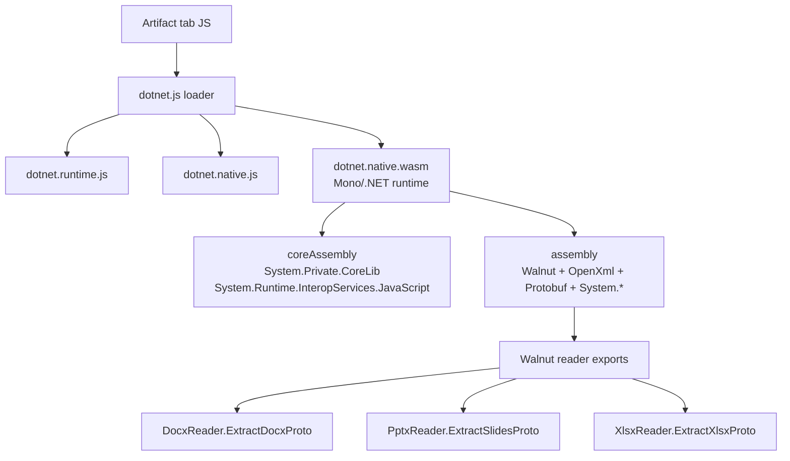

# Office 文档查看器 WASM 阅读器参考

本目录是将当前 Office WASM 概念验证（proof-of-concept）转化为 Routa 自有产物查看器的参考实现工作区。

它有意不内置（vendor）从 Codex `Walnut` 中提取出来的资源。那些文件仅存放在 `tmp/codex-app-analysis/extracted/webview/assets` 下供本地分析使用。生产代码应当使用 Routa 自有的阅读器实现，或经过批准的第三方依赖路径。

## 当前 POC

可运行的本地概念验证为：

- `src/app/debug/office-wasm-poc/page-client.tsx`
- `src/app/debug/office-wasm-poc/office-wasm-config.ts`
- `src/app/api/debug/office-wasm-poc/assets/[...slug]/route.ts`
- `scripts/debug/check-office-wasm-poc-consistency.ts`

该调试路由验证了核心的阅读器路径：

```text
file input
  -> kind detection: csv / tsv / docx / pptx / xlsx
  -> CSV/TSV JS parser or Walnut .NET reader
  -> Document / Presentation / Workbook proto wrapper
  -> lightweight visual preview + raw JSON
```

## Bundle 关系

提取出来的 Codex bundle 使用 .NET 的 browser-wasm 运行时加上 WebCIL 程序集：



在 WASM 模块层面：

- `dotnet.native.wfd2lrj4w6.wasm` 是运行时模块。
- `Walnut.nvqhqmqbjk.wasm`、`DocumentFormat.OpenXml*.wasm`、`Google.Protobuf*.wasm` 和 `System.*.wasm` 是 WebCIL 程序集容器。
- WebCIL 模块暴露 payload 访问器；运行时通过 boot manifest 加载它们，而不是通过直接的 WASM 导入。

## 目标生产形态

第一个 Routa 自有的实现已在以下位置启动：

```text
tools/office-wasm-reader/
  Directory.Packages.props
  DEPENDENCIES.md
  Routa.OfficeWasmReader/
```

它使用与提取出来的 bundle 相同的依赖族：.NET browser-wasm `9.0.14`、`DocumentFormat.OpenXml` / `DocumentFormat.OpenXml.Framework` `3.3.0`、`System.IO.Packaging` `8.0.1`，以及 `Google.Protobuf` `3.31.0`。

首先将可复用代码从调试 POC 中提取到面向产品的模块边界：

```text
src/client/office-document-viewer/
  artifact-kind.ts
  office-artifact-types.ts
  readers/
    office-artifact-reader.ts
    csv-reader.ts
    wasm-office-reader.ts
    reader-cache.ts
  protocol/
    office-artifact-types.ts
    office-artifact-protobuf.ts
    routa-office-wasm-reader.ts
  components/
    OfficeArtifactPreview.tsx
    DocumentPreview.tsx
    PresentationPreview.tsx
    WorkbookPreview.tsx
  __tests__/
    artifact-kind.test.ts
    reader-cache.test.ts
```

仅当阅读器资源被批准发布时，才添加非调试用途的资源路由：

```text
src/app/api/office-document-viewer/assets/[...slug]/route.ts
```

在需要 fetch 边界的地方，桌面端和 Web 端 UI 应当通过 `resolveApiPath` 和 `desktopAwareFetch` 来调用它。

## 阅读器边界

保持阅读器 ABI 狭窄且可替换：

```ts
export type OfficeArtifactKind = "csv" | "tsv" | "docx" | "pptx" | "xlsx";

export type ParsedOfficeArtifact =
  | { kind: "document"; sourceKind: "docx"; proto: unknown }
  | { kind: "presentation"; sourceKind: "pptx"; proto: unknown }
  | { kind: "spreadsheet"; sourceKind: "csv" | "tsv" | "xlsx"; proto: unknown };

export interface OfficeArtifactReader {
  parse(bytes: Uint8Array, kind: OfficeArtifactKind): Promise<ParsedOfficeArtifact>;
}
```

这使 UI 独立于第一个阅读器实现。纯 JS 阅读器、Routa 自有的 .NET 阅读器，或基于服务端的阅读器都可以实现同一份契约。

## 迁移步骤

1. 将文件类型检测和解析结果类型从 `page-client.tsx` 中移出。
2. 将 CSV/TSV 解析移入 `readers/csv-reader.ts`。
3. 将当前的 Walnut 加载器封装到 `OfficeArtifactReader` 之后，仅用于调试验证。
4. 将 POC 中的预览组件提取为可复用组件，并仅使用 i18n 标签。
5. 在 feature flag 之后将阅读器接入会话画布（session canvas）或产物标签页（artifact tabs）。
6. 决定发布版路由使用 JS 库、Routa 自有的 WASM 阅读器，还是服务端解析。

## 产品约束

- 在未做出许可（licensing）决定之前，不要将提取出来的 Codex `Walnut` 二进制文件作为 Routa 产品资源发布。
- 保持 Office 预览资源按需延迟加载（lazy-loaded）；提取出来的 bundle 大约为 10-12 MB。
- 尽可能让解析脱离主渲染路径；较大的 DOCX/PPTX/XLSX 文件应显示进度并设有大小限制。
- 如果未来要支持编辑、diff 或回导出（export-back-to-Office），优先采用稳定的中间产物模型。

## 主记录

进行中的分析与证据存放在：

- `docs/issues/2026-05-01-office-document-viewer-wasm-reader.md`
